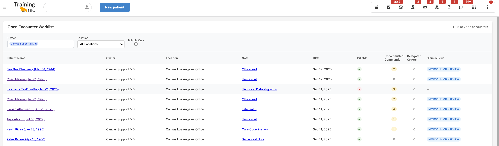

# Encounter List Plugin


## Overview

The Encounter List plugin provides a comprehensive worklist view of open encounters. It displays all encounters that are currently in progress (NEW or UNLOCKED state), allowing healthcare providers to efficiently monitor and manage their active patient encounters with advanced filtering and navigation capabilities.



## Features

- **Open Encounter Tracking**: Displays all encounters in NEW or UNLOCKED states
- **Advanced Filtering**: Filter by provider (owner), location, and billable status
- **Multi-Provider Selection**: Select multiple providers to view their encounters
- **Command Status Tracking**: Shows uncommitted commands and delegated orders for each encounter
- **Claim Queue Monitoring**: Displays current claim processing status
- **Pagination**: Handles large datasets with 25 encounters per page
- **Direct Navigation**: Click-through links to patient charts and encounter notes
- **Responsive Design**: Works on desktop and mobile devices
- **Real-time Data**: Fresh data loaded from Canvas on each view

## How to Access

### Installation

Install the plugin using the Canvas CLI:
```bash
canvas plugin install encounter_list
```

### User Interface Access

The plugin provides one access point:

1. **Global Encounter List Application**
   - Scope: Global (available system-wide)
   - Opens a full-page modal showing all open encounters across the system
   - Accessible from the Canvas main navigation
   - Named "Encounter List" in the Canvas interface


## Encounter Types Displayed

### Included Encounter Types
- **Clinical Notes**: All billable and non-billable clinical encounters
- **Visit Notes**: Standard patient visit documentation
- **Procedure Notes**: Documentation of procedures performed
- **Consultation Notes**: Specialist consultations and referrals

### Excluded Encounter Types
- **Messages**: Internal communications between providers
- **Letters**: Formal correspondence and external communications

### Encounter States
- **NEW**: Newly created encounters that haven't been started
- **UNLOCKED**: Encounters that are currently being worked on but not yet finalized

## Filtering Capabilities

### Available Filters

1. **Owner (Provider)**: 
   - Multi-select dropdown of active providers
   - Defaults to showing the logged-in user's encounters
   - Can select multiple providers to view combined workload

2. **Location**: 
   - Single-select dropdown of practice locations
   - Shows only locations that have open encounters
   - Option to view all locations

3. **Billable Only**: 
   - Checkbox filter to show only billable encounters
   - Helps focus on revenue-generating activities

## Data Columns Displayed

The encounter list displays the following information:

1. **Patient Name**: 
   - Clickable link to patient chart
   - Includes patient date of birth in parentheses

2. **Owner**: 
   - Provider responsible for the encounter
   - Shows credentialed name

3. **Location**: 
   - Practice location where encounter is taking place
   - Full location name

4. **Note**: 
   - Type and title of the encounter note
   - Clickable link directly to the note

5. **DOS (Date of Service)**: 
   - When the encounter is scheduled or took place
   - Formatted as "MMM DD, YYYY"

6. **Billable**: 
   - Visual indicator (✓ or ✗) showing if encounter is billable
   - Green checkmark for billable, red X for non-billable

7. **Uncommitted Commands**: 
   - Count of commands that are staged or in review
   - Helps identify encounters with pending actions

8. **Delegated Orders**: 
   - Count of orders that have been delegated to external providers
   - Shows orders requiring follow-up

9. **Claim Queue**: 
   - Current status in the billing/claims process
   - Color-coded badges for different queue states

## Claim Queue Status Indicators

The plugin displays various claim queue statuses with color-coded badges:

- **Needs Clinician Review**: Blue badge - requires provider review
- **Needs Coding Review**: Yellow badge - requires coding verification  
- **Queued For Submission**: Green badge - ready for insurance submission
- **Filed Awaiting Response**: Light blue badge - submitted to insurance
- **Rejected Needs Review**: Red badge - claim was rejected
- **Adjudicated Open Balance**: Purple badge - processed with balance due
- **Patient Balance**: Orange badge - amount due from patient
- **Zero Balance**: Green badge - fully paid
- **Trash**: Red badge - claim marked for deletion
- **Appointment**: Light blue badge - scheduled appointment

## API Endpoints

The plugin provides several internal API endpoints:

- `/plugin-io/api/encounter_list/encounters` - Paginated encounter data with filtering
- `/plugin-io/api/encounter_list/providers` - Active provider list for filters
- `/plugin-io/api/encounter_list/locations` - Practice locations with open encounters

## Pagination

- **Default page size**: 25 encounters per page
- **Navigation controls**: Previous/Next buttons with page indicators
- **Total count display**: Shows current page range and total encounter count
- **Automatic filtering**: Filters reset pagination to page 1

## Technical Implementation

### Database Integration
- Integrates with Canvas ORM models: `Note`, `Command`, `Staff`, `Patient`
- Filters notes by state: `NoteStates.NEW` and `NoteStates.UNLOCKED`
- Excludes message and letter categories: `NoteTypeCategories.MESSAGE`, `NoteTypeCategories.LETTER`
- Uses Django annotations for efficient command counting

### Frontend Technology
- Vanilla JavaScript (no external frameworks)
- CSS Grid and Flexbox for responsive layouts
- Custom dropdown components for multi-select filtering
- Direct HTML table rendering for performance

### Performance Optimizations
- Server-side pagination to handle large datasets
- Efficient database queries with proper filtering
- Minimal JavaScript dependencies

## Navigation Features

### Direct Links
- **Patient Chart**: Click patient name to open full patient record
- **Encounter Note**: Click note title to open specific encounter


## Responsive Design

The interface adapts to different screen sizes:
- **Desktop**: Full table layout with all columns visible
- **Mobile**: Compressed layout with adjusted padding and font sizes
- **Tablet**: Responsive column widths and flexible pagination controls


### Monitoring

Monitor plugin functionality through Canvas logs:
```bash
canvas logs encounter_list
```

## Version Compatibility

- Canvas SDK: 0.1.4+
- Python: 3.8+
- Canvas Instance: Compatible with current Canvas Medical platforms

