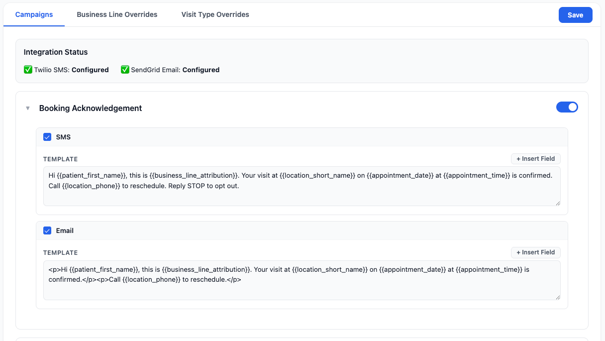
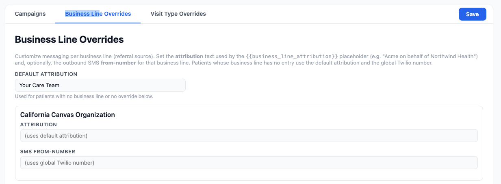
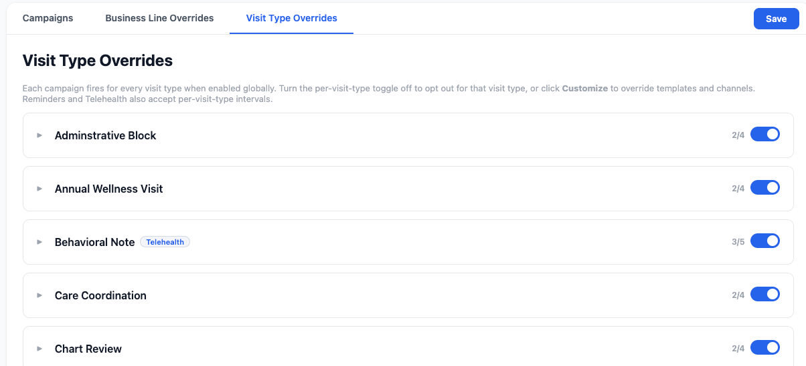
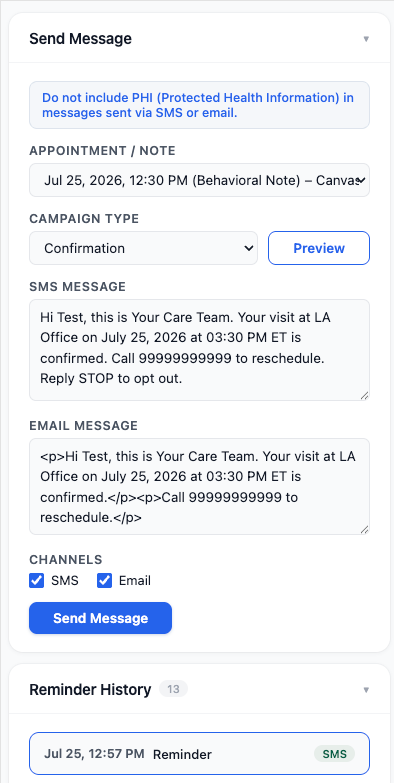

# appointment_reminders

Appointment reminders and confirmations over SMS and email, with per-business-line branding and routing and a two-way Y/N confirm flow.

## What it does

- **Appointment notifications** — confirmation, reminder, cancellation, no-show, and telehealth-join messages via Twilio (SMS) and SendGrid (email). Per-note-type templates with `{{placeholder}}`s; multi-interval reminder cadence (default `[4320, 45]` = 3 days + 45 min).
- **Per-business-line branding + routing** — `{{business_line_attribution}}` / `{{business_line}}` placeholders; per-line **attribution** override → default fallback; per-line outbound **from-number** → global fallback. A patient's business line (`Patient.business_line`) drives which branding/number is used.
- **Two-way structured confirm** — a signature-gated Twilio inbound webhook: `Y` confirms the patient's nearest upcoming appointment, `N` opens a follow-up Task routed to a configurable team. Strict Y/N token match (no free-form), `MessageSid` replay dedup, fail-closed signature check.
- **STOP writes back to the chart** — a patient who texts a Twilio opt-out keyword has `has_consent` cleared on the number they texted from, so the opt-out survives in Canvas and not just in Twilio's block list. `START` / `UNSTOP` / `YES` restore it.
- **Admin console gated by role** — the `/admin` endpoints require a staff role listed in `ADMIN_ROLE_NAMES`. Fail-closed: unset means nobody.
- **Testing-mode gate** — a fail-closed allowlist, set in the admin app, that restricts *all* sends to specific patients **and** recipients. On by default, so a fresh install cannot message anyone until someone deliberately opens it up.

> **Reminder and telehealth-join are independent campaigns, so overlapping intervals double up.** Telehealth-join runs whether or not the reminder campaign is on for that visit type. Give them the same interval and a patient with a telehealth visit receives two SMS and two emails about the same appointment, seconds apart (observed in UAT with both set to 15 minutes). Configure around it: stagger the intervals, for example reminders at 45 minutes and the join nudge at 15, or switch the reminder campaign off for telehealth visit types under **Per-visit-type settings**.

## Screenshots

Campaign configuration in the provider-menu admin app. Each campaign has its own SMS and email template, channel toggles, and enable switch.



Per-business-line overrides set the patient-facing attribution and an outbound number for each line.



Every campaign can be turned off or customized per visit type.



In a patient's chart, staff can preview the rendered copy for any campaign, send it by hand, and review everything sent to that patient.



## Problem it solves

Canvas ships native appointment reminders, but they are a single global setting: one cadence, one wording, no per-visit-type variation, and a confirm loop you cannot extend. Practices that run several lines of business, or that need compliance-approved wording, or that want a telehealth join link delivered separately from the reminder itself, have no way to express that natively.

This plugin replaces the native reminders with campaigns you configure per visit type and per business line, and it turns patient replies into real state: `Y` confirms the appointment on the schedule, `N` opens a follow-up Task for staff.

## Who it's for

Practices on Canvas that need more than one reminder policy. Typically that means one of:

- **Multiple business lines or payers** where each needs its own sender number and its own patient-facing name.
- **Telehealth visits** that need a join link close to the appointment, separate from the day-before reminder.
- **Compliance-approved copy** that must not be reworded by whoever sends a message by hand.
- **Two-way confirmation** where a patient's reply should update the schedule rather than land in an inbox.

If you need one reminder, at one interval, with one wording, Canvas's native setting is simpler and you should use that instead.

> ### ⚠ Read before you enable a campaign
>
> **This plugin replaces Canvas's native appointment reminders. It cannot detect them.** Native reminders are driven by the `appointmentReminders` **organization setting**, which plugins cannot read — there is no SDK model for it and no way for this plugin to warn you at runtime. If it is still set when you enable the `reminder` or `confirmation` campaign, **every patient gets two reminders**: one from Canvas, one from here.
>
> Installing is safe on its own — all five campaigns ship **disabled**, so nothing sends until you turn one on. The checklist below is what has to happen before that first switch.

## Pre-install checklist

Work through these in order. Steps 1–3 are required before enabling any campaign, step 4 applies only if you want two-way confirmation, and step 5 is how you should do the first run.

1. **Check whether native reminders are on.** Look for the `appointmentReminders` organization setting. If it holds a value like `{"daysAhead": 3, "hourOfDay": 9}`, native reminders are **active**. If the setting is absent, they're off — absence is how "disabled" is represented; there is no `false` form.
2. **Clear it if present**, via Django admin or Canvas support, and coordinate the timing with enabling this plugin. Anything else means either a gap in coverage or double messages. Note that clearing it also **retires the native `Y` confirm loop**, which is gated on the same setting — this plugin rebuilds that flow, but only once step 4 is done.
3. **Set the required variables**, including `ADMIN_ROLE_NAMES` — without it nobody can open the admin app — then verify it shows Twilio and SendGrid as *Configured*. Missing credentials mean campaigns silently deliver nothing.
4. **For two-way confirm, provision a dedicated Twilio number** whose inbound webhook points at `…/plugin-io/api/appointment_reminders/twilio/inbound`, and set `twilio-inbound-webhook-url` to that exact URL. See *Integration with Canvas core* below — this has real lead time and can't be done at the last minute.
5. **Do the first run behind testing mode.** It is on by default. Add yourself under **Settings → Testing mode** in the admin app, enable one campaign, and confirm delivery to your own phone or inbox before turning it off. See *Testing mode* below.

## Components

| Handler | Type | Role |
| --- | --- | --- |
| `AppointmentEventHandler` | events | Confirmation / cancellation / no-show on appointment events |
| `ReminderScheduler` | cron `*/5 * * * *` | Reminder + telehealth-join messages for upcoming booked appointments. Skips the appointment scan entirely on ticks where no configured interval can fire |
| `NotificationAPI` | SimpleAPI | Admin config (role-gated), manual sends, notification history, integration health |
| `TwilioInboundAPI` | SimpleAPI | Signature-gated inbound-SMS webhook (`POST /twilio/inbound`) — Y/N confirm/decline, STOP/START consent write-back |
| `TimelineMessageFilter` | config | Hides "Message" notes from the patient timeline |
| `NotifyAdminApp` | Application | "Appointment Reminders" — provider-menu admin: configure campaigns, per-line and per-visit-type overrides, and **Settings** (testing mode, task assignment). Refuses staff without an `ADMIN_ROLE_NAMES` role |
| `NotifyPatientApp` | Application | "Appointment Reminders" — chart panel: this patient's reminder history |

## Key files

| File | Purpose |
| --- | --- |
| `services/config.py` | `CampaignConfig` dataclass (campaigns, attribution, testing mode) + load/save via `CampaignConfigRecord` |
| `services/delivery.py` | Twilio SMS + SendGrid email senders; consent + testing-mode gates; delivery audit |
| `services/templates.py` | Variable extraction + `{{placeholder}}` rendering |
| `services/business_line.py` | Resolve per-line attribution + from-number from config |
| `services/twilio_inbound.py` | Signature verification, form parsing, Y/N intent + STOP/START consent classification |
| `services/consent.py` | Build the `Patient` effect that writes SMS consent back after an opt-out/opt-in |
| `services/authz.py` | `ADMIN_ROLE_NAMES` role gate for the admin endpoints |
| `services/history.py` | `NotificationDelivery` audit rows (outbound sends + inbound responses) |

Custom data lives under the `canvas__appointment_reminders` namespace: `CampaignConfigRecord` (config singleton) and `NotificationDelivery` (activity log; `campaign_type=inbound_response` rows record confirms/declines).

Index names on `NotificationDelivery` are declared explicitly and must stay under 30 characters. Auto-generated names are built from schema + table and then truncated to Postgres's 63-byte identifier limit; `canvas__appointment_reminders` plus `notificationdelivery` consumes 51 of those bytes, leaving 12 for the discriminator. Every auto-named index on that table therefore truncated to the same identifier and **only the first was created** — verified on a live instance, where two declared indexes were silently absent.

`NotificationDelivery.patient` is nullable for exactly one case: a verified inbound reply whose sender matched no patient, written with `status=unresolved_sender`. Those rows have no chart to hang off, so the per-patient history can't return them — read them from `GET /admin/unresolved-senders` instead. See *Replies from unknown numbers*.

## Configuration options (variables)

Set these with `canvas config set appointment_reminders --host <hostname> KEY=value`. Nothing here belongs in the repo.

Each is declared in `CANVAS_MANIFEST.json` under `variables`, with a `sensitive` flag that decides whether the value can be read back. **Sensitive** values are write-only: masked in the Admin UI and reported by `canvas config list` only as `[set]` / `[not set]`. Non-sensitive values are readable, which is what you want for things you'll need to eyeball — the from-number, the webhook URL, the allowed admin roles. The **Masked** column below records which is which; `canvas config set` never changes the flag, only the manifest does.

Every credential is sensitive. Everything here is either a credential or a staff permission — operational settings such as testing mode live in the admin app instead, where an administrator can reach them without instance-level access.

Only five are needed to send anything: `twilio-account-sid`, `twilio-auth-token`, and `twilio-phone-number` for SMS, plus `sendgrid-api-key` and `sendgrid-from-email` for email. Those exact five are what the admin app checks before showing *Configured*.

| Variable | Masked | Required | Purpose | Where to get it |
| --- | --- | --- | --- | --- |
| `namespace_read_write_access_key` | Yes | Auto | Custom Data access for `CampaignConfigRecord` + `NotificationDelivery` | **Do not set.** Canvas provisions it on install. Setting it by hand breaks custom-data reads |
| `twilio-account-sid` | Yes | Yes, for SMS | Identifies the Twilio account; always used in the request URL, even when API-key auth is in play | Twilio Console home page, "Account Info". Starts `AC` |
| `twilio-auth-token` | Yes | Yes, for SMS | Two jobs: fallback outbound auth, **and** the key used to verify the `X-Twilio-Signature` on inbound replies. Inbound confirm/decline cannot work without it | Twilio Console home page, next to the account SID. Treat as a master credential |
| `twilio-api-key-sid` | Yes | No | Preferred outbound auth when paired with the secret below, because it is revocable without rotating the master token | Twilio Console → Account → API keys & tokens → Create API key. Starts `SK` |
| `twilio-api-key-secret` | Yes | No | The other half of the API key. Both must be set or the pair is ignored | Shown **once** at API-key creation. Not retrievable later; make a new key if lost |
| `twilio-phone-number` | No | Yes, for SMS | Default outbound sender. Per-business-line from-numbers in the admin app override it; this is the fallback | Twilio Console → Phone Numbers → Active numbers. E.164 form, so `+15551234567` |
| `twilio-inbound-webhook-url` | No | Only for two-way confirm | The exact URL Twilio POSTs to. The signature is computed over this string, so any mismatch fails closed and replies are rejected | You choose it: `https://<hostname>/plugin-io/api/appointment_reminders/twilio/inbound`. Paste the identical string into the number's "A message comes in" webhook in Twilio |
| `sendgrid-api-key` | Yes | Yes, for email | Authenticates the send | SendGrid → Settings → API Keys → Create. Needs Mail Send permission. Starts `SG.` |
| `sendgrid-from-email` | No | Yes, for email | The From address on every email | Any address you have verified in SendGrid → Settings → Sender Authentication. Unverified senders are rejected at send time |
| `LOCK_MESSAGE_TEMPLATES` | No | No | `1`/`true`/`yes`/`on` stops **manual senders** departing from the approved copy. See below. Unset means a manual send can be reworded freely | You set it |
| `ADMIN_ROLE_NAMES` | No | Yes, to use the admin app | Comma-separated staff roles allowed to open the admin console and call its endpoints. Fail-closed: unset locks **everyone** out, including you. See *Who can open the admin app* | Your instance's role names, e.g. `Practice Manager,Administrator`. Either the display name or the internal code matches |

**Outbound Twilio auth** picks the API key when `twilio-api-key-sid` and `twilio-api-key-secret` are both set, and otherwise falls back to `twilio-account-sid` + `twilio-auth-token` (`services/delivery.py:_twilio_auth`). The request URL is built from the account SID either way, which is why that secret is required even under API-key auth.

## Task assignment

When a patient declines by SMS, the plugin opens a follow-up Task. **Settings → Task assignment** chooses which team receives it, from the teams configured on the instance.

**Give the task a due date** is off by default. Switch it on and you set the rule: an offset in **business days** from the day the patient replied (same day, +1, +2, +3, +5) and a **time of day** (default 23:59). Without a due date the task sorts nowhere, which is how it gets lost in a large queue.

Three things the rule does deliberately:

- **Business days, so weekends are skipped.** A Friday reply with +1 is due Monday, not Saturday. A reply that arrives *on* a weekend rolls forward before counting, so "same day" on a Saturday is due Monday rather than a day nobody is working. **Public holidays are not skipped** — Canvas exposes no holiday calendar a plugin can read, so a task can land on one.
- **End of day by default, not the reply moment.** `due` is a timestamp; setting it to "now" would render the task as already overdue the instant it appears, which is a different signal from "handle this today."
- **Anchored to the instance's timezone** (`INSTALLATION_TIME_ZONE`), not UTC. Because `due` is a timestamp and not a date, end-of-day computed in UTC renders as the *previous* date for any instance behind it — midnight UTC is the evening before in Eastern. Falls back to UTC with a warning if the environment supplies no zone, which keeps the date right for US instances and only shifts the hour.

Leaving the team **Unassigned** is the default and matches what the plugin did before this was configurable: the Task is still created and still carries the `appointment-decline` label, but it lands in no team's queue, so someone has to go looking for it.

If the chosen team is later deleted in Canvas, the Task is created unassigned and a warning is logged rather than the effect being risked on a dangling id — losing the Task would mean losing the only signal that this patient wants to reschedule. The dropdown flags a configured team it can no longer find, so a stale setting is visible rather than silently behaving as "Unassigned".

## Testing mode

A fail-closed safe-launch gate, set under **Settings → Testing mode** in the admin app. The card starts collapsed; when the gate is on, the header carries an **ON** badge so a closed gate is visible without opening it. While it is on, a message sends only when **both** the patient and the destination address are allowlisted. One without the other sends nothing, which is deliberate.

**It is on by default, with both lists empty — so a fresh install sends nothing to anyone.** That is the intended starting state: add yourself, enable one campaign, confirm the message arrives, then turn the gate off to go live. While a campaign is enabled and testing mode is off, the admin app shows a live-sending warning; while testing mode is on with an empty list, it warns that nothing is sending at all.

Allowed patients are matched against the patient's **MRN**, the **id** from their chart URL, or the internal **dbid** — paste whichever you have. MRN is usually the one to reach for, since it is what staff see and quote. An entry matching no patient fails silently: every send is skipped and the gate looks correctly configured while the allowlist is inert, so check a test send actually arrives rather than trusting the absence of errors. Allowed recipients may mix phones and emails — phones are compared in normalized E.164, emails case-insensitively.

### It used to be a plugin secret

Through 0.8.x this was the `TESTING_MODE`, `TESTING_MODE_PATIENTS`, and `TESTING_MODE_RECIPIENTS` plugin variables. It moved into campaign config in 0.9.0, because it is an operational setting rather than a credential: plugin config takes instance-level access to change, which is the right bar for secrets and for who may administer the plugin, and the wrong bar for the person running a test send. Anyone who can enable a campaign in the admin app can already cause live sending, so gating this behind plugin config bought nothing.

**Upgrading from 0.8.x:** the old variables are no longer read. Testing mode defaults to **on**, so an instance that was running behind the gate stays behind it rather than silently broadcasting the moment the secret stops being consulted — but the allowlists do **not** carry over, so re-enter them in the admin app before your next test send. If you were running with testing mode off, you must turn it off again in the admin app before anything sends. Clear the three stale values with `canvas config unset` at your convenience; they are inert.

### Who can open the admin app

`ADMIN_ROLE_NAMES` lists the staff roles allowed to configure campaigns, matched case-insensitively against each role's display name *and* its internal code, so either form works. Set it before you go looking for the app — unset denies everyone, by design, since an admin console that opens itself when misconfigured is the worse failure.

The real gate is `NotificationAPI.authenticate`, which refuses every `/admin*` request from a staff member without a listed role. The per-patient chart panel is untouched and stays available to any logged-in staff member.

**The menu item itself stays visible to everyone.** Canvas has no per-user visibility hook for a `provider_menu_item` application: `visible()` is defined only on embedded (note and scheduling) applications, and the `ProviderMenuConfiguration` effect [explicitly does not apply](https://docs.canvasmedical.com/sdk/layout-effect/#provider-menu-configuration) to plugin-provided menu items. A non-admin who clicks **Appointment Reminders** gets a short "you don't have access" page instead of the console. Since the URL is reachable without the menu at all, the server-side check is what protects the configuration; the refusal page is only courtesy.

### Replies from unknown numbers

A verified reply whose sender matches no patient used to return 200 and write nothing. The appointment stayed unconfirmed, which reads exactly like the patient never replying — so a misconfigured number, a patient texting from a phone that isn't on their chart, or a wrong-number reply all looked identical to silence.

Those replies are now recorded as `NotificationDelivery` rows with `campaign_type=inbound_response` and `status=unresolved_sender`, carrying the sender's number and the message body so staff can tell a stray "Y" from a wrong number. They belong to no patient, so they're read from a dedicated endpoint rather than any chart:

```
GET /plugin-io/api/appointment_reminders/admin/unresolved-senders
```

Role-gated with the rest of `/admin*`, newest first, capped at 100.

Two things to know:

- **Only verified traffic is recorded.** The write happens after the signature check and after the `MessageSid` replay guard, so nobody can POST arbitrary numbers and message bodies into the log, and a replayed request can't inflate it.
- **The rows hold a phone number belonging to nobody on file.** That is the point — you cannot follow up without it — but it is data about a person with no patient record, so treat the endpoint as you would any other patient-data surface. It is not exposed in the admin UI yet; the endpoint is the interface for now.

### Locking message copy

Set `LOCK_MESSAGE_TEMPLATES` to `1` / `true` / `yes` / `on` where wording is compliance-approved and must not drift on its way to a patient.

**It constrains the manual sender, not the admin.** Admins keep editing the approved copy in the admin app exactly as before. What the lock stops is the person sending a one-off message from the bell in a patient's chart from rewording that copy on the way out.

Concretely, with the lock on:

- In the patient panel the previewed SMS and email bodies become read-only.
- `POST /patient/<id>/send` re-renders the message from the stored template and **discards whatever body the client posted**, so the approved copy is what is delivered.
- A campaign with no stored template behind it is refused with **403** rather than delivered as an empty message. (The free-text **Custom** option was removed from the product entirely, so every send is template-backed regardless of the lock.)

The server-side behavior is the actual boundary; the read-only textareas are a convenience on top of it, since anything holding a staff session could POST to the endpoint directly. Unset the variable to lift the lock. It deliberately can't be lifted from inside the app, so the people who control the wording are the ones with plugin-config access.

**Independent of the lock**, a manual send is refused with **422** when the rendered body still contains a `{{placeholder}}` the renderer could not fill, so template syntax never reaches a patient verbatim. Only the channels actually selected are checked, so a typo in an unused template can't block a send.

## Reminder scheduling

The cron runs every 5 minutes, but most ticks do no work and no longer pay for a scan.

A reminder interval of **a day or more** is *date-relative*: it fires at the configured **send time** on the target date, so it can only fire inside a `GRACE_MINUTES` window once per day. A reminder interval **under a day**, and **every** telehealth interval regardless of size, is *time-relative*: it fires once the appointment is that many minutes away, which can happen on any tick.

So before querying anything, the scheduler asks whether any configured interval could fire right now. With only day-out intervals configured — a single daily reminder, the common case — that is true on about two ticks a day and the other ~286 return immediately without touching the appointment table. Configure any short reminder interval, or enable telehealth, and every tick scans as before.

The send-time sources the gate considers are the global setting plus any per-visit-type override. Business-line overrides cannot set an interval, send time, or timezone — they only refine copy, channels, and opt-out — so that pair is the complete set. Missing a source here would silently stop that visit type's reminders, so it is covered by tests.

**Send times near the end of the local day work.** The scheduled instant is anchored to the target date rather than to the current date, so a grace window that spills past local midnight still fires. Before that fix, a send time in the last `GRACE_MINUTES` of the day never fired at all — the only ticks inside its window landed on the next date and were rejected by a date-equality check. A malformed send time falls back to 09:00 with a warning rather than raising, since an exception there would take down the whole scan and lose every patient's reminder, not just the misconfigured type's.

## Consent (TCPA / opt-out)

Enforced at send time in `services/delivery.py:_get_patient_contacts`:

- **SMS** requires `has_consent=True` **and** `opted_out=False` on the phone contact point.
- **Email** requires only `opted_out=False` (implicit consent).
- A patient with neither is silently skipped, logged `skipped:no_phone_on_file`.

### STOP / START write-back

Twilio maintains its own block list. When a patient texts a standard opt-out keyword — `STOP`, `STOPALL`, `UNSUBSCRIBE`, `CANCEL`, `END`, `QUIT`, `REVOKE`, `OPTOUT` — Twilio blocks the number, auto-replies, and then [forwards the message to the webhook](https://help.twilio.com/articles/223134027). Nothing in that flow reaches Canvas. `services/consent.py` closes the gap by clearing `has_consent` on the contact point the message came from, so the chart agrees with Twilio and later sends are skipped before they can fail with error 21610. `START` / `UNSTOP` / `YES` restore it, matching Twilio's opt-in keywords.

This matters specifically *because* two-way confirm repoints the number's inbound webhook at this plugin. Canvas's native incoming-SMS handler used to record the opt-out; once the webhook moves, it no longer sees the message.

Two consequences worth knowing:

- **`has_consent`, not `opted_out`.** The `Patient` effect's contact-point payload has no `opted_out` field, so no plugin can set it. That turns out to be the better field anyway: `has_consent` gates SMS alone, while `opted_out` would also suppress email, and STOP is an SMS carrier keyword. A patient who opts out of texts keeps getting email reminders.
- **`YES` means two things at once.** It is both Twilio's opt-in keyword and this plugin's confirm token, so it restores consent *and* confirms the appointment. Both halves are actioned; `services/twilio_inbound.py` classifies consent and appointment intent on separate axes for exactly this reason, since a single verdict could only carry one of them.
- **`CANCEL` is an unsubscribe keyword, not an appointment word.** Twilio publishes it as a `STOP` synonym, so it clears consent and nothing more. It is deliberately *not* in the decline set: a patient texting it means "stop texting me", and opening a reschedule Task off the back of that would attribute an intent about the visit that they never expressed. To decline an appointment a patient replies `N`, `NO`, `2`, or `DECLINE`.

The plugin never opts a patient in on its own — only in response to the patient's own opt-in keyword. Staff can still change consent by hand in the chart.

## Integration status, and why credentials aren't enough

The admin app's **Integration Status** panel asks Twilio where inbound messages actually go, rather than inferring health from the presence of an auth token. It reports three states:

| | |
| --- | --- |
| ✅ **Configured** | Credentials set, and Twilio posts inbound messages to this plugin |
| ⚠️ **Outbound only — patient replies are being dropped** | Credentials set, but nothing routes inbound here |
| ❌ **Not configured** | Credentials missing |

The middle state exists because it really happened: a number's "A message comes in" webhook was cleared, outbound reminders kept sending perfectly, and every `Y`, `N` and `STOP` was discarded for five days with no error, no log line, and no audit row — the request never reached the plugin at all. Credentials were valid the whole time, so the panel said *Configured*.

The check is deliberately reluctant to raise an alarm. **Outbound only** appears only when neither the number's own `sms_url` nor any Messaging Service's `inbound_request_url` points here. Anything Twilio can't settle — an unreachable API, a 401, a number not in this account (hosted numbers and short codes don't appear), or a TwiML app governing the number, which makes Twilio ignore `sms_url` entirely — reports *Configured (inbound routing unverified)* instead. A false "replies are being dropped" would teach people to ignore the warning.

Two limits worth knowing. Only the **global** `twilio-phone-number` is checked, not per-business-line from-numbers. And the result is cached for five minutes, because the SDK's HTTP client enforces a fixed 30-second timeout with no per-request override and the panel loads on every admin page view.

## Integration with Canvas core — read before enabling

The plugin **replaces** Canvas's native appointment-reminder + confirm flow (it can't read `OrganizationSetting`s, so it does not coordinate with them). The *Pre-install checklist* above is the short version; this section is the detail behind it.

1. **Disable native reminders.** Clear the `appointmentReminders` `OrganizationSetting` before enabling this plugin's `reminder`/`confirmation` campaigns — otherwise patients get **two** reminders (one from home-app, one from `ReminderScheduler`). The native inbound `Y` loop is gated on the same setting (plus `incomingSmsAuth`), so clearing it also retires native confirmation — which is why this plugin implements its own.
2. **Two-way confirm needs a dedicated number.** Inbound SMS routing is a Twilio concern: on a typical instance every number sits in a Canvas **Messaging Service** whose inbound webhook points at Canvas's native messaging. For the plugin's `Y`/`N` flow to receive replies, the confirmation number's inbound webhook must point at `…/plugin-io/api/appointment_reminders/twilio/inbound` (POST). Use a **dedicated number in its own Messaging Service** — sharing the general patient-messaging number would route normal replies to this plugin (which only understands Y/N and drops the rest). `twilio-inbound-webhook-url` must exactly equal that URL (the signature is validated against it).
3. **Match credentials.** Use the same Twilio from-number/creds the org already uses, or messages come from a different sender.

Campaigns ship **disabled** (opt-in). Enable per campaign in the admin app.

## Known gaps

- **No runtime detection of native reminders.** `appointmentReminders` is an `OrganizationSetting` with no `canvas_sdk` model and no replica table, and native sends are logged to `api_appointmentreminder` without writing `Message`/`MessageTransmission` rows. The plugin therefore has no signal — direct or indirect — that native reminders are still active. Avoiding double sends is a deployment-checklist step, not something the code can enforce.
- **The admin menu item cannot be hidden per role**, only made inert — see *Who can open the admin app*. Hiding it would need a Canvas platform change.
- **Contact-point update semantics are undocumented.** Canvas documents `addresses` updates as replace-based and says nothing about `contact_points`, and the payload carries no row ids. `services/consent.py` therefore resends every live contact point on each consent write, which is correct under either reading but should be confirmed against a real chart during UAT: send a STOP from a patient who has an email and a second phone on file, then check both survived.
- **The reminder scan window is padded, not exact.** A day-out interval fires at `send_time` on the target date, and the appointment can sit anywhere in that date, so the scan reaches to the end of it (plus an hour for a DST fall-back day). That over-includes on purpose: `_is_day_out_window` still makes the exact per-appointment call, so a wider scan changes only how many rows are considered. Sizing the window by the raw interval instead — as versions up to 0.11.1 did — silently dropped every eligible appointment past that bound, with no log line.
- **The reminder cron does not narrow its window to the firing band.** When a scan does run it queries every booked appointment from now to `max(interval) + grace`, though only those in a 7-minute band can actually fire. The gate below removes the *scans* that can do nothing at all, which is the bigger win; narrowing the surviving scan's window is still open. It would have to union the interval, send-time and timezone combinations across visit types, so it is not a one-liner — and with only day-out intervals configured, the gate already reduces the scans to two a day.
- **Inbound patient lookup is a sequential scan.** Resolving a reply's sender matches the last 10 digits as a suffix (`telecom__value__endswith`), which compiles to `LIKE '%…'` and so cannot use a standard B-tree index. That is fine for a webhook firing a few times a minute, and cheaper than the 4-digit substring scan plus 50-row hydration it replaced. Making it fast would need a normalized or reversed-string expression index on the column — a platform change, not a plugin one.
- **A send is recorded as `accepted`, not delivered.** A success means Twilio or SendGrid took the request; the plugin consumes no status callback, so it never learns whether the carrier delivered the message. The activity log labels these **Sent** and records the provider's own id as the *carrier reference*, so a message can be looked up directly in Twilio or SendGrid. Rows written before v0.15.0 are stored as `delivered`, which never meant more than `accepted` either, and display identically. This was not academic: a message Twilio accepted and then dropped at the carrier was reported as delivered, with no id to check.
- **No send retry queue.** Twilio/SendGrid failures are logged to `NotificationDelivery` + an `AppointmentsMetadata` effect, but not retried.
- **Email uses implicit consent** (opt-out only, no per-email opt-in) and has no built-in unsubscribe (would require SendGrid Subscription Tracking / ASM).
- **No consolidated confirmation-status view** yet — confirms surface as appointment status on the schedule, declines as Tasks, and all replies as `inbound_response` audit rows, but there's no single "needs outreach" roll-up. Unresolved senders have an endpoint (`GET /admin/unresolved-senders`) but no admin-UI surface, so nothing shows them unless someone asks.

## Running tests

```bash
uv run pytest tests/
```

## Deploy

```bash
canvas install appointment_reminders --host <hostname>   # add --disable to install without enabling
canvas config set appointment_reminders --host <hostname> KEY=value
canvas logs --host <hostname>
canvas list --host <hostname>
```
