# Assistant

Ask plain-English questions about a patient — or the whole practice — and get answers grounded in the chart. The Assistant routes your question through Claude, which pulls the relevant records (conditions, medications, labs, appointments, notes, tasks…) through a set of Canvas data tools, then answers in clear prose with optional trend charts, suggested follow-ups, and approval-gated charting actions.

It lives right in Canvas as an **"Assistant"** panel — in a patient chart, practice-wide, or in the provider companion — so clinicians never leave their workflow to get a question answered.

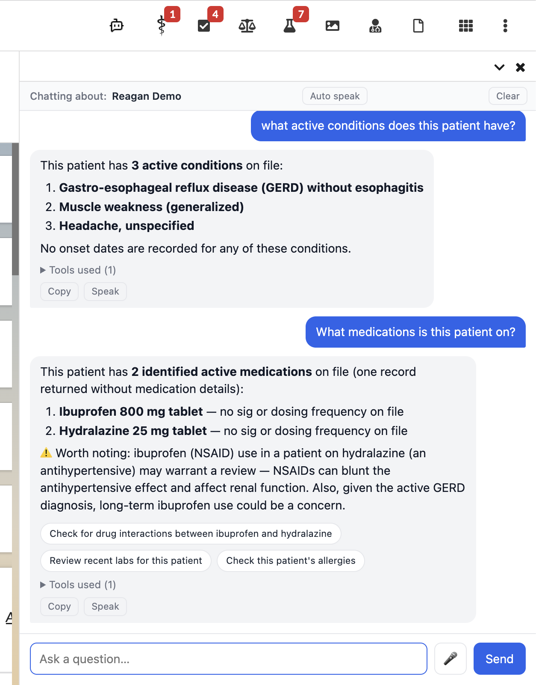

## What it can do

Ask the kinds of questions you'd otherwise click through several screens to answer:

- **Look things up** — "What medications is Jane Doe on?", "Any drug allergies for this patient?", "When was her last A1C and what was it?"
- **Compose across records** — "Find Jane Doe and show her upcoming appointments." Claude chains the tool calls (`find_patients` → `find_appointments`) with no extra setup.
- **Prep your day** — "Who am I seeing tomorrow?" / "Get me ready for morning rounds." Returns a one-paragraph digest per scheduled patient (active conditions, current meds, recent abnormal labs, open tasks, last visit) via a single `prep_visit_panel` call.
- **Visualize trends** — "Trend her A1C over the last 12 months." Claude embeds an inline line chart.
- **Take action (with approval)** — "Add a follow-up task for her metformin refill." Mutating actions never fire automatically — you approve or deny each one.
- **Research with citations** — "Any interactions between metformin and contrast dye?" uses Anthropic's hosted web search (off by default for PHI-sensitive instances; see Configuration).

<p>
  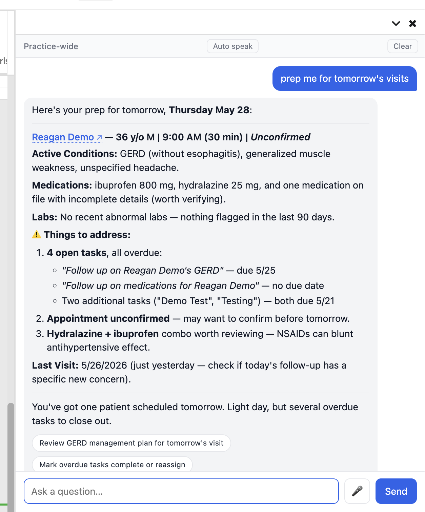
  &nbsp;
  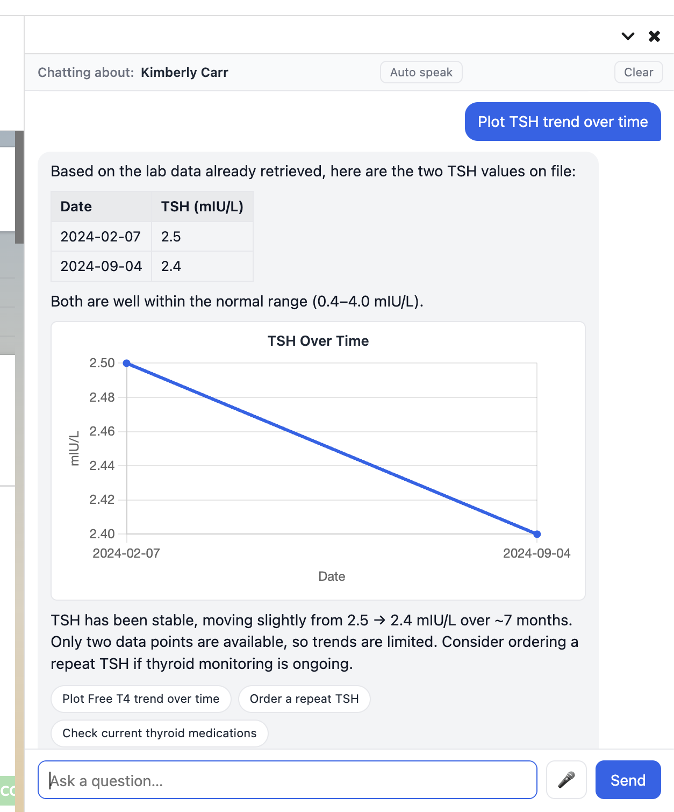
</p>

**Under the hood**, Claude has a catalog of tools: read-only lookups over the SDK data models (`Patient`, `Staff`, `Appointment`, `Encounter`, `Condition`, `MedicationStatement`, `Observation`, `LabReport`, `AllergyIntolerance`, `Note`, `Command`, `Task`), a composite `prep_visit_panel` digest, three approval-gated write tools (`create_task`, `create_appointment`, `create_condition`), and the hosted `web_search`. The full catalog and request/response contract are in the [Developer reference](#developer-reference-condensed).

**UX niceties:** markdown answers (tables, lists, headings), inline trend charts, clickable suggestion chips for likely next steps, deep links to patient charts, voice input/output, multi-turn conversation within a session, a collapsible per-message tool trace, and copy-answer / clear-conversation buttons.

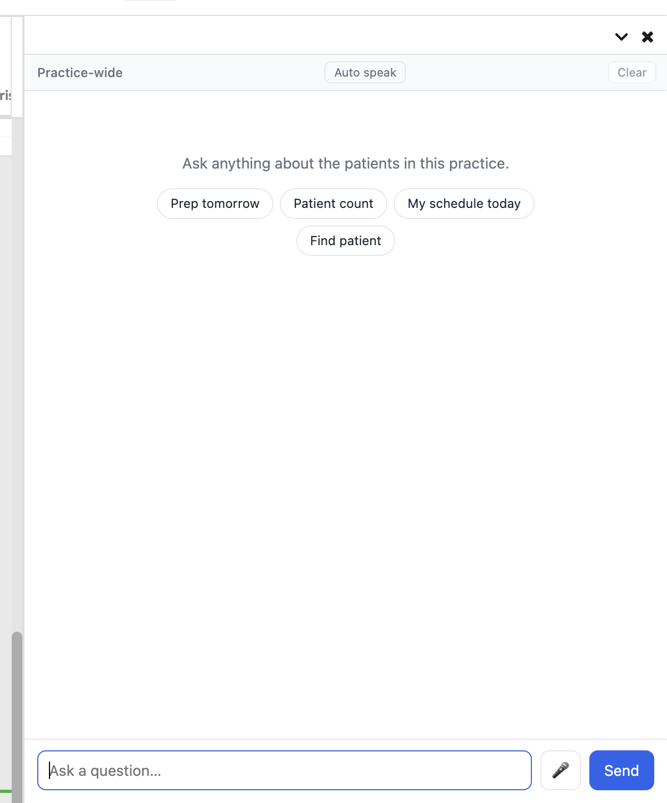

## Install

From the plugin parent directory (`extensions/assistant/`):

```sh
canvas install assistant --host <your-canvas-subdomain> --secret AnthropicKey=sk-XXX
```

## Configuration

### Secret

Set this in the Canvas admin (`/admin/plugin_io/plugin/`):

| Secret         | Description          | Required |
| -------------- | -------------------- | -------- |
| `AnthropicKey` | An Anthropic API key | Yes      |

### Feature flags

These are **source-tree toggles** — module-level constants at the top of `assistant/handlers/assistant.py`, not Canvas admin settings. Edit and redeploy to change them. All default to `True`.

| Flag                    | Default | Effect when on                                                                                                                                    |
| ----------------------- | ------- | ------------------------------------------------------------------------------------------------------------------------------------------------- |
| `AUTH_ENABLED`          | `True`  | Requires a Canvas staff session (`StaffSessionAuthMixin`). **Keep `True` in production.** Flip to `False` only for curl/smoke-test access.        |
| `WEB_SEARCH_ENABLED`    | `True`  | Exposes the Anthropic-hosted `web_search` tool. Turn off to keep prompts from leaving the instance, or to avoid the 90s timeout on broad surveys. |
| `SUGGESTIONS_ENABLED`   | `True`  | Claude emits suggested-next-action chips after answers.                                                                                           |
| `PATIENT_LINKS_ENABLED` | `True`  | Patient names render as deep links to their chart (`/patient/<id>`).                                                                              |
| `CHARTS_ENABLED`        | `True`  | Claude may embed inline trend charts.                                                                                                             |

### Model and limits

Also constants in `handlers/assistant.py`:

| Setting                | Value               | Notes                                                             |
| ---------------------- | ------------------- | ----------------------------------------------------------------- |
| Model                  | `claude-sonnet-4-6` | `CHAT_MODEL`                                                      |
| Max output tokens      | `8192`              | `CHAT_MAX_TOKENS`                                                 |
| Tool-loop budget       | `8` iterations      | `MAX_LOOP_ITERATIONS`; returns a fallback answer if exceeded      |
| Anthropic call timeout | `90s`               | Raised from the SDK's 30s default so `web_search` has time to run |

## Where it lives in Canvas, and how it stays in scope

The plugin registers four `Application` variants, all named "Assistant" and differing only by `scope`:

| Class                     | Scope                                 | Where it appears                       |
| ------------------------- | ------------------------------------- | -------------------------------------- |
| `ChatApp`                 | `patient_specific`                    | Patient chart right drawer             |
| `ChatAppGlobal`           | `global`                              | Practice-wide right drawer             |
| `ChatAppCompanionPatient` | `provider_companion_patient_specific` | Provider companion, in a patient chart |
| `ChatAppCompanionGlobal`  | `provider_companion_global`           | Provider companion, practice-wide      |

All four are backed by the same `Assistant` `SimpleAPI` handler (`POST /chat`).

**In Canvas itself** — the Assistant docks in the right-drawer panel, scoped automatically to where it was opened:

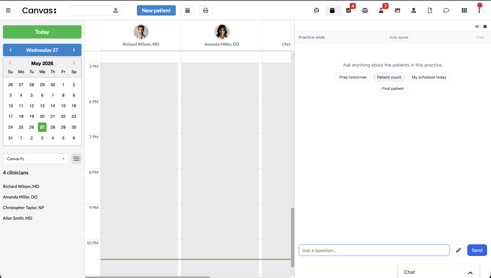

*`ChatAppGlobal` — practice-wide drawer over the day's schedule.*

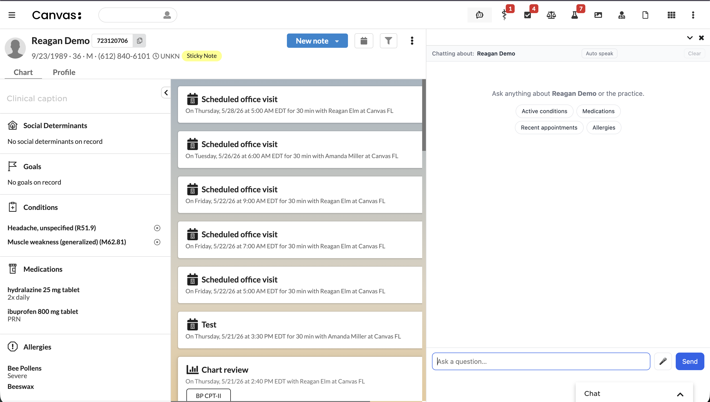

*`ChatApp` — patient-chart drawer; chips and `patient_id` are scoped to the open chart.*

**In the provider companion** — same Assistant, surfaced from the companion's app grid:

<p>
  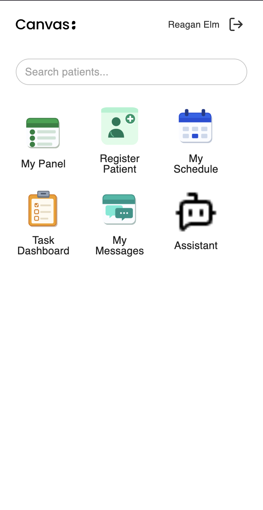
  &nbsp;
  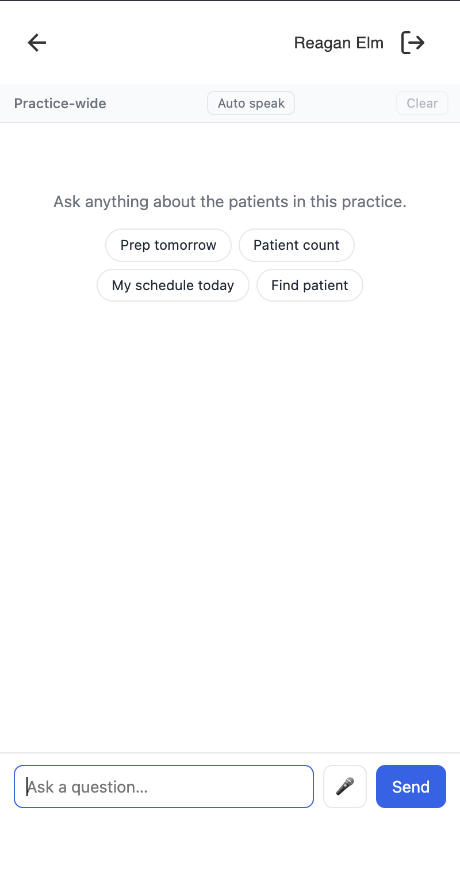
</p>

*`ChatAppCompanionGlobal` — launcher tile (left) and the panel opened (right). `ChatAppCompanionPatient` looks the same but is reached from inside a patient chart in the companion.*

**How scope is contained:**

- **Authentication.** Endpoints require a Canvas staff session via `StaffSessionAuthMixin` (gated by `AUTH_ENABLED`). The plugin fails closed when a session isn't present.
- **Patient threading.** When opened from a chart, the active `patient_id` is passed into every request, so "this patient" questions go straight to the right records without a redundant name lookup — and Claude can't accidentally answer about the wrong patient.
- **Read vs. write split.** Lookup tools run immediately; the three write tools (`create_task`, `create_appointment`, `create_condition`) **pause for explicit user approval** before any effect is applied. There are no delete or update tools.
- **PHI minimization.** Patient names are kept out of web-search queries, and out of chart titles/series labels. `web_search` is capped at one use per request.

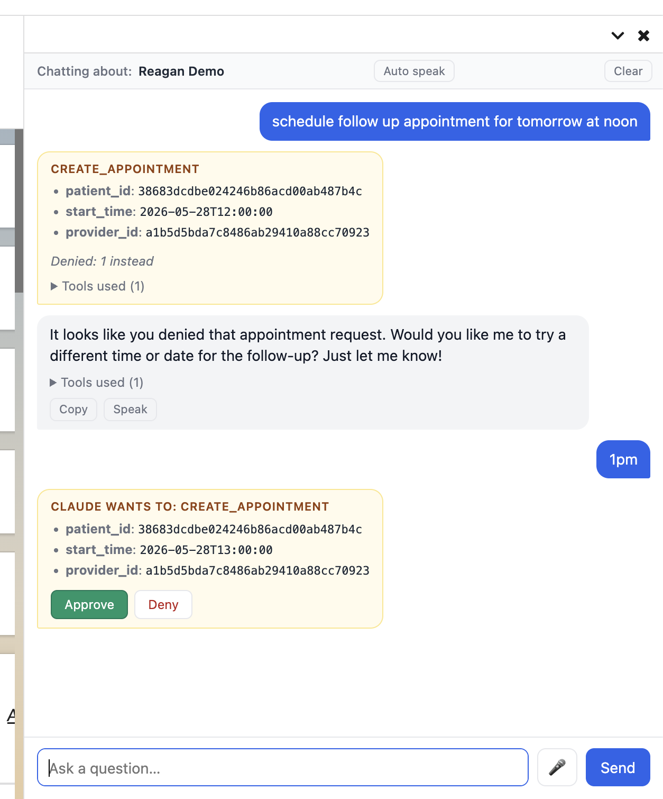

<p>
  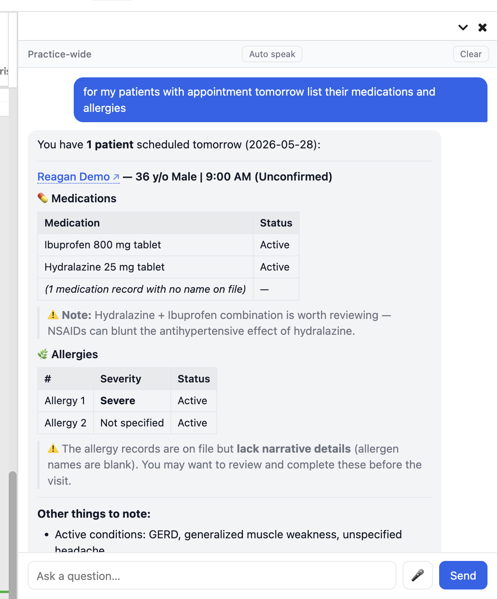
  &nbsp;
  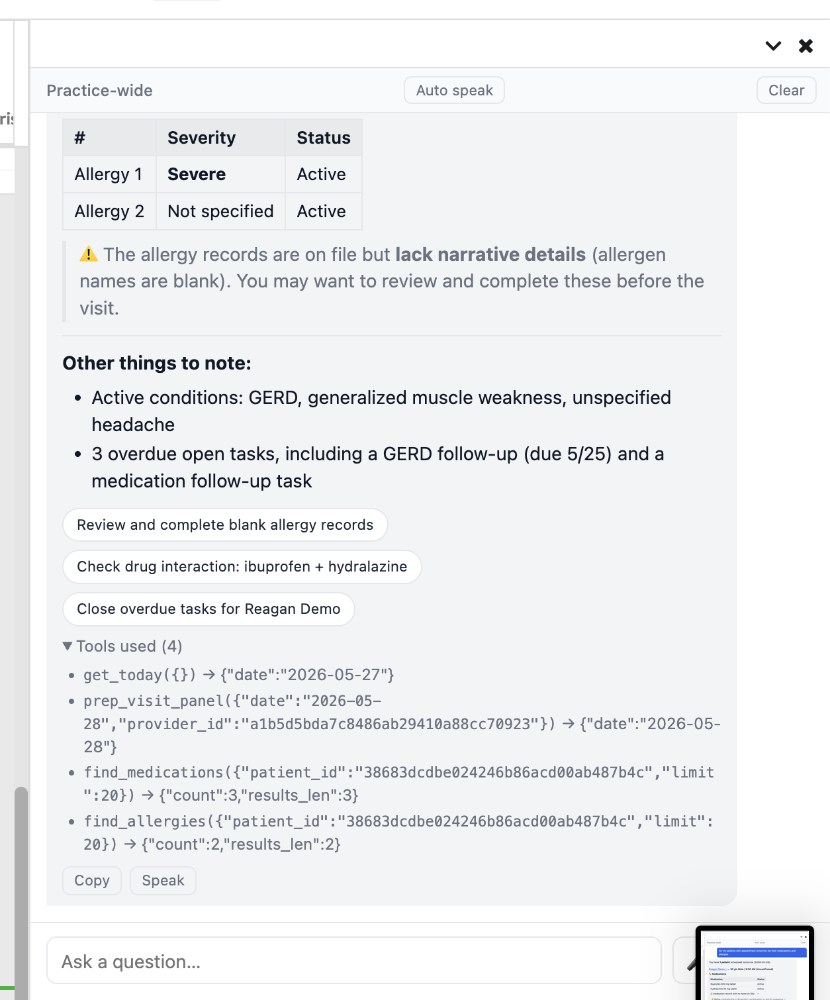
</p>

*Two scroll positions of the same answer — the response body (left) and the expanded "Tools used (4)" footer (right), showing each tool call's inputs and result counts.*

## Technical decisions

- **Direct Anthropic HTTP, not the `LlmAnthropic` wrapper.** The call goes through `canvas_sdk.utils.http.Http` directly. The built-in wrapper only supports a single forced structured-output tool call, which is incompatible with the multi-tool agentic loop this plugin needs.
- **Prompt caching.** The system prompt and tool list are sent with `cache_control: ephemeral`, so iterations within a loop and repeated questions amortize across the cache (`usage.cache_read_input_tokens` climbs after the first call).
- **Polling instead of streaming.** True token-level SSE isn't available in the SDK today, so `/chat` accepts `poll: true` and runs one tool iteration per call, returning `{state: "running"}` while it works. The UI loops on it and shows "Running find_conditions…" between steps — progress every few seconds instead of one silent wait.
- **Raised HTTP timeout.** A small `_AnthropicHttp` subclass bumps the request timeout to 90s so the server-side `web_search` tool (15–60s) can complete without tripping the SDK's 30s default.
- **Bounded loop.** `MAX_LOOP_ITERATIONS = 8` caps runaway tool use; simple questions finish in under five, and the loop returns a graceful fallback if the budget is exhausted.
- **Value-based tool registry.** Tools are assembled from explicit `TOOL_SPEC` dicts and a `_SPECS` tuple rather than decorator registration — see the sandbox notes below for why.

## Wish list: Canvas sandbox improvements

The plugin runs under RestrictedPython, which shapes the architecture in a few ways. Reframed as asks for the Canvas platform:

- **First-class Anthropic SDK / real streaming.** Today there's no token-level streaming — effects are batched until `compute()` returns, `Http.post` can't stream, and WebSockets are server-push-only. We approximate with per-iteration polling; native SSE (or a supported Anthropic SDK) would replace the workaround.
- **Broader Pydantic allowlist.** No `field_validator`, `Annotated[T, "desc"]`, `TypeAdapter`, or `create_model`, so validation/normalization happens in handler bodies instead of on the model.
- **Broader `typing` allowlist.** `Callable`/`ClassVar` must come from `typing`; `Annotated` and `get_type_hints` aren't available; `type[X]` annotations need `from __future__ import annotations`.
- **Decorator-based registration support.** Decorator side effects don't survive sandbox re-evaluation, which is why the tool registry is value-based.

## Disclaimers

- **PHI leaves the instance.** When `/chat` runs, the user's question **and the result of every tool call** — patient names, demographics, dates of birth, diagnosis codes, medication lists, allergies, notes, etc. — is sent to `api.anthropic.com`. Use only with an appropriate Anthropic BAA and data-handling agreements in place.
- **Browser speech is not covered by the Anthropic BAA.** Voice input uses the browser's Web Speech `SpeechRecognition`, which routes audio through the **browser vendor's** cloud (Chrome → Google, Safari → Apple) — not Anthropic, and not under the Anthropic BAA. Read-aloud uses the browser's `speechSynthesis` (vendor or on-device TTS). Both controls are hidden when the browser doesn't support them.
- **Trial posture.** This is a trial/sandbox plugin, not a hardened production deployment: authentication is a code-level toggle, conversations aren't persisted server-side, there's no rate limiting or token-cost cap yet, and the frontend loads `marked` / `DOMPurify` / `Chart.js` from a CDN (pinned with SRI hashes).

## Future enhancements

**Production-readiness**

- ☐ Real authentication beyond the `AUTH_ENABLED` toggle
- ☐ Rate limiting / per-conversation token-cost cap (surface usage in the UI)
- ☐ Structured logging per `/chat` call (question hash, tools, iterations, tokens)
- ☐ Persisted multi-turn history (today's history dies when the panel closes)

**More capability**

- ☐ Additional read tools (CareTeam, Claims, Coverage, Goals, Immunizations, MedHistory, Questionnaires)
- ☐ Additional write tools (Command, Medication, Note, Goal, Questionnaire Response)
- ☐ Update tools (everything)
- ☐ Citations as clickable deep links to the source record (only Patient currently)
- ☐ Write the conversation to a Note (custom command)
- ☐ Bar/scatter charts
- ☐ Image attachments (e.g. drag a wound photo for Claude to analyze)

## Developer reference (condensed)

### `POST /plugin-io/api/assistant/chat`

```sh
curl -X POST "$CANVAS_HOST/plugin-io/api/assistant/chat" \
  -H "Content-Type: application/json" \
  -d '{"question": "what is this patient'\''s most recent appointment?"}'
```

Body: `question` (required), plus optional `staff_id`, `patient_id`, prior `messages` (replay to continue a conversation), and `poll: true`. Response includes `answer` (markdown), a per-tool `trace`, `iterations`, the full `messages` transcript to replay next turn, and token `usage` (including `cache_*` fields). A companion `GET /staff?q=<text>` endpoint helps discover `staff_id` values, and `GET /ui` serves the chat panel.

### Adding a chat tool

Each tool is one module under `assistant/chat_tools/`, exporting a Pydantic args model, a free-function handler, and a `TOOL_SPEC` dict (`mutates: True` for write tools). Wire it up with a direct submodule import in `chat_tools/__init__.py` plus an entry in the `_SPECS` tuple. Shared helpers live in the sibling `assistant/chat_tools_lib.py` (not inside the package — the sandbox recurses on self-imports).

### Smoke tests

End-to-end tests in `tests/test_smoke.py` hit the deployed `/chat` endpoint and exercise the real tool-use loop:

```sh
uv run pytest tests/test_smoke.py -v
```

They don't carry a Canvas staff session, so the deployed plugin needs `AUTH_ENABLED = False` for them to pass — a session-scoped fixture probes `/chat` first and skips the suite with a clear message on a 401. **Flip `AUTH_ENABLED` back to `True` and redeploy before production traffic resumes.**