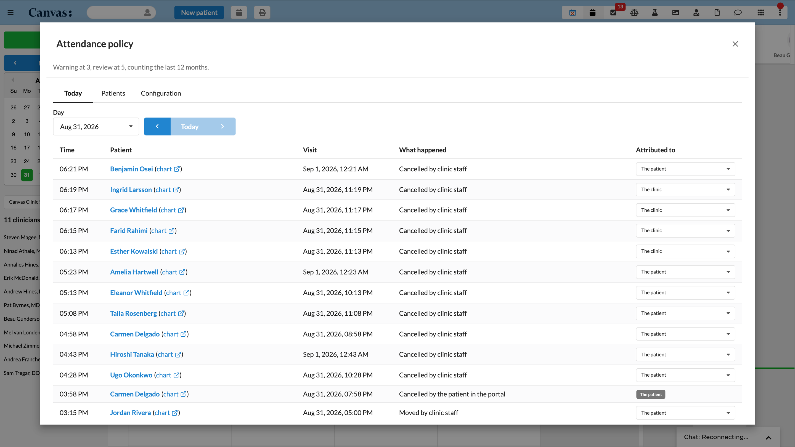
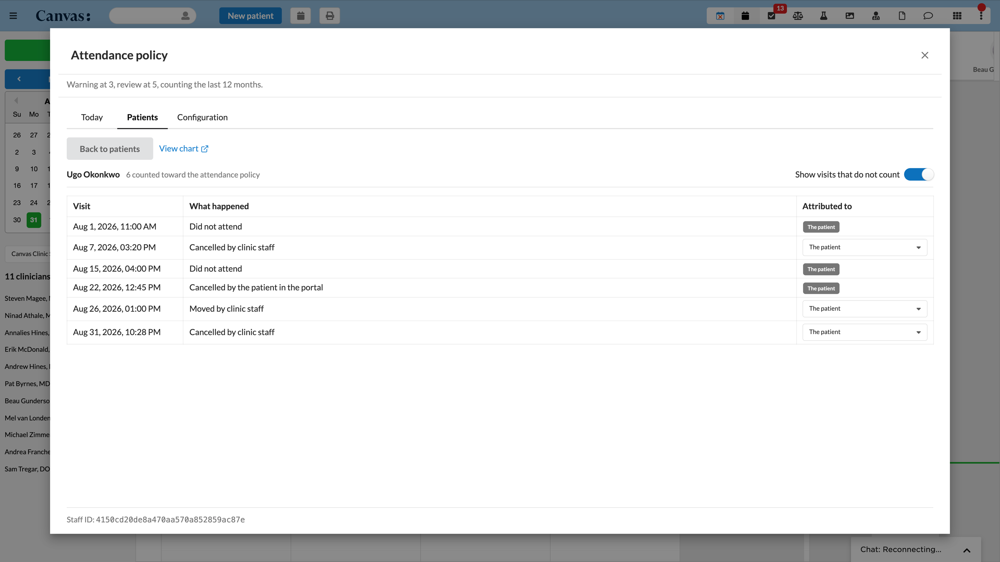

# Attendance Policy Tracker

Counts the visits a patient missed, cancelled too close to the appointment, or
moved so late that moving amounted to a cancellation. Attributes each one to the
patient or to the clinic, and raises a task at a warning threshold and again at a
review threshold. It never discharges anybody.

## What it does

The plugin keeps a per patient count of missed visits, late cancellations, and
late moves, and surfaces that count on its own screen in the persistent top bar.
When a patient reaches the warning threshold it raises one task for the team that
owns warnings, and when they reach the review threshold it raises one task for the
team that owns reviews. A person always decides what happens next. The plugin
changes no patient status and discharges nobody.

Nothing is stored as a running tally. Canvas keeps an append only record of every
state a visit moved into together with who moved it, and the total is rebuilt from
that record every time it is read. A restored appointment or a reverted no show
therefore drops out of the count on the next read, with no repair step anywhere.

Every visit is asked two separate questions. Whether it counts at all, which a no
show always does, and which a cancellation or move does only when it happened
inside the configured cutoff. Then whose side it sits on, decided by a fixed
chain. A no show is always the patient, a portal action is always the patient, the
clinic label anywhere on the thread means the clinic, and anything left over falls
to the configured default. Only patient attributed visits move a patient toward
the thresholds, while clinic attributed ones stay visible but drive nothing.

| Component | What it does |
|---|---|
| Application | A screen in the persistent top bar with a day view, a patient view, and a configuration tab |
| Scheduled sweep | Recomputes recently active patients every five minutes and raises whichever tasks they have earned |
| Run rule | Tags a run of cancellations against one provider as the clinic's, so a morning of clinic cancellations does not land on the patients who lost those visits |
| Install stamp | Records the install moment once, so the count starts empty rather than reaching back through history |

## Problem it solves

A practice that runs an attendance policy discharges a patient after too many
missed and late cancelled visits, but Canvas holds no count of either. Staff label
appointments by hand and then run a report to find out who has crossed a line,
which means the number the policy turns on is the one nobody can see.

Canvas also records who clicked cancel and never who asked for it, so a
cancellation the clinic itself made looks identical to one the patient made.
Counting naively punishes patients for the clinic's own cancellations. This plugin
separates the two with a label any member of staff can add or remove at any time,
and the total follows on the next read.

## Who it's for

- Practices that run a written attendance or no show policy and need the count the
  policy turns on to be visible rather than reconstructed from reports.
- Front desk and scheduling staff, who receive the warning task and who correct
  attribution when a cancellation was really the clinic's.
- Providers and clinical leads, who receive the review task and make the retention
  decision the plugin deliberately leaves to a person.

## How to install

1. From this plugin directory, install into a Canvas instance.

   ```bash
   canvas install attendance_policy_tracker --host <your-instance>
   ```

2. Open Canvas and click the Attendance Policy icon in the persistent top bar.

The plugin declares a `read_write` custom data namespace. On a first install
Canvas creates that namespace and stores its two access keys in the plugin's own
secrets automatically, so there is nothing to configure.

Reinstalling is where care is needed. Uninstalling deletes the plugin's secrets
while deliberately leaving the namespace and its data in place, and Canvas never
regenerates the keys for a namespace that already exists. The stored keys are
hashed, so a lost key cannot be recovered. Copy `namespace_read_write_access_key`
somewhere safe before uninstalling and restore the same value afterwards. If the
key is already lost, the namespace has to be dropped and recreated, which destroys
the stored policy.

```bash
canvas namespace drop <namespace>
```

## Configuration options

Every policy value ships with a working default, so the plugin runs a coherent
policy from the moment it is installed and before anybody opens the configuration
tab. Clearing a field returns it to its default rather than storing a blank. A
save that would produce an incoherent policy, such as a review threshold at or
below the warning threshold, is refused with the reason shown against the field
that caused it.

| Setting | Default | What it controls |
|---|---|---|
| `late_cutoff_hours` | 24 | Hours before the start inside which a cancellation counts |
| `move_boundary_hours` | 24 | Hours before the start inside which moving a visit counts |
| `counting_window_months` | 12 | How far back a total reaches, rolling from the moment of the read |
| `holding_window_minutes` | 15 | How long the plugin waits after an incident before it counts, so a label applied shortly afterwards costs nothing |
| `warning_line` | 3 | Incidents at which the warning task is raised |
| `discharge_review_line` | 5 | Incidents at which the review task is raised, and it must sit above the warning threshold |
| `default_attribution` | `patient` | Who an untagged staff cancellation counts against |
| `counted_kinds` | all three | Which kinds count, chosen from `no_show`, `late_cancellation`, and `late_move` |
| `run_count` | 3 | Cancellations against one provider that trigger the automatic clinic label |
| `run_window_minutes` | 15 | The window that run of cancellations has to fall inside |
| `clinic_tag` | `clinic-cancelled` | The appointment label that marks a cancellation as the clinic's |
| `warning_team_id` | empty | Team receiving the warning task, and an empty value raises no task |
| `discharge_review_team_id` | empty | Team receiving the review task, and an empty value raises no task |
| `warning_task_labels` | empty | Labels applied to the warning task |
| `discharge_review_task_labels` | empty | Labels applied to the review task |

One setting sits outside the plugin. The list of staff who may open the
configuration tab lives in Canvas administration as the `config_access_staff_ids`
variable, because a plugin cannot write its own variables. That is the property
wanted here, since the list of people allowed to change policy should not be
editable from the screen it guards.

That variable is empty on a fresh install, which means nobody can open the
configuration tab yet. Granting access needs the staff key, a thirty two character
hexadecimal string, and not the integer shown beside a user in the administration
user list. Copying that integer is the common mistake and it fails quietly, the
tab simply never appears. The plugin prints every member of staff their own key at
the bottom of its screen whether or not they have access, so the sequence is
straightforward.

1. The person who needs access opens the plugin and reads the identifier printed
   at the bottom of the page.
2. An administrator pastes that value into `config_access_staff_ids` in Canvas
   administration. Several people are separated by whitespace, newlines, or
   commas, whichever is convenient.
3. That person reloads the plugin and the configuration tab is there.

A refused attempt is logged with the key that was presented, so a wrong value is
discoverable rather than mysterious.

## Screenshots or screen recordings



The Today tab, one row per attendance change, newest first. Each row names the
patient, the visit that was given up, what happened to it, and who it counts
against. A patient's name opens their record on this surface, and the chart link
beside it opens their Canvas chart. The four clinic rows in the middle are a run
of cancellations the plugin recognised as the clinic's own doing and attributed
away from those patients without anybody asking.



The Patients tab with one record open. Every visit counted against that patient
in the last twelve months, with the attribution editable on the ones where a
correction is possible. A missed visit and a cancellation the patient made in the
portal are settled facts, so they are shown fixed rather than as a control.

## Known limitations

- The count starts empty at install and reaches back no further, so a practice
  gets little from the plugin until roughly a counting window of incidents has
  built up.
- The automatic run rule labels cancellations as they arrive, so a run that
  happened before the plugin was installed is never labelled and has to be
  corrected by hand.
- Changing the clinic label leaves corrections already made under the previous
  label behind. The configuration screen warns about this rather than preventing
  it.
- A patient moving their own visit through the portal is gated behind a per
  appointment type setting that is off by default, so a practice may never emit
  that signal at all.
- The patient list returns at most three hundred people and the on demand
  recompute emits at most two hundred actions, both to keep one screen from
  asking the instance for unbounded work. Each response says when it was
  truncated, and nothing is lost because the periodic sweep is not capped.

## Tests

```bash
uv sync
uv run pytest tests -q
```

217 tests cover the counting engine, attribution, configuration validation, the
install stamp, the live channel, the staff facing routes, the periodic sweep, the
visit source queries, and policy storage.
