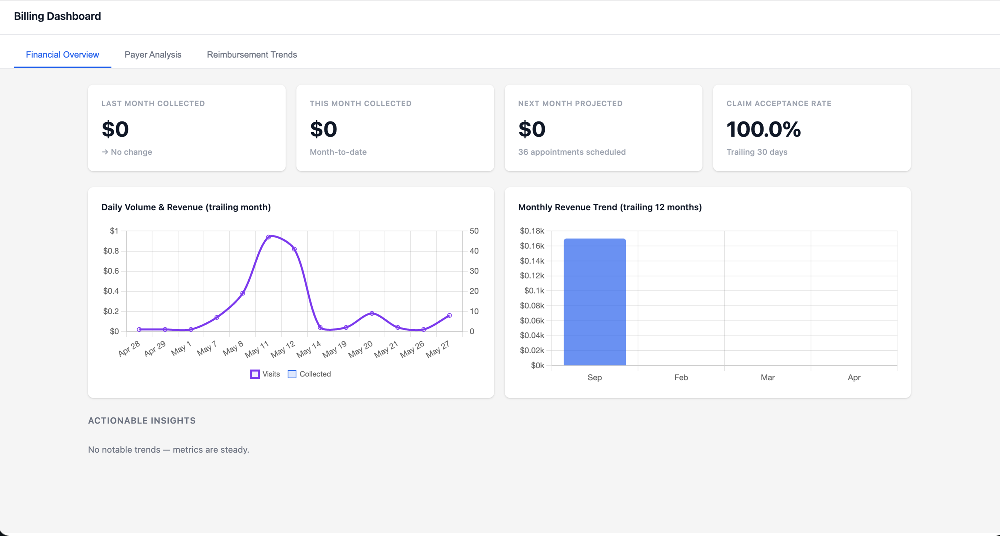
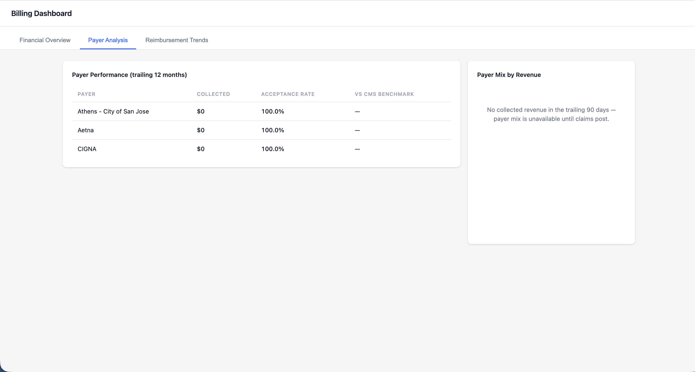
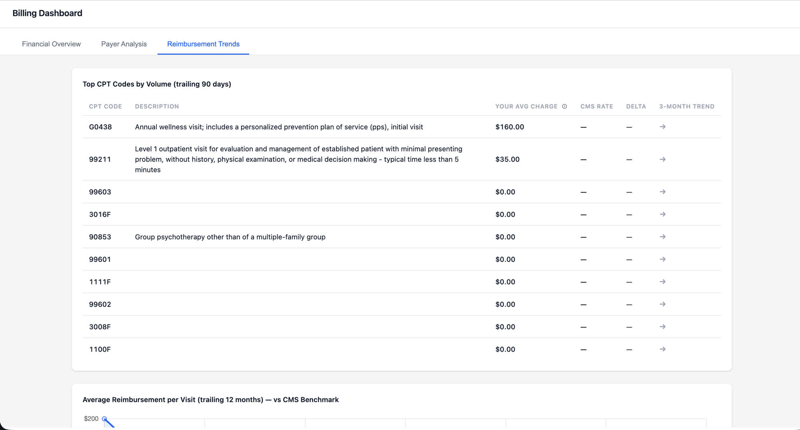
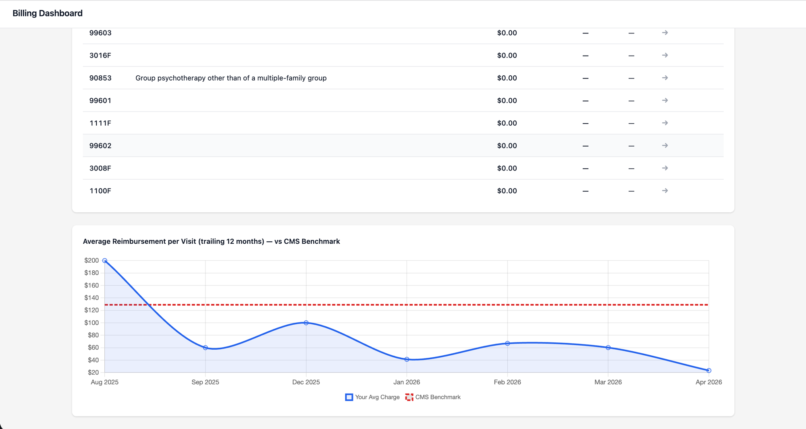

# Billing Dashboard

## What it does

Billing Dashboard is a full-page financial overview for practice managers and billing staff. Open it from the Canvas provider menu and see three tabs of real-time data about the practice's billing: how much money came in last month, which payers are the strongest performers, and which CPT codes are billed most often. The dashboard pulls directly from Canvas's claim and billing records — no exports, no copy/paste from other systems.

## Problem it solves

Practice managers and billing leads need a weekly pulse on financial health: "Did we collect more or less than last month? Which payer is slowest to pay? Are we billing the right mix of codes?" Today that answer lives in three places at once — the claim queues in Canvas's revenue views, an Excel file that tracks payer performance, and a report someone runs manually at month-end. The information exists but never lands in one place at the same time. Billing Dashboard is that one place: each metric reads from the same Canvas data the team already trusts, so the dashboard matches the claim detail views byte-for-byte.

## Who it's for

| Role | Primary use |
|---|---|
| Practice manager | Weekly / monthly pulse on financial health |
| Billing lead | Spot payer-specific problems (acceptance rate dips, slow collections) |
| Clinic owner / administrator | At-a-glance revenue trend without pulling reports |
| Revenue cycle consultant | Benchmark a practice against CMS rates and their own history |

**Specialty:** not specialty-specific. Any ambulatory practice using Canvas for billing will see meaningful data. Specialties with heavy quality-measure (F-code) reporting may see blank descriptions for CPTs that aren't entries in the practice's `ChargeDescriptionMaster`.

## How to install

1. From this plugin directory, install into a Canvas instance:
   ```bash
   canvas install billing_dashboard --host <your-instance>
   ```
2. Open Canvas. In the provider menu (top-right waffle icon), click **Billing Dashboard**.

No post-install configuration is required.

## Configuration options

This plugin has **no secrets, environment variables, or manifest settings to customize**. All customization requires a code change:

| What | File | Notes |
|---|---|---|
| CMS benchmark rates (per CPT) | `data/cms_rates.py` | `CMS_RATES` dict; expand for additional codes |
| Time windows (month / trailing 90d / trailing 12mo) | `data/windows.py` | Each window is a small function returning a start/end tuple |
| Insights rule thresholds | `data/insights.py` | Five simple rules; edit the threshold or add a rule |
| Per-tab metric composition | `data/overview.py` / `payer.py` / `trends.py` | One file per tab; `build_*()` function assembles the payload |

If the practice's `ChargeDescriptionMaster` table has entries for their CPT codes, those descriptions will show up automatically — no config needed.

## Screenshots

### Financial Overview



### Payer Analysis



### Reimbursement Trends





## Frontend layout (reference)

### Tab 1: Financial Overview

```
┌─────────────────────────────────────────────────────────────────┐
│  Billing Dashboard                                              │
├──────────────────┬─────────────────┬────────────────────────────┤
│ Financial Overview│ Payer Analysis  │ Reimbursement Trends       │
├──────────────────┴─────────────────┴────────────────────────────┤
│                                                                 │
│  ┌──────────────┐ ┌──────────────┐ ┌──────────────┐ ┌────────┐ │
│  │ Last Month   │ │ This Month   │ │ Next Month   │ │ Claim  │ │
│  │ Collected    │ │ Collected    │ │ Projected    │ │ Accept │ │
│  └──────────────┘ └──────────────┘ └──────────────┘ └────────┘ │
│                                                                 │
│  ┌─────────────────────────┐ ┌─────────────────────────┐       │
│  │ Daily Volume & Revenue  │ │ Monthly Revenue Trend   │       │
│  │ (trailing month)        │ │ (trailing 12 months)    │       │
│  └─────────────────────────┘ └─────────────────────────┘       │
│                                                                 │
│  ACTIONABLE INSIGHTS (rule-based, computed from summary metrics)│
└─────────────────────────────────────────────────────────────────┘
```

### Tab 2: Payer Analysis

```
┌─────────────────────────────────────────────────────────────────┐
│  Payer Performance (trailing 90 days)            │ Payer Mix    │
│  ─────────────────────────────────────           │ by Revenue   │
│  Payer  │ Collected │ Acceptance │ vs CMS       │              │
│  ───────┼───────────┼────────────┼─────────     │ [Doughnut]   │
│  ...rows grouped by `coverages__payer_name`...  │              │
└─────────────────────────────────────────────────────────────────┘
```

### Tab 3: Reimbursement Trends

```
┌─────────────────────────────────────────────────────────────────┐
│  Top CPT Codes by Volume (trailing 90 days)                    │
│  CPT  │ Description (from ChargeDescriptionMaster) │ Your Avg  │
│       │                                            │ Charge    │
│  ─────┼────────────────────────────────────────────┼──────────  │
│  ...top 10 CPT codes by volume with CMS comparison...          │
│                                                                 │
│  Average Charge per Visit (trailing 12 months) vs CMS Benchmark│
│  Line chart: your avg (filled) vs CMS benchmark (dashed)       │
└─────────────────────────────────────────────────────────────────┘
```

## Architecture

```
billing_dashboard/
├── CANVAS_MANIFEST.json        # plugin manifest (v0.7.1+)
├── README.md                   # this file
├── applications/
│   └── billing_app.py          # provider-menu entry; launches modal → /dashboard
├── assets/
│   ├── billing-dashboard-icon.svg
│   └── billing-dashboard-icon.png
├── data/
│   ├── cms_rates.py            # hardcoded CMS benchmark lookup
│   ├── insights.py             # rule engine for the insights panel
│   ├── mock.py                 # mock payloads (fallback when real data is empty)
│   ├── overview.py             # Overview tab builder (Claim + Appointment)
│   ├── payer.py                # Payer tab builder (Claim grouped by payer_name)
│   ├── trends.py               # Trends tab builder (BillingLineItem + ChargeDescriptionMaster)
│   └── windows.py              # calendar + trailing time-window helpers
├── handlers/
│   └── billing_api.py          # SimpleAPI: serves the page, CSS, JS, and JSON metrics
├── static/
│   ├── css/styles.css          # dashboard CSS (served via render_to_string)
│   └── js/main.js              # tab switching, fetches, Chart.js rendering
└── templates/
    └── page.html               # HTML page (references styles.css and main.js as static assets)
```

## Endpoints

| Method | Path | Description |
|--------|------|-------------|
| GET | `/dashboard` | Serves the dashboard HTML page |
| GET | `/styles.css` | Dashboard stylesheet |
| GET | `/main.js` | Dashboard JavaScript (tab switching, fetches, charts) |
| GET | `/api/metrics?tab=overview` | Overview JSON — summary cards + daily/monthly charts + insights |
| GET | `/api/metrics?tab=payer` | Payer JSON — per-payer table + payer mix data |
| GET | `/api/metrics?tab=trends` | Trends JSON — top CPT table + monthly average series |

All endpoints are guarded by `StaffSessionAuthMixin` — only authenticated Canvas staff can reach them.

## Running tests

```bash
uv run pytest tests/
```
