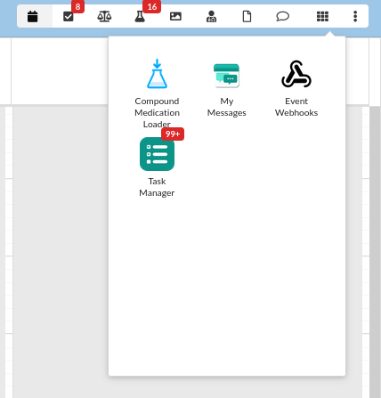
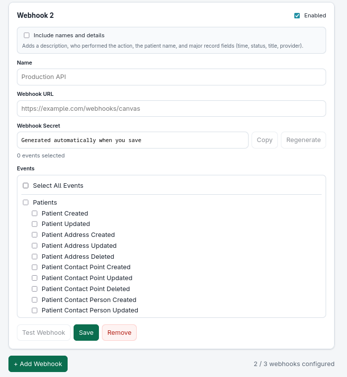

# Event Webhooks — user guide

This is the plugin README: how to install, configure, and **receive** Canvas events.

If you are changing the plugin code, use the [developers guide](DEVELOPERS.md). For a short overview, see the [repo README](../README.md).

---

## What it does

Canvas fires an event (`APPOINTMENT_CREATED`, `PRESCRIPTION_SIGNED`, …). The plugin turns that into a JSON POST and sends it to every enabled webhook that selected that event.

- Up to **3** HTTPS destinations
- **156** verified Canvas `EventType` names (nothing invented)
- Each destination has its own secret and event list
- Optional names and details (who did it, patient name, major fields)

```
Canvas Event
     │
     ▼
Event Dispatcher
     │
     ├── Webhook 1  → filter → HMAC (secret 1) → https://…
     ├── Webhook 2  → filter → HMAC (secret 2) → https://…
     └── Webhook 3  → filter → HMAC (secret 3) → https://…
```

Retries: 429, 500, 502, 503, 504. Max 3. Async (the plugin does not wait). One webhook’s failure does not stop the others.

---

## Problem it solves

Without this plugin, every Canvas → external-system integration is its own plugin, each re-implementing HMAC signing, retries, and event filtering, and none of it changeable without a redeploy. This replaces that with one signed, retrying pipeline and a staff UI, so adding or re-pointing a destination is a config change, not a code change.

## Who it's for

Integration engineers connecting Canvas to an external API, queue, or warehouse, and operations staff who need appointment, task, or billing events in Slack or Zapier and want to manage the destinations themselves. No specialty assumptions.

---

## Install

```bash
uv sync
uv run pytest
uv run canvas validate canvas_event_webhooks
uv run canvas install canvas_event_webhooks --host <your-subdomain>
```

Bump `plugin_version` in `CANVAS_MANIFEST.json` before each reinstall.

Optional, only if you have not saved anything in the UI yet:

```bash
uv run canvas install canvas_event_webhooks --host <your-subdomain> \
    --secret webhook-url=https://your-endpoint.example.com/canvas \
    --secret webhook-secret=$(openssl rand -hex 32)
```

After the first UI save, those CLI secrets are ignored for delivery.

---

## Configure in Canvas

Open the Canvas apps grid (the 3×3 icon in the top bar) and choose **Event Webhooks**. It is a global app, not inside a patient chart.



Each card:

| Field | Notes |
|---|---|
| Name | Your label, max 80 characters |
| URL | `https://` only. HTTP is rejected and never delivered |
| Secret | Generated on save (`canvaswebhook_` + 32 bytes of entropy). Copy it. Regenerating means updating your receiver |
| Enabled | Off = this destination gets nothing |
| Include names and details | Off = IDs only. On = description, actor, patient name/MRN, major record fields |
| Events | Select All, or per category / per event |



**Test Webhook** POSTs a signed `webhook.test`. Canvas cannot show the remote HTTP status. Confirm on your side or with `canvas logs --host <subdomain>` (`[Webhooks]`).

---

## Payload

Same envelope on every event.

### Default (IDs only)

```json
{
  "id": "7c9e6679-7425-40de-944b-e07fc1f90ae7",
  "event": "PRESCRIPTION_CREATED",
  "occurred_at": "2026-09-02T12:30:00.000000+00:00",
  "source": "canvas",
  "version": "1",
  "patient_id": "pt_abc123",
  "target": {
    "id": "a1b2c3d4-…",
    "type": "Prescription"
  },
  "context": {
    "patient_id": "pt_abc123"
  }
}
```

`patient_id` is present only on patient-related events. It is read from the Canvas context (`patient.id`, `patient_id`, or a nested record). It is never invented. Staff, patient-group, and compound-medication events omit it.

### Names and details (toggle on)

Extra keys:

- `description` — one sentence, e.g. `Dr. Jane Smith — Appointment Created for patient John Doe (…)`
- `actor` — who did it (`first_name`, `last_name`, `full_name`, staff prefix/NPI when available)
- `patient` — `full_name`, `mrn`, `birth_date` when we can load them
- `data` — record-specific fields (appointment time/status/location, task title/assignee, prescription status/pharmacy, note title — **not** the note body)

Still omitted: SSN, note body, message content, document URLs, payment amounts.

### Raw Canvas context

Plugin secret `include-context=true` puts the **unfiltered** Canvas context in `context` (file URLs, comments, etc.). That is instance-wide, not per webhook.

```bash
canvas set-secrets canvas_event_webhooks include-context=true
```

### Test ping

```json
{
  "id": "…",
  "event": "webhook.test",
  "occurred_at": "2026-09-02T12:30:00.000000+00:00",
  "source": "canvas",
  "version": "1",
  "test": true,
  "message": "This is a test event from Canvas Event Webhooks."
}
```

---

## Signature (required on your server)

```
Content-Type: application/json
X-Canvas-Timestamp: 1756830000
X-Canvas-Signature: t=1756830000,v1=<hex digest>
```

Signed material is `{unix_timestamp}.{raw JSON body}`. Each webhook has its own secret.

**On your server:**

1. Read the **raw** body (do not re-serialize JSON).
2. Parse `t` and `v1` from `X-Canvas-Signature`.
3. Reject if `t` is older than **5 minutes** or more than **30 seconds** in the future.
4. HMAC-SHA256 the secret with `f"{t}." + body` and compare to `v1` with a timing-safe compare.
5. Reject unsigned requests (no header / no secret on a legacy CLI webhook).

This format started in plugin **0.4.0**. Older `sha256=<hmac of body only>` is gone.

Python:

```python
import hashlib, hmac, time

MAX_AGE = 300

def verify(secret: str, body: bytes, header: str) -> bool:
    parts = dict(item.split("=", 1) for item in header.split(",") if "=" in item)
    timestamp = int(parts["t"])
    age = time.time() - timestamp
    if age < -30 or age > MAX_AGE:
        return False
    expected = hmac.new(
        secret.encode(), f"{timestamp}.".encode() + body, hashlib.sha256
    ).hexdigest()
    return hmac.compare_digest(expected, parts["v1"])
```

Node:

```javascript
const crypto = require("crypto");

const MAX_AGE = 300;

function verify(secret, rawBody, header) {
  const parts = Object.fromEntries(
    header.split(",").filter((p) => p.includes("=")).map((p) => p.split("="))
  );
  const timestamp = Number(parts.t);
  const age = Date.now() / 1000 - timestamp;
  if (age < -30 || age > MAX_AGE) return false;
  const expected = crypto
    .createHmac("sha256", secret)
    .update(`${timestamp}.`)
    .update(rawBody)
    .digest("hex");
  return crypto.timingSafeEqual(Buffer.from(expected), Buffer.from(parts.v1));
}
```

Do not log secrets or full patient payloads.

---

## CLI secrets (legacy)

If nothing has been saved in the UI yet:

- All 156 events go to `webhook-url`
- Signing uses `webhook-secret` when set
- The UI shows a **Legacy CLI webhook** you can save or replace

After the first UI save, AttributeHub is the source of truth. `include-context` still applies.

---

## Event catalog

Every name is checked against `canvas_sdk.events.EventType`. These do **not** exist in Canvas and are not implemented: `PATIENT_DELETED`, `PATIENT_ACTIVATED` / `_DEACTIVATED`, `APPOINTMENT_DELETED` / `_COMPLETED`, `TASK_DELETED`, `MESSAGE_UPDATED` / `_SENT` / `_DELETED`, `CONVERSATION_*`, `PRESCRIPTION_RENEWED` / `_REJECTED` / `_SENT`.

### Patients (21)

| Event | When |
|---|---|
| `PATIENT_CREATED` | New patient record |
| `PATIENT_UPDATED` | Patient fields change |
| `PATIENT_ADDRESS_CREATED` / `_UPDATED` / `_DELETED` | Address |
| `PATIENT_CONTACT_POINT_CREATED` / `_UPDATED` / `_DELETED` | Phone / email |
| `PATIENT_CONTACT_PERSON_CREATED` / `_UPDATED` / `_DELETED` | Related person |
| `PATIENT_EXTERNAL_IDENTIFIER_CREATED` / `_UPDATED` / `_DELETED` | External ID |
| `PATIENT_FACILITY_ADDRESS_CREATED` / `_UPDATED` / `_DELETED` | Facility address |
| `PATIENT_METADATA_CREATED` / `_UPDATED` | Metadata |
| `PATIENT_PREFERRED_PHARMACY_UPDATED` | Preferred pharmacy |
| `PATIENT_PAYMENT_PROCESSED` | Payment processed |

### Appointments (11)

| Event | When |
|---|---|
| `APPOINTMENT_CREATED` | Booked |
| `APPOINTMENT_UPDATED` | Details change |
| `APPOINTMENT_RESCHEDULED` | Rescheduled |
| `APPOINTMENT_CHECKED_IN` | Checked in |
| `APPOINTMENT_CANCELED` | Canceled |
| `APPOINTMENT_NO_SHOWED` | No-show |
| `APPOINTMENT_RESTORED` | Restored |
| `APPOINTMENT_LABEL_ADDED` / `_REMOVED` | Labels |
| `APPOINTMENT_METADATA_CREATED` / `_UPDATED` | Metadata |

### Clinical notes (11)

| Event | When |
|---|---|
| `NOTE_CREATED` / `_UPDATED` | Note opened or fields change |
| `NOTE_OPENED` / `NOTE_CLOSED` | Opened or closed |
| `NOTE_STATE_CHANGE_EVENT_CREATED` | Signed, locked, unlocked, … |
| `NOTE_STATE_CHANGE_EVENT_UPDATED` | State-change record updated |
| `NOTE_SUPERVISING_PROVIDER_CHANGED` | Supervising provider |
| `NOTE_METADATA_CREATED` / `_UPDATED` | Metadata |
| `ENCOUNTER_CREATED` / `_UPDATED` | Encounter |

### Clinical records (24)

| Event | When |
|---|---|
| `CONDITION_CREATED` / `_UPDATED` / `_RESOLVED` / `_ASSESSED` | Problem list |
| `ALLERGY_INTOLERANCE_CREATED` / `_UPDATED` | Allergy |
| `IMMUNIZATION_CREATED` / `_UPDATED` | Immunization |
| `IMMUNIZATION_STATEMENT_CREATED` / `_UPDATED` | Statement |
| `OBSERVATION_CREATED` / `_UPDATED` | Observation |
| `VITAL_SIGN_CREATED` / `_UPDATED` | Vitals |
| `INSTRUCTION_CREATED` / `_UPDATED` | Instruction |
| `INTERVIEW_CREATED` / `_UPDATED` | Interview |
| `DEVICE_CREATED` / `_UPDATED` | Device |
| `DETECTED_ISSUE_CREATED` / `_UPDATED` | Detected issue |
| `DETECTED_ISSUE_EVIDENCE_CREATED` / `_UPDATED` | Evidence |

### Medications (4)

| Event | When |
|---|---|
| `MEDICATION_LIST_ITEM_CREATED` / `_UPDATED` | Med list |
| `COMPOUND_MEDICATION_CREATED` / `_UPDATED` | Compound |

### Prescriptions (14)

| Event | When |
|---|---|
| `PRESCRIPTION_CREATED` | Prescribe command |
| `PRESCRIPTION_UPDATED` | Updated |
| `PRESCRIPTION_SIGNED` | Signed |
| `PRESCRIPTION_TRANSMITTED` | Sent to pharmacy |
| `PRESCRIPTION_DELIVERED` | Pharmacy received |
| `PRESCRIPTION_ACCEPTED` | Accepted |
| `PRESCRIPTION_ERRORED` | eRx error |
| `PRESCRIPTION_CANCELED` | Canceled |
| `PRESCRIPTION_CANCEL_REQUESTED` / `_DENIED` | Cancel request |
| `PRESCRIPTION_PENDING` / `PRESCRIPTION_INQUEUE` | Queue |
| `PRESCRIPTION_OPENED` | Opened |
| `PRESCRIPTION_RECEIVED` | Received |

### Labs, imaging, referrals (8)

| Event | When |
|---|---|
| `LAB_ORDER_CREATED` / `_UPDATED` | Lab order |
| `LAB_REPORT_CREATED` / `_UPDATED` | Lab report |
| `IMAGING_REPORT_CREATED` / `_UPDATED` | Imaging report |
| `REFERRAL_REPORT_CREATED` / `_UPDATED` | Referral report |

### Tasks (10)

| Event | When |
|---|---|
| `TASK_CREATED` / `_UPDATED` / `_COMPLETED` / `_CLOSED` | Lifecycle |
| `TASK_COMMENT_CREATED` / `_UPDATED` / `_DELETED` | Comments |
| `TASK_LABELS_ADJUSTED` | Labels |
| `TASK_METADATA_CREATED` / `_UPDATED` | Metadata |

### Staff (10)

| Event | When |
|---|---|
| `STAFF_CREATED` / `_UPDATED` / `_ACTIVATED` / `_DEACTIVATED` | Staff |
| `STAFF_EXTERNAL_IDENTIFIER_CREATED` / `_UPDATED` / `_DELETED` | External IDs |
| `STAFF_METADATA_CREATED` / `_UPDATED` / `_DELETED` | Metadata |

### Documents (11)

| Event | When |
|---|---|
| `DOCUMENT_RECEIVED` | Inbound document |
| `DOCUMENT_LINKED_TO_PATIENT` | Linked |
| `DOCUMENT_CATEGORIZED` | Type assigned |
| `DOCUMENT_REVIEWED` | Reviewed |
| `DOCUMENT_DELETED` / `_DELEGATED` / `_FIELDS_UPDATED` / `_REVIEWER_ASSIGNED` | Later lifecycle |
| `DOCUMENT_REFERENCE_CREATED` / `_UPDATED` / `_DELETED` | Document reference |

### Messages and letters (7)

| Event | When |
|---|---|
| `MESSAGE_CREATED` | Patient–provider message |
| `MESSAGE_TRANSMISSION_CREATED` / `_UPDATED` | Transmission |
| `LETTER_CREATED` / `_UPDATED` | Letter |
| `LETTER_ACTION_EVENT_CREATED` / `_UPDATED` | Letter action |

### Care teams and groups (8)

| Event | When |
|---|---|
| `CARE_TEAM_MEMBERSHIP_CREATED` / `_UPDATED` / `_DELETED` | Care team |
| `PATIENT_GROUP_CREATED` / `_UPDATED` | Group |
| `PATIENT_GROUP_MEMBERSHIP_CREATED` / `_UPDATED` / `_DELETED` | Membership |

### Billing, coverage, consent (17)

| Event | When |
|---|---|
| `BILLING_LINE_ITEM_CREATED` / `_UPDATED` | Line items |
| `CLAIM_CREATED` / `_UPDATED` | Claims |
| `CLAIM_INCIDENT_TO_CHANGED` / `CLAIM_QUEUE_MOVED` / `CLAIM_SUPERVISING_PROVIDER_CHANGED` | Claim routing |
| `COVERAGE_CREATED` / `_UPDATED` | Coverage |
| `COVERAGE_ELIGIBILITY_RESPONSE_*` | Eligibility |
| `CONSENT_CREATED` / `_UPDATED` / `_DELETED` | Consent |

---

## Security (what the plugin actually does)

- HTTPS only
- HMAC per webhook, timestamp bound into the signature
- Secrets generated server-side, not logged
- Config UI requires a logged-in **staff** session
- Default payload is IDs; names are opt-in per webhook

Replay protection (the 5-minute `t` window) must be implemented **on your receiver**. Canvas cannot reject a POST that someone later copies to your URL.
