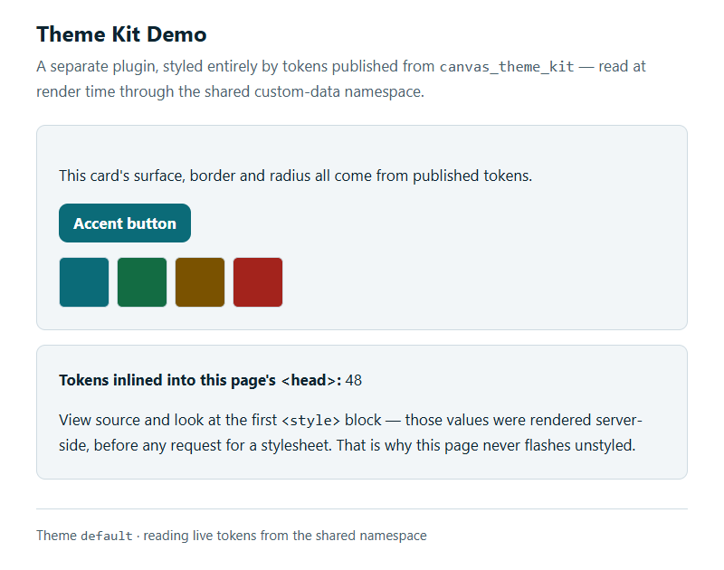

# Canvas Theme Kit Demo

## What it does

A reference consumer for [Canvas Theme Kit](../canvas-theme-kit). It adds a
**Theme Kit Demo** entry to the provider menu that opens a page styled entirely
by the tokens published from Theme Kit. The page's first paint already carries
the published colors, spacing and type, read at render time from the shared
custom-data namespace and inlined into `<head>`.

It is meant to be copied. Start your own consumer plugin from this one and
change the page.

## Problem it solves

A page that links a stylesheet paints twice: once with browser defaults, and
again when the stylesheet arrives. That second repaint is the flash of unstyled
content, and it is the hard part of sharing a stylesheet between plugins.

This plugin shows the fix working end to end. It reads the active theme's tokens
while rendering and inlines them before the response is sent:

```html
<style>:root{--ctk-color-accent:#0b5fff;--ctk-space-4:1rem;…}</style>
<link rel="stylesheet" href="/plugin-io/api/canvas_theme_kit/assets/default/core.css" />
```

No request has to complete for the first paint to be correct. View source on the
demo page: the first `<style>` block is the proof.

It also ships a diagnostic route. A page rendering with fallback colors could
mean a missing namespace key, an unpublished theme, or genuinely empty tokens.
Those are three different problems that look identical on screen, and
`/demo/tokens` tells you which one you have.

## Who it's for

| Role | Primary use |
|---|---|
| Plugin developer | A working starting point for a plugin that consumes Theme Kit tokens |
| Designer or brand owner | A page to check a published theme against before it reaches real surfaces |

**Specialty:** not specialty-specific.

## How to install

Requires [`canvas_theme_kit`](../canvas-theme-kit) installed first, with a
published theme.

1. From this plugin directory, install it with the publisher's read key:

   ```bash
   canvas install canvas_theme_kit_demo --host <instance> \
     --secret namespace_read_access_key=<the publisher's read key>
   ```

   The install fails without that key: Canvas refuses to authorize a plugin that
   declares namespace access it cannot prove. `canvas install` prints
   `uploaded!` and exits 0 even when the server-side install then fails, so check
   `canvas logs --host <instance>` rather than the exit code.

2. Open Canvas. In the provider menu, click **Theme Kit Demo**.

## Configuration options

| Setting | Type | Purpose |
|---|---|---|
| `namespace_read_access_key` | secret | The `namespace_read_access_key` you supplied when installing `canvas_theme_kit`. |

Nothing else is configurable. The demo reads the theme with slug `default`;
append `?theme=<slug>` to `/demo/page` to view another.

## Screenshots

### Demo page



## Routes

| Route | Serves | Auth |
|---|---|---|
| `GET /demo/page` | the token-styled page | any logged-in session |
| `GET /demo/tokens` | what this plugin can see through the namespace | any logged-in session |

## How it reads the tokens

**Identical model definitions.** `canvas_theme_kit_demo/models/__init__.py`
mirrors the publisher's models. The SDK requires every plugin sharing custom
tables to declare identical models. Drift does not raise; it silently reads the
wrong shape, which is why `tests/test_model_mirror.py` compares the two
structurally when `canvas-theme-kit` is checked out alongside this folder.

**Namespace sharing, not HTTP.** Fetching tokens over HTTP from the publisher
would cost a round trip on the render path, which is the thing being avoided. It
also would not work: the publisher's asset routes are session-gated, and a
server-side call from another plugin carries no user session.

`tokens.py` caches the token map for 60 seconds, so a page render costs no
database round trip, and a published change reaches server-rendered pages within
a minute. It caches the map rather than the rendered block because the page uses
both; caching only the block left every render paying for the queries anyway.

More in [canvas_theme_kit_demo/README.md](canvas_theme_kit_demo/README.md) and
the publisher's [docs/consuming.md](../canvas-theme-kit/docs/consuming.md).

## Running tests

```bash
uv run pytest --cov=canvas_theme_kit_demo --cov-report=term-missing --cov-branch
uv run mypy --config-file=mypy.ini .
canvas validate canvas_theme_kit_demo
```

On Windows, prefix Canvas CLI commands with `PYTHONIOENCODING=utf-8`.

## License

Apache-2.0. See [LICENSE](LICENSE) and [NOTICE](NOTICE).
