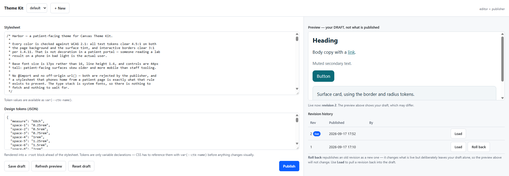

# Canvas Theme Kit

## What it does

Canvas Theme Kit gives your Canvas plugins one shared set of design tokens and
CSS, and lets authorized staff edit and publish it from inside Canvas. Open
**Theme Kit** from the provider menu, change a color or a spacing value, preview
it, and publish. Every plugin that consumes the theme picks up the change within
about five minutes, with no redeploy, no version bump, and no code change in the
consumers.

It ships:

- A staff-gated editor for CSS and design tokens, with a live preview of your
  draft.
- Multiple named themes, each independently versioned.
- An append-only revision history with rollback. One bad stylesheet affects
  every consuming page at once, so it needs a fast way back.
- Asset routes that serve the published stylesheet, a `:root` token block, and a
  shared script.
- `harbor`, a ready-made accessible theme in `themes/`, with a one-shot script
  to apply it.

A working consumer ships alongside it in
[`canvas-theme-kit-demo`](../canvas-theme-kit-demo).

## Problem it solves

Canvas plugins each render their own HTML. Build more than two and you are
copy-pasting the same button styles between them, and the copies drift. The
usual fix is a shared stylesheet plugin, which works until design wants a color
changed and the answer is "next release."

The second problem is subtler. A page that links a stylesheet paints twice: once
with browser defaults, once when the CSS arrives. On a patient portal over a
phone connection that second repaint is clearly visible, and it looks broken.
Tightening cache headers usually makes it worse, because the obvious-looking
headers force a revalidation round trip before first paint.

Theme Kit solves both. A consuming plugin reads the published tokens **while
rendering its page** and inlines them into `<head>`:

```html
<style>:root{--ctk-color-accent:#0b6b78;--ctk-space-4:1rem;…}</style>
<link rel="stylesheet" href="/plugin-io/api/canvas_theme_kit/assets/default/core.css" />
```

The first paint already has the right colors, spacing and type, with zero
network requests. The linked stylesheet fills in the component rules behind it,
served from cache and never blocking. The consumers read the tokens through a
shared custom-data namespace rather than over HTTP, because a render-time HTTP
call would put the round trip back on the critical path.

## Who it's for

| Role | Primary use |
|---|---|
| Plugin developer | Style several plugins from one source instead of copying CSS between them |
| Designer or brand owner | Change colors, type and spacing across every plugin without an engineering release |
| Practice administrator | Control who can edit and who can publish, and roll back a bad change |

**Specialty:** not specialty-specific. It is useful to any organization running
more than one plugin that renders its own HTML.

## How to install

1. From this plugin directory, install it and supply both namespace keys:

   ```bash
   canvas install canvas_theme_kit --host <instance> \
     --secret namespace_read_access_key=$(uuidgen) \
     --secret namespace_read_write_access_key=$(uuidgen)
   ```

   Supply the keys yourself. Canvas generates them otherwise, and the only
   supported way to read a generated key back is a Django admin page that many
   operator accounts cannot reach. Without the read key, no consumer plugin can
   be installed. Both keys must be given together or Canvas ignores them. Store
   them somewhere outside Canvas: uninstalling a plugin deletes its secrets while
   the namespace survives.

2. Grant access. **Nobody is authorized until you do.** That is deliberate: an
   unconfigured install is inert rather than open. See
   [Configuration options](#configuration-options).

3. Open **Theme Kit** from the provider menu, or go to
   `/plugin-io/api/canvas_theme_kit/admin/ui`. Click **+ New**, edit, and
   publish. To start from the bundled theme instead, paste
   `themes/apply-harbor.js` into the browser console.

4. To style your own plugin with the published theme, install
   [`canvas-theme-kit-demo`](../canvas-theme-kit-demo) as a working example and
   read [docs/consuming.md](docs/consuming.md).

`canvas install` exits 0 even when the server-side install fails. Run
`canvas logs --host <instance>` before installing and confirm
`Successfully loaded plugin "canvas_theme_kit"` in the log.

## Configuration options

| Setting | Type | Purpose |
|---|---|---|
| `namespace_read_access_key` | secret | Read key for the `canvas_theme_kit__themes` namespace. Consumer plugins need the same value. |
| `namespace_read_write_access_key` | secret | Read-write key. Belongs to this plugin only. |
| `DS_EDITOR_ROLES` | variable | Comma-separated `StaffRole` internal codes that may edit drafts and use the preview. |
| `DS_PUBLISHER_ROLES` | variable | Codes that may publish and roll back. Falls back to `DS_EDITOR_ROLES` when unset, never to anything wider. |

Find the role codes on your instance with
`GET /plugin-io/api/canvas_theme_kit/admin/roles`, then:

```bash
canvas config set canvas_theme_kit DS_EDITOR_ROLES=<code>,<code>
canvas config set canvas_theme_kit DS_PUBLISHER_ROLES=<code>
```

Editing and publishing are separate permissions. A draft edit affects nobody;
publishing changes every consuming page in the organization at once.

Gate on `StaffRole`, not `CareTeamRole`. A care-team role is a per-patient
assignment, not an authorization construct.

## Screenshots

### Editor



## Using the editor

The draft/published split is the one thing worth understanding before you use
it:

- The **preview shows your draft.** Saving changes nothing anyone else sees.
- **Publish** snapshots the draft as a new revision. This is what changes
  `core.css`.
- **Roll back** republishes an older revision. It changes what is live and
  deliberately leaves your draft alone, so the preview does not change, which
  looks like nothing happened. Use **Load** to pull a revision into the draft.
- **Reset draft** restores the shipped starter tokens. Rollback cannot do this;
  it only replays published revisions.

History is append-only. Rolling back to revision 3 produces revision 7 with
revision 3's content, so the record of who published what survives.

The editor is reachable from the provider menu, the app drawer, or directly at
`/plugin-io/api/canvas_theme_kit/admin/ui`. The app drawer entry uses `global`
scope, which is only visible outside a patient chart, so the direct URL is the
reliable one.

## Design tokens are variables

Publishing `--ctk-color-accent: #ff0000` defines a variable. It does not make
anything red. Something has to reference it:

```css
.my-button {
  background: var(--ctk-color-accent, #0b5fff);
  color: var(--ctk-color-accent-contrast, #fff);
  border-radius: var(--ctk-radius-md, 6px);
  padding: var(--ctk-space-2, 0.5rem) var(--ctk-space-4, 1rem);
}
```

This plugin ships values; each consuming plugin decides what to do with them.
Always pass a fallback so a page still renders sensibly against a theme that
omits a token.

## What it cannot do

- **It cannot restyle Canvas's own UI.** There is no SDK hook for injecting CSS
  into Canvas chrome. Styling reaches only HTML that plugins render: portal
  widgets, application iframes, `portal_menu_item` apps, and SimpleAPI-served
  pages.
- **Admins cannot edit JavaScript.** `core.js` ships with the plugin.
  Admin-authored JavaScript served into patient portal sessions would be a
  stored-XSS surface by design, where one compromised staff account becomes
  script execution on every page. CSS and tokens only.
- **Assets require a logged-in session**, so pre-login portal pages (login,
  registration, password reset) cannot load them. That is changeable, since the
  CSS carries no patient data, but it is a deployment decision rather than a
  default. See [docs/security-model.md](docs/security-model.md).
- **No dynamic theme resolution.** Multiple themes can exist; choosing between
  them at runtime does not.

Rollback and the `304` revalidation path are unit-tested but have not yet been
observed end to end on a live instance.

## Routes

The full route table, with auth requirements, is in
[canvas_theme_kit/README.md](canvas_theme_kit/README.md#routes).

## Documentation

| Document | Read it when |
|---|---|
| [docs/architecture.md](docs/architecture.md) | You want the whole picture: components, data model, request flows |
| [docs/consuming.md](docs/consuming.md) | You are adding a consumer plugin |
| [docs/caching.md](docs/caching.md) | You are about to change a cache header. **Read this first.** |
| [docs/canvas-sandbox.md](docs/canvas-sandbox.md) | You are writing plugin code and want to skip a class of bug that only appears in production |
| [docs/security-model.md](docs/security-model.md) | You are reviewing this, or changing who can do what |
| [docs/operations.md](docs/operations.md) | You are installing, deploying, or debugging a deploy |
| [docs/decisions.md](docs/decisions.md) | You want to know why something is the way it is before changing it |

## Running tests

```bash
uv run pytest --cov=canvas_theme_kit --cov-report=term-missing --cov-branch
uv run mypy --config-file=mypy.ini .
canvas validate canvas_theme_kit
```

On Windows, prefix Canvas CLI commands with `PYTHONIOENCODING=utf-8`. The CLI
prints Unicode status marks a cp1252 console cannot encode.

The tests mock the ORM, so they prove logic, not queries. They will not catch a
field-name error or anything the Canvas sandbox rejects at runtime.
`tests/test_sandbox_compatibility.py` closes one class of that gap structurally;
the rest needs a real instance. See
[docs/canvas-sandbox.md](docs/canvas-sandbox.md).

## License

Apache-2.0. See [LICENSE](LICENSE) and [NOTICE](NOTICE).
