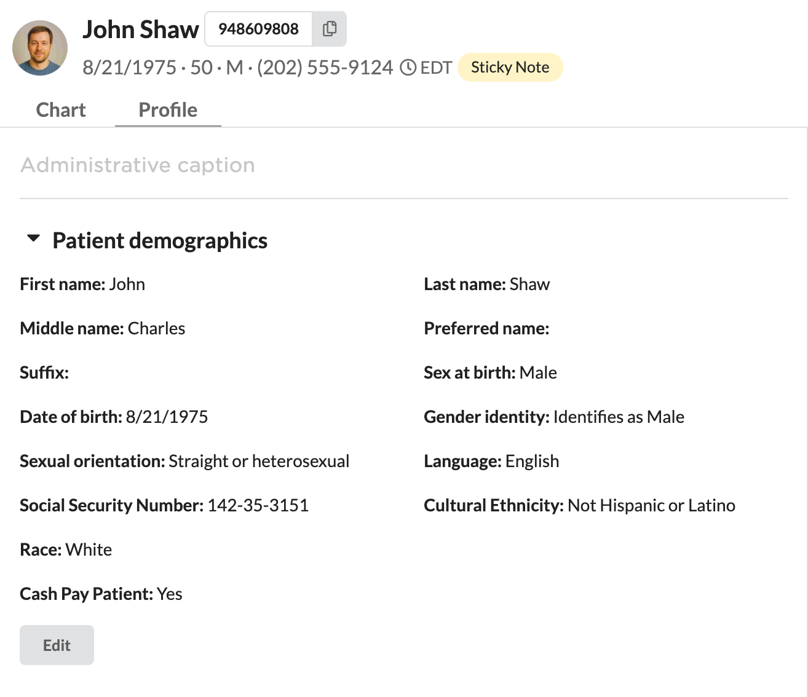
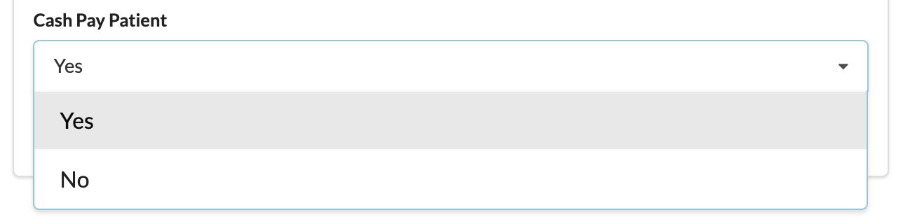

# cash_pay_profile_field

Adds an optional **Cash Pay Patient** single-select dropdown to the patient
profile in Canvas. Staff can pick **Yes** or **No**, and the choice is saved as
patient metadata under the key `cash_pay_patient`.

## What it does

When a patient's Profile page loads, this plugin contributes one extra field:

| Property | Value |
|---|---|
| Label | Cash Pay Patient |
| Type | Single-select dropdown |
| Options | Yes / No |
| Required | No — may be left blank |
| Metadata key | `cash_pay_patient` |

The selected value is persisted as patient metadata. A user picking "Yes"
stores the literal string `"Yes"`; "No" stores `"No"`; leaving it blank stores
nothing. Saved values repaint on reopen because the field is editable.

Downstream consumers (reports, workflow plugins, integrations) can read the
value from patient metadata under the `cash_pay_patient` key.

## Screenshots

The field appears in the **Patient demographics** section of the Profile tab:

When editing, it renders as a Yes / No single-select dropdown:

## How it works

A single `BaseHandler` subclass, `PatientMetadataFields`, subscribes to
`EventType.PATIENT_METADATA__GET_ADDITIONAL_FIELDS` and returns a
`PatientMetadataCreateFormEffect` declaring the field. Modeled on the
`patient_metadata_management` reference plugin, trimmed to this one field.

## Configuration

None. The plugin declares no secrets and no scopes.

## Behavior notes

- **Optional field:** blank is a valid state and never blocks saving a profile.
- **Storage values vs. labels:** the SELECT field stores the literal option
  string (`"Yes"` / `"No"`). Plan accordingly when reading the metadata
  downstream.
- **Future extension:** to set this value from an outside system, a SimpleAPI
  upsert endpoint can be added later (would require a plugin secret API key).
  Out of scope for this build.

## References

- [PatientMetadataCreateFormEffect](https://docs.canvasmedical.com/sdk/patient-metadata-create-form-effect/)
