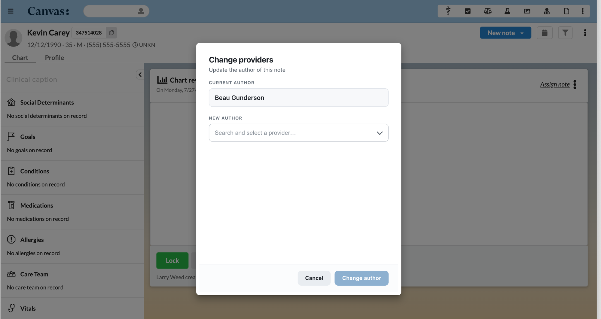

# Change Note Author

Reassign the author of a Chart Review note from inside the note itself — no admin
tooling, no database edits, no support ticket.

---

## What it does

This plugin adds one new item, **"Change providers,"** to the three-dots (⋯) menu in
the header of a Chart Review note.

Clicking it opens a small pop-up window that shows you two things: who the note is
currently attributed to, and a searchable list of every active staff member at your
practice. Pick the person the note should belong to, click **Change author**, and the
note is immediately re-attributed to them.

That's the whole plugin. It does one job.

Nothing else about the note changes — the content, the commands, the date of service,
and the patient all stay exactly as they were. Only the author changes.

The menu item is deliberately quiet: it appears **only** on Chart Review notes. On an
Office Visit, a Telehealth note, or any other note type, it isn't there at all, so
there's nothing extra for your team to scroll past day to day.

---

## Problem it solves

In most practices, Chart Review notes get created faster than they get assigned
correctly.

Records arrive from an outside clinic and get logged under whoever happened to be at
the keyboard. A medical assistant opens a Chart Review to file a fax and it lands under
their name instead of the reviewing physician's. A locum covers a week, leaves, and a
stack of notes is still pointing at them. Someone picks the wrong provider from a
dropdown on a Monday morning.

None of these are dramatic problems, but they add up in ways that matter:

- **Provider work queues get noisy.** Notes show up on the wrong person's list, and the
  right person never sees them.
- **Reporting drifts.** Any count of "notes by provider" is quietly wrong.
- **Attribution is inaccurate.** The chart says one clinician reviewed the records when
  a different one actually did.

Before this plugin, fixing that meant filing a support request and waiting, or having
someone with database access make the change by hand. Both are slow, and both put a
routine clerical correction in the hands of people who shouldn't have to be involved.

This plugin puts the fix where the mistake is visible: in the note, for the person who
noticed it, in about five seconds.

---

## Who it's for

| Role | Why they'd use it |
|---|---|
| **Medical assistants & front office** | Correct a note they filed under the wrong provider, without escalating |
| **Care coordinators** | Route incoming records to the clinician who's actually reviewing them |
| **Practice managers** | Clean up attribution after staffing changes, locum coverage, or turnover |
| **Physicians & clinicians** | Hand a Chart Review to the right colleague when it lands in their queue by mistake |
| **Billing & compliance staff** | Make sure the chart reflects who genuinely did the review |

**Specialty:** not specialty-specific. Any practice that uses Chart Review notes and has
more than one provider will find a use for it. The more staff you have touching incoming
records, the more useful it gets.

---

## What it looks like

Open a Chart Review note, click the ⋯ menu in the note header, and choose
**Change providers**. This is what you get:



The current author is shown at the top so you can confirm you're fixing the right note.
Clicking the **New author** field opens a searchable list of every active staff member.

A few small things the modal does to stay out of your way:

- **Search as you type** — filters by name *and* role, so "nurse" finds every NP.
- **Keyboard friendly** — arrow keys to move, Enter to pick, Escape to back out.
- **Nothing is pre-selected** — the current author is labeled `Current` in the list, and
  the **Change author** button stays greyed out (as above) until you pick someone
  genuinely different. You can't accidentally reassign a note to the person who already
  has it.
- **Errors show up in the modal**, in plain language, instead of failing silently.

---

## Requirements

- A Canvas instance with plugins enabled.
- The [Canvas CLI](https://docs.canvasmedical.com/sdk/canvas_cli/) installed
  (`pip install canvas`).
- A note type named **Chart Review** on your instance. If yours is called something
  else, that's fine — see [Configuration options](#configuration-options).

No external services, no API keys, no accounts to create. The plugin talks only to your
own Canvas instance.

---

## How to install

From this plugin's directory:

```bash
canvas install change_note_author --host <your-instance>
```

Then open any Chart Review note and click the ⋯ menu in the header. **Change providers**
should be at the top.

That's it — no post-install setup is required if your note type is already named
"Chart Review."

---

## Configuration options

This plugin has exactly **one** setting, and most practices will never need to touch it.

| Variable | What it does | Default |
|---|---|---|
| `CHART_REVIEW_NOTE_TYPE_NAME` | The name of the note type the menu item appears on. Matching ignores capitalization and extra spaces. | `Chart Review` |

**When you'd change it:** your practice calls the note type something else — "Records
Review," "Outside Records," "Document Review," and so on.

Set it at install time:

```bash
canvas install change_note_author --host <your-instance> \
  --variable CHART_REVIEW_NOTE_TYPE_NAME="Records Review"
```

Or change it later on an already-installed plugin:

```bash
canvas config set change_note_author \
  CHART_REVIEW_NOTE_TYPE_NAME="Records Review" --host <your-instance>
```

You can also edit it in the Canvas UI on the plugin's configuration page.

There are no secrets, no API keys, and no external configuration.

---

## Safety and permissions

Worth reading before you roll this out to your whole practice.

**Who can use it.** Any signed-in staff member who can open the note can also change its
author. The plugin does not restrict the action by role or team. That's a deliberate
choice — the whole point is to let the person who spots the mistake fix it — but it
does mean an MA can reassign a physician's note. If your practice needs this limited to
specific roles, see [Restricting access](#restricting-access) below.

**Locked notes are protected.** If a note has been signed, locked, or finalized, the
plugin refuses the change and says so in the modal. It does not try to work around the
platform's rules.

**Inactive staff can't be assigned.** The picker only lists active staff, and the server
re-checks that the selected person is still active before applying the change — so a
stale browser tab can't assign a note to someone who left.

**The request is authenticated.** The endpoint that performs the change requires a valid
signed-in Canvas staff session (`StaffSessionAuthMixin`). It cannot be called by an
anonymous request, an external client, or a patient.

**Chart Review is enforced on the server, not just in the UI.** The endpoint re-checks
the note's type before writing, so it can't be used to reassign the author of an Office
Visit or any other note type — even by calling it directly, outside the modal.

**Every change is logged, including who made it.** Each reassignment writes a line to
the Canvas plugin log naming the acting staff member, the note, and the new author:

```bash
canvas logs --host <your-instance>
```

```
INFO  change_note_author: staff <actor-id> reassigning note <note-id> author to staff <staff-id>
```

Refused attempts on the wrong note type are logged too, at `WARNING`.

### Restricting access

If you want to limit who can reassign notes, add a team check to
`change_note_author/handlers/change_providers_button.py` (to hide the menu item) **and**
to `change_note_author/handlers/change_provider_api.py` (to enforce it on the server —
hiding a button is not a permission check). Canvas exposes team membership through
`canvas_sdk.v1.data.team.TeamMembership`.

---

## How it works

For anyone reading or extending the code, the whole flow is four steps:

1. **`ChangeProvidersButton`** ([`handlers/change_providers_button.py`](change_note_author/handlers/change_providers_button.py))
   is an `ActionButton` in the `NOTE_HEADER_DROPDOWN` location. Its `visible()` method
   returns `True` only when the note's type matches your configured Chart Review name.
2. **Clicking it** builds the list of active staff, marks the current author, and opens
   a `LaunchModalEffect` rendered from
   [`templates/change_provider.html`](change_note_author/templates/change_provider.html).
3. **Confirming** POSTs `{note_id, new_provider_id}` to `/change-provider`, handled by
   **`ChangeProviderAPI`** ([`handlers/change_provider_api.py`](change_note_author/handlers/change_provider_api.py)),
   which is gated behind `StaffSessionAuthMixin`.
4. **The route validates** the note, that it really is a Chart Review note, the new
   provider, their active status, and whether the note is still editable — then returns
   a `Note` update effect setting `provider_id`, plus a JSON confirmation the modal
   displays.

The name-matching and display-label logic lives in
[`utils/matching.py`](change_note_author/utils/matching.py) as plain functions with no Canvas
imports, which is what makes it directly unit-testable.

### Project layout

```
change-note-author/
├── README.md
├── LICENSE
├── pyproject.toml                       # local dev/test only; Canvas doesn't use it
├── change_note_author/
│   ├── CANVAS_MANIFEST.json             # plugin definition
│   ├── assets/
│   │   └── change-providers-modal.png   # screenshot used in this README
│   ├── handlers/
│   │   ├── change_providers_button.py   # the ⋯ menu item + modal launch
│   │   └── change_provider_api.py       # POST /change-provider
│   ├── utils/
│   │   └── matching.py                  # pure helpers, no Canvas imports
│   └── templates/
│       └── change_provider.html         # the modal
└── tests/
    ├── handlers/
    └── utils/
```

---

## Running the tests

```bash
uv sync
uv run pytest --cov=change_note_author --cov-report=term-missing
```

51 tests, 100% coverage. They use mocks throughout — no Canvas instance or database
needed.

You can also confirm the plugin is well-formed before installing it:

```bash
canvas validate change_note_author
```

This checks the manifest against Canvas's schema and loads both handlers in the plugin
sandbox.

---

## Troubleshooting

**The menu item doesn't appear.**
Nine times out of ten this is the note type name. The plugin matches on the note type's
name, so if yours is "Records Review" and the setting still says "Chart Review," the
item stays hidden. Check the note type's exact name in Canvas and set
`CHART_REVIEW_NOTE_TYPE_NAME` to match. (Capitalization and surrounding spaces don't
matter; the actual words do.) Also confirm you're on a Chart Review note and that the
plugin is enabled.

**"This note is locked or finalized."**
The note has been signed or locked. Unlock it through the normal Canvas workflow first,
or ask someone who can.

**"The selected provider is not active."**
That staff member has been deactivated in Canvas. Reactivate them, or pick someone else.

**The list is missing someone.**
Only *active* staff are listed. If a person is missing, check their status in Canvas
staff settings.

**Still stuck?** Check the logs — most failures print a clear reason:

```bash
canvas logs --host <your-instance>
```

---

## Contributing

Issues and pull requests are welcome in the
[Canvas plugins repo](https://github.com/Medical-Software-Foundation/canvas). Please run
the tests and `canvas validate change_note_author` before opening a PR.

Ideas that would make good contributions:

- Role- or team-based restrictions on who can reassign
- Support for note types beyond Chart Review
- A visible audit trail on the note itself

## License

[MIT](LICENSE) — free to use, modify, and distribute.
