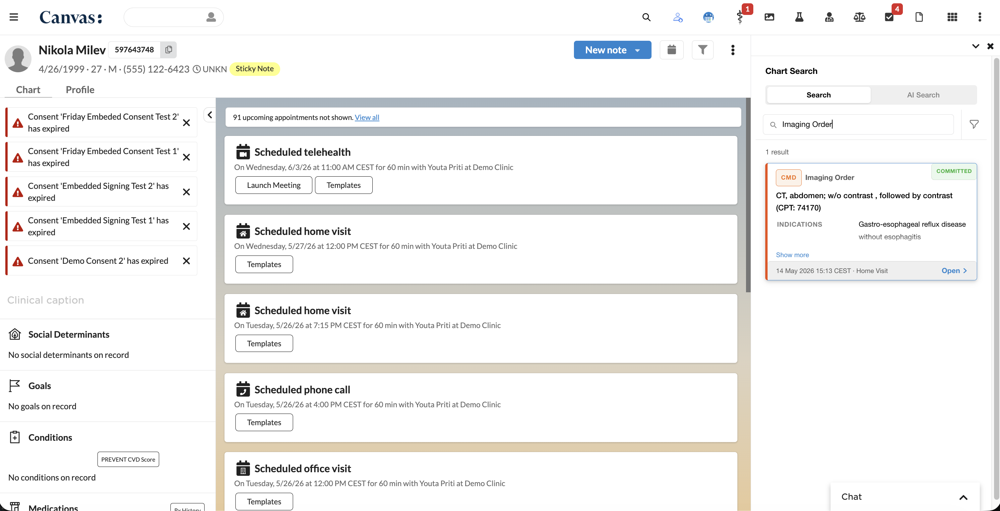
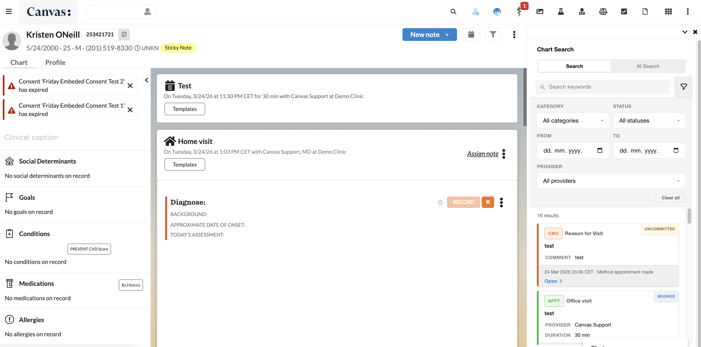
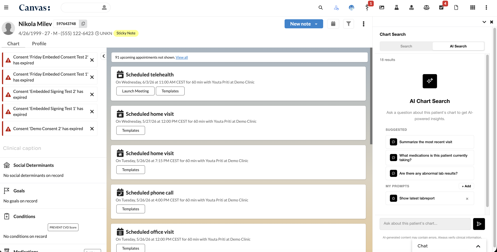
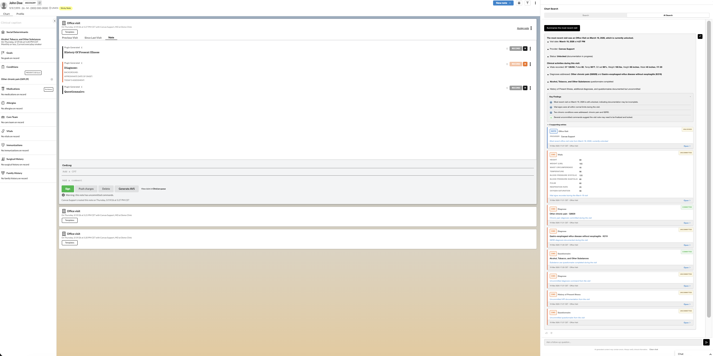

# Chart Command Search

A Canvas Medical plugin that lets clinicians search a patient's entire chart from one place — using either keywords or plain-English questions answered by AI.

## Info

*This plugin was developed and contributed by [Vicert](https://vicert.ai).*

Contact: <engineering@vicert.com>

## The problem it solves

Patient charts grow large quickly. Finding a specific lab result, a past medication, a referral letter, or a message buried in a long history forces clinicians to click through many tabs and filters. This plugin gives them one search box that looks across **commands, notes, appointments, letters, messages, and labs** at the same time, and optionally lets them ask natural-language questions (e.g. *"What medications is this patient on?"* or *"Summarize the recent labs"*) answered by Claude with citations back to the chart.

## Who it's for

- **Clinicians and care team members** who need to quickly find information in a patient's chart during or before a visit.
- **Canvas instance admins** who want to replace the legacy note-only search with a unified, AI-augmented experience.

## Screenshots






## What it does

- **Keyword Search** — Search across commands, notes, appointments, letters, messages, and lab reports with filtering by category, status, date range, and provider.
- **AI Search** — Natural-language queries powered by Claude that understand patient context and return structured answers with citations to chart entries.
- **Feedback capture** — Staff can thumbs-up/down AI answers; admins can export the feedback for review.
- **Panel cleanup** — Automatically hides the legacy "Note search" button from the patient chart panel so this plugin becomes the single entry point.

## Components

| Component | Type | Description |
|-----------|------|-------------|
| `ChartSearchApp` | Application | Opens the search UI in the right chart pane |
| `ChartSearchAPI` | SimpleAPI (GET `/search`) | Keyword search endpoint |
| `AIChartSearchAPI` | SimpleAPI (POST `/ai-search`) | AI-powered search endpoint |
| `FeedbackSubmitAPI` | SimpleAPI (POST `/feedback`) | Staff submits thumbs up/down rating for AI responses |
| `FeedbackQueryAPI` | SimpleAPI (GET `/feedback-export`) | External API-key-authenticated feedback retrieval and stats |
| `HideLegacyNoteSearch` | Protocol | Removes legacy note search from the panel |

## Install

1. Make sure your Canvas instance is running SDK **0.154.1** or newer.
2. From this directory, install the plugin to your instance:

   ```bash
   canvas install --host <your-instance>.canvasmedical.com .
   ```

3. Set the required secrets in Canvas admin (see **Configuration** below).
4. Open any patient chart — the **Chart Search** application appears in the right-hand panel.

## Configuration

### Required Secrets

| Secret | Description |
|  -------- | ------------- |
| `ANTHROPIC_API_KEY` | API key for Claude AI search functionality |
| `namespace_read_write_access_key` | Access key for custom data namespace (feedback storage) |

### Optional Secrets

| Secret | Description |
| -------- | ------------- |
| `SUGGESTED_PROMPTS` | JSON array of practice-wide suggested AI search prompts (e.g. `["What medications is this patient on?", "Summarize recent labs"]`) |
| `AI_SEARCH_ENABLED` | Set to `"false"` to disable AI search (defaults to `"true"`) |
| `FEEDBACK_API_KEY` | API key for external access to the feedback export endpoint |

## Search Categories

- **Commands** — All chart commands (orders, diagnoses, procedures, etc.)
- **Medications** — Prescribe/refill/adjust medication commands with prescription status
- **Notes** — Encounter notes with body content and reason for visit
- **Appointments** — Upcoming and past appointments with status tracking
- **Letters** — Letter encounters with fax/print status
- **Messages** — Patient-provider messages
- **Labs** — Lab reports with test results, review status, and abnormal flags
