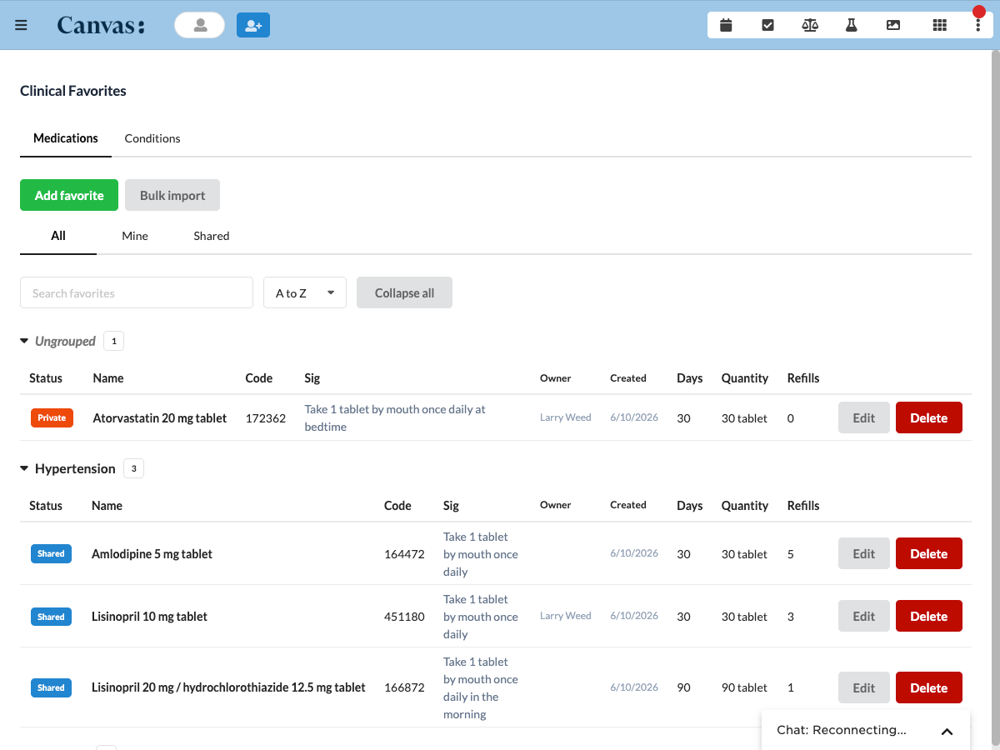

# Clinical Favorites

## What it does

Clinical Favorites gives clinicians one place to curate and reuse their frequently used medications and conditions. A favorite is a prefilled template the clinician drops into a chart note in one click instead of retyping the full Prescribe or Diagnose command.

The plugin registers two Canvas Applications.

- Clinical Favorites, scope `provider_menu_item`, opens from the top of the provider menu as a full page. This surface is management only. Add, edit, delete, hide shipped defaults, and import a list of favorites in bulk.
- Insert Favorites, scope `patient_specific`, opens from the patient chart in the large right chart pane. The patient comes from chart context, so there is no patient search. The clinician picks one of that patient's open notes, checks the medication and condition favorites to send into it, and a single click originates a `PrescribeCommand` per medication and a `DiagnoseCommand` per condition. Insert rows are compact and expand on click to show full detail. When the patient has no open notes the insert surface shows a notice rather than a dead button.

A type tab on both surfaces switches between Medications and Conditions. A scope tab switches between All, Mine, and Shared.

Key capabilities.

- Medication favorites with FDB search, hydrated clinical quantities, sig, days supply, quantity to dispense, unit, refills, default pharmacy, generic substitution toggle, pharmacist note, label, and label color.
- Condition favorites with ICD-10 search through the Canvas ontologies service, display name, label, and label color.
- A visibility model with three scopes per favorite, shared across the organization, private to the creator, and per user hide of shipped defaults, surfaced as All, Mine, and Shared filter chips.
- Validation before insert. Each selected favorite is resolved against the live ontology before a command originates, so an unresolvable code is surfaced as unresolved rather than originating a command with a null title. Validation fails open on a transient ontology outage.
- Mixed selection across both type tabs in one session, committed in a single round trip, behind a hard confirmation dialog that lists the selected favorites with the patient and note.
- Group header accordions with the ungrouped section pinned on top, expand and collapse all, and auto open of groups containing search matches.
- Bulk import of a JSON list of favorites in one round trip with per row validation, a dry run preview, and a per row reason for any failures.
- Server side ownership guards on update and delete and on the unhide default flow. A staff member who did not create a favorite gets a 403 with the creator named in the response.
- Staff session authentication on every endpoint.
- Custom Data persistence in the `canvas_medical__clinical_favorites` namespace with read and write access.

## Problem it solves

Clinicians reach for the same medications and conditions many times a day, and Canvas asks for the full Prescribe or Diagnose command each time. That repetition is slow and error prone. Clinical Favorites lets a clinician build a personal or shared library of prefilled templates once and drop any of them into a note in a single click, so common orders take one action instead of a full command entry.

## Who it's for

Prescribing clinicians and any care team member who repeatedly enters the same medications or conditions. The management page suits a clinician or an organization curating a shared catalog, and the chart insert pane suits the clinician working a patient note. Favorites can be private to their creator or shared across the whole organization.

## How to install

Install the plugin with the Canvas CLI, pointing it at the plugin package directory, the one that holds `CANVAS_MANIFEST.json`.

```
canvas install path/to/clinical_favorites --host <your-instance>
```

The plugin creates its Custom Data namespace on first install and needs no seed data to start. Once installed, Clinical Favorites appears at the top of the provider menu and Insert Favorites appears in the patient chart.

## Configuration options

The plugin requires no secrets to run. Authentication is staff session based and needs no external API key.

One optional secret tunes behavior. `BULK_IMPORT_MAX_ROWS` caps how many favorites a single bulk import request may carry. A Canvas admin can set it per instance to a positive integer in the plugin's Secrets section. When it is unset, blank, or not a valid positive integer, the plugin falls back to a built in default of 500 rows.

The plugin calls Canvas internal services only, the ontologies service for FDB medication search and ICD-10 condition search, the pharmacy directory for the default pharmacy field, and Canvas Patient and Note data for the open notes picker.

## Screenshots

The Clinical Favorites management page on the provider menu, showing the medication catalog grouped by section with visibility, code, sig, quantity, and refill columns.



## Limits and known caveats

- FDB ids are not portable across environments. Each Canvas environment ships its own FDB ontology snapshot, so the same drug at the same strength can carry a different `med_medication_id` on one instance versus another. Bulk import payloads sourced from one environment cannot be replayed against another without resolution against the target environment's search endpoints. The Add Favorite flow in the UI does not have this problem because every code is picked from a live search against the running instance.
- The chart insert pane depends on at least one open note. If the patient has zero open notes, the insert surface shows an empty state notice. The plugin does not create a note.
- The visibility filter is server side enforced on every read. Seeing a row under the All filter does not imply edit or delete rights, which are gated by the creator on the server.
- The provider menu page renders on desktop only.

## Info

_This plugin was developed and contributed by [Vicert](https://vicert.com)._
