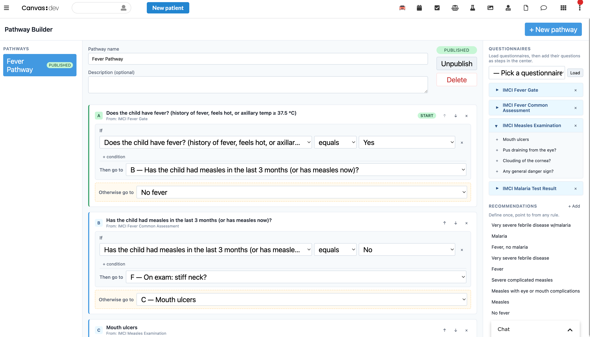
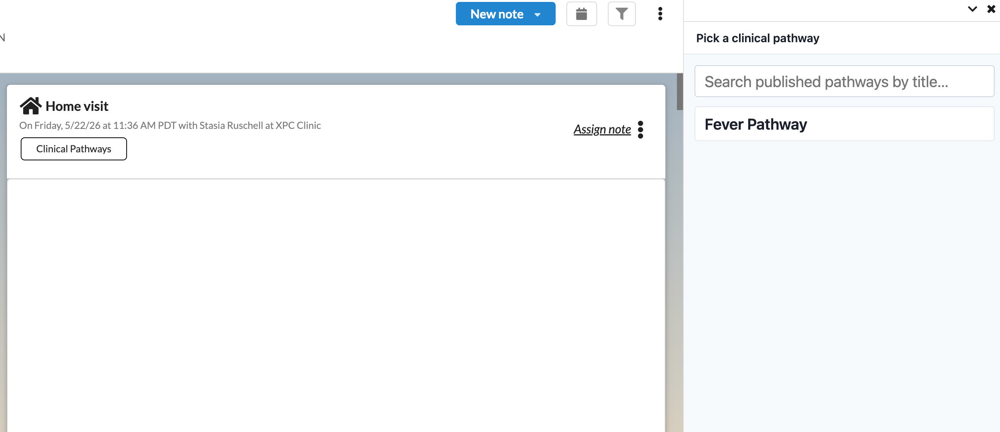
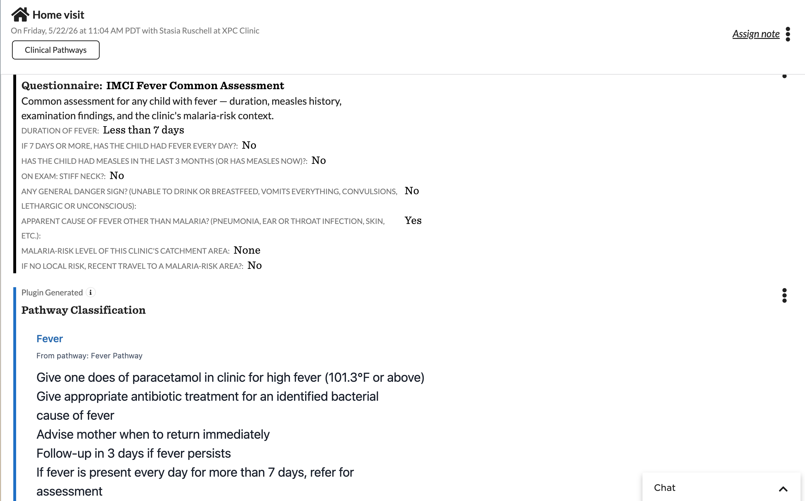

# Clinical Pathways

A Canvas plugin for building structured, branching clinical questionnaires ("pathways") and running them against a patient during a note encounter.

## What it does

- **Pathway Builder** — A page application reachable from the provider menu where any authenticated staff user can author pathways: ordered steps that each reference an existing Canvas questionnaire + question, branching rules between steps, and a terminal recommendation that originates as a custom command.
- **Pathway Runner** — A "Clinical Pathways" button in the note header opens a picker where the provider selects a published pathway. The runtime evaluator listens for `INTERVIEW_UPDATED` events and walks the pathway forward as each questionnaire is committed, auto-inserting the next questionnaire and, on completion, originating the Q&A trail and the recommendation as custom commands in the open note.

## Problem it solves

Clinical decision algorithms — triage trees, severity classifications, screening protocols — are typically maintained as paper documents, PDFs, or ad-hoc copy/paste into notes. There is no first-class way for a non-engineer to encode "if cough + fever ≥ 3 days, then ask about chest indrawing; if yes, classify as severe pneumonia" and have the EHR walk a provider through it during a real encounter.

Clinical Pathways turns those algorithms into authorable artifacts that run inside a note. A clinical lead builds the pathway once; thereafter every provider who picks it during a note gets the next questionnaire auto-inserted as they commit each step, and the final classification + answer trail land in the note as committed commands. The provider never leaves the note, and the algorithm stays versioned and visible in one place instead of scattered across PDFs and tribal knowledge.

## Who it's for

- **Clinical leads / protocol authors** who want to encode a branching algorithm over Canvas questionnaires without writing code.
- **Providers** who, mid-encounter, want guided triage or classification driven by questionnaires already configured in their Canvas instance — with the answer trail and classification automatically captured in the note.

The plugin is specialty-agnostic: anything that can be expressed as a branching tree over discrete questionnaire responses works.

## Installation

To install this plugin to a Canvas instance:

```bash
canvas install clinical_pathways
```

The plugin declares its own custom data namespace (`canvas__clinical_pathways`, `read_write`) for storing pathway definitions and in-progress runs — no manual schema work is required.

## Configuration

No configuration required. The plugin declares no secrets and no environment variables, and uses only Canvas SDK functionality (no external APIs or services). The `Pathway Classification` custom command is registered automatically when the plugin is installed.

## Surfaces

| Surface | Type | Entry |
|---|---|---|
| Pathway Builder | `Application` (scope `provider_menu_item`) | Provider menu → "Pathway Builder" |
| Pathway Runner | `ActionButton` (location `NOTE_HEADER`) | Open note → "Clinical Pathways" button |

### Pathway Builder



### Pathway Picker (in note)



### Questionnaire flow and terminal recommendation



## Data

Pathway definitions and in-progress runs are stored as plugin-owned [CustomModels](https://docs.canvasmedical.com/sdk/custom-data-custom-models/) in the namespace `canvas__clinical_pathways`. Completed runs are also persisted as `CustomCommand` blocks in the note (Q&A trail + recommendation).

## Limitations

- No pathway versioning; edits are live in-place.
- Search matches pathway title only.
- Recommendation is rendered as a single custom command (parameters defined per terminal command in `terminal_commands.py`).
- Any authenticated staff user can edit any pathway (no role restrictions).
- No patient-facing surfaces.

## License

Released under the [MIT License](LICENSE).
