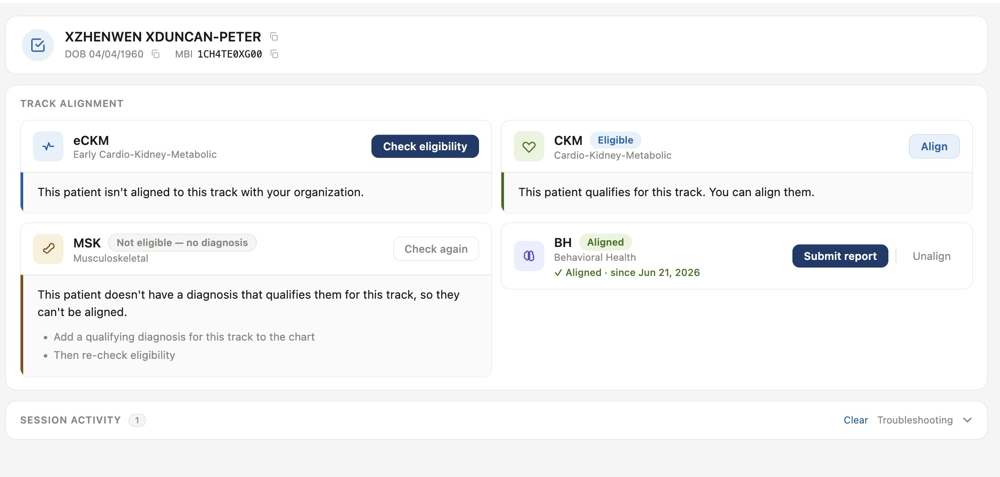

# CMS ACCESS FHIR Client

A Canvas plugin that connects a patient's chart to the **CMS ACCESS Model** FHIR API. From the patient chart, a care coordinator can check a patient's ACCESS eligibility, align them to a care track (eCKM, CKM, MSK, or BH), unalign them, and submit the model's required data reports — without leaving Canvas.

## Problem it solves

Participants in the CMS ACCESS Model must interact with a FHIR API to enroll patients, keep them aligned, and report clinical data on deadlines. Done by hand, that means assembling FHIR bundles, managing OAuth, polling asynchronous submissions, and translating CMS result codes — error-prone work that lives outside the EHR. This plugin moves the whole workflow into the patient chart and turns each CMS result into a plain-language status with a clear next step, while keeping a full request/response log for troubleshooting.

## Who it's for

Care coordinators, population-health staff, and clinical operations teams at organizations participating in (or piloting) the CMS ACCESS Model. It is most useful for primary-care and chronic-condition programs working the CKM/eCKM, MSK, and BH tracks.

---

## ⚠️ Production readiness requirements

This plugin implements the CMS ACCESS Model FHIR client and has been validated in the CMS IMPL test environment for eligibility, alignment, unalignment, and data reporting across the CKM and BH tracks.

Before enabling it in production, review the following:

### 1. Local alignment state is a cache — reconcile it against CMS

CMS holds the authoritative record of each patient's alignment. This plugin keeps a local mirror (`ACCESSAlignment`) that it updates from the responses to operations it runs, so the local view **can drift** from CMS — for example, if CMS unaligns a patient or changes a track on their side.

Per the ACCESS Operations Manual (v0.9.8 and v0.9.12) and Implementation Guide, CMS communicates the seven lifecycle events — provider lock-in ending, control-group period ending, alignment renewal due, baseline / quarterly / end-of-year reporting due, and unalignment — by **email only**, to addresses configured during participant onboarding. Monitor those notifications and re-run **Check eligibility** to refresh a patient's local status against CMS.

### 2. Configure the required reporting questionnaires

For the MSK and BH tracks, the plugin submits PROM `QuestionnaireResponse` resources generated from completed Canvas Interviews.

The required instruments — including PROMIS, Oswestry, WHODAS, PGIC, and QuickDASH — may require licensing and are **not** bundled with this plugin. They must be configured as Canvas Questionnaires, coded so the plugin can find them:

- **Instruments with a LOINC** (PHQ-9, GAD-7, PROMIS measures, Oswestry, etc.): code the Canvas Questionnaire with the expected LOINC.
- **Instruments CMS identifies by an ACCESS code** (WHODAS, PGIC, QuickDASH): code the Canvas Questionnaire with that ACCESS code (`WHODAS`, `PGIC`, `QuickDASH`) and it is discovered automatically.

Until each required instrument exists and has been completed by the patient, CMS returns an `incomplete-data` response. BH baseline reporting has been validated end to end; the remaining instruments are built to spec.

---

## Screenshots



The inspector modal: each track (eCKM, CKM, MSK, BH) is a card showing the patient's current status and the next available action, over a collapsible "Session activity" log for troubleshooting.

## How it works

An **ACCESS** button in the patient chart header opens the inspector modal. Each ACCESS track shows as a card with the patient's current status and the action available next (check eligibility, align, switch, submit report, or unalign). Behind the scenes the plugin handles the CMS asynchronous submission pattern (`POST` → `202 Accepted` + `Content-Location` → poll the submission-status URL → final result), retries polling on a schedule, and maps each CMS result code to an end-user-friendly badge, message, and recovery step.

The modal doubles as an **HTTP inspector**: a collapsible "Session activity" log records every CMS call with the full request and response (method, URL, status, bodies, `OperationOutcome` errors) so an implementer can troubleshoot without server access. The bearer token is redacted.

## Installation

1. From this directory, run `canvas install --host <your-instance>.canvasmedical.com`.
2. Open the plugin's configuration page and fill in the required configuration values (below).
3. Set `ACCESS_SHOW_BANNER=true` to also surface the patient's current alignment status as a chart banner.

The patient's MBI is **not** entered by a user — it is read from the patient's active Medicare Part B Coverage in Canvas (see [MBI source](#mbi-source)).

## Configuration options

All values are configured as plugin secrets/variables; nothing is hardcoded. Operations **fail closed** if a required value is missing.

| Variable | Required | Purpose |
|---|---|---|
| `ACCESS_BASE_URL` | ✓ | CMS FHIR API base URL, up to (not including) `/access` — e.g. `https://impl-cdxapi.cmmi.cms.gov/cdx/services/fhir` |
| `ACCESS_OAUTH_CLIENT_ID` | ✓ | OAuth 2.0 client ID |
| `ACCESS_OAUTH_CLIENT_SECRET` | ✓ | OAuth 2.0 client secret |
| `ACCESS_OAUTH_TOKEN_URL` | ✓ | OAuth 2.0 token endpoint |
| `ACCESS_PARTICIPANT_ID` | ✓ | Your ACCESS participant ID — `ACCES` (5 letters) + 5 digits, e.g. `ACCES12345` |
| `ACCESS_ENABLED_TRACKS` |  | Comma-separated tracks to expose, e.g. `CKM,BH` (case-insensitive). Blank/unset shows all four (eCKM, CKM, MSK, BH); listing a subset hides the rest and blocks operations on them. |
| `ACCESS_OAUTH_SCOPE` |  | OAuth scopes (default: `cdx/*.read cdx/fhir-resource.write`; blank uses the default) |
| `ACCESS_OAUTH_AUTH_STYLE` |  | OAuth client-auth style override (`body` or `header`); blank auto-detects |
| `ACCESS_SHOW_BANNER` |  | `true` to show the current-alignment banner in the chart |
| `ACCESS_SHOW_PROFILE_FIELD` |  | `true` to enable the custom patient profile fields |
| `ACCESS_MEDICARE_PART_B_PAYER_IDS` |  | Comma-separated payer IDs (`Transactor.payer_id`, e.g. `00831`) to match as Medicare Part B (precise allowlist) |
| `ACCESS_PAYER_NAME_PATTERN` |  | Case-insensitive substring matched against the Coverage issuer name (default `Medicare Part B`) |
| `ACCESS_DEFAULT_PAYER_ID` |  | Fallback payer ID sent to CMS when the coverage carries none |
| `ACCESS_ORG_NAME` |  | Organization name used as the report Composition custodian |

## Components

| Class | Type | Role |
|---|---|---|
| `AccessInspectorButton` | ActionButton (chart header) | Opens the ACCESS inspector modal for the current patient |
| `AccessOperationsApi` | SimpleAPI | Serves the inspector UI and runs CMS operations, returning the full request/response `exchange` |
| `SubmissionStatusPoller` | CronTask | Polls outstanding submission-status URLs with exponential backoff |
| `AccessBannerHandler` | BaseHandler | Emits a banner alert with the current alignment status (gated by `ACCESS_SHOW_BANNER`) |

### Inspector routes (under `/plugin-io/api/cms_access_fhir_client/app/`)

| Route | Purpose |
|---|---|
| `GET /` · `GET /main.js` · `GET /styles.css` | Inspector single-page UI |
| `GET /state?patient_id=` | Current ACCESS alignment rows + patient demographics |
| `POST /eligibility` · `/align` · `/unalign` · `/report-data` | Run the CMS operation; the response includes the full `exchange` |
| `POST /poll` | Poll the patient's in-progress submission-status URL once |

## Plugin models

- **`ACCESSAlignment`** — one row per (patient, track): status, care-period dates, async submission state, poll backoff, and the latest report result. A **local cache** of CMS's authoritative state (see [Production readiness](#1-local-alignment-state-is-a-cache--reconcile-it-against-cms)).
- **`ACCESSOperationLog`** — audit log of each CMS operation the plugin runs.

## MBI source

The plugin does **not** accept an MBI from the user. It reads the Medicare Beneficiary Identifier from the patient's active Medicare Part B Coverage in Canvas.

**How the lookup works:**

1. `get_active_medicare_part_b_coverage(patient, secrets)` runs before any CMS operation.
2. Two filters are supported, in order:
   - **Allowlist** (`ACCESS_MEDICARE_PART_B_PAYER_IDS`): comma-separated payer IDs matched against `coverage.issuer.payer_id` (e.g. `00831`).
   - **Name pattern** (`ACCESS_PAYER_NAME_PATTERN`, default `Medicare Part B`): case-insensitive substring on `coverage.issuer.name`. Matches `IL Medicare Part B` / `AK Medicare Part B` while excluding Medicare Advantage payers.
3. Only `state=active` coverages are considered.
4. With multiple active Part B coverages, the lowest `coverage_rank` (primary) wins.
5. The MBI is read from `coverage.id_number`.

**Fail-closed:** if no active Medicare Part B coverage is found, the operations return HTTP 422 with:

```
Patient has no active Medicare Part B coverage on file — cannot perform ACCESS operation
```

Attach a Medicare Part B coverage in the Canvas insurance section before running ACCESS operations.

**How the MBI is sent:** the patient is sent as an inline FHIR `Patient` resource (not a reference), with the MBI in `identifier[system=http://hl7.org/fhir/sid/us-mbi]`, plus name and date of birth.

## License

MIT — see [LICENSE](../LICENSE).
