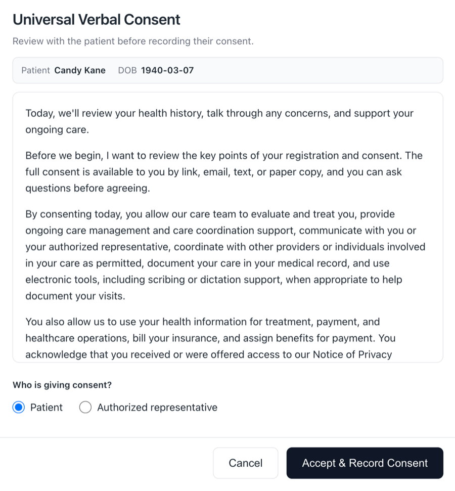
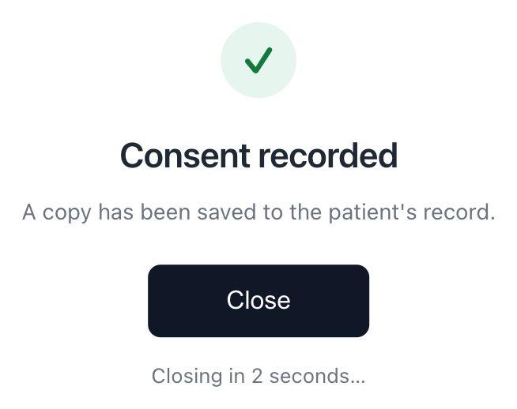
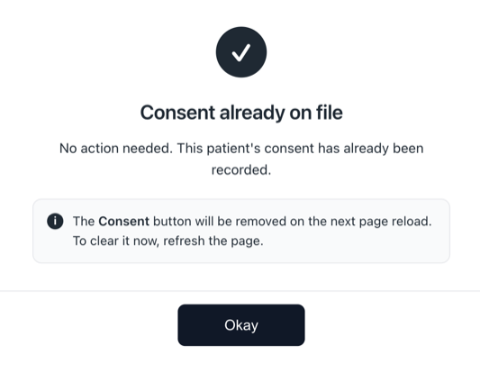

# Consent Capture

A Canvas plugin that lets front-desk and clinical staff **record a patient's
consent in one click, right from the patient chart** — and files a signed-looking
PDF documenting who collected it, when, and from whom.

It adds a red **Consent** button to the patient chart header. The button only
appears for patients who don't already have the configured consent on file, so
staff always know at a glance who still needs to be asked. Clicking it walks the
staff member through a short scripted consent conversation and, on **Accept**,
writes the consent to the patient's record via the Canvas FHIR API.

---

## Why this plugin exists

Practices frequently need to capture a **verbal consent** (for treatment,
telehealth, financial responsibility, release of information, etc.) during a
visit and have a durable record of it. Doing this by hand — locating the right
form, filling in the patient and staff details, generating a document, and
attaching it to the chart — is slow and error-prone.

Consent Capture turns that into a single button that:

- **Only shows when it's needed** — hidden automatically once an accepted consent
  of the configured type is on file, so it doubles as a visual "still needs
  consent" indicator.
- **Records who did what** — the collecting staff member is taken from the
  logged-in Canvas session (not typed in), so the documentation is trustworthy.
- **Produces a clean PDF** — a neutral, professional one-page document naming the
  patient, date of birth, who consented (the patient or an authorized
  representative), the collecting staff member, the date/time, and the full
  consent statement.
- **Files it as structured data** — a FHIR `Consent` resource so the consent is
  queryable and shows up in the patient's record, with the PDF attached.

---

## How it works (staff experience)

1. A staff member opens a patient chart. If the patient does **not** already have
   the configured consent on file, a red **Consent** button appears in the chart
   header.
2. The staff member clicks it. A modal opens showing the patient's name and date
   of birth and the scripted consent statement to read/review with the patient.
3. The staff member records **who is consenting**:
   - the **patient**, or
   - an **authorized representative** (enter the representative's name and, if
     relevant, their relationship to the patient — e.g. "Jane Doe (Daughter)").
4. On **Accept**, the plugin:
   1. Generates a documentation PDF (built without any external PDF library,
      because the Canvas plugin sandbox has none).
   2. Creates a FHIR **Consent** with:
      - `status` = `active`
      - the configured coding (`system` / `code` / `display`)
      - effective date = **today** (`provision.period.start`), using the staff
        member's **local** calendar date
      - **no** `period.end`, so the consent does not expire
      - the PDF attached as the `sourceAttachment`
5. The button disappears from the chart header for that patient, confirming the
   consent is now on file.

If anything is misconfigured or the patient can't be found, the modal shows a
plain-language message instead of failing silently.

---

## Screenshots

**Collecting a consent** — the scripted statement, patient context, and the
who-is-consenting selection:



**After recording** — a brief confirmation that auto-closes:



**Consent already on file** — shown if the button is clicked when a consent has
already been recorded (see [After a consent is recorded](#after-a-consent-is-recorded)):



---

## Prerequisites

Before configuring the plugin you need two things set up in Canvas:

1. **A Patient Consent Coding** in **Admin → Settings** whose system + code match
   the `CONSENT_SYSTEM` / `CONSENT_CODE` you'll configure below. This is the
   consent "type" the button collects and checks for.
2. **Canvas FHIR API OAuth credentials** (a client ID and secret) with permission
   to create `Consent` resources. These are created in Canvas admin under the
   OAuth application registration. Keep the secret safe — it is stored as a
   sensitive plugin variable, never in the code.

---

## Configuration

All behavior is controlled by **plugin variables** (set in the plugin's
configuration in Canvas). Nothing is hardcoded, so the same plugin can capture
any consent type by changing configuration.

| Variable | Required | Sensitive | Default | Description |
|----------|----------|-----------|---------|-------------|
| `CANVAS_FHIR_CLIENT_ID` | ✅ | 🔒 | — | OAuth client ID for the Canvas FHIR API. |
| `CANVAS_FHIR_CLIENT_SECRET` | ✅ | 🔒 | — | OAuth client secret for the Canvas FHIR API. |
| `CONSENT_CODE` | ✅ | — | — | The consent code to collect and check for. Must match a Patient Consent Coding configured in Canvas Admin Settings. |
| `CONSENT_SYSTEM` | — | — | `http://loinc.org` | The coding system URL for the consent code. |
| `CONSENT_DISPLAY` | — | — | — | Human-readable name of the consent (shown in the modal and as the PDF title, e.g. "Consent to Treat"). |
| `CONSENT_STATEMENT` | — | — | — | The scripted statement shown in the modal and printed on the PDF. See formatting notes below. |

### Notes on each setting

- **`CANVAS_FHIR_CLIENT_ID` / `CANVAS_FHIR_CLIENT_SECRET`** — obtained from the
  Canvas OAuth application registration. The backing OAuth app should be scoped to
  the **minimum** needed to create `Consent` resources.
- **`CONSENT_CODE`** — this is the key setting. It must exactly match a Patient
  Consent Coding configured in Canvas so that (a) the recorded consent is
  recognized and (b) the button correctly hides once consent is on file. **If
  `CONSENT_CODE` is left empty, the button always shows and submitting will return
  a "not fully configured" message** — this is intentional so the plugin can be
  installed before the coding is finalized.
- **`CONSENT_SYSTEM`** — defaults to LOINC (`http://loinc.org`). Change it if your
  consent code comes from a different coding system.
- **`CONSENT_DISPLAY`** — a friendly label. If omitted, the code itself is used as
  the title.
- **`CONSENT_STATEMENT`** — the consent language staff review with the patient:
  - Each line break starts a new paragraph, so you can paste multi-paragraph text
    straight from a document.
  - Blank lines are ignored.
  - If your configuration field only allows a single line, use `||` to separate
    paragraphs (e.g. `First paragraph.||Second paragraph.`).
  - If left empty, the modal shows a neutral note ("Review the consent with the
    patient before recording.") and the PDF omits the statement section — the
    plugin still works.

---

## When does the button appear?

| Situation | Button shown? |
|-----------|---------------|
| No patient in context | No |
| `CONSENT_CODE` not configured yet | Yes (so consent can be collected once set up) |
| Patient already has an **accepted** consent of the configured code | No |
| Patient has no accepted consent of the configured code | Yes |

"Accepted" means the patient's consent is in one of these states: `accepted` or
`accepted_via_patient_portal`.

### After a consent is recorded

Canvas only evaluates the button's visibility when the chart page loads, so
immediately after a consent is collected the button can linger in the header
until the next reload. To avoid confusion, if a staff member clicks it again
while a consent is already on file, the plugin doesn't collect a second consent —
it opens a short notice ("Consent already on file / No action needed…") explaining
that the button will be removed on the next page reload, and that they can refresh
now to clear it immediately. The button clears itself on the next page load
regardless.

---

## Components

Declared in `CANVAS_MANIFEST.json`:

- **`consent_capture.handlers.consent_button:ConsentButton`** — the red
  chart-header action button. Decides visibility and opens the consent modal.
- **`consent_capture.handlers.consent_api:ConsentApi`** — a staff-authenticated
  API endpoint (`POST /consent/collect`, reachable at
  `/plugin-io/api/consent_capture/consent/collect`) that the modal's **Accept**
  button calls to generate the PDF and create the FHIR `Consent`.

### Security model

- The endpoint uses the SDK's `StaffSessionAuthMixin`, so **only logged-in staff**
  can record a consent.
- The collecting staff member's identity is read from the authenticated Canvas
  session, not from anything the browser sends, so the documentation cannot be
  spoofed.
- FHIR credentials are stored as **sensitive** plugin variables and are never
  written to logs.

---

## Data access

The plugin reads `Patient` (name and date of birth), `PatientConsent` (to check
whether consent already exists), and `Staff` (the collector's name). It writes the
`Consent` resource through the Canvas FHIR API. It does not read or write anything
else.

---

## Development

### Project layout

```
consent-capture/                 # container (this repo)
├── pyproject.toml               # pytest + coverage config
├── tests/                       # test suite (mirrors the source tree)
└── consent_capture/             # the plugin
    ├── CANVAS_MANIFEST.json
    ├── constants.py             # config parsing + button appearance
    ├── fhir.py                  # FHIR Consent payload builder
    ├── pdf.py                   # dependency-free PDF generation
    ├── handlers/
    │   ├── consent_button.py    # the chart-header button
    │   └── consent_api.py       # the /consent/collect endpoint
    └── templates/
        └── consent.html         # the consent modal
```

### Tests

Run from the container directory:

```bash
uv run pytest
```

The suite has **100% coverage** and exercises the PDF builder, the FHIR payload
shape, the button visibility logic, and the consent-collection endpoint
(configuration errors, the success path, and FHIR error handling).
