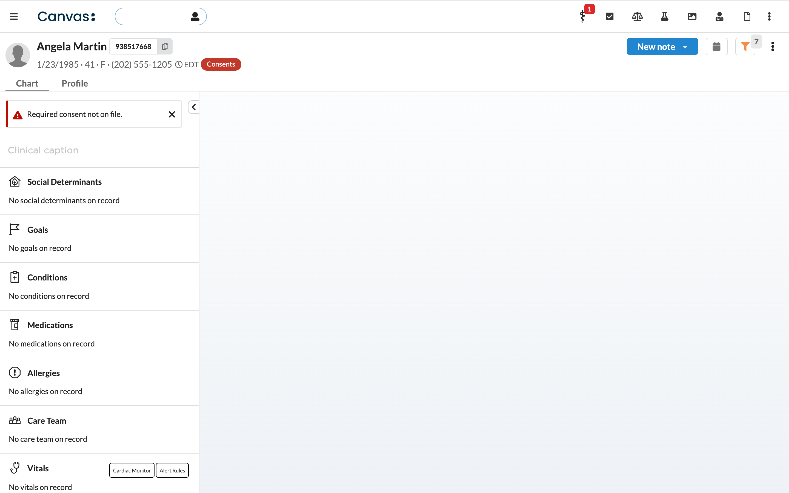
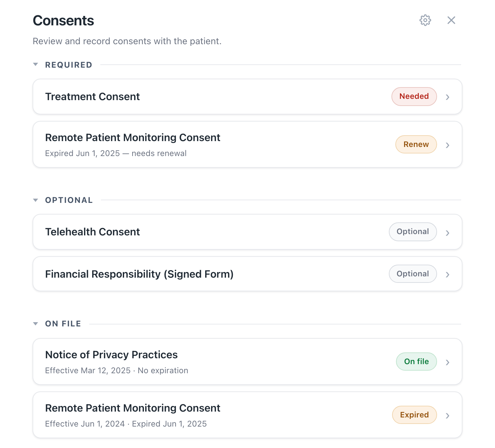
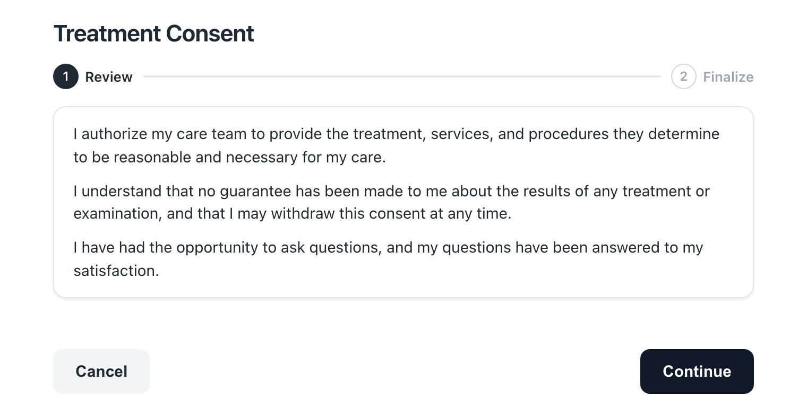
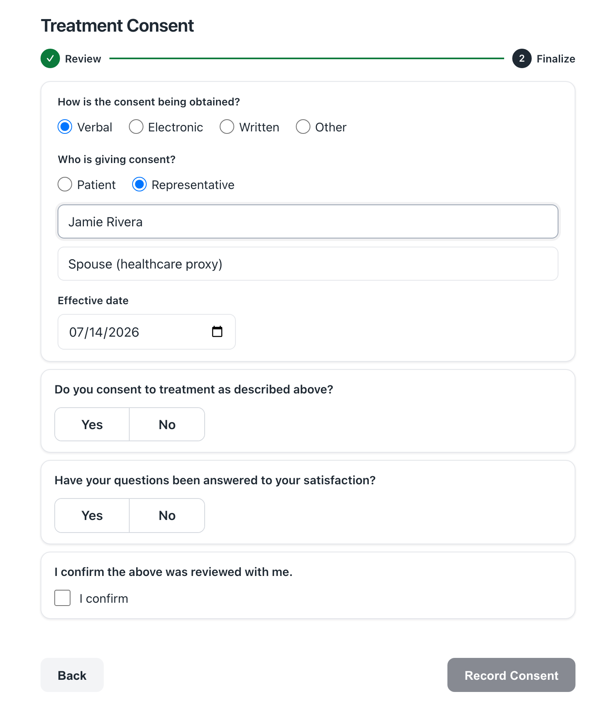
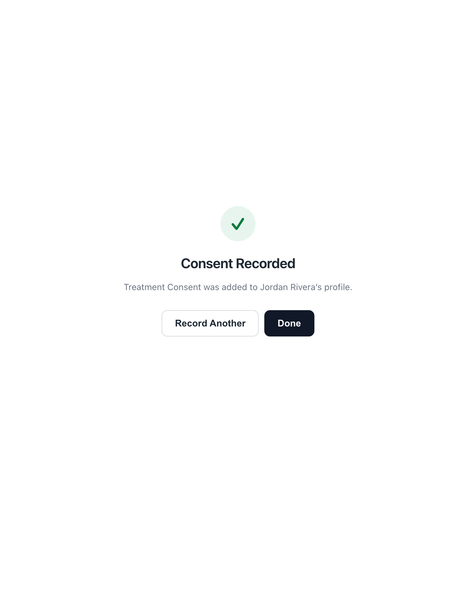
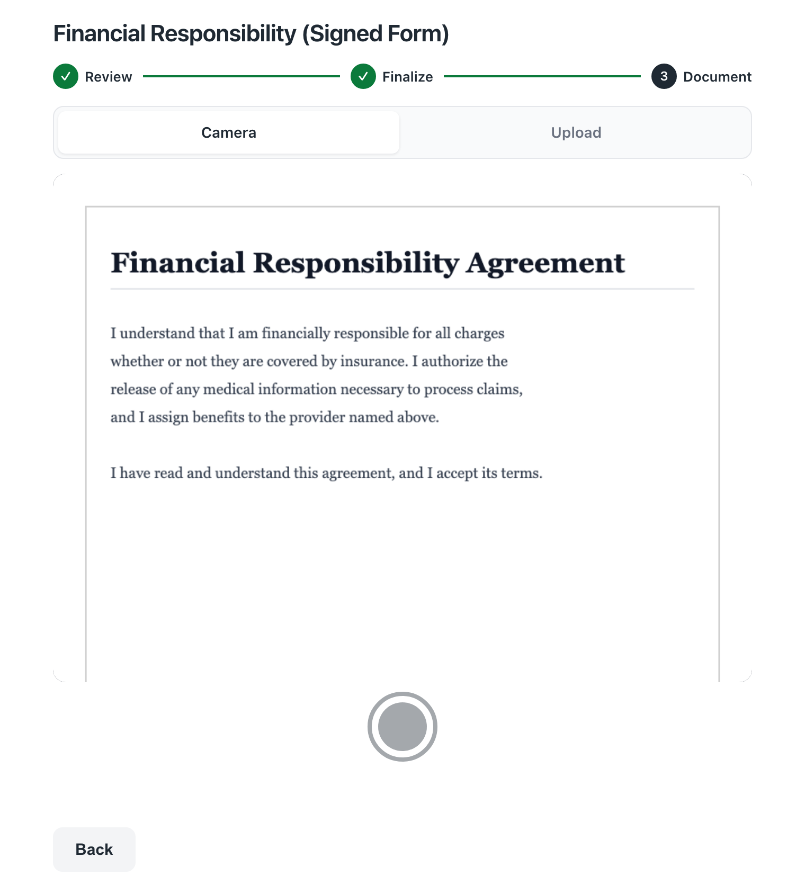
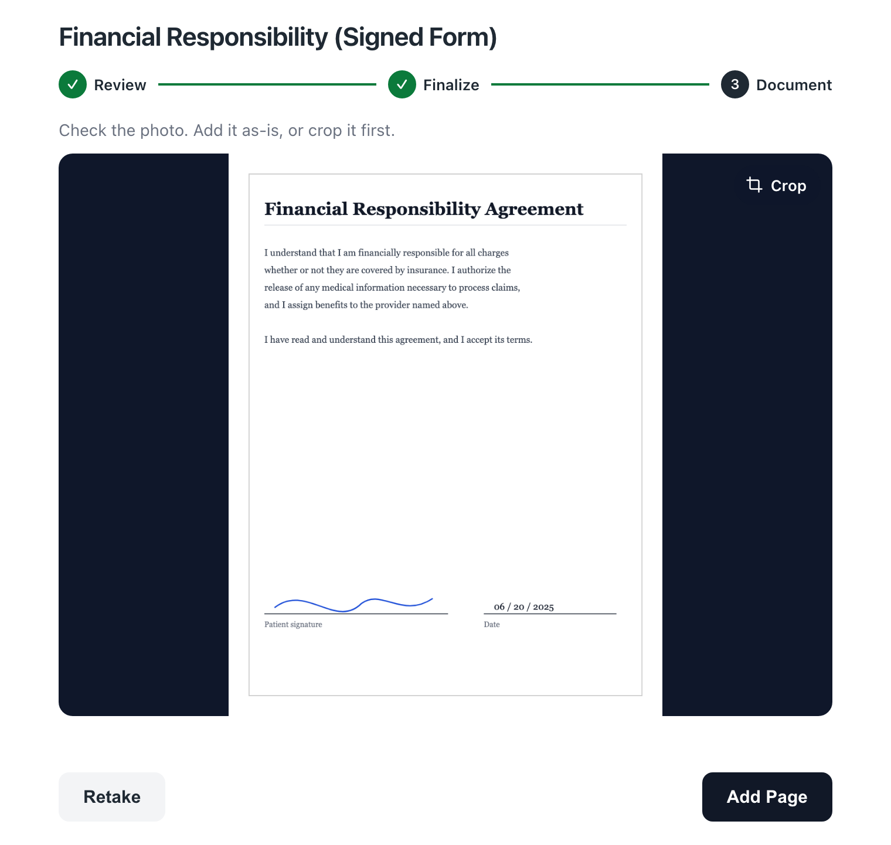
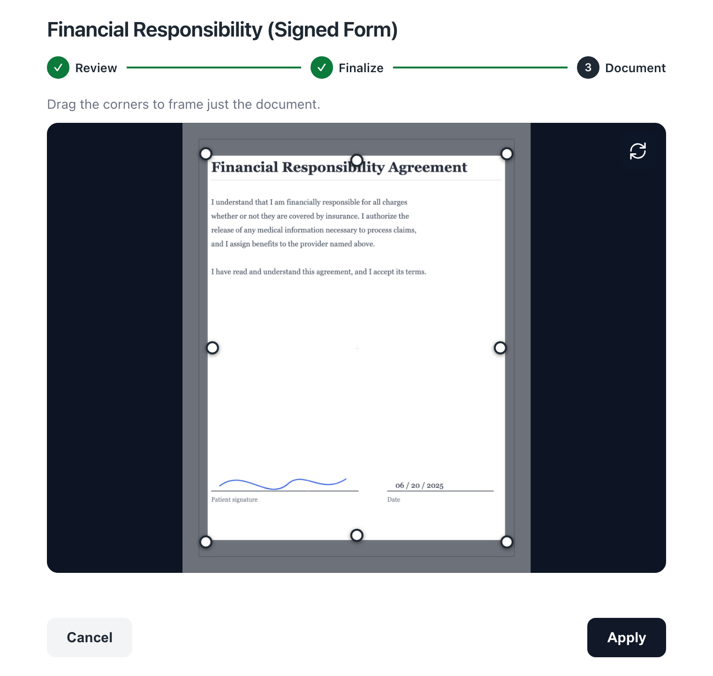
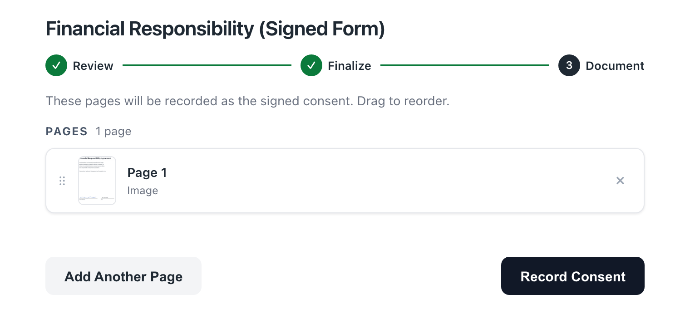
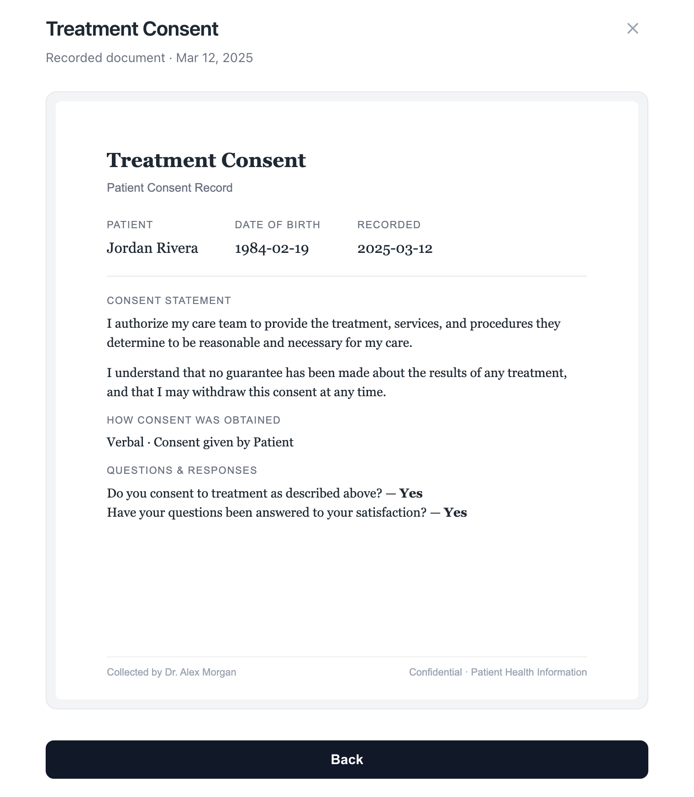

# Recording Consents — Staff Guide

This is a quick, click-by-click guide for front-desk and clinical staff on how to **record a
patient's consent** with the Consent Capture plugin, right from the patient's chart. No setup
knowledge needed. If you can open a patient chart, you can do this.

**What this covers:** opening the Consents window, recording a consent, handling a signed
paper ("Written") consent, viewing a consent already on file, and renewing an expired one.

> This guide is for the people *recording* consents. If you're the administrator setting the
> plugin up (credentials, which consents exist, wording), see **[SETUP_GUIDE.md](SETUP_GUIDE.md)**.

> _The screenshots of the consent window below use sample data for illustration. Your
> practice's consents, wording, and patient details will look different._

---

## 1. Opening the Consents window

Open the patient's chart. There are two ways to open Consents, plus one reminder:

- **"Consents" button** at the top of the chart. It's **always there**; it's **red when the
  patient still needs a required consent** and a neutral **gray** once everything required is
  on file. Click it either way to open Consents.
- **"Consents" in the chart app drawer.** This is **always** there, even when nothing is
  outstanding, so you can record an optional consent or look up what's on file any time.
- **Red banner reading "Required consent not on file."** This is a *reminder*, not a button.
  It tells you the patient owes a required consent. Use the red button or the app drawer to
  open Consents. The banner clears on its own once the required consent is recorded.

> If the patient is inactive or deceased, the button stays gray (never red) and the
> banner won't show. You can still open Consents from the button or the app drawer.

---

## 2. The Consents window (the "hub")

When Consents opens, you'll see the patient's consents sorted into up to three groups. Each
row shows the consent name, a colored status tag, and a **›** arrow.

- **Required** — consents the patient must have. Tags you'll see:
  - **Needed** (red) — never recorded. Record it.
  - **Renew** (amber) — was recorded but has **expired**. The row shows when it expired.
- **Optional** — consents you *can* record but aren't required. Tags: **Optional**, or
  **Renew** if a previous one expired. (This group is collapsed when something is required —
  click the heading to expand it.)
- **On File** — the patient's consent **history**. Tags: **On file** (green) or **Expired**
  (amber). Each row shows the effective date and expiration (or "No expiration"). Clicking one
  **opens the recorded document** (see section 6). This group includes consents recorded
  elsewhere, not just ones you record here.

To **record** a consent, click any row under **Required** or **Optional**.

---

## 3. Recording a consent (the normal flow)

After you click a consent, a short two-step wizard opens. The steps are shown at the top:
**Review → Finalize**.

### Step 1 — Review

You'll see the consent's wording. **Read it with the patient.** When you're ready, click
**Continue**. (To go back to the list, click **Cancel**.)

### Step 2 — Finalize

Depending on how this consent is set up, you may see some or all of the following. Fill in
what's shown:

1. **How is the consent being obtained?** — pick one: **Verbal**, **Electronic**,
   **Written**, or **Other** (only the options your practice enabled appear). If you pick
   **Written**, a note tells you that you'll add the signed form on the next step (see
   section 4).
2. **Who is giving consent?** — **Patient** or **Representative**. If you pick Representative,
   enter their **full name** and their **relationship to the patient** (for example: parent,
   healthcare proxy). Both are required.
3. **Capacity attestation** — if this consent requires it, you'll see a statement —
   *"The patient has the capacity for decision-making."* (or, for a representative, *"The
   representative has the authority for decision-making."*) — with **Yes / No** buttons.
   **Yes** is pre-selected; leave it on Yes to attest. Selecting **No** shows a notice and
   blocks recording until capacity is confirmed.
4. **Questions** — answer any questions shown (Yes/No, a confirmation checkbox, or a short
   typed answer). Some questions are required. If a question **must be answered Yes** and you
   answer No, a warning appears and the consent can't be recorded.
   *(Questions do not appear for **Written** consents — the signed form is the record.)*
5. **Effective date** — defaults to today. Change it only if the consent was given on a
   different day.

When everything's filled in, click **Record Consent**.

> The button stays greyed out until required questions are answered, the capacity attestation
> (if shown) is confirmed, and — if applicable — the representative's name and relationship are
> filled in.

When **Representative** is selected, the name and relationship fields appear:

### Done

You'll see a green checkmark and **"Consent Recorded."** From here you can:
- **Record Another** — go back to the list to record another consent, or
- **Done** — close the window.

The consent now appears under **On File**, and if it was the last required one, the button
turns from red to gray and the banner clears on their own.

---

## 4. Recording a "Written" (signed paper) consent

If you chose **Written** as the method, no on-screen questions are asked (the signed form is
the record). Clicking **Continue** takes you to a **Document** step so you can attach the
signed form. You can use the device camera or upload a file.

At the top you'll see two tabs: **Camera** and **Upload**.

### Option A — Camera

1. On the **Camera** tab, point the camera at the signed page.
2. Tap the round **shutter** button to take the photo.

3. On the **review** screen, check the photo:
   - Tap **Add Page** to keep it, or
   - Tap **Retake** to discard and try again.
   - To trim the edges first, tap **Crop**, drag the corners to frame just the document
     (use the rotate button if it's sideways), then tap **Apply**.

4. To add more pages, tap **Add Another Page** and repeat. To finish, continue to the page
   list below.

> If the camera doesn't work on your device, switch to the **Upload** tab.

### Option B — Upload

1. Tap the **Upload** tab, then **Choose files**.
2. Pick one or more **images or a PDF** of the signed document.
3. Images open on the review screen one at a time (crop if you like, then **Add Page**).

### Review the pages and record

On the **Pages** screen you'll see every page you added:
- **Drag** the pages by the handle to put them in the right order.
- Tap the **×** on a page to remove it.
- Tap **Add Another Page** to capture or upload more.

When the pages look right, tap **Record Consent**. The plugin assembles them into one
document, files it, and shows the **Consent Recorded** screen.

---

## 5. Renewing an expired consent

A consent tagged **Renew** (amber) has expired and needs to be recaptured.

1. Open Consents and click the consent tagged **Renew** (under **Required** or **Optional**).
2. Record it exactly like a normal consent (sections 3–4).

The new consent replaces the expired one under **On File**.

---

## 6. Viewing a consent that's already on file

1. Open Consents.
2. Under **On File**, click the consent you want to see.
3. The recorded document opens in a viewer. Click **Back** to return to the list, or the
   **×** to close.

> Some consents on file may have been recorded elsewhere in Canvas. They still show here so
> you have the full picture. If a row has no attached document, the viewer will say so.

---

## Good to know

- **One record per consent type.** Recording a consent again (a renewal, or a correction)
  replaces the previous one for that consent. The patient won't end up with duplicates.
- **The button color and banner are automatic.** The button turns red (and the banner appears)
  when a required consent is missing, and both clear once it's recorded — the button stays as a
  neutral gray entry point. You don't turn them off.
- **The person recording is you.** The consent is filed under your signed-in Canvas account,
  so you don't enter your own name anywhere.

---

## If something goes wrong

| What you see | What to do |
|---|---|
| **"Record Consent" is greyed out** | Answer all required questions and confirm the capacity attestation if one is shown. If a representative is giving consent, fill in their name and relationship. If a question must be Yes, it can't be recorded on No. |
| **"Please select how the consent was obtained"** | Choose a method (Verbal / Electronic / Written / Other) before recording. |
| **"Could not reach the server" / "Could not record consent"** | Try again. If it keeps happening, tell your administrator (it may be a configuration issue). |
| **Camera is blocked or unavailable** (Written consents) | Use the **Upload** tab instead. |
| **A consent you expected isn't in the list to record** | It may be hidden by your administrator. Ask them to enable it in Consent Settings. |
| **The document won't open** from On File | That consent may not have an attached file, or it was recorded without one. The viewer will tell you. |
