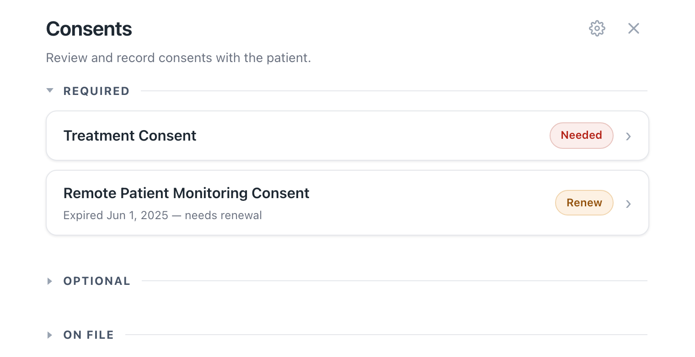
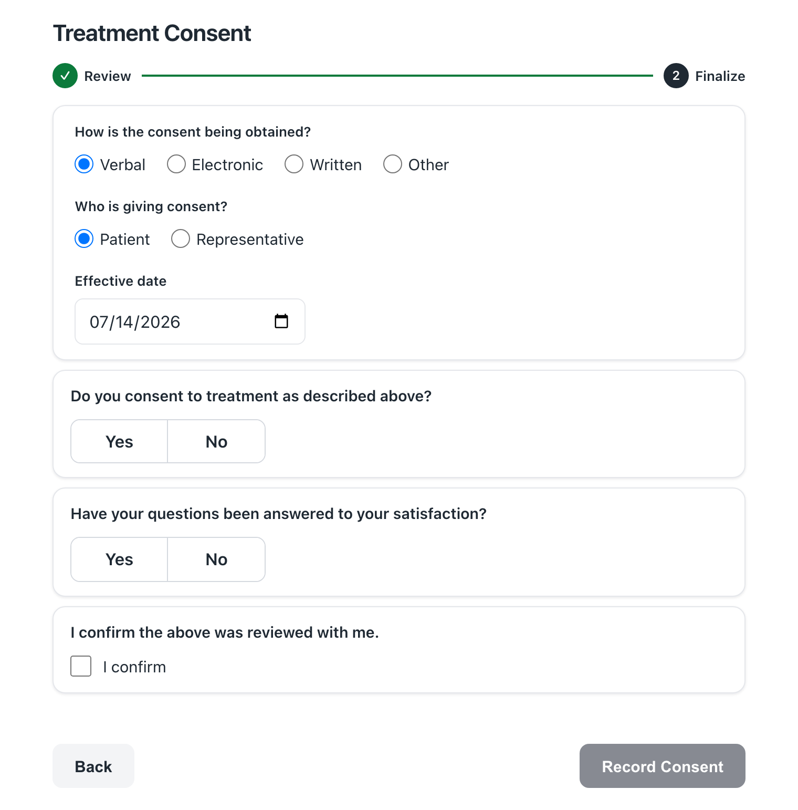

# Consents — Quick Start

**Record a patient's consent in under a minute, right from the chart.**
Need more detail? See the full **[RECORDING_GUIDE](RECORDING_GUIDE.md)**.

---

## 1. Open Consents

In the patient's chart, use either:

- The **Consents** button at the top of the chart (always there — **red** when a required
  consent is due, gray otherwise), or
- **Consents** in the chart app drawer (always there).

A red banner, **"Required consent not on file,"** is just a reminder to open it.

---

## 2. Pick a consent

Consents are grouped by a colored tag:

- **Needed** (red) or **Renew** (amber) — under **Required**. Record these.
- **Optional** — record if you need to.
- **On file** (green) or **Expired** — history. Tap to view the document.

Tap any **Needed**, **Renew**, or **Optional** consent to record it.

---

## 3. Record it — 4 steps

1. **Review** the wording with the patient, then tap **Continue**.
2. Choose **how** consent was obtained: Verbal, Electronic, Written, or Other.
3. Choose **who** is giving it (Patient or Representative), **confirm the capacity
   attestation** if one is shown, and answer any **questions**. *(Written consents skip the
   questions.)*
4. Tap **Record Consent**. A green checkmark confirms it is on file.

---

## Signed paper consent ("Written")

Pick **Written** in step 2, tap **Continue**, then either **photograph** the signed form or
**Upload** a file. Review the pages, then tap **Record Consent**.

---

## Quick tips

- **"Record Consent" greyed out?** Answer every required question and confirm the capacity
  attestation if one is shown. For a representative, add their name and relationship.
- **Camera not working?** Use the **Upload** tab instead.
- **Consent not in the list?** Ask your administrator to enable it.
- The consent is filed under **your** Canvas login; the button turns from red to gray and the
  banner clears itself once the last required consent is recorded.
