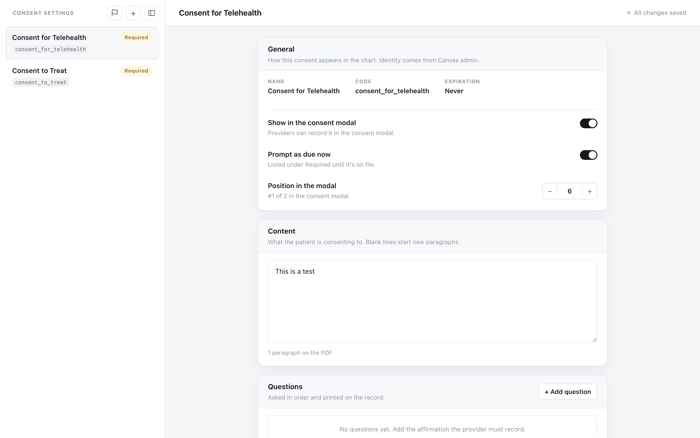
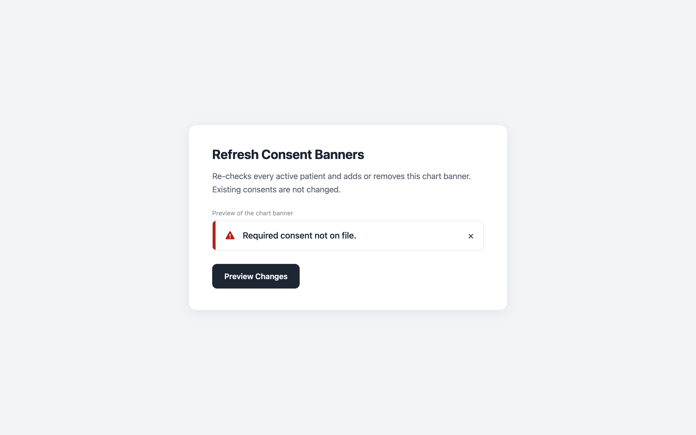

# Consent Capture — Setup & Configuration Guide

This guide walks you through setting up the **Consent Capture** plugin from start to
finish. Consent Capture lets your staff record a patient's consent right from the chart,
files each one as a documented FHIR `Consent`, and turns the chart's **Consents** button red
(alongside a chart/profile banner) whenever a patient still owes a **required** consent. You configure everything
(which consents exist, the wording, the questions) without writing any code.

**Who this guide is for:** the person setting the plugin up for your practice (a Canvas
administrator). No coding required.

**About how long it takes:** roughly 30–45 minutes the first time, most of it spent
writing the consent wording in Step 5.

> ⚠️ **A note on the Canvas admin screens.** A few steps happen in Canvas itself, outside
> this plugin. Canvas occasionally moves menus, so anywhere the exact click path might
> differ on your instance, you'll see a **"Verify this path in your instance"** note. Treat
> those as "look for something like this," and confirm the real location in your Canvas.

---

## Before you start

Make sure you have all of these. If you're missing one, get it before continuing.

- [ ] **Canvas administrator access** (you can reach the Admin settings area).
- [ ] Permission to **create a FHIR API application** in Canvas (to get a client ID and
      secret). If you can't do this yourself, ask whoever manages your Canvas API access.
- [ ] A **list of the consents** your practice needs to capture (for example: Treatment
      Consent, Remote Patient Monitoring, Telehealth).
- [ ] The **Consent Capture plugin files** (this folder), ready to install. Installation is
      covered in Step 3.

---

## Step 1 — Create your consent types in Canvas

The consents your staff can record are the **Patient Consent Codings** that live in Canvas
admin. **The plugin does not create these** — it lists the ones you set up here and lets you
add wording and questions to each. So this is where you decide *which* consents exist.

Do this once for each consent your practice needs:

1. Sign in to Canvas as an administrator.
2. Go to the **Admin** settings area and open **Patient Consent Codings**.
   > ⚠️ **Verify this path in your instance.** Look for "Patient Consent Coding" (or
   > "Consent Coding") under the Admin settings. The exact menu label can vary.
3. Click **Add** (or the **+**) to create a new coding.
4. Fill in:
   - **Display** — the name staff will see, e.g. `Remote Patient Monitoring Consent`.
   - **System** and **Code** — the coding's identifiers. If you don't have a standard to
     follow, a simple internal value is fine (for example system `INTERNAL` and a short
     code like `RPM`). Write these down; you'll recognize the consent by them later.
   - **Expiration rule** — how long the consent stays valid: **Never**, **Expires one year
     after acceptance**, or **Expires at end of year**. (Expiration is controlled here, not
     in the plugin.)
   - **Mandatory / Proof required** — set these per your practice's policy if your Canvas
     shows them.
5. Save.
6. Repeat for every consent type you want to capture.

> 💡 You can always come back and add more consent types later. New codings show up in the
> plugin's Consent Settings automatically.

---

## Step 2 — Create FHIR API credentials

When staff record a consent, the plugin saves it through the Canvas **FHIR API**. To do that
it needs its own **client ID** and **client secret**. You create those once here.

1. In Canvas admin, open the area for **API / third-party applications** (where OAuth
   applications are registered).
   > ⚠️ **Verify this path in your instance.** Look for something like "Third-party
   > application," "OAuth application," or "API client" under Admin settings.
2. Create a **new application**.
3. Give it a recognizable name, e.g. `Consent Capture Plugin`.
4. Grant it permission to:
   - **Create** `Consent` resources (to save new consents), and
   - **Read** `Consent` and `Binary` resources (to show the recorded document later).
   > ⚠️ If your instance uses scope strings, these correspond to write access for Consent
   > and read access for Consent and Binary. Verify the exact scope names in your instance.
5. Save the application. Canvas will show you a **client ID** and a **client secret**.
6. **Copy both somewhere safe right now.** The secret is usually shown only once. You'll
   paste them into the plugin in the next step.

> 🔒 Treat the client secret like a password. Don't email it or paste it into a chat. You'll
> store it as a **sensitive** plugin variable in the next step.

---

## Step 3 — Install the plugin and set its variables

### Install the plugin

Install Consent Capture on your instance the same way you install other plugins.

- If you use the command line:
  ```bash
  uv run canvas install ./consent_capture --host <your-canvas-host>
  ```
- If you use the Canvas plugin admin UI, upload/enable the plugin there instead.
  > ⚠️ **Verify this path in your instance.** Use whichever plugin-installation method your
  > team already uses for this Canvas instance.

### Set the plugin variables

Open the plugin's **variables / configuration** screen and set the values below.

> ⚠️ **Verify this path in your instance.** Plugin variables are set on the installed
> plugin's configuration screen in the Canvas plugin admin. Look for "Variables,"
> "Secrets," or "Configuration" on the Consent Capture plugin.

| Variable | Required? | What to enter |
|---|---|---|
| `CANVAS_FHIR_CLIENT_ID` | **Yes** | The **client ID** from Step 2. |
| `CANVAS_FHIR_CLIENT_SECRET` | **Yes** | The **client secret** from Step 2. (Stored as sensitive.) |
| `CONSENT_ADMIN_USERS` | Recommended | Who is allowed into the admin pages (Consent Settings and the banner page). A list of Staff **IDs** or full **names**, separated by commas, semicolons, or new lines. If you **leave it empty, only the root user / "Canvas Support" can open the admin pages** (everyone else is denied). Add the staff who should manage consents. |
| `CONSENT_BANNERS_ENABLED` | No | Turns the **"Required consent not on file." banner** on or off. Leave it as `true` (the default) to keep banners. Set it to `false` to turn banners off everywhere — then run the banner refresh (Step 6) once to clear existing banners immediately. This only affects the banner; the chart button is unaffected. |
| `CONSENT_SYSTEM` | No | Leave it as `INTERNAL`. This is a legacy default and is rarely needed. |

> ✅ **Set `CONSENT_ADMIN_USERS` before go-live.** Until you do, only the root /
> "Canvas Support" user can reach Consent Settings and the banner tools. List the names or
> IDs of the people who should manage consents. For example:
> `Jane Admin, Dr. Alex Lee` or `staff-id-1, staff-id-2`.

---

## Step 4 — Confirm it's live

Let's make sure the plugin is installed and you have admin access.

1. Stay signed in to Canvas.
2. In your browser, go to:
   `https://<your-canvas-host>/plugin-io/api/consent_capture/admin/settings`
3. What you should see:
   - **The Consent Settings page** → 🎉 you're set. The plugin is installed and you have
     admin access. Continue to Step 5.
   - **A "You don't have access" message** → the plugin is installed, but you're not on the
     admin list. Add your Staff ID or full name to `CONSENT_ADMIN_USERS` (Step 3) and
     reload.
   - **A page-not-found / error** → the plugin isn't installed or enabled yet. Revisit
     Step 3.

---

## Step 5 — Configure each consent

Now you'll add the wording, questions, and options to each consent type. This is where the
plugin comes to life.

### Open Consent Settings

Consent Settings is its own page. Open it either way:
- Go to `https://<your-canvas-host>/plugin-io/api/consent_capture/admin/settings`, or
- Click the **gear icon** in the top-right of the consent picker (shown to admins).



### Pick a consent from the list

The left column lists your consents, each with a status badge:

- **Required** — patients must have it; it drives the red button and the banner.
- **Optional** — staff can record it, but it's not chased.
- **Not shown** — hidden from the recording picker (staff can't record it right now).
- **Not set up** — a coding exists in Canvas but hasn't been configured here yet.

Also in this list:
- The **+** button opens Canvas admin so you can add a new consent coding (Step 1).
- The small **flag icon** opens the "Refresh Consent Banners" page (Step 6).

Click a consent to edit it.

### Fill in the consent

Work down the editor. Each part is described below.

- **General** — the name, code, and expiration. These are **read-only** here because they
  come from the Canvas coding (Step 1). To change them, edit the coding in Canvas admin.

- **Toggles** — turn each on or off:
  - **Show in the consent modal** — whether staff can *record* this consent from the picker.
  - **Prompt as due now** — marks the consent **required**. When on, the consent shows under
    **Required** and drives the red button and the banner until it's on file.
  - **Ask how consent was obtained** — staff pick a method at capture (see below).
  - **Ask who is giving consent** — the patient, or a representative (name + relationship).
  - **Include a capacity statement** — adds a decision-making capacity line to the record.

- **Content (verbiage)** — the consent language staff read to the patient and that prints on
  the record. **Leave a blank line between paragraphs** to keep the paragraph breaks.

- **Questions** — the affirmations staff must record, asked in order. Each question can be:
  - **Yes / No**, **Acknowledge**, or a **typed answer**;
  - marked **required**; and, for Yes/No, set to **must be Yes to record** (so consent can't
    be saved unless the patient answered Yes).

- **At capture** — the details staff confirm when recording:
  - **Methods offered** — any of **Verbal**, **Electronic**, **Written**, **Other**.
    > 💡 **Written is special.** For a Written consent the plugin does *not* generate a PDF.
    > Instead, staff upload or photograph the signed paper document, and that becomes the
    > record.
  - **Who is giving consent** — patient or representative.
  - **Capacity statement** — uses `[Patient name]` and `[Name]` placeholders, which fill in
    automatically at capture.

- **Document preview** — a live preview on the right shows how the recorded PDF will read as
  you type. Use it to proofread.

### Save

Click **Save changes**. Repeat Step 5 for every consent you want staff to use.

> ℹ️ **"Show in the consent modal" controls *recording*, not display.** A consent that's
> already on a patient's chart still appears under **On File** in the picker even if this
> toggle is off. The plugin never creates or edits codings, and expiration always lives on
> the coding in Canvas admin.

---

## Step 6 — Turn on banners for patients already in the system

The red banner ("Required consent not on file.") updates automatically whenever something
happens on a patient — a consent is recorded, or the patient record changes. That means
**patients already in your system won't get the banner until their next event**, unless you
give it a nudge here.

Run this once after you finish setting up your required consents (and again any time you make
a new consent required):

1. Open the **Refresh Consent Banners** page:
   - Click the **flag icon** in Consent Settings, or
   - Go to `https://<your-canvas-host>/plugin-io/api/consent_capture/admin/banners`.
2. Click **Preview Changes**. This only *reports* how many banners would be added and
   removed. **It changes nothing.**
3. Review the numbers. If they look right, click **Apply Changes**. To back out, click
   **Cancel**.



> ✅ This never changes any recorded consents. It only adds or removes the banner on active
> patients to match who currently owes a required consent.

---

## What your staff will see

Once you're set up, here's the day-to-day experience for clinical and front-desk staff.

**Three ways a consent shows up in the chart:**
1. A **Consents** button in the chart header — **always shown**. It turns **red** when the
   patient still owes a **required** consent, and is a neutral **gray** button once everything
   required is on file.
2. A **Consents** launcher in the chart's **app drawer** — always available, so staff can
   review what's on file or record an optional consent any time.
3. A red **banner** reading **"Required consent not on file."** on the chart and profile —
   clears automatically once every required consent is on file.

**Recording a consent (4 steps):**
1. Open the picker (any of the three surfaces above). Consents are grouped into **Required**,
   **Optional**, and **On File** (the patient's consent history).
2. Pick a consent and review the wording with the patient.
3. Confirm how consent was obtained, who is giving it, and answer any questions.
4. Click **Record Consent**. The plugin files it and it appears under **On File** right away.

> ℹ️ The **red** color and the banner **never appear for inactive or deceased patients** —
> their Consents button stays gray. If a patient is reactivated, the red color and
> banner come back on the patient's next event (or after a banner refresh, Step 6).

---

## Troubleshooting

| What you see | What to do |
|---|---|
| **"You don't have access"** on an admin page | Add your Staff ID or full name to `CONSENT_ADMIN_USERS` (Step 3), then reload. |
| A consent **won't record**, or a "credentials are missing" message | Recheck `CANVAS_FHIR_CLIENT_ID` and `CANVAS_FHIR_CLIENT_SECRET` (Steps 2–3). Confirm the API application can create `Consent`. |
| A consent **isn't in the picker** for staff to record | In Consent Settings, turn on **Show in the consent modal** for that consent (Step 5). |
| The **banner isn't showing** on a patient who should have it | Run **Refresh Consent Banners** (Step 6). The banner shows only for **active, non-deceased** patients who still owe a **required** consent — confirm the patient is eligible and that the consent is marked **Prompt as due now** (Step 5). |
| A consent shows under **On File** that you didn't record here | Expected. The plugin surfaces every consent on file, including ones recorded elsewhere or on codings it doesn't manage. |

---

## Quick reference

**Key URLs** (replace `<your-canvas-host>`):

| Page | URL |
|---|---|
| Consent Settings | `/plugin-io/api/consent_capture/admin/settings` |
| Refresh Consent Banners | `/plugin-io/api/consent_capture/admin/banners` |

**Plugin variables:**

| Variable | Required? | Value |
|---|---|---|
| `CANVAS_FHIR_CLIENT_ID` | Yes | FHIR API client ID |
| `CANVAS_FHIR_CLIENT_SECRET` | Yes | FHIR API client secret (sensitive) |
| `CONSENT_ADMIN_USERS` | Recommended | Staff IDs/names allowed into the admin pages; empty = root / "Canvas Support" only |
| `CONSENT_SYSTEM` | No | Leave as `INTERNAL` |

For a technical/developer reference (components, security model, data access, tests), see
the plugin's **[README.md](../consent_capture/README.md)**.
