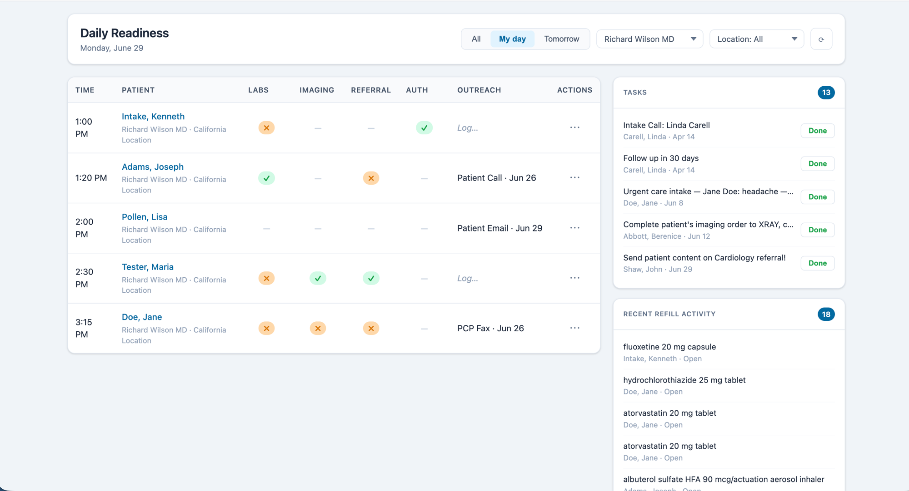
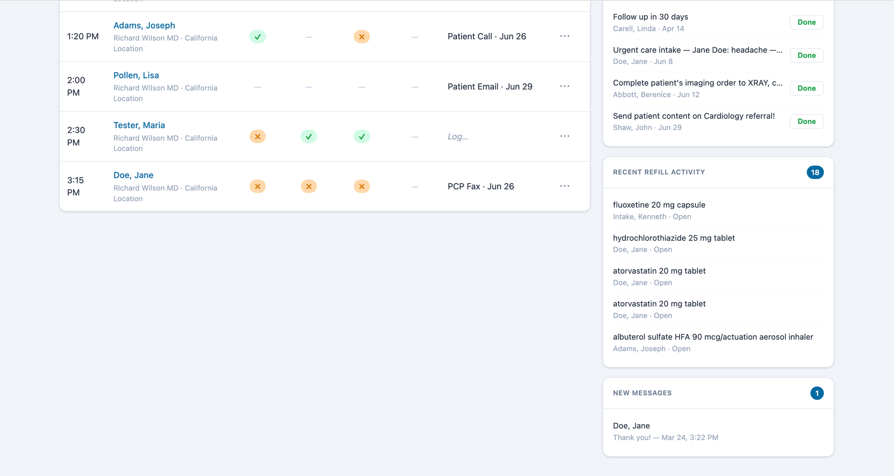
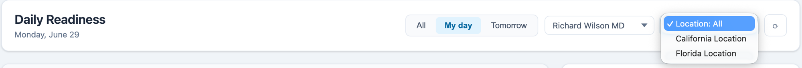
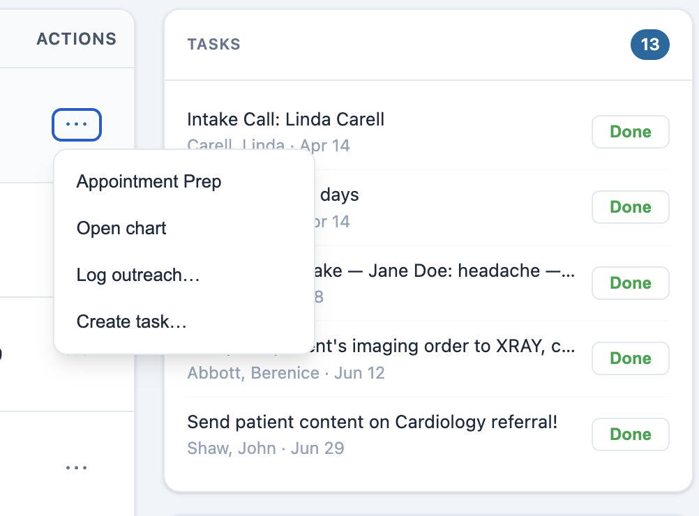
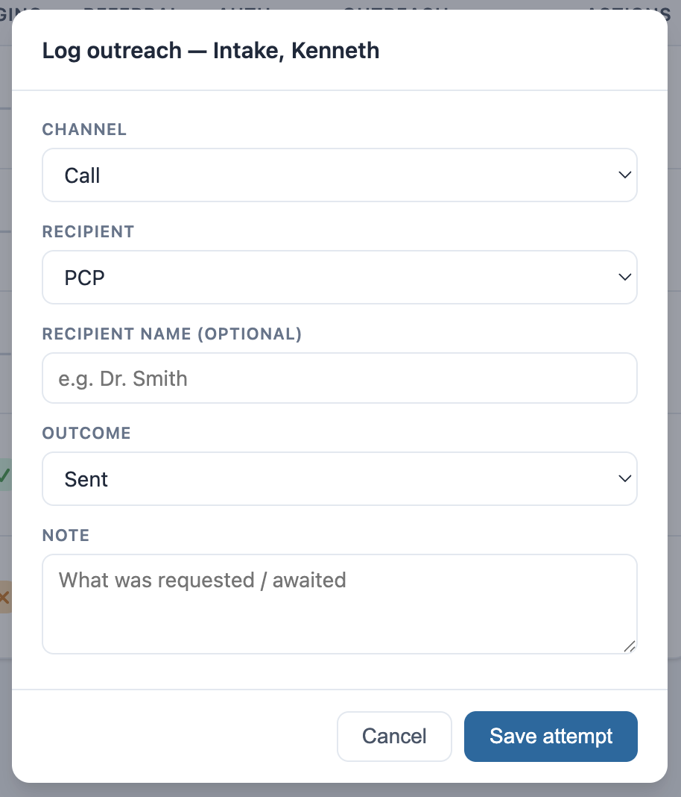
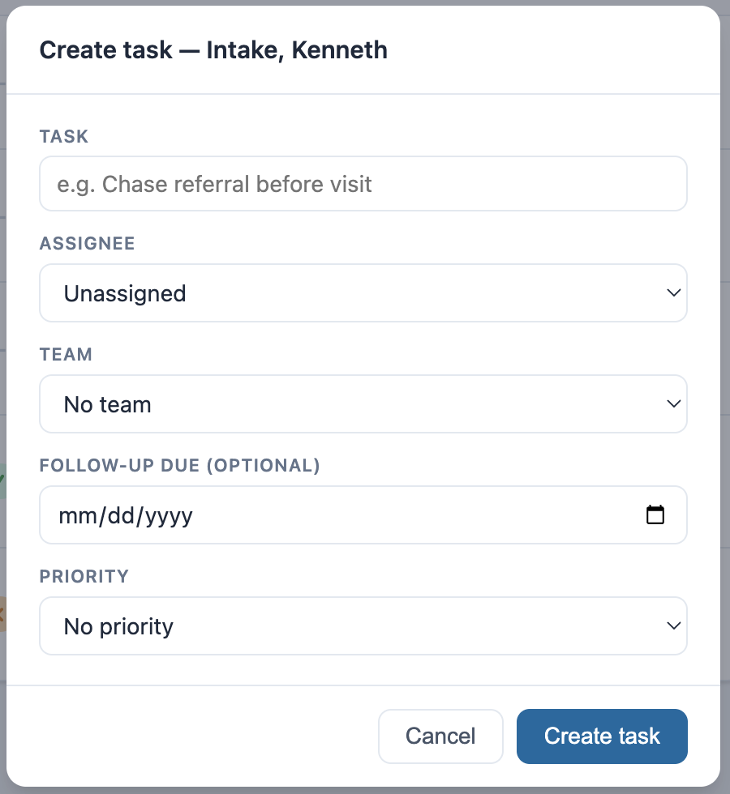

# Daily Readiness Dashboard

## What it does

The Daily Readiness Dashboard is a single screen that opens as the landing page
when staff log in. It lists the day's scheduled patients in time order and shows
at a glance whether each visit is *ready* — are the labs back, is imaging
complete, has the referral come through, is the prior authorization on file?
Alongside the schedule it surfaces open tasks, refill requests, and unread
patient messages, and lets staff act on them without leaving the page: log an
outreach attempt, mark a readiness item complete, create or edit a task, open
the patient's chart, start a messaging thread, or kick off an AI "appointment
prep" summary.

It opens on **My day** — the signed-in provider's schedule, with the provider
filter pre-set to them — and the task panel shows the tasks assigned to that
provider. A toggle switches between:

- **My day** — the signed-in provider's appointments and assigned tasks for today
- **All** — every provider's appointments clinic-wide, and all open tasks
- **Tomorrow** — the signed-in provider's schedule for tomorrow, with tasks due
  tomorrow

The provider and location dropdowns refine any view; choosing a provider scopes
both the schedule and the task panel to that provider. Refills and unread
messages always reflect the patients on the visible schedule.

## Problem it solves

Before a clinic day starts, someone has to work down the schedule and figure out
which visits are at risk of being unproductive — the patient whose labs never
came back, the consult that's still pending, the auth that hasn't cleared. Today
that means bouncing between the schedule, each patient's chart, the orders
screen, the task list, and the refill/message queues, one patient at a time.
This dashboard collapses that morning huddle into one screen: the readiness gaps
are visible immediately, and the follow-up action is one click away.

## Who it's for

Front-desk staff, care coordinators, nurses, and providers at a nephrology /
dialysis clinic who need to prepare for the day's visits. The dashboard is
staff-facing only (`provider_menu_item` scope).

## How to install

```bash
canvas install daily-dashboard --host <instance> \
  --variable CLINIC_TIMEZONE=America/Los_Angeles \
  --variable CUSTOMER_IDENTIFIER=<instance>
```

After install, the dashboard becomes the **default homepage** for the instance
(it replaces the schedule landing view via a `GET_HOMEPAGE_CONFIGURATION`
handler). It is also reachable from the provider menu as **"Daily Readiness."**

The "Appointment Prep" action opens a companion AI assistant panel; that
assistant plugin must be installed separately and have its API key configured
for the prep summary to generate.

## Configuration options

All configuration is via manifest **variables** (set with `--variable` at
install). None are required for the dashboard to load — each has a sensible
default — but `CLINIC_TIMEZONE` is recommended.

| Variable | Purpose | Default |
|----------|---------|---------|
| `CLINIC_TIMEZONE` | Fallback timezone for the day window + time display when the browser doesn't supply one. Times otherwise follow the **signed-in user's own** timezone. | `UTC` |
| `CUSTOMER_IDENTIFIER` | Your Canvas instance subdomain, used to build chart deep-links. Set this to your instance for the "open chart" links to resolve. | `example` (placeholder) |
| `MESSAGING_APP_IDENTIFIER` | App identifier for the "Open messages" deep-link. | conversational-view app |
| `ASSISTANT_PANEL_APP` | App identifier opened by the "Appointment Prep" action. | assistant ChatApp |
| `ASSISTANT_PREP_PROMPT` | The prompt auto-sent to the assistant on Appointment Prep. | a visit-prep summary prompt |
| `PANEL_TASKS_URL` / `PANEL_REFILLS_URL` / `PANEL_MESSAGES_URL` | Optional card-header link targets. Left empty (headers unlinked) because native worklists aren't cold-loadable. | `""` |

## Limitations

- **Authorization readiness is a manual flag, not derived data.** The Canvas
  plugin SDK does not currently expose the prior-authorization / referral-auth
  queue as a readable model, so the "Auth" column is driven by a staff
  "Mark complete" toggle stored in patient metadata. Labs, imaging, and referral
  columns *are* derived from real SDK data (orders + reports).
- **Refill activity is derived from the `Prescription` model** (`is_refill`),
  not from a native refill-request inbox, which the SDK does not expose. The list
  is a reasonable proxy, not an authoritative work queue.
- **Card-header deep-links to the native worklists are disabled by default.**
  Canvas's built-in task/refill/message worklists use in-app (SPA) filter state
  that isn't addressable by a cold URL, so a pasted link lands on the schedule.
  The per-row actions (open chart, open messages, appointment prep) *do*
  deep-link correctly.
- **No server-side access scoping.** The board defaults to the signed-in
  provider's day ("My day"), but the **All** toggle lets any authenticated staff
  member view every patient scheduled that day — there is no care-team or panel
  enforcement. This suits an operational front-desk/care-team board; a deployment
  with stricter access requirements would need server-side per-staff filtering.

## Running Tests

```bash
uv run pytest tests/
```

## Screenshots

**Daily Readiness — "My day"** (the signed-in provider's schedule + readiness
table on the left, action panels on the right):



**Action panels** — open tasks (with one-click Done), recent refill activity,
and new messages:



**Filters** — All / My day / Tomorrow, provider (defaults to the signed-in
user), and location:



**Per-row actions** — Appointment Prep, Open chart, Log outreach, Create task:



**Log outreach** — channel, recipient, outcome, and an optional note (surfaced
when the outreach entry is clicked):



**Create task** — title, assignee, team, due date, and priority:


