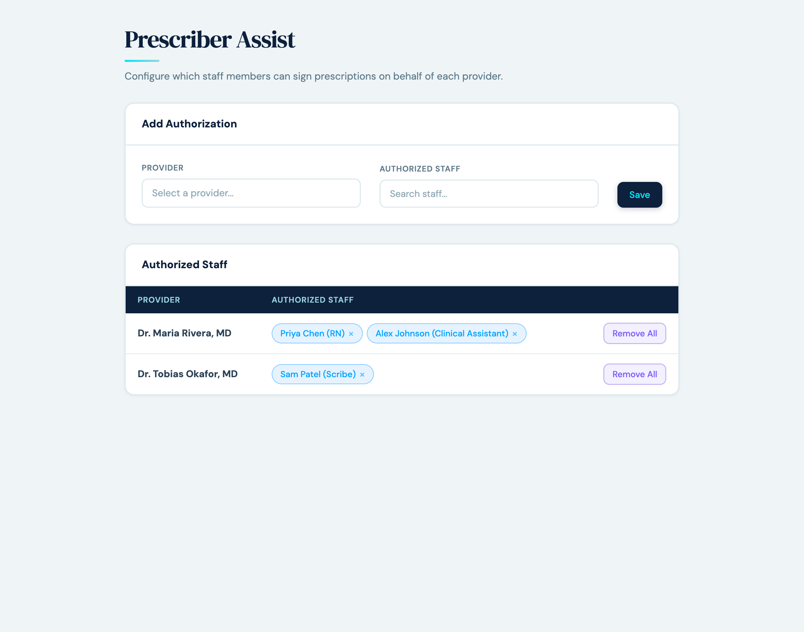

# DEA Prescriber Filter

## What it does

The DEA Prescriber Filter plugin controls who can sign prescriptions for which providers in Canvas. It prevents staff from signing prescriptions on behalf of providers they are not authorized for, and blocks prescriptions being sent to pharmacies in states the prescriber is not licensed in.

An admin UI called **Prescriber Assist** lets administrators explicitly authorize delegation relationships — for example, granting a clinical assistant the right to sign on behalf of a specific prescriber.

## Problem it solves

Canvas does not enforce prescribing scope by default. Any staff user with prescribe permissions can attempt to sign for any provider, and prescriptions can be routed to pharmacies in any state regardless of the prescriber's licensure. In practice this creates two failure modes:

- A staff member can accidentally (or maliciously) sign a controlled-substance prescription for a provider they have no clinical relationship with — a DEA compliance risk.
- A prescription can be routed to a pharmacy in a state the prescriber is not licensed in, requiring a manual re-route and customer-service contact.

The workaround today is per-organization policy combined with after-the-fact audit. This plugin pushes the enforcement up to the moment of signing.

## Who it's for

- **Provider organizations** with multiple licensed prescribers and clinical support staff (nurses, MAs, scribes) who handle prescriptions on their behalf.
- **Practices that prescribe controlled substances** (DEA Schedule II–V) where authorization mistakes have regulatory consequences.
- **Multi-state organizations** where prescriber licensure varies by state and pharmacy routing must respect it.

Particularly relevant for primary care, internal medicine, pain management, psychiatry, and any specialty involving controlled-substance prescribing.

## How to install

**Via the Canvas CLI** (requires API client credentials in `~/.canvas/credentials.ini` for the target instance):

```bash
cd extensions/dea_prescriber_filter
canvas install . --host <your-instance>
```

**Via the Canvas admin UI (URL upload)** — paste the GitHub directory URL into the plugin upload form:

```
https://github.com/Medical-Software-Foundation/canvas/tree/main/extensions/dea_prescriber_filter
```

After install, the Prescriber Assist app appears in the app drawer for authenticated staff. Any logged-in Canvas staff member can open the admin UI by default; to restrict access to a named subset of admins, configure the `ADMIN_STAFF_IDS` secret (see [Configuration options](#configuration-options)).

## Important: disable `RESTRICT_MEDICATION_ORDERS_TO_PRESCRIBER`

This plugin enforces the same prescriber-restriction logic as Canvas's built-in `RESTRICT_MEDICATION_ORDERS_TO_PRESCRIBER` instance setting — but with an explicit override mechanism that the built-in setting does not provide.

**Before installing, set `RESTRICT_MEDICATION_ORDERS_TO_PRESCRIBER` to `false`** in the Canvas admin panel. Leaving both layers active is redundant: the built-in setting will block prescriptions that the plugin's Prescriber Assist delegation is meant to allow, with no way to override.

With the built-in setting disabled and the plugin installed:
- The plugin enforces the same restriction at sign-time
- Admins can use Prescriber Assist to grant explicit delegations when staff members need to sign on behalf of a provider — a documented, audited override path the built-in setting doesn't support

## Configuration options

### `ADMIN_STAFF_IDS` (optional plugin secret)

The Prescriber Assist admin UI controls prescribing-delegation, which decides who can sign controlled-substance prescriptions on behalf of a provider. By default, any authenticated Canvas staff member can access the admin UI. Set `ADMIN_STAFF_IDS` to a comma-separated list of staff UUIDs to restrict access to a named subset.

**Example:**
```
ADMIN_STAFF_IDS=57f3668ea9f84f3980e772ea8451af38,a1b2c3d4e5f6...
```

- Empty or unset → any authenticated Canvas staff member can access the admin UI
- Set to UUIDs → only listed staff can access the admin UI; all others get 403 Forbidden

Configure this in the Canvas admin panel: **Plugins → dea_prescriber_filter → Secrets**.

## Screenshots



The Prescriber Assist admin UI: administrators select a provider and a set of staff members, then save a delegation. Existing delegations appear in the table below and can be edited or removed individually.

## Features

### Authorization enforcement
- **NPI matching** — a user can sign their own prescriptions automatically
- **Prescriber Assist delegation** — admins can explicitly authorize staff to sign for other providers
- **Sign button hiding** — when the current user is not authorized for the selected prescriber, sign/send/print actions are removed from the command, preventing the commit
- **Validation error** — when review is clicked without authorization, the user sees "Not authorized to prescribe for this provider."

### State license validation
- On review, checks that the selected prescriber profile's license state matches the pharmacy's state
- The check scopes to the specific selected profile (e.g. "Dr Brown (AK)"), not all NPI-linked profiles — so picking the wrong profile for a cross-state prescription is caught
- Pharmacy state is looked up live via the Canvas pharmacy service (NCPDP)

### Prescriber dropdown enhancements
- All providers in the prescriber search are annotated with their license state (e.g. `"NY"`)
- Providers the current user can sign for (own NPI or delegated) are sorted to the top
- The supervising provider search is also annotated and sorted alphabetically

### Prescriber Assist admin UI
- Global application accessible from the app drawer
- Configure which staff members can sign on behalf of each provider
- Cache-backed storage — survives plugin reloads, 14-day TTL

## Supported commands

- Prescribe
- Refill
- Adjust Prescription

Each command has corresponding action filters and validation handlers.

## Architecture

### Components

#### Protocols (`protocols/prescriber_filter.py`)
- `PrescriberSearchPrioritization` — annotates and re-orders prescriber dropdown results
- `SupervisingProviderSorter` — annotates and sorts supervising provider dropdown
- `PrescribeActionFilter` / `RefillActionFilter` / `AdjustPrescriptionActionFilter` — hides sign/send/print actions when unauthorized; also caches the current user's staff key for the validation handler
- `PrescribeValidation` / `RefillValidation` / `AdjustPrescriptionValidation` — shows authorization and state-mismatch error messages on review

#### API (`api/delegation_api.py`)
- `DelegationUIApi` — SimpleAPI endpoints for the admin UI
  - `GET /app/delegation-admin` — renders the admin page HTML
  - `POST /app/form-action` — handles save/remove delegation form submissions
- Access control:
  - `StaffSessionAuthMixin` — authenticates the caller as Canvas staff
  - `_is_admin_user` — requires `ADMIN_STAFF_IDS` to be set; denies all callers if unset
  - `_is_same_origin` — CSRF defense on POST
  - `_valid_staff_id` — verifies submitted IDs correspond to real Staff records

#### Application (`applications/delegation_app.py`)
- `PrescriberDelegationApp` — app drawer entry point, launches the admin UI in a modal

#### Engine (`engine/`)
- `storage.py` — cache-backed delegation storage (provider → list of authorized staff UUIDs)
- `lookups.py` — helpers for listing active providers and staff, deduplicated by NPI

## Authorization data flow

```
User opens a prescribe command
      │
      ▼
AVAILABLE_ACTIONS fires
      │
      ├─ Action filter checks if current user is authorized for the prescriber
      │   (own NPI or via Prescriber Assist)
      ├─ If unauthorized → filters sign/send/print actions out
      └─ Caches the current user's staff key (keyed by command UUID, 5-min TTL)
      │
      ▼
User clicks Review
      │
      ▼
POST_VALIDATION fires
      │
      ├─ Reads the cached user key
      ├─ If present and user is unauthorized → shows "Not authorized" error
      ├─ Checks the selected prescriber profile's license states
      └─ If pharmacy state not in license states → shows state-mismatch error
```

The action filter is the primary safety gate: it always runs with the *current* user context (not a cached decision), so user-switching does not leak authorization.
