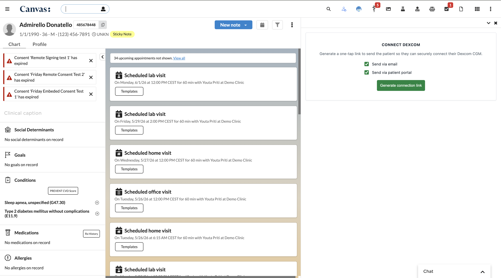
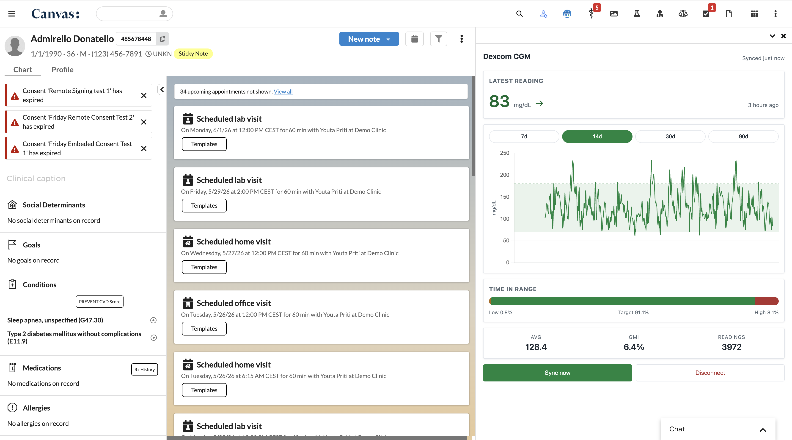

# dexcom_cgm_viewer

## What it does

`dexcom_cgm_viewer` is a Canvas plugin that brings a patient's Dexcom
continuous glucose monitor (CGM) data into the chart drawer. Staff can
generate a one-tap connection link, deliver it to the patient over email
(via SendGrid), the Canvas patient portal, or a copyable URL, and — once
the patient authorizes — view latest glucose, trend arrow, time-in-range,
and a glucose chart for the last 7 / 14 / 30 / 90 days. Sync is on-demand
through a Dexcom Developer API v3 client; there is no nightly cron.

## Problem it solves

CGM data lives in Dexcom's cloud and traditionally requires staff to
either pull patient-shared reports manually or wait on a separate vendor
integration. This plugin lets a clinician connect a patient to Dexcom from
inside the chart in under a minute and review glucose trends without
leaving Canvas — replacing the manual PDF-report workflow common in
endocrinology, primary care, and remote-monitoring programs.

## Who it's for

- **Endocrinology** practices managing type 1 and insulin-dependent type 2
  diabetes.
- **Primary care** clinicians running diabetes-management programs.
- **Remote patient monitoring (RPM)** and chronic-care-management (CCM)
  teams who already bill 99453 / 99454 / 99457 and need CGM data
  surfaced inside the EHR.
- Any care team that wants Dexcom data in-chart without a separate
  reporting portal.

## Screenshots

The plugin tile inside the patient chart:



After connecting the patient and running a sync — latest glucose, trend
arrow, time-in-range, and the glucose chart:



## How to install

```bash
canvas install dexcom_cgm_viewer --host <your-canvas-host>
```

After installing, set the required plugin secrets (see
[Configuration options](#configuration-options)).

## Configuration options

Five required plugin secrets:

| Secret | Notes |
| --- | --- |
| `DEXCOM_CLIENT_ID` | From Dexcom developer registration |
| `DEXCOM_CLIENT_SECRET` | From Dexcom developer registration |
| `DEXCOM_REDIRECT_URI` | Pre-registered with Dexcom; e.g. `https://<canvas-host>/plugin-io/api/dexcom_cgm_viewer/callback` |
| `DEXCOM_ENVIRONMENT` | `sandbox` or `production` |
| `DEXCOM_MAGIC_LINK_SECRET` | High-entropy string (≥ 32 bytes) used to HMAC-SHA256 sign magic-link tokens |

Two optional secrets enable email delivery via SendGrid. When unset, the
link is still generated and offered as a copyable value plus a Canvas
portal message:

| Secret | Notes |
| --- | --- |
| `SENDGRID_API_KEY` | SendGrid API key with Mail Send permission |
| `SENDGRID_FROM_EMAIL` | A SendGrid-verified sender address |

Set them with:

```bash
canvas config set dexcom_cgm_viewer \
  "DEXCOM_CLIENT_ID=..." \
  "DEXCOM_CLIENT_SECRET=..." \
  "DEXCOM_REDIRECT_URI=https://<your-canvas-host>/plugin-io/api/dexcom_cgm_viewer/callback" \
  "DEXCOM_ENVIRONMENT=sandbox" \
  "DEXCOM_MAGIC_LINK_SECRET=$(python -c 'import secrets;print(secrets.token_urlsafe(48))')" \
  --host <your-canvas-host>
```

> **Note on token storage:** OAuth tokens are stored unencrypted in the
> plugin's namespaced custom-data tables. The Canvas plugin sandbox
> blocks the `cryptography` library, so application-layer encryption-at-
> rest cannot be added until Canvas exposes an encrypted-field type.
> Tokens are scoped per patient, never returned by any plugin API, and
> refresh tokens rotate on every refresh.

## Architecture

```
DexcomChartApp (patient-scoped Application)
      │
      ▼
DexcomChartAPI  ──► StaffSessionAuthMixin
      │
      ▼
Canvas custom data:
  • dexcom_oauth_tokens   (OAuth tokens, single-use refresh rotation)
  • dexcom_sync_state     (sync watermark, link-pending, errors)
  • dexcom_egvs           (5-min readings, 90-day rolling retention)
  • dexcom_summaries      (daily aggregates, indefinite retention)

DexcomOAuthAPI  ──► JWT-authenticated /connect & /callback
```

## Routes

All routes are under `/plugin-io/api/dexcom_cgm_viewer/`.

| Method | Path | Auth | Purpose |
| --- | --- | --- | --- |
| GET  | `/`                              | Staff session | Render chart-drawer shell |
| GET  | `/data?patient_id=&range=`       | Staff session | View-model JSON |
| POST | `/sync?patient_id=&range=`       | Staff session | Manual pull (chunked into 30-day windows) |
| POST | `/send-link?patient_id=&channels=` | Staff session | Mint link, deliver over selected channels |
| POST | `/disconnect?patient_id=`        | Staff session | Purge tokens + cached data |
| GET  | `/diagnose?patient_id=`          | Staff session | Read-only contact-point state (messaging triage) |
| GET  | `/connect?token=<jwt>`           | JWT           | Patient-facing redirect to Dexcom OAuth |
| GET  | `/callback?code=&state=`         | OAuth state   | Exchange code, store tokens |

## UAT setup

End-to-end walkthrough for a tester: register Dexcom credentials, set the
plugin secrets, prep a test patient, and run the connect → sync →
disconnect flow.

### 1. Dexcom developer credentials

1. Sign in at https://developer.dexcom.com/ and create an account if needed.
2. Create a new app under **My Apps → Add App**.
3. For the **OAuth Redirect URI**, register *exactly*:
   ```
   https://<your-canvas-host>/plugin-io/api/dexcom_cgm_viewer/callback
   ```
   Any mismatch (trailing slash, wrong host, http vs https) makes every
   patient OAuth attempt fail.
4. Pick **Sandbox** to start — switching to **Production** requires
   Dexcom's partner-program approval.
5. Copy the **Client ID** and **Client Secret**.

### 2. Generate the magic-link secret

```bash
python -c "import secrets; print(secrets.token_urlsafe(48))"
```

### 3. (Optional) SendGrid setup for email delivery

Skip this if you only need to test the Canvas-portal channel and the
copyable link.

1. Sign in at https://sendgrid.com/ and create an account.
2. **Settings → API Keys → Create** — give the key only the **Mail Send**
   permission.
3. **Settings → Sender Authentication → Single Sender Verification** — add
   and verify a sender email.
4. Copy the API key and the verified sender address into the
   `SENDGRID_API_KEY` and `SENDGRID_FROM_EMAIL` secrets.

### 4. Prepare a test patient

For **portal-message** or **email** delivery to work, the patient needs a
messageable channel:

1. Open the patient chart → patient profile drawer.
2. Under **Contact info** / **Telecom**, add an email contact point with:
   - System: **Email**
   - Value: an inbox you can actually check
   - **Has consent:** true
   - **Opted out:** false
   - State: **Active**
3. Save.

If the patient has none of those, link generation still works — staff
just copy the link manually.

### 5. End-to-end test

1. Open the test patient's chart → expand the **Plugins** tab → click
   **Dexcom CGM**.
2. **Disconnected state**: tick *Send via email* and/or *Send via patient
   portal* → click **Generate connection link**. The toast tells you
   which channels delivered. A copyable link appears in the panel.
3. **Connect**: open the link in an incognito window (or on your phone).
   It redirects to Dexcom's hosted login. Use one of the sandbox test
   users:
   - `User7` (G7) — recommended, current-generation data
   - `User4` (G6 receiver), `User6` (G6 mobile), `User8` (ONE+)

   Sandbox data repeats every 10 days.
4. Accept the HIPAA authorization. You'll land on the "You're connected"
   page.
5. Back in the chart drawer, click **Check for connection** (or refresh)
   — the UI flips to the connected state.
6. **Sync now** — the first sync pulls a 14-day window (default range)
   and shows a loading banner. Subsequent range chips (7d / 14d / 30d /
   90d) re-read from the local database without calling Dexcom.
7. **First-sync timing**: a 90-day range is chunked into three 30-day
   requests under the hood (Dexcom v3 limit) — expect 10–30 seconds.
8. **Disconnect** — confirms a prompt, then purges tokens and cached
   glucose data. The UI returns to the disconnected state.

### 6. Troubleshooting

| Symptom | Where to look |
| --- | --- |
| Email not received | `canvas logs --host <host> --since 5m --level ERROR` — look for SendGrid 4xx/5xx |
| Portal message never appeared | Hit `https://<host>/plugin-io/api/dexcom_cgm_viewer/diagnose?patient_id=<UUID>` while logged in as staff — confirms the patient has a verified messaging channel |
| Dexcom OAuth bounces back to an error | Check that the registered redirect URI matches `DEXCOM_REDIRECT_URI` *exactly* |
| Sync fails with "sync timed out" | Logs will show whether Dexcom returned 401 (refresh issue) or 4xx (date-range issue) |
| Patient ID lookup fails | Patient IDs are UUIDs — grab from the `?patient_id=` in any working `/data` request in DevTools, not from the chart UI |

## Local development

```bash
uv sync
uv run pytest --cov=dexcom_cgm_viewer --cov-report=term-missing
uv run mypy dexcom_cgm_viewer
```

## License

Released under the [MIT License](../LICENSE).

## Info

*This plugin was developed and contributed by [Vicert](https://vicert.com).*
Contact: engineering@vicert.com
