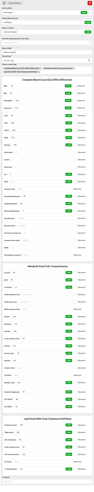

# Doc Intake AI

Automatically processes documents arriving in Data Integration using Extend AI.

## What it does

When a document is received by fax, upload, or an electronic channel, this plugin sends it to Extend AI for extraction, matches the patient and provider against Canvas records, and fills the Data Integration intake form with the document type, patient, reviewer, and template fields. Each extracted value carries an AI confidence badge so the reviewer can see what was inferred.

## Problem it solves

Incoming clinical documents normally land in Data Integration as untyped, unlinked files that a staff member has to read, categorize, match to a patient, route to a reviewer, and transcribe into template fields by hand. That manual triage is slow and error prone at volume. This plugin does the first pass automatically, so a document arrives already classified, linked, routed, and prefilled, and the staff member only has to confirm.

## Who it's for

Canvas customers who receive a steady flow of inbound clinical documents, faxed lab and imaging reports being the common case, and want AI to handle the initial categorization and data entry before a human reviews.

## How to install

Requires an instance that supports the Data Integration SDK, the `DOCUMENT_RECEIVED` event, and the `canvas_sdk.effects.data_integration` effects. That capability is on mainline canvas and canvas-plugins, so run it on canvas-plugins 0.163.x or newer.

Install the plugin with the Canvas SDK command, replacing hostname with your environment.

```
canvas install doc_intake_ai --host <hostname>
```

After installing, set the secrets described below. At minimum `EXTEND_API_KEY` and `EXTEND_EXTRACTOR_ID` are required, and you enable the capabilities you want with the `ENABLE_*` secrets.

## Configuration options

All configuration is done through plugin secrets.

| Secret | Required | Description |
|--------|----------|-------------|
| `EXTEND_API_KEY` | Yes | Extend AI API bearer token |
| `EXTEND_EXTRACTOR_ID` | Yes | Extend AI processor id from Extend Studio |
| `EXTEND_WEBHOOK_SECRET` | Yes | Shared secret used to verify Extend AI webhook callbacks |
| `DEFAULT_REVIEWER` | No | Fallback reviewer when no provider match is found. Enter a staff name such as `Jane Smith` or an NPI number such as `1234567890`. If not set, defaults to Canvas Bot. |
| `ENABLE_CLASSIFY` | No | Set to `true` to tag documents with a type. Disabled by default. |
| `ENABLE_MATCH_PATIENT` | No | Set to `true` to match documents to patient records. Disabled by default. |
| `ENABLE_ASSIGN_REVIEWER` | No | Set to `true` to assign a clinician reviewer. Disabled by default. |
| `ENABLE_PREFILL_TEMPLATES` | No | Set to `true` to fill template fields from extracted data. Uses a second Extend AI API call. Disabled by default. |
| `ENABLE_CHANNEL_FAX` | No | Controls whether fax documents trigger AI processing. Enabled by default. Set to `false` to disable. |
| `ENABLE_CHANNEL_DOCUMENT_UPLOAD` | No | Set to `true` to process documents uploaded through the Data Integration UI. Disabled by default. Useful for testing without fax infrastructure. |
| `ENABLE_CHANNEL_INTEGRATION_ENGINE` | No | Set to `true` to process documents from integration engine sources. Disabled by default. |
| `ENABLE_CHANNEL_PATIENT_PORTAL` | No | Set to `true` to process documents uploaded through the patient portal. Disabled by default. |

Each `ENABLE_*` secret accepts only the word `true`, case insensitive, to enable the capability. Values like `yes`, `1`, or `on` do not work and are treated as disabled. Any other value, or leaving the secret empty, means disabled.

A fresh install has all capabilities disabled and only the fax channel enabled. The admin enables the desired capabilities and optionally enables additional channels. Fax is the only channel on by default because it is the primary production use case.

## Screenshots

The Data Integration form after the plugin has processed a faxed lab report. Patient, document type, and reviewer are matched at the top, and the lab template fields below are prefilled from the extracted values, each with an AI confidence badge.



## How it works

The plugin runs a two phase pipeline on every incoming document.

Phase 1 sends the document to Extend AI and receives structured extraction data, patient name, provider NPI, document type, clinical codes, and so on. This phase always runs regardless of configuration because it provides the data that all downstream capabilities depend on.

Phase 2 is optional and only runs when template prefilling is enabled. It makes a second Extend AI API call to extract values for template specific fields such as lab results and imaging findings.

After extraction, the plugin uses the structured data to fill in the Data Integration form. Each form field is controlled by a separate capability toggle.

## Notes

When a document is uploaded through the Data Integration form, the plugin hands it off to Extend AI and returns immediately. The form appears empty at first because extraction has not finished yet. Extend AI typically takes 20 to 30 seconds to process the document, after which it sends results back to the plugin through a webhook. The plugin then writes the values, patient, document type, reviewer, and template fields, to the database. The form does not live update, so reload the page to see the prefilled fields.

## Data Integration form behavior

The Data Integration form uses a progressive field layout. Each field becomes visible only once all fields above it in the chain are filled. The chain is Patient, then Document Type, then Reviewer, then Template Fields.

The Reviewer field appears only after both Patient and Document Type are set. Template fields appear only after a Reviewer is selected.

This matters for configuration. The plugin sends its effects to the database regardless of which capabilities are enabled, but the form displays a field only once all upstream fields are satisfied. Here is what that looks like for each capability toggle.

- All capabilities enabled. Patient, document type, reviewer, and template fields are all prefilled and the form is fully populated on load.
- ENABLE_CLASSIFY off, everything else on. The document type field is empty. Because the form requires both patient and document type before showing the reviewer, the reviewer and template fields stay hidden even though the plugin sent those effects. Selecting a document type by hand reveals the reviewer, already prefilled, and the template fields, already matched.
- ENABLE_MATCH_PATIENT off, everything else on. The patient field is empty. The document type is filled, but the reviewer stays hidden because the form requires both patient and document type. Selecting a patient by hand reveals the reviewer and template fields.
- ENABLE_ASSIGN_REVIEWER off, everything else on. Patient and document type are both filled. The reviewer field is visible but empty because the plugin did not send a reviewer effect. Template fields stay hidden until a reviewer is selected by hand.
- ENABLE_PREFILL_TEMPLATES off, everything else on. Patient, document type, and reviewer are all filled. The template area appears but the template values stay empty. This saves one Extend AI API call per document.
- All capabilities disabled. The form is empty. Phase 1 extraction still runs but no effects are sent.

In all cases the plugin's effects are stored correctly in the database. The form just reveals them progressively as the upstream dependencies are met. This is standard Canvas platform behavior, not specific to this plugin.

## How reviewer assignment works

The plugin tries to match a reviewer in this order.

1. Provider NPI extracted from the document
2. Provider name extracted from the document
3. The `DEFAULT_REVIEWER` secret if configured
4. Canvas Bot as an automatic fallback

Documents always get a reviewer. The question is just how specific you want the default to be.
