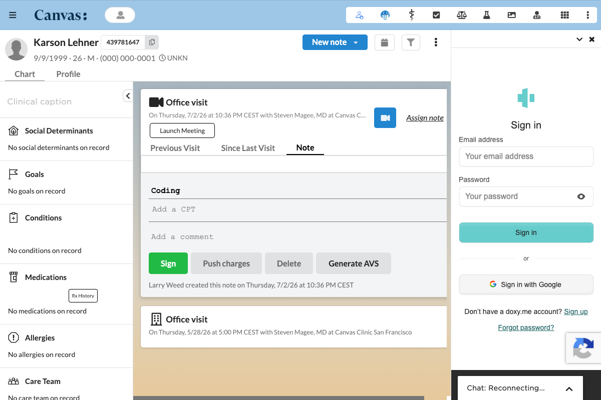

doxy_in_chart
===================

## What it does

Adds a "Launch Meeting" action button to telehealth notes that carry a doxy.me meeting link. Clicking it opens the doxy.me sign in page directly in the right pane of the patient chart, so the provider can host the visit and manage the waiting room without leaving Canvas.

## Problem it solves

Telehealth providers normally leave the chart to open their video tool in a separate browser tab, which breaks their flow and splits attention across two windows. This plugin brings the doxy.me host experience into the chart pane, next to the note the provider is already writing, so the video visit and the documentation sit side by side.

## Who it's for

Canvas customers who run telehealth visits on doxy.me and want providers to launch and host those visits from inside the patient chart.

## How to install

Install the plugin with the Canvas SDK command, replacing hostname with your environment.

```
canvas install doxy_in_chart --host <hostname>
```

No secrets are required. Providers sign in with their own doxy.me credentials.

## Configuration options

The plugin has no plugin level settings. Two things on the Canvas side affect it.

- The appointment needs a doxy.me link, either in the appointment `meeting_link` field or on the provider's `personal_meeting_room_link`. The button appears only when that link starts with `https://doxy.me/`.
- A native blue camera button may also show in the note header and open the link in a new tab. Hide it with the Canvas admin setting `HIDE_TELEHEALTH_BUTTON_IN_NOTE_HEADER` if you want only the in chart launch.

## Screenshots



## How it works

- On a telehealth appointment with a doxy.me link, the "Launch Meeting" button appears in the note header.
- Clicking it renders a full height iframe of the doxy.me sign in page in the right chart pane.
- The provider signs into doxy.me and becomes the host. Patients who open the same room link land in the waiting room, where the host admits them, all from the pane.
- Closing the pane or navigating away ends the session.

## Notes

- The provider signs into doxy.me once per session. There is no automatic host token, so the sign in is manual.
- doxy.me uses a waiting room. As the host, the provider sees patients arrive and admits them from the same pane.

## Testing

Run the test suite from the plugin root.

```
pytest
```
