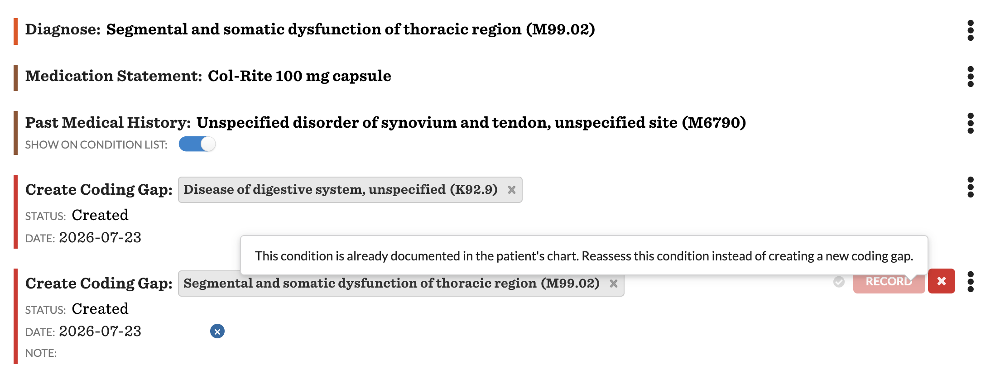
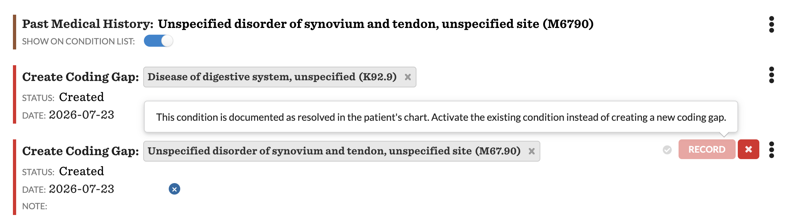
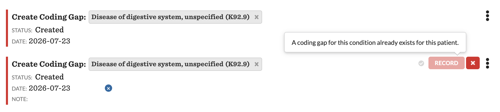

# Duplicate Coding Gap Validation

Blocks the creation of a coding gap for a condition that is already documented on the patient's chart.

## What it does

When a reviewer enters a **Create Coding Gap** command, this plugin reads the ICD-10 code(s) selected in the command's `diagnose` field and compares them against both the patient's committed conditions and their existing coding gaps. If the code is already present, the plugin blocks the commit and shows a message:

- Existing condition is **active**: *"This condition is already documented in the patient's chart. Reassess this condition instead of creating a new coding gap."*
- Existing condition is **resolved**: *"This condition is documented as resolved in the patient's chart. Activate the existing condition instead of creating a new coding gap."*
- An active **coding gap** already carries the code: *"A coding gap for this condition already exists for this patient."*

If the code is not already present (or the patient/code can't be resolved), the commit proceeds normally.

## Screenshots

Existing active condition — reviewer is told to reassess the existing condition:



Existing resolved condition — reviewer is told to reactivate the existing condition:



Existing coding gap — a coding gap for the code already exists for the patient:



## Problem it solves

Coding gaps that duplicate an already-documented condition create redundant work: the same condition gets surfaced, reassessed, and re-coded when it should instead be reassessed on the existing record. Catching the duplicate at entry keeps the problem list and coding-gap worklist clean and steers reviewers toward reassessing the existing condition.

## Who it's for

Coders, clinical reviewers, and prescribers who work coding gaps / suspected conditions, and practices that run risk-adjustment (HCC) workflows and want to avoid duplicate suspected-condition records.

## How to install

```
canvas install duplicate_coding_gap_validation
```

No SDK commands need to be enabled beyond the built-in coding-gap commands. See the limitation above regarding standalone-command validation.

## Configuration options

No configuration required. Matching is **exact ICD-10** (normalized to strip dots, spaces, and case) against both committed conditions and existing coding gaps. HCC-group (rather than exact-code) matching is a natural extension but is intentionally out of scope here.

## Handlers

### BlockDuplicateCodingGapHandler

Prevents committing a coding gap whose ICD-10 code is already documented as a committed condition on the patient's chart.

**Event:** `CREATE_CODING_GAP_COMMAND__POST_VALIDATION`

**Validation rule:** Extract the selected ICD-10 code(s) from the command's `diagnose` field (`_selected_icd10s`), then block the commit if any code either (a) matches a committed `Condition` on the patient — message differs for active-like vs. resolved — or (b) is already carried by an active coding gap — a `CODINGGAP`, non-deleted `DetectedIssue` in an active status, read from the patient's `detected_issues` reverse relation and its `evidence` codings. Matching is on the normalized code, so dotted/undotted formatting differences still match.

## Development

### Running tests

```bash
uv run pytest
```

### Test coverage

```bash
uv run pytest --cov=duplicate_coding_gap_validation --cov-report=term-missing
```

## File structure

```
duplicate_coding_gap_validation/
├── handlers/
│   ├── images/
│   │   ├── existing_active_condition.png
│   │   ├── existing_resolved_condition.png
│   │   └── existing_coding_gap.png
│   ├── __init__.py
│   └── duplicate_coding_gap_validation.py   # BlockDuplicateCodingGapHandler + helpers
├── CANVAS_MANIFEST.json
├── README.md
└── __init__.py
```
