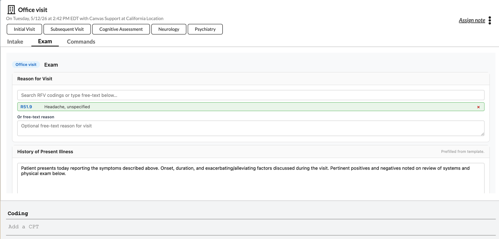
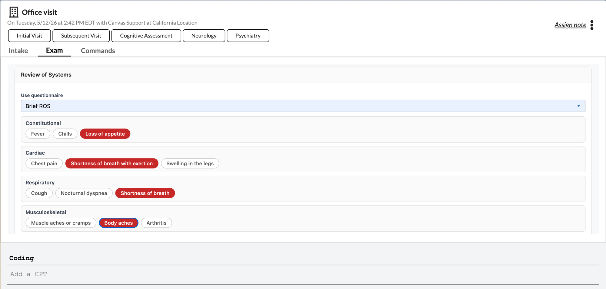
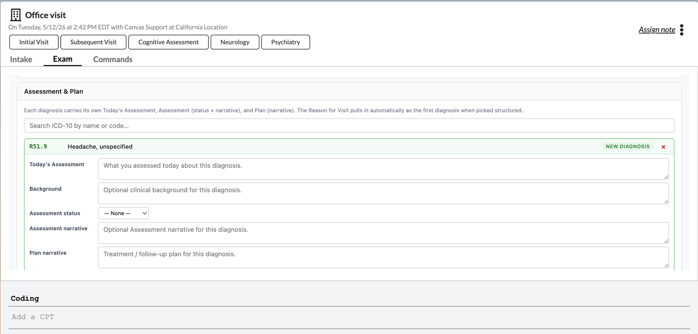
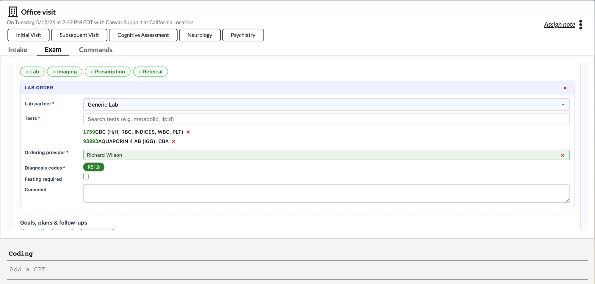
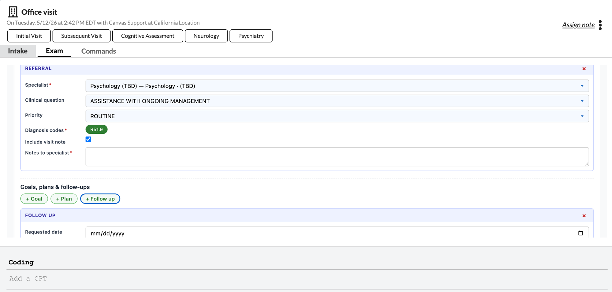
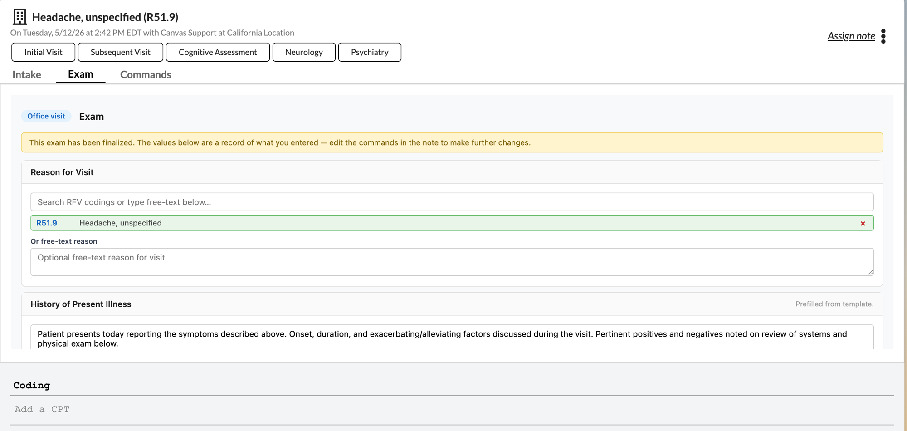
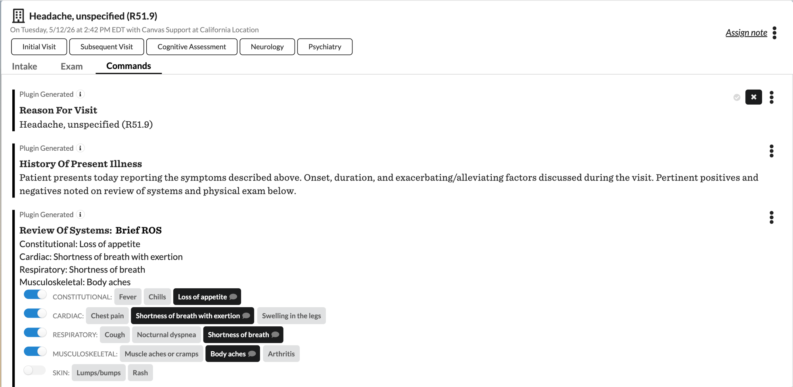

# Exam Chart App

## What it does

Adds an "Exam" tab to the note body. The provider completes Reason for Visit,
History of Present Illness, Review of Systems, Physical Exam, and Assessment &
Plan (with diagnoses and orders for labs, imaging, prescriptions, referrals,
goals, plan items, and follow-ups) in one guided form. Clicking "Finalize
Exam" emits the corresponding Canvas commands onto the note.

## Problem it solves

Providers complete encounter charting through ad-hoc patterns today — free-text
dictation, fragmented commands, no consistent way to drive HPI content from
the visit reason. This plugin gives the provider a single guided form whose
output is native Canvas commands, with HPI prefill keyed off the Reason for
Visit.

## Who it's for

- Primary user: MD / provider completing the encounter
- Secondary user (read-only context): MA who completes Intake before handoff

## How to install

```bash
canvas install exam-chart-app
```

After install, configure secrets at
`<instance>/admin/plugin_io/plugin/<plugin_id>/change/`.

## Configuration options

| Secret | Purpose | Default behavior if unset |
|---|---|---|
| `exam-note-types` | Comma-separated note-type keywords (case-insensitive substring match). | Tab shows on every note type. |
| `ros-questionnaire-code` | Pin a specific Review of Systems questionnaire by its `Questionnaire.code` value (overrides the default name-heuristic). | Plugin lists every active questionnaire whose name contains "review of systems" or "ros". |
| `pe-questionnaire-code` | Pin a specific Physical Exam questionnaire by `Questionnaire.code`. | Plugin lists every active questionnaire whose name contains "physical" or "exam". |
| `exam-imaging-codes` | One imaging-catalog entry per line, pasted verbatim from the chart's CPT typeahead so each label matches the instance's catalog character-for-character. | Bundled fallback catalog of common studies. |
| `icd10-search-url` | Base URL for the in-chart ICD-10-CM lookup used by the A&P diagnosis picker and Orders cards. Server-side validated: must be `https://`, must NOT point at `localhost` / loopback / RFC-1918 private ranges. Invalid values are rejected with a logged warning and the JS-side public default fires instead. | NLM Clinical Tables (`https://clinicaltables.nlm.nih.gov/api/icd10cm/v3/search`). Override for deployments behind egress proxies / strict CSP, or to point at a self-hosted ICD-10 mirror. |

### Customizing ROS / Physical Exam questionnaires

The Exam tab discovers ROS and Physical Exam questionnaires at runtime by
name match. On instances that ship the default Canvas questionnaire library,
this typically surfaces *Brief ROS* and *Standard ROS* in the ROS chooser
and *Brief Exam* and *Standard Exam* in the PE chooser. Practices that
author their own questionnaires (via the Canvas admin UI or a plugin
bundle) will see those appear in the dropdown as long as the questionnaire
is `status="AC"` (Canvas stores Questionnaire status as a 2-char code, not
the string `"active"`). To pin one specific questionnaire and hide the
others from the chooser, set the corresponding `*-questionnaire-code`
secret to its `Questionnaire.code` value.

### Extending the HPI prefill library

When the provider picks a Reason for Visit, the HPI textarea pre-fills
from a code-keyed template bundled at `templates/default_templates.json`.
The bundled file ships a generic `default` paragraph plus a couple of
worked examples (K21.9 GERD, M25.561 right knee pain) — every other
ICD-10 falls back to the generic template. To extend coverage, add
entries to `default_templates.json` keyed by ICD-10 code:

```json
"E11.9": {
  "hpi": "Patient with type 2 diabetes mellitus presents for...",
  "note": "",
  "letter": { "subject": "", "body": "" }
}
```

The `note` / `letter` fields are reserved for future use; HPI is the
only field the current plugin reads.

### Customizing the imaging-code catalog

The Imaging order card's dropdown lists CPT-coded studies from a
bundled catalog in `data/imaging_codes.py`. Each entry's `label` is a
verbatim copy of the chart's CPT-typeahead string for that code so the
chart can string-match it back to its internal catalog when the staged
Imaging command renders. Two consequences worth knowing:

1. If Canvas's chart-side typeahead phrasing drifts, a bundled label
   stops matching and the staged command renders with an empty
   "Image:" row. Set the `exam-imaging-codes` plugin secret to override
   the catalog — paste one entry per line, copied verbatim from your
   instance's CPT typeahead.
2. The catalog is best-effort by design. The bundled defaults cover
   common X-Ray / CT / MRI / Ultrasound studies but are not
   encyclopedic. Operators with narrower / broader imaging needs
   should override via the secret rather than editing the bundled
   list.

### Co-existing with other note-tab plugins

The plugin keeps its per-note state in `AttributeHub` under its own
namespace (`canvas__exam_chart_app`) and uses a persistent "ever finalized"
marker keyed by note UUID. The orphan-commands banner that fires when a
draft is wiped (typically a delete/undelete cycle) is scoped to this
marker, so commands emitted by other plugins on the same note do not
trigger it.

## Screenshots

### Reason for Visit + History of Present Illness



The provider picks an ICD-10 from the typeahead (or types a free-text reason). HPI prefills from a code-keyed template so common visit reasons start with a clinical paragraph rather than a blank textarea; the provider edits as needed.

### Review of Systems



The ROS section discovers the instance's ROS questionnaires at runtime (or pins one via the `ros-questionnaire-code` secret). Per-question toggle pills let the provider mark positives without keyboard input. Selected answers ride through to the `ReviewOfSystemsCommand`.

### Assessment & Plan



Each diagnosis carries its own Today's Assessment, Background, Assessment narrative, and Plan narrative. The Reason for Visit auto-becomes the first diagnosis when picked structured. New ICD-10s can be added or matched against the patient's existing active conditions (which surfaces an `AssessCommand` instead of a new `DiagnoseCommand`).

### Orders



Orders cards (Lab, Imaging, Prescription, Referral, Goal, Plan, Follow-up) sit under the same A&P block. The Lab card auto-completes from `LabPartner` and `LabPartnerTest`; ordering-provider dropdowns filter staff by `roles__role_type='PROVIDER'`.



Referrals pick a `ServiceProvider`; Follow-up uses free-text reason for visit to avoid the `ReasonForVisitSettingCoding` validation gate.

### Finalized exam (read-only)



Clicking "Finalize Exam" emits the matching Canvas commands and flips the form to read-only with an informational banner. Further edits go through the chart's normal command UI; the Exam tab keeps the draft state visible.

### Commands emitted onto the note



The same chart's Commands tab after finalize: Reason for Visit, History of Present Illness, and Review of Systems all rendered as native Canvas commands. The ROS toggles map one-to-one onto the command's question toggles.
