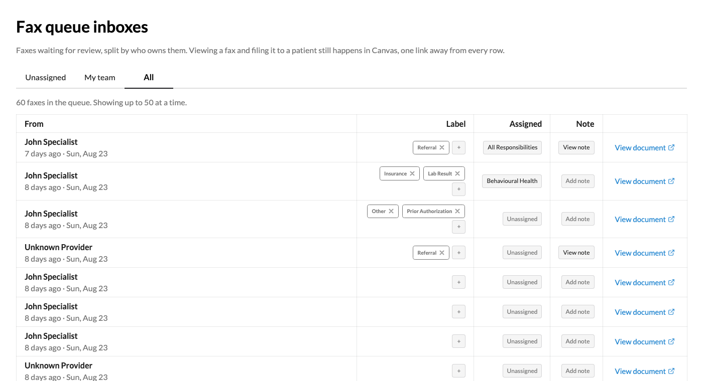

# Fax Queue Inboxes

A team organised dashboard over the inbound fax queue Canvas already has, adding
practice defined labels, a note and an assignment to each fax without changing
anything about how a fax is read or filed.

## What it does

Canvas receives inbound faxes as integration tasks and shows them on its Data
Integration screen. That screen is one long list. In a practice where several
people work the queue there is no way to say a fax belongs to the referrals team,
no way to leave a note for whoever picks it up next, and no way to see only what
is still unclaimed.

This plugin adds a screen in the left hand menu with three tabs, Unassigned, My
team and All. Each row shows who the fax came from and how long it has been
waiting, the labels on it, who it is assigned to, its note, and a link into the
native screen where the fax is actually read and filed.

Everything on a row is editable in place. Labels are chips with a plus beside
them that offers only the labels the fax does not already carry. The assignee is
a searchable dropdown over the practice's teams and staff. The note opens where
it stands and saves without a reload.

The plugin never reads, renders, files or junks a fax. Viewing a document and
filing it to a patient stay in Canvas, one link away from every row, which is
what keeps a clinical record's own workflow untouched.

## Problem it solves

An inbound fax queue with more than one person working it turns into a race.
Two people open the same referral, a fax nobody recognises sits for a week
because it belongs to nobody, and the context somebody worked out on the phone
lives in their head rather than beside the fax.

Assignment, labels and a note fix all three, and none of them exist on the
native screen. The plugin adds them beside the queue rather than replacing it,
so the triage decision is captured where it happens and the clinical work
carries on where it always did.

## Who it's for

Front desk and referral coordinators who work an inbound fax queue daily, and
practices where more than one person shares that queue and needs to see which
faxes are already claimed.

## What it responds to

Nothing. The plugin subscribes to no events and runs no cron. It is a staff
facing surface and the API behind it, so every action is a request a person
made.

## Components

| Kind | Class | What it does |
|---|---|---|
| Application, `provider_menu_item` | `handlers.application:FaxQueueDashboard` | Puts the dashboard in the left hand menu and opens it as a page |
| SimpleAPI, `StaffSessionAuthMixin` | `handlers.api:FaxQueueAPI` | Serves the page, its two design system assets, and the twelve JSON routes behind it |
| `CustomModel` | `models.practice_label:PracticeLabel` | The practice's own label list |
| `CustomModel` | `models.fax_label:FaxLabel` | One row per label placed on a fax, with who set it and when |
| `CustomModel` | `models.fax_record:FaxRecord` | The note and the assignment the plugin holds for a fax |
| `ModelExtension` proxies | `models.proxies` | Private targets so the custom models can point at Canvas rows |

Every one of the fifteen routes sits behind `StaffSessionAuthMixin` at class
level, including the page itself, so nothing answers without a staff session.

## How to install

```bash
canvas install fax_queue_inboxes --host <your-instance>
```

The plugin owns a custom data namespace and Canvas generates its access key when
that namespace is first created. Nothing needs to be set by hand on a first
install.

**Before you ever uninstall, save the namespace keys.** Uninstalling deletes a
plugin's secrets, including `namespace_read_access_key` and
`namespace_read_write_access_key`, while the namespace and every label, note and
assignment in it survive. Because the namespace still exists, reinstalling does
not regenerate those keys, so the plugin comes back unable to read its own data
and the failure is silent until something touches it. Copy both values out of
the Canvas admin UI first, and set them back after the reinstall.

## Configuration options

One variable, and the system sets it.

| Variable | Sensitive | What it is |
|---|---|---|
| `namespace_read_write_access_key` | no | Generated by Canvas when the namespace is created, and how the plugin reaches its own data |

No secrets to obtain, no external service, no environment variables, and no
settings screen. The label list is administered through the plugin's own label
routes rather than through a settings page, so a shared vocabulary cannot grow
by accident while somebody is working the queue.

## Data it holds, and where

Everything the plugin stores lives in its own custom data namespace and nothing
is written onto a Canvas clinical record. Labels, notes and assignments are the
plugin's, and the fax, the document and the native review are Canvas's.

The plugin reads the queue through the SDK in process. It makes no outbound HTTP
call and uses no FHIR client.

## Tests

```bash
cd fax-queue-inboxes
uv run pytest
```

## Known limitations

- **The first column can only show what a fax actually carries.** Canvas does
  not populate an inbound fax's title or type, all three ingestion paths write
  the service provider and the document and nothing else, so the column leads
  with the resolved sender and the arrival time instead. A fax whose sender
  Canvas could not match reads as Unknown Provider, which is the native screen's
  own behaviour rather than something added here.
- **The sending fax number is out of reach.** It lives on the fax row, for which
  the SDK ships no model, so no plugin can read it.
- **A label is the plugin's own and Canvas does not see it.** Labels never
  suggest or set a native document type, deliberately, because a wrong
  categorisation on a clinical document is worse than none.

## Screenshots or screen recordings



The All tab, showing the whole pending queue. Each row leads with who the fax
came from and how long it has been waiting, then its labels as chips with a
plus that offers only the ones it does not already carry, who it is assigned
to, whether somebody has written a note on it, and the link into the native
Data Integration screen where the document is actually read and filed. A fax
whose sender Canvas could not resolve reads as Unknown Provider, matching the
native screen rather than inventing a lookup of its own.

## Info

*This plugin was developed and contributed by [Vicert](https://vicert.com).*
Contact: engineering@vicert.com
