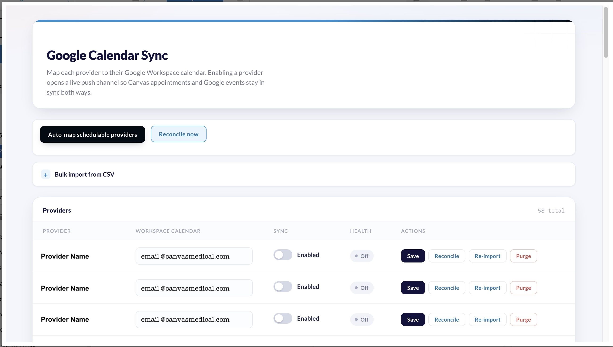

# gcal-sync — two-way Google Calendar sync for Canvas

Two-way sync between Canvas appointments and providers' Google Workspace calendars. Canvas
appointments and provider **admin blocks** (lunch/PTO) are pushed into providers' Google calendars in
near-real-time, and provider-created Google events are imported back into Canvas as admin holds that
block availability. **Canvas remains the system of record.**

## Problem it solves

Providers often keep personal availability — PTO, lunch, external meetings — in Google Calendar, while
Canvas owns clinical scheduling. Without sync the two drift: Canvas shows a provider as available when
they are actually blocked in Google, which leads to double-booking. gcal-sync keeps both directions
aligned automatically so a provider's availability in Canvas reflects their real calendar.

## Who it's for

Practices on Google Workspace whose providers manage availability in Google Calendar and want it
reflected in Canvas scheduling (and vice versa) without manual double-entry.

## What it does

| Component | Class | Purpose |
|---|---|---|
| Push sync | `gcal_sync.handlers.appointment_sync:AppointmentSyncHandler` | On appointment events, push to Google. |
| Webhook | `gcal_sync.routes.webhook:GoogleWebhook` | Receives `events.watch` pings; pulls the delta. |
| Channel renewal | `gcal_sync.handlers.channel_renewal:ChannelRenewalCron` | Renews watch channels before expiry. |
| Reconciliation | `gcal_sync.handlers.reconciliation:ReconciliationCron` | Daily catch-up; sync-token recovery. |
| Block sweep | `gcal_sync.handlers.block_sweep:BlockSweepCron` | Every 15 min, push admin blocks (Calendar events). |
| Admin | `gcal_sync.applications.google_calendar_admin:GoogleCalendarAdmin` | Map staff→calendar; sync health; per-provider reconcile / re-import / purge. |

Provider-created Google events are imported as admin holds (`ScheduleEvent`). Private/confidential
events can be imported with their title masked to "Busy" — no event details from Google are written
into Canvas beyond time and a generic label. Canvas-wins by default: edits made to a Canvas
appointment from the Google side are reverted unless explicitly allow-listed.

## Installation

```bash
canvas install gcal_sync
```

Then complete the one-time setup below.

## Configuration (secrets)

| Secret | Notes |
|---|---|
| `GOOGLE_SERVICE_ACCOUNT_JSON` | Workspace service-account key (domain-wide delegation). |
| `GOOGLE_CALENDAR_WEBHOOK_TOKEN` | Shared token validated on each watch ping (fail-closed). |
| `GOOGLE_WEBHOOK_BASE_URL` | Public origin Google posts to, e.g. `https://<your-instance>.canvasmedical.com`. |
| `ADMIN_STAFF_IDS` | Comma-separated Canvas staff ids allowed to use the admin app. Empty = no access. |
| `SCHEDULE_EVENT_NOTE_TYPE_CODE` | Optional. Note type for imported holds (default: Generic event `272379006`). |
| `EXCLUDED_BLOCK_TITLES` | Optional. Block titles NOT to sync (default `Buffer,Lead Time`). |
| `INGEST_PRIVATE_EVENTS` | Optional, default true. Import private/confidential Google events (name masked to "Busy"). |
| `INGEST_ALL_DAY_EVENTS` | Optional, default false. Import all-day Google events as holds. |
| `GOOGLE_TO_CANVAS_ALLOWED_CHANGES` | Optional, default empty (Canvas-wins; appointment edits in Google are reverted). |
| `namespace_read_write_access_key` | Auto-generated by Canvas for the `gcal_sync` namespace. Do not set. |

## One-time setup

Create a Google Workspace service account with domain-wide delegation for scope
`https://www.googleapis.com/auth/calendar`, confirm the Workspace BAA covers Calendar, set the secrets
above, then in the admin app use **Auto-map schedulable providers** to enroll providers and open watch
channels. The nightly reconciliation and channel-renewal crons handle the initial import and keep
watch channels alive.

## Custom data

Uses the `gcal_sync` namespace (`custom_data` in the manifest) for its mapping and sync-state tables.

## Screenshots

The admin application (app drawer → **Google Calendar Admin**) provides the staff↔calendar mapping
table, a sync-health view, and per-provider reconcile / re-import / purge controls.



## Running tests

```bash
uv run pytest tests/
```
