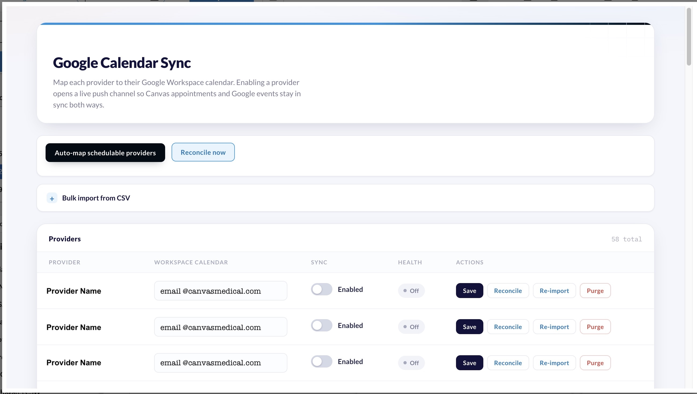

# gcal-sync — two-way Google Calendar sync for Canvas

Two-way sync between Canvas appointments and providers' Google Workspace calendars. Canvas
appointments and provider **admin blocks** (lunch/PTO) are pushed into providers' Google calendars in
near-real-time, and provider-created Google events are imported back into Canvas as admin holds that
block availability. **Canvas remains the system of record.**

## Problem it solves

Providers often keep personal availability — PTO, lunch, external meetings — in Google Calendar, while
Canvas owns clinical scheduling. Without sync the two drift: Canvas shows a provider as available when
they are actually blocked in Google, which leads to double-booking. gcal-sync keeps both directions
aligned automatically so a provider's availability in Canvas reflects their real calendar.

## Who it's for

Practices on Google Workspace whose providers manage availability in Google Calendar and want it
reflected in Canvas scheduling (and vice versa) without manual double-entry.

## What it does

| Component | Class | Purpose |
|---|---|---|
| Push sync | `gcal_sync.handlers.appointment_sync:AppointmentSyncHandler` | On appointment events, push to Google. |
| Webhook | `gcal_sync.routes.webhook:GoogleWebhook` | Receives `events.watch` pings; pulls the delta. |
| Channel renewal | `gcal_sync.handlers.channel_renewal:ChannelRenewalCron` | Renews watch channels before expiry. |
| Reconciliation | `gcal_sync.handlers.reconciliation:ReconciliationCron` | Daily catch-up; sync-token recovery. |
| Block sweep | `gcal_sync.handlers.block_sweep:BlockSweepCron` | Every 15 min, push admin blocks (Calendar events). |
| Reimport drain | `gcal_sync.handlers.reimport_drain:ReimportDrainCron` | Drains the "Re-import all" queue, rebuilding a few providers per tick. |
| Outbound backfill | `gcal_sync.handlers.outbound_backfill:OutboundBackfillDrainCron` | Paced drain of Canvas→Google backfill for new/missed providers. |
| Admin | `gcal_sync.applications.google_calendar_admin:GoogleCalendarAdmin` | Map staff→calendar; sync health; per-provider reconcile / re-import / purge / dry-run. Fleet-level re-import all and cancel controls. |

Provider-created Google events are imported as admin holds (`ScheduleEvent`). Private/confidential
events can be imported with their title masked to "Busy" — no event details from Google are written
into Canvas beyond time and a generic label. Canvas-wins by default: edits made to a Canvas
appointment from the Google side are reverted unless explicitly allow-listed.

## Installation

```bash
canvas install gcal_sync
```

Then complete the one-time setup below.

## Configuration (secrets)

| Secret | Notes |
|---|---|
| `GOOGLE_SERVICE_ACCOUNT_JSON` | Customer-provided service-account JSON key (from their GCP project, with domain-wide delegation). |
| `GOOGLE_CALENDAR_WEBHOOK_TOKEN` | Shared token validated on each watch ping (fail-closed). |
| `GOOGLE_WEBHOOK_BASE_URL` | Public origin Google posts to, e.g. `https://<your-instance>.canvasmedical.com`. |
| `ADMIN_STAFF_IDS` | Comma-separated Canvas staff ids allowed to use the admin app. Empty = no access. |
| `SCHEDULE_EVENT_NOTE_TYPE_CODE` | Optional. Note type for imported holds (default: Generic event `272379006`). |
| `EXCLUDED_BLOCK_TITLES` | Optional. Block titles NOT to sync (default `Buffer,Lead Time`). |
| `INGEST_PRIVATE_EVENTS` | Optional, default true. Import private/confidential Google events (name masked to "Busy"). |
| `INGEST_ALL_DAY_EVENTS` | Optional, default false. Import all-day Google events as holds. |
| `namespace_read_write_access_key` | Auto-generated by Canvas for the `gcal_sync` namespace. Do not set. |

## One-time setup

### Google Workspace admin setup

Your Google Workspace Administrator will need to:

1. **Create a service account in Google Cloud Console**
   1. Go to [console.cloud.google.com](https://console.cloud.google.com) and
      [create a new project](https://console.cloud.google.com/projectcreate?pli=1)
      (e.g. "Canvas Calendar Sync").
      - Enable the API: APIs & Services → Library → search
        "[Google Calendar API](https://console.cloud.google.com/apis/library/calendar-json.googleapis.com)"
        → click Enable.
      - Create the identity: IAM & Admin → Service Accounts →
        [Create service account](https://console.cloud.google.com/iam-admin/serviceaccounts/create).
        1. Name it something clear (e.g. `canvas-calendar-sync`).
        2. Generate associated key (should be a JSON file). This becomes the
           `GOOGLE_SERVICE_ACCOUNT_JSON` plugin secret.
        3. Note the associated Unique ID — this is the "Client ID" used in the next step.

2. **Authorize it for your Workspace (Google Admin Console)**
   1. Go to [admin.google.com](https://admin.google.com) (must be signed in as a Super Admin).
   2. Navigate to Security → Access and data control → API controls → Domain-wide delegation →
      Manage Domain Wide Delegation.
   3. Add new and enter:
      - **Client ID:** the Unique ID from step 1 above.
      - **OAuth scopes:** `https://www.googleapis.com/auth/calendar`

### Plugin secrets

Configure these secrets in the plugin settings on your Canvas instance:

| Secret | Value |
|---|---|
| `GOOGLE_SERVICE_ACCOUNT_JSON` | Paste the full JSON key file from step 1 above. |
| `GOOGLE_CALENDAR_WEBHOOK_TOKEN` | A randomly generated string used to verify webhook pings from Google. |
| `GOOGLE_WEBHOOK_BASE_URL` | Your Canvas instance URL, e.g. `https://<your-instance>.canvasmedical.com`. |
| `ADMIN_STAFF_IDS` | Comma-separated Canvas staff keys for who can manage the sync admin app. |

### Map providers to calendars

Open the "Google Calendar Sync" app from the left sidebar. Three options:

- **Auto-map** — maps every active staff member with a Provider role to their Canvas staff email
  (`google_admin.py:auto_map`). Best when provider staff emails match their Workspace calendar
  emails.
- **Bulk CSV import** — paste a CSV with emails in the first column
  (`google_admin.py:bulk_import`). The plugin matches each email to a Canvas staff profile. Use
  this when providers use a different calendar email than their Canvas staff email.
- **Individual mapping** — set each provider's calendar email one at a time.

When a mapping is saved as active, the plugin opens a Google `events.watch` channel for that
calendar (`google_admin.py:_open_channel_best_effort`), enabling near-real-time inbound sync.

The admin UI shows sync health per provider: whether a watch channel is active, when the last
outbound sync ran, and how many events are tracked. The nightly `ReconciliationCron` and
`ChannelRenewalCron` handle catch-up and keep watch channels alive automatically.

### Multi-domain note

The service account and delegation are per Google Workspace domain. If different partners or
locations use separate Workspace domains, each domain's admin must complete Steps 1–2 independently
with their own GCP project and JSON key file.

### How auth works under the hood

The plugin holds one service-account key and, for each provider, mints a short-lived RS256 JWT
that impersonates that provider (`sub = provider@example.com`) and exchanges it for an access token
via the JWT-bearer grant (`auth.py:GoogleAuth.get_access_token`). Tokens are cached per provider
for just under their 1-hour lifetime so bursts of appointment events don't mint a token per event.
No per-user refresh tokens are stored or rotated.

### What syncs and what doesn't

**Outbound (Canvas → Google):**
- Appointment create/update/cancel/reschedule (via `AppointmentSyncHandler`)
- Admin schedule blocks like lunch/PTO (via `BlockSweepCron`, every 15 min)
- Does NOT push Canvas `schedule_events` (availability/bookable windows) — those are Canvas-only

**Inbound (Google → Canvas):**
- Provider-created Google events become admin holds on the Canvas schedule
- Near real-time via webhook push notifications + daily reconciliation
- Private events imported with title masked to "Busy" (configurable via `INGEST_PRIVATE_EVENTS`)
- Canvas-wins by default: edits to a Canvas appointment from Google are reverted

### Troubleshooting

If the sync returns 401 errors after deployment, delegation was not configured (or was configured on
the wrong domain). The token exchange in `auth.py:_exchange()` surfaces Google's error body in the
plugin logs to make this diagnosable.

## Custom data

Uses the `gcal_sync` namespace (`custom_data` in the manifest) for its mapping and sync-state tables.

## Screenshots

The admin application (app drawer → **Google Calendar Admin**) provides the staff↔calendar mapping
table, a sync-health view, and per-provider reconcile / re-import / purge controls.



## Running tests

```bash
uv run pytest tests/
```
