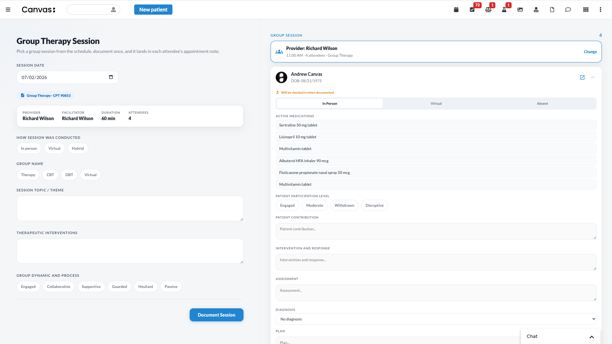
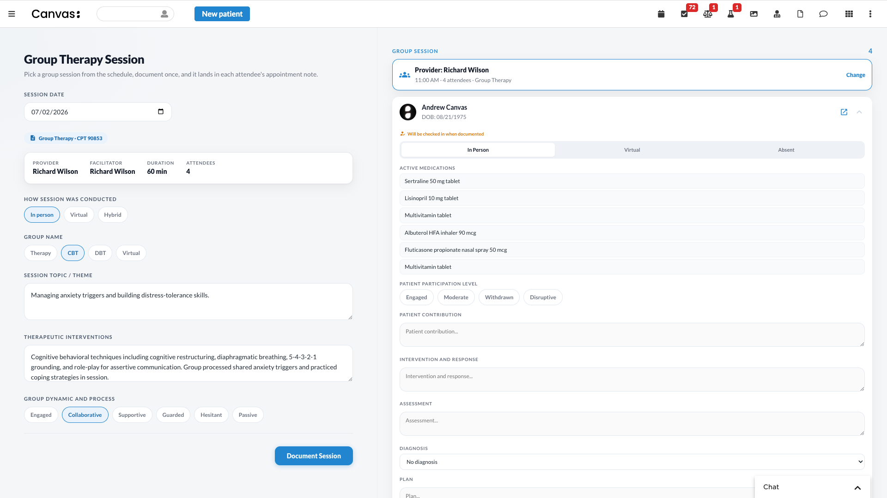
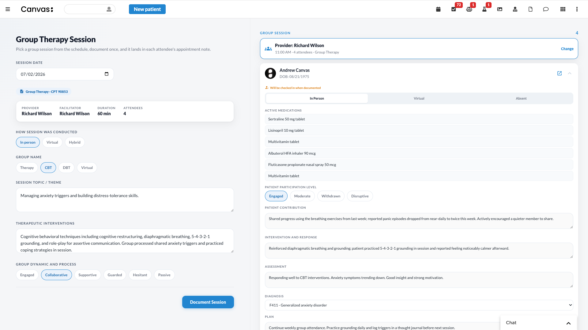
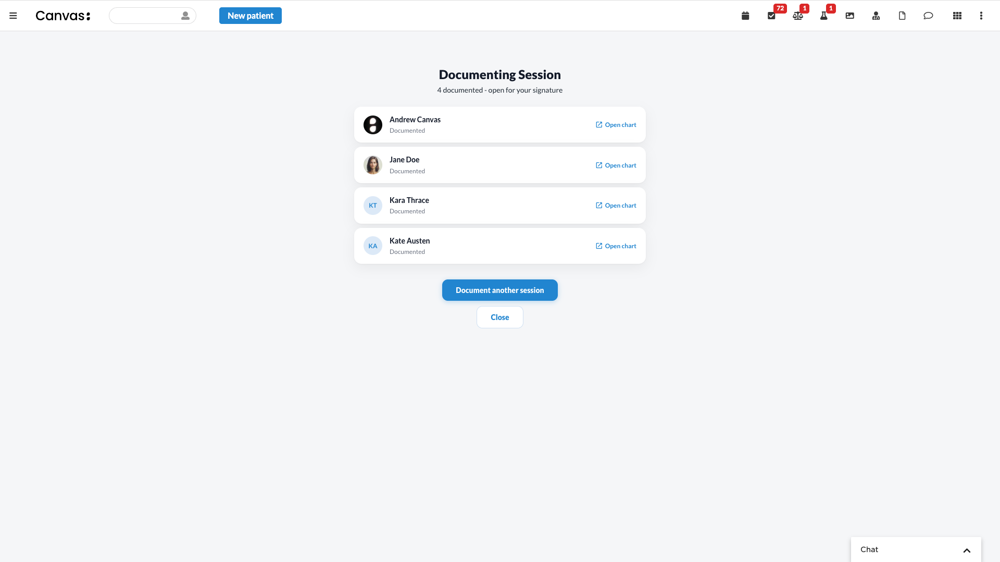

# Group Therapy

Document a group therapy session once and land individual, billed documentation in every attendee's chart - in their existing appointment note for that day, not a new free-floating note.

## What it does

The roster comes from the schedule, not from manual search. A **group session** is the set of appointments that share the **same provider + the exact same start time** and carry the **Group Therapy** reason for visit. The documenter picks a date, picks one of that day's group sessions, and the plugin documents the session once into every attendee's existing appointment note.

- The roster and each attendee's target note come straight from the scheduled appointments - no search, no appointment creation.
- Assesses each patient's **own active diagnosis** (no new diagnosis is created); the provider picks when a patient has more than one.
- Bills the group CPT once per attendee (per-participant) or as a single group charge - configurable.
- Absent attendees are marked **no-show** on their appointment note.
- Scheduled (not-yet-checked-in) appointments are **checked in automatically** when documented.
- Documentation is left **open for the provider to sign** (the plugin commits, it does not auto-sign).
- An attendee whose appointment note is already signed/locked is shown but skipped (you can't document into a locked note).
- The session's **provider is shown** in the documentation area. If the person documenting is not that provider (an assistant or support staff), they must acknowledge that the audit log will record the documentation under their own name.

## The problem

Providers who run group therapy sessions face repetitive documentation: after each session they open every patient's chart and re-enter the same note, diagnosis, and billing. Documenting per chart is slow and error-prone, and notes created outside the visit aren't tied to the day's scheduled appointment. This plugin documents the whole group in one pass, into each attendee's real appointment note.

## Who it's for

Behavioral health providers (and the assistants or support staff documenting on their behalf) running scheduled group sessions - skills groups, ADHD, addiction recovery, grief, and similar.

## Demo

A full session documented end to end - pick the date and session, fill the shared group fields once, document each attendee, and submit:

[▶ Watch the demo](https://www.loom.com/share/8a411b5301eb4dcb8c6067c41da64159)

| | |
|---|---|
|  |  |
|  |  |

## How it works

1. **Open the app** from the Canvas apps menu (global, not inside a chart).
2. **Pick the date** (defaults to today). The plugin lists that day's group sessions - each shown as time, provider, and patient count.
3. **Pick the session** you are documenting. The roster loads from its appointments; each attendee's existing appointment note is the documentation target.
4. **Document once** - fill the shared session sections from the configured template (how conducted, group name, topic, interventions, group dynamic). Per attendee, mark In Person / Virtual / Absent, pick a diagnosis if there is more than one, and fill the per-patient sections.
5. **Document Session** - lands the summary + diagnosis + billing into each attendee's appointment note (one pass), checking in any still-booked appointments first; absentees are marked no-show. Notes are left open for the provider to sign.

A patient with no appointment in that slot simply isn't in the group - schedule them first if needed.

## Installation

```
canvas install group_therapy --host <your-instance>
```

Set the admin variable so designated staff can open the **Group Therapy Setup** page (see Configuration):

```
canvas config set --host <your-instance> group_therapy ADMIN_STAFF_KEYS="<staff-key>,<staff-key>"
```

**Required Waffle switch.** The session summary renders via the `groupTherapyNote` custom command, gated by a Django Waffle switch (the same per-command pattern as `assess`, `prescribe`, etc.). Confirm this switch is **Active** in Django Admin under Waffle -> Switches (`/admin/waffle/switch/`):

```
commands-sdk:commands:groupTherapyNote:enabled
```

## Configuration

Templates (sections, shared/per-patient, questionnaire mappings, RFV codes, CPT, billing mode) are **admin-configurable** in the "Group Therapy Setup" app and stored in `custom_data` (namespace `canvas_medical__group_therapy`). On first install the config is seeded with **one portable, code-free Group Therapy template** (RFV `Group_Therapy`, CPT `90853`, per-participant billing); an admin edits it - or adds more templates and maps sections to this instance's questionnaire codes - in the Setup app afterward.

| Variable | Purpose |
|----------|---------|
| `ADMIN_STAFF_KEYS` | Comma-separated staff keys allowed to open **Group Therapy Setup**. **Fails closed:** if unset/blank, no one can open Setup (documentation still works on the seeded template). Not editable from the UI. |
| `namespace_read_write_access_key` | Auto-generated by Canvas on first install; grants the plugin read/write to its custom-data namespace. Not set by hand. |

## Running tests

```
uv run pytest tests/
```
