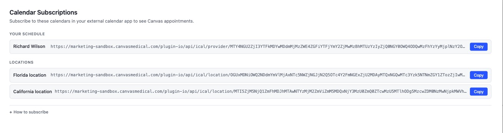

# Calendar Subscriptions (ical)

## What it does

This plugin lets providers subscribe to their Canvas appointments from any
external calendar app (Google Calendar, Apple Calendar, Outlook, and any
other client that supports the iCalendar `.ics` subscription format). It
publishes a personal calendar feed for the logged-in provider and a feed for
each active practice location. The feeds include event title, location,
start time, duration, organizer name and email, and appointment status. They
do not include patient identifiers or any clinical detail.

## Problem it solves

Providers commonly maintain a personal calendar outside Canvas (Google,
Apple, Outlook) for personal commitments and external meetings. Without an
integration, they have to context-switch between Canvas and that calendar,
or manually copy appointments back and forth. This plugin gives each
provider a single subscribable URL that keeps their Canvas schedule
automatically reflected in whichever calendar app they already live in.

## Who it's for

- Providers and care teams in any specialty who keep an external personal
  calendar alongside Canvas
- Practices coordinating around shared physical locations who want a
  read-only location-level view of upcoming appointments
- Operations and front-desk staff who need to see a location's schedule in a
  shared calendar tool

## How to install

From a checkout of the plugin source:

```bash
canvas install ical --host=<your-instance>
```

After install, set the plugin secret described in **Configuration** below
before clicking the Calendar Links application.

## Configuration

Set the plugin secret
`CALENDAR_LINK_SALT__EXISTING_LINKS_BECOME_INVALID_IF_CHANGED` to a random
high-entropy string. This salt is mixed into the per-provider and
per-location calendar URLs so subscription URLs cannot be guessed or forged
from a known provider ID.

Generate a good value with:

```bash
python -c "import secrets; print(secrets.token_hex(32))"
```

As the secret name implies, rotating the salt invalidates every existing
subscription. Subscribed providers will need to remove and re-add their
calendar.

## Use

Once the plugin is installed and the salt secret is set, logged-in staff can
either:

1. Click the **Calendar Links** application from the schedule page, or
2. Visit `<your-canvas-url>/plugin-io/api/ical/calendars` directly

Either entry point opens a modal listing the staff member's personal
calendar URL and a URL for each active practice location. The provider
copies the URL of the calendar they want to subscribe to and pastes it into
their calendar app's "Add by URL / subscribe to calendar" flow.

## Screenshots

The Calendar Links modal lists the logged-in staff member's personal
calendar URL and a URL for each active practice location, with a Copy
button next to each.


