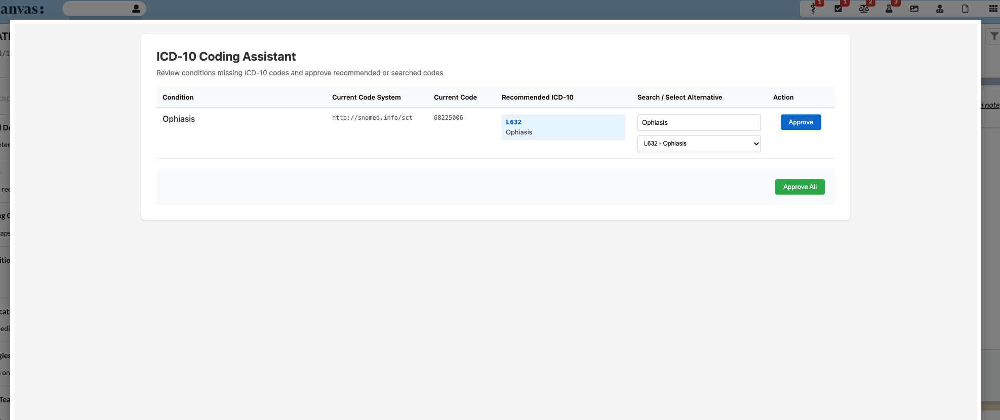

# ICD-10 Coding Assistant

A Canvas plugin that helps providers quickly find and attach ICD-10 codes to active patient
conditions that only have SNOMED or other non-ICD-10 codings.

## What it does

- **Notification badge** — A patient-specific Application icon appears on every patient chart.
  The badge count reflects how many active conditions are missing an ICD-10 code. When all
  conditions are coded, the badge disappears.
- **Coding UI** — Clicking the icon opens a centered modal listing all uncoded conditions,
  fetching recommended ICD-10 codes from the platform ontologies service, and letting the
  provider approve individual conditions or all at once with a single click.
- **Bulk staging** — Each approval (or "approve all") creates a single Chart Review note with
  one `UpdateDiagnosisCommand` per condition, giving a clean audit trail.
- **Assess guard** — A validation protocol blocks committing an assess command when the target
  condition has no ICD-10 coding, prompting the provider to fix the coding first.
- **Auto-repoint** — After an UpdateDiagnosis command is committed, any open staged assess
  commands referencing the old condition are automatically re-pointed to the new condition.

## Problem it solves

Conditions imported from external systems or captured via SNOMED often lack an ICD-10 code — the
coding that billing and claims require. Today a provider has to notice the gap, open each
condition, look up an equivalent ICD-10 code, and update the diagnosis one at a time. This plugin
surfaces every uncoded active condition in one place, recommends ICD-10 codes automatically, and
stages all the fixes in a single Chart Review note — turning a manual, easy-to-miss chore into a
one-click bulk action.

## Who it's for

Providers and clinical/coding staff in any specialty who are responsible for keeping a patient's
problem list billable — especially where conditions are bulk-imported (migrations, integrations)
and arrive without ICD-10 codes.

## Components

| Class | Type | Purpose |
|---|---|---|
| `ICD10CodingApplication` | Application (patient_specific) | Badge + modal launch |
| `ICD10CodingAPI` | SimpleAPI | Conditions list, search, approve endpoints |
| `ICD10FrontendAPI` | SimpleAPI | Serves HTML/JS/CSS UI |
| `AssessConditionValidation` | BaseProtocol | Blocks assess without ICD-10 |
| `UpdateAssessAfterChangeDiagnosis` | BaseProtocol | Re-points assess after diagnosis change |

## Prerequisites

1. A **Chart Review** note type (`category="review"`, `is_active=True`) must be configured.
2. At least one **active PracticeLocation** must exist.

ICD-10 recommendations and search are served by the platform **ontologies service**, which the
plugin reaches through the SDK's `ontologies_http` client. This requires no setup — the plugin
runner is provisioned with the ontologies endpoint and credentials in every environment, so the
lookups work identically in local, staging, and production.

> **The `coding_lookup` plugin is no longer required.** Earlier versions of this plugin called
> `coding_lookup` over HTTP (using a public `*.canvasmedical.com` URL and an API key) to look up
> ICD-10 codes. It now queries the ontologies service directly via `ontologies_http` — the same
> backend `coding_lookup` wrapped — so `coding_lookup` does **not** need to be installed for this
> plugin to function. If it was only installed to support this plugin, it can be removed (confirm
> no other plugins depend on it first).

## Configuration options

None — the plugin works out of the box:

- **Secrets** — none required. ICD-10 lookups use the platform ontologies service via
  `ontologies_http`, which the runner authenticates automatically.
- **Settings / thresholds** — none. All active, non-surgical conditions missing an ICD-10 code
  are surfaced; there is nothing to tune.

## Installation

```sh
canvas install --organization <org> --environment <env>
```

No post-install configuration is required.

## How it works in practice

1. Provider opens a patient chart. If any active, non-surgical conditions lack an ICD-10 code,
   the ICD-10 Coding Assistant icon shows a badge with the count.
2. Provider clicks the icon. A centered modal lists all uncoded conditions with:
   - Current coding system and code
   - Top recommended ICD-10 codes (from the platform ontologies service)
   - A search box to find alternative codes
3. Provider clicks "Approve" per condition (or "Approve All") to stage a Chart Review note
   with the selected ICD-10 code applied via `UpdateDiagnosisCommand`.
4. Provider records (commits) the Chart Review note to finalize the ICD-10 assignments.

## Screenshots



_The assistant open on a patient chart: each active condition missing an ICD-10 code is listed
with its current coding, the recommended ICD-10 code, a search box for alternatives, and per-row
and bulk approve actions._

<!-- TODO before publishing: capture this from the centered modal (the layout changed from the
right chart pane) and commit it as assets/screenshot-coding-modal.png. -->
