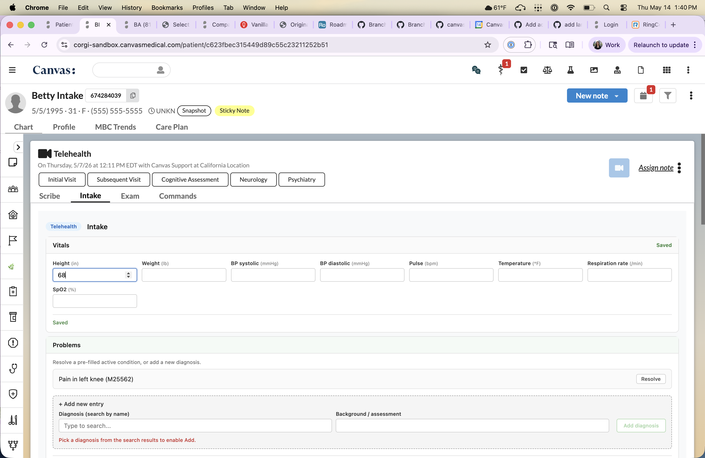
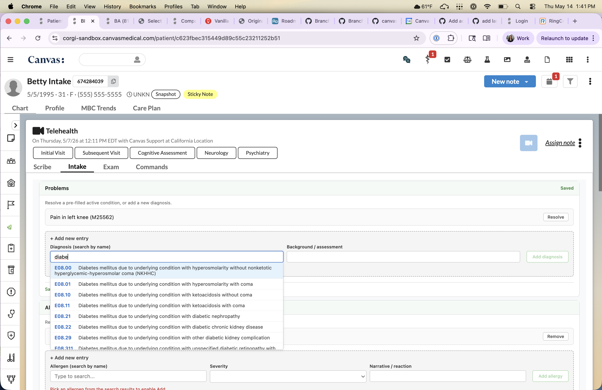
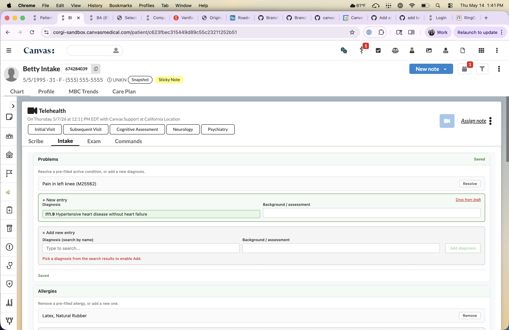
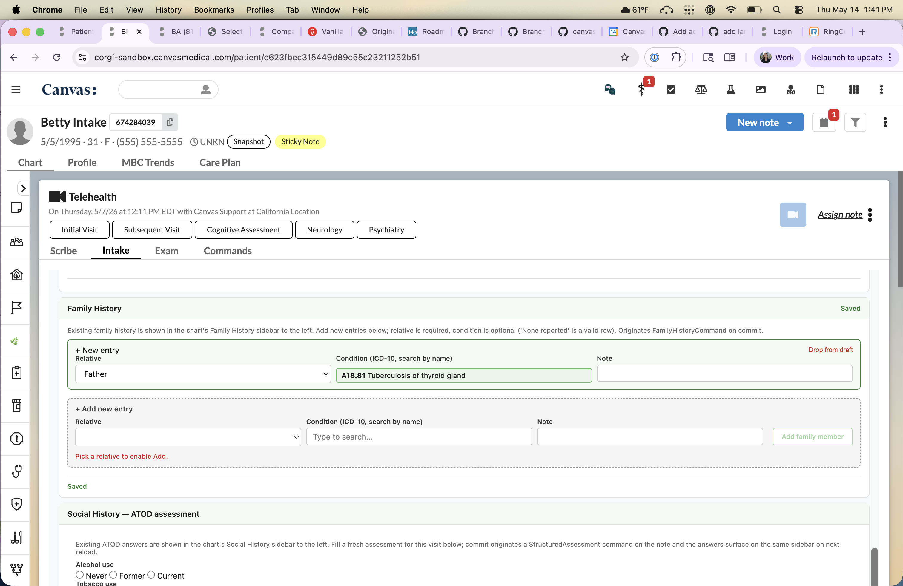
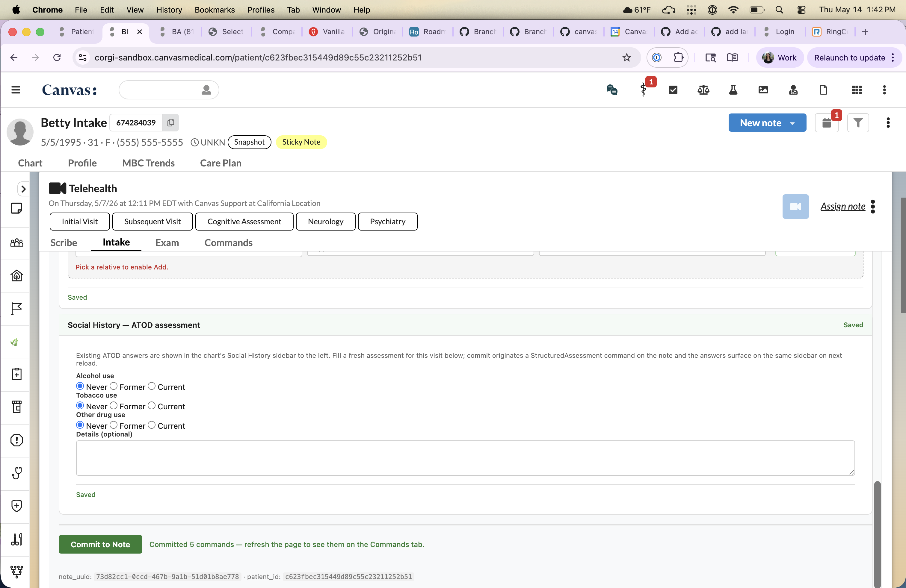
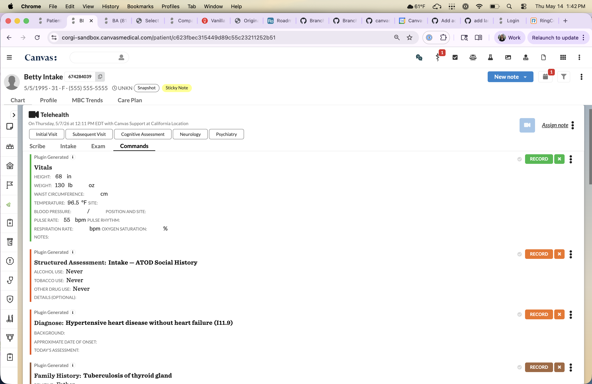
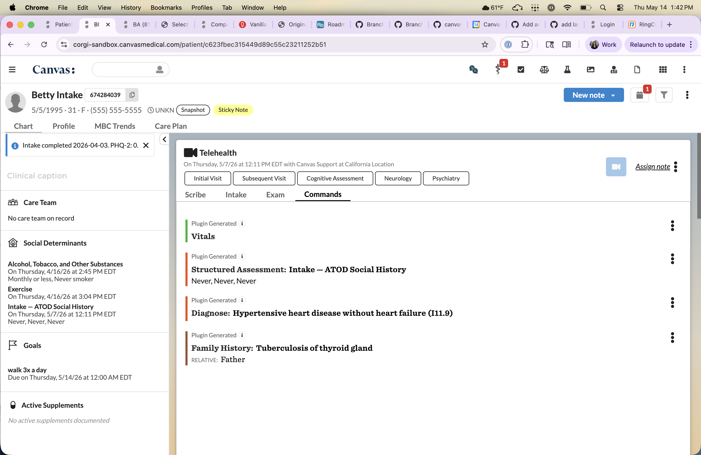

intake_chart_app
================

## What it does

Adds an "Intake" tab on the note body. Medical assistants capture all eight standard intake sections (Vitals, Problems, Allergies, Medications, Past Medical History, Surgical & Procedure History, Family History, Social History) in one guided form, save drafts as they go, and commit them as native Canvas commands when the visit reaches the right point.

## Problem it solves

Today the intake workflow is fragmented across the chart sidebar, the Commands tab, and free-text fields. An MA bounces between four or five UI surfaces to get a single visit fully charted, and each surface has its own affordance for "is this still accurate?" — so things get missed or duplicated. This plugin consolidates the per-visit intake into one form on the note, pre-fills it from the patient's existing chart, and emits the right Canvas commands (`VitalsCommand`, `DiagnoseCommand`, `AllergyCommand`, `MedicationStatementCommand`, etc.) on commit.

## Who it's for

Front-desk / clinical-support staff completing a patient's intake before the provider walks into the room. Specialty-agnostic — the same eight sections apply to primary care, urgent care, and most subspecialty visits.

## How to install

```
canvas install intake_chart_app
```

Then optionally set the note-type filter secret (see Configuration options below). The plugin's Intake tab is visible on every note type by default.

## Configuration options

| Secret | What it does |
|---|---|
| `intake-note-types` | Comma-separated list of case-insensitive keywords. If set, the Intake tab only renders on notes whose type name contains any of these keywords (e.g. `office visit, follow up`). If unset or empty, the tab is visible on every note. |
| `canvas-instance-origin` | Optional. Fully-qualified origin for the Canvas instance the plugin runs on (e.g. `https://tenant.canvasmedical.com`). On commit, the plugin POSTs a `ChartSectionReview` row to this origin and forwards the staff session cookie so the home-app records the "I reviewed this section" entries. If unset, the origin is derived from the request's `Host` header — but only when the host ends with `.canvasmedical.com`; any other Host produces a logged no-op and the section-review side-channel is skipped. Set this secret explicitly when the instance is reachable at a non-`canvasmedical.com` hostname (custom subdomain, local development). |

Set via the Canvas plugin settings UI, or:

```
canvas install intake_chart_app --secret intake-note-types="office visit,follow up"
canvas install intake_chart_app --secret canvas-instance-origin="https://tenant.canvasmedical.com"
```

A third manifest secret, `namespace_read_write_access_key`, is **not operator-configurable** — the Canvas plugin runtime auto-generates the value when the plugin's custom-data namespace is first initialised and injects it as a plugin secret. The plugin code does not read this secret directly; it's required because the manifest declares `custom_data.access = read_write`, and the runtime refuses to load the plugin unless the secret is declared and has a value.

## Recovery: when the namespace key is missing

If `canvas install intake_chart_app` fails with:

```
PluginInstallationError: Plugin 'intake_chart_app' declares read_write access to namespace
'canvas__intake_chart_app' but 'namespace_read_write_access_key' secret is not configured.
```

…the plugin's custom-data namespace already exists on the Canvas instance from an earlier install attempt that didn't declare the access-key secret. The runtime auto-generates the key only at **namespace creation**, not on subsequent installs, so the namespace must be dropped and re-created.

**Warning:** the drop wipes the plugin's `attribute_hub`, `custom_attribute`, `namespace_auth`, and `schema_version` tables. All draft state is lost.

```bash
# 1. Drop the namespace (requires typing the namespace name to confirm)
echo "canvas__intake_chart_app" | canvas namespace drop canvas__intake_chart_app --host <instance> --execute

# 2. Disable + uninstall the plugin so the next install is treated as fresh
canvas disable intake_chart_app --host <instance>
canvas uninstall intake_chart_app --host <instance>

# 3. Reinstall — the runtime re-initialises the namespace and auto-generates the key
canvas install intake_chart_app --host <instance>
```

After step 3, `canvas list --host <instance>` should show the plugin enabled and the runtime logs should report `Plugin 'intake_chart_app' authorized for namespace 'canvas__intake_chart_app' with 'read_write' access`. A clean first-time install does not need this recovery — the manifest declaration triggers the auto-generation on the first install.

## Known limitations

- **No Edit affordance on Problems / Allergies / Medications pre-filled rows.** The Canvas SDK has no native in-place edit for `AllergyCommand` / `MedicationStatementCommand`, and `UpdateDiagnosisCommand` round-trips have proven unreliable. Each of the three sections offers Resolve/Remove on existing rows + Add new — same chart state, no half-commit ambiguity.
- **No "Confirm / Mark as Reviewed" affordance on pre-filled rows.** The chart sidebar's "Mark as Reviewed" workflow is backed by `ChartSectionReviewCommand`, which currently can't be originated from a plugin context in a way that reproduces the sidebar's rendering (originate effects, batch originate from a sign-event handler, REST POST to `/api/ChartSectionReview/`, and direct ORM write were all tried). The modal forwards the staff session cookie to the home-app's `ChartSectionReview` endpoint on commit when all rows of a section are confirmed (see `canvas-instance-origin` in Configuration options).
- **Family History is Add-only — no in-modal pre-fill.** Canvas's Family History sidebar reads from FHIR `FamilyMemberHistory` resources, which the fumage API does not expose for read. The chart sidebar to the left of the modal is the source of truth; new entries committed from the modal land on the chart on next reload.
- **Social History uses an Add-only ATOD questionnaire by default.** The chart's Social History sidebar is the source of truth for previously-committed answers; the modal renders a fresh empty form on open. See "Bundled questionnaires" below for the YAML to swap in a different screener (AUDIT-C, DAST-10, etc.).
- **History sections submit ICD-10 picks in renderer-appropriate shapes.** Canvas's chart renderer treats `past_medical_history` as a plain string and treats `past_surgical_history` / `family_history` as structured codings. The reconciler matches each command's expectation: PMH gets the display name as a plain string; surgical/family history gets a `system: UNSTRUCTURED` Coding dict with the ICD-10 code in `coding.code` and the human-readable name in `coding.display`. A bare string in those structured-coding fields would render blank.
- **ICD-10 search queries leave the Canvas instance.** The Problems / Past Medical History / Surgical & Procedure History / Family History search dropdowns call `https://clinicaltables.nlm.nih.gov/api/icd10cm/v3/search` **directly from the medical assistant's browser** — the request does not proxy through the Canvas plugin runtime. NLM's Clinical Tables service is unauthenticated and free, but each keystroke beyond the debounce threshold sends the typed search term (e.g. `"diabetes"`, `"chest pain"`) off-instance with no audit trail on Canvas. Adopters in regulated environments should evaluate whether this satisfies their data-flow / BAA / audit requirements. Allergies and Medications use a different path: their searches go through the plugin's own SimpleAPI routes, which proxy to Canvas's authenticated FDB ontologies service — those queries do not leave the Canvas instance.

## Template layout

The modal's UI is split across five files under `intake_chart_app/templates/`:

- `intake.html` — top-level modal markup, rendered server-side via `canvas_sdk.templates.render_to_string`. Includes per-section partials.
- `_intake_active_list.html` — partial for Problems / Allergies / Medications. Takes an `actions` list of `{key, label}` dicts; each section currently surfaces a single Resolve/Remove button (Problems uses the "Resolve" label since the underlying command is `ResolveConditionCommand`). The Edit panel is conditional on a non-empty `edit_fields` and is currently unused by every section.
- `_intake_history_list.html` — partial for Past Medical / Surgical / Family History (read-only pre-filled rows plus an + Add form). The same partial supports an `hide_empty_placeholder` flag for sections like Family History that don't pre-fill.
- `_intake_social_history.html` — partial for the ATOD Social History section. Add-only (no prior-summary block; the chart sidebar is the source of truth).
- `_intake_field.html` — partial for one labelled input (text / textarea / select / date / search-with-dropdown), included from the active-list and history-list partials.
- `intake.css` — modal styles, served by `IntakeAPI.get_intake_css` at `/plugin-io/api/intake_chart_app/intake/static/intake.css`.
- `intake.js` — modal behavior + client-side required-field gating, served by `IntakeAPI.get_intake_js` at `/plugin-io/api/intake_chart_app/intake/static/intake.js`.

Server-side context is built by `intake_chart_app/applications/render_context.py` (`build_intake_context`). Runtime config (`note_uuid`, `api_base`) is injected via Django's `|json_script` filter — the script reads `document.getElementById("intake-config")` on load.

### Persistence — auto-save

The modal has **no Save Draft button**. Every input / change in any section's form fires a debounced save (~600 ms) against the same `/intake/section/save` endpoint the old Save Draft button used. Status text in each section header drives `Saving… / Saved / Save failed` so the MA sees feedback inline. Empty sections short-circuit (no no-op POSTs).

The Commit to Note button cancels any pending debounce timers, flushes one explicit save of every section (`Saving…`), and then dispatches the commands (`Committing… → Committed`). This guarantees an in-flight keystroke can't be lost between the last debounce window and a fast Commit click.

### Client-side validation gating

Required fields disable the per-section Add button until satisfied:

| Section | Add button label | Required field(s) |
|---|---|---|
| Problems | `Add diagnosis` | `icd10_code` (picked from the ICD-10 search) |
| Allergies | `Add allergy` | `allergen_code` (picked from the FDB allergy search) |
| Medications | `Add medication` | `fdb_code` (picked from the FDB grouped-medication search) |
| Past Medical History | `Add condition` | `medical_history_code` (picked from the ICD-10 search) |
| Surgical & Procedure History | `Add procedure` | `surgical_history_code` (picked from the ICD-10 search) |
| Family History | `Add family member` | `relative` (select; condition is optional — "None reported" is a valid row) |

Vitals and Social History (ATOD) have no Add concept; they just auto-persist on input.

### Search-by-name endpoints

The search dropdowns either hit NLM Clinical Tables directly from the browser (no auth needed for ICD-10) or go through the plugin's own `SimpleAPI` routes that proxy to Canvas ontologies (which need a `PRE_SHARED_KEY` only the plugin runtime has):

| Section | Backend | Picked code field | Submitted as |
|---|---|---|---|
| Problems | NLM Clinical Tables `icd10cm` | `icd10_code` (ICD-10-CM code) | `DiagnoseCommand.icd10_code` (string) |
| Allergies | Canvas ontologies `/fdb/allergy/` (server-side proxy) | `allergen_code` (`"<concept_id>\|<concept_type>"` compound) | `AllergyCommand.allergy` (`Allergen` dict) |
| Medications | Canvas ontologies `/fdb/grouped-medication/` (server-side proxy) | `fdb_code` (`med_medication_id` — FDB grouped-medication ID, NOT an RxCUI) | `MedicationStatementCommand.fdb_code` (string) |
| Past Medical History | NLM Clinical Tables `icd10cm` | `medical_history_code` (ICD-10-CM code) | `MedicalHistoryCommand.past_medical_history` (plain display-name string) |
| Surgical & Procedure History | NLM Clinical Tables `icd10cm` | `surgical_history_code` (ICD-10-CM code) | `PastSurgicalHistoryCommand.past_surgical_history` (UNSTRUCTURED Coding dict) |
| Family History | NLM Clinical Tables `icd10cm` | `family_history_code` (ICD-10-CM code) | `FamilyHistoryCommand.family_history` (UNSTRUCTURED Coding dict) |

The picked display name is mirrored into a sibling `<field>__display` hidden input on every search-backed widget so the picked pill survives save/reload showing the full human-readable name.

The three history sections all use the **same ICD-10 backend** for consistency, even though `MedicalHistoryCommand.past_medical_history` is a plain-string field while `PastSurgicalHistoryCommand.past_surgical_history` and `FamilyHistoryCommand.family_history` are `str | Coding` and need a structured Coding to render on the chart. See "Known limitations" above for the rationale.

## Bundled questionnaires

The plugin ships one structured-assessment questionnaire which Canvas auto-creates on install:

| INTERNAL code     | Name                            | Source YAML                              |
| ----------------- | ------------------------------- | ---------------------------------------- |
| `INTAKE_ATOD_V1`  | Intake — ATOD Social History    | `questionnaires/atod_intake.yaml`        |

The ATOD questionnaire has four questions (alcohol / tobacco / other-drug status as radios with Never / Former / Current, plus a free-text Details field). It commits as a `StructuredAssessmentCommand` on each Intake commit and surfaces on the chart's Social History sidebar via the YAML's `display_results_in_social_history_section: true` flag. The modal section is **Add-only** — the chart's Social History sidebar (visible to the left of the modal) is the source of truth for previously-committed answers; the modal always renders a fresh empty form on open.

To swap in a customer-specific screener (e.g. AUDIT-C, DAST-10):

1. Replace `questionnaires/atod_intake.yaml` with the new definition (keep the file at the same path, or update the manifest's `questionnaires` array).
2. Update `SocialHistorySection._form_field_to_question_code` in `data/single_command_sections.py` to match the new question codes.
3. Update `ATOD_FORM_FIELDS` in `applications/render_context.py` so the form renders the new shape.
4. Reinstall the plugin (`canvas install intake_chart_app`).

## Screenshots

End-to-end workflow captured on a Telehealth note, walking through pre-fill,
search-by-name, ATOD assessment, commit, and the resulting chart state.

**1. The Intake tab on a note.** Vitals form ready for input; Problems
section pre-filled from the patient's chart with a Resolve affordance on
the existing condition.



**2. ICD-10 search to add a new problem.** Typing into the diagnosis
search opens a dropdown of NLM Clinical Tables matches; picking one stages
a `DiagnoseCommand`.



**3. Problem added; Allergies pre-filled below.** The new entry stages
under the section header; the Allergies section's existing entry
(Latex, Natural Rubber) was pre-filled from the chart.



**4. Family History — adding a relative.** Relative + condition with an
optional Note; the same ICD-10 search backs the condition field.



**5. Social History — ATOD assessment.** Four radio questions
(alcohol / tobacco / other-drug status) plus a Details textarea. The
green Commit to Note button fires every section's command in one click.



**6. Commands tab after commit.** Every filled section lands as the
matching native Canvas command: Vitals, Structured Assessment for
Social History, Diagnose for the new problem, Family History for the
relative.



**7. Patient chart after commit.** Left-side panels show the committed
content reflected in the chart's Social Determinants / ATOD answers, and
the day's intake is preserved on the timeline.


