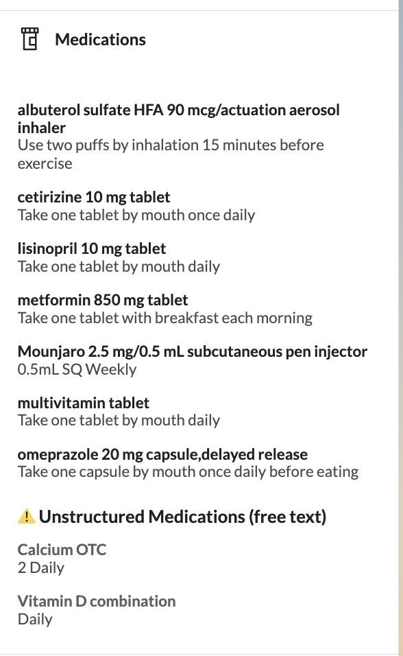

# Unstructured Medication Flag

## What it does

Separates unstructured medications - those entered as free text with no FDB or
RxNorm drug code - into their own clearly labeled group in the patient chart
Medications section. Coded medications render first with no heading; the
unstructured ones follow under a "⚠️ Unstructured Medications (free text)"
heading.

It responds to the `PATIENT_CHART__MEDICATIONS` event, inspects each
medication's codings, and returns a single `PatientChartGroup` effect with two
groups: coded meds in a high-priority unnamed group, and unstructured meds in a
lower-priority labeled group. Grouping both sets prevents Canvas from adding its
own "Other" bucket. If every medication is coded, the list renders untouched.

## Problem it solves

Free-text medications break interaction checking, e-prescribing, and reporting,
and there is no obvious signal in the chart that a medication is uncoded - a
provider has to hover each entry to find out. This plugin surfaces every
unstructured medication under its own heading so the gap is visible at a glance,
prompting the provider to re-enter the medication with a real drug code.

## Who it's for

Any Canvas customer or care team that wants clinicians to spot and clean up
free-text medications - especially organizations relying on interaction
checking, e-prescribing, or medication reporting that depends on coded entries.

## How to install

Install via the Canvas CLI against your instance:

```bash
canvas install unstructured_med_flag --host <your-instance>
```

No additional setup is required.

## Configuration options

None. The plugin declares no secrets and no settings. The definition of
"unstructured" is fixed: a medication is flagged when none of its codings use
the FDB (`http://www.fdbhealth.com/`) or RxNorm
(`http://www.nlm.nih.gov/research/umls/rxnorm`) system.

## Screenshots or screen recordings



The Medications section renders coded medications first with no heading, then an
"⚠️ Unstructured Medications (free text)" heading containing the free-text
entries.
