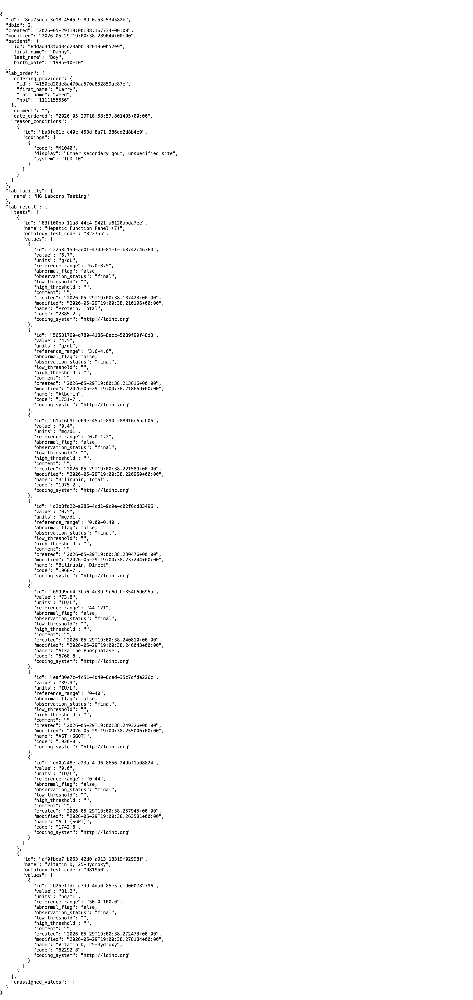

lab-result-api
==============

## Description

SimpleAPI endpoint that provides read-only access to Canvas lab reports. Returns the report metadata, the patient, and the result tests with their nested lab values. When the report is linked to an originating lab order, the order block is also included (with ordering provider, lab partner, and reason conditions); reports ingested without a Canvas-side order (e.g., external HL7 or FHIR results) will not have this block populated. Values from legacy reports that were ingested without an associated `LabTest` are surfaced separately under `unassigned_values`.

## Problem it solves

External systems that need lab results out of Canvas otherwise have to assemble them from several FHIR resources — `DiagnosticReport`, `Observation`, `ServiceRequest`, `Patient`, and `Condition` — and then reconstruct the report → order → test → value hierarchy themselves, reconcile result tests against ordered tests, and handle legacy values that were ingested without a linked test. That is several round-trips and a non-trivial amount of stitching logic for every integrator, and the legacy-value edge case is easy to miss and silently drop data.

This endpoint collapses that work into a single authenticated `GET`: one call by `lab_report_id` returns the full graph — patient demographics, originating order with ordering provider and reason conditions, lab facility, and every result test with its nested values — already shaped and with `entered_in_error` conditions filtered out. Legacy values with no associated test are surfaced explicitly under `unassigned_values` so nothing is lost.

## Who it's for

Integration engineers and developers building systems that consume Canvas lab data — analytics and reporting pipelines, data warehouses, downstream clinical or patient-facing applications, and third-party lab integrations. It is a server-to-server API (authenticated with a shared key), not a clinical end-user interface. The plugin is specialty-agnostic: it works for any practice ingesting lab results into Canvas, regardless of the lab partner or test types involved.

## API Endpoint

### `GET /plugin-io/api/lab_result_api/lab-result/<lab_report_id>`

**Authentication:** API key via `APIKeyAuthMixin`. Send your Canvas SimpleAPI key in the `Authorization` header. The expected key is configured by the `simpleapi-api-key` secret on the plugin.

**Path Parameters**

| Name | Description |
|------|-------------|
| `lab_report_id` | UUID of the `LabReport` to retrieve. |

**Response (200 OK)**

```json
{
  "id": "788881ce-e451-44c3-b42d-6dbaebc999bb",
  "dbid": 999,
  "created": "2025-01-15T08:00:00",
  "modified": "2025-01-15T10:00:00",
  "patient": {
    "id": "patient-uuid",
    "first_name": "John",
    "last_name": "Doe",
    "birth_date": "1980-05-15"
  },
  "lab_order": {
    "ordering_provider": {
      "id": "provider-uuid",
      "first_name": "Jane",
      "last_name": "Smith",
      "npi": "1234567890"
    },
    "comment": "Routine check",
    "date_ordered": "2025-01-14T09:00:00",
    "reason_conditions": [
      {
        "id": "condition-uuid",
        "codings": [
          {"code": "E11.9", "display": "Type 2 diabetes mellitus", "system": "ICD-10"}
        ]
      }
    ]
  },
  "lab_facility": {
    "name": "Quest Diagnostics"
  },
  "lab_result": {
    "tests": [
      {
        "id": "lab-test-uuid",
        "name": "Hemoglobin A1c",
        "ontology_test_code": "4548-4",
        "values": [
          {
            "id": "lab-value-uuid",
            "value": "6.5",
            "units": "%",
            "reference_range": "4.0-5.6",
            "abnormal_flag": true,
            "observation_status": "final",
            "low_threshold": "4.0",
            "high_threshold": "5.6",
            "comment": "Elevated A1c",
            "created": "2025-01-15T10:00:00",
            "modified": "2025-01-15T10:00:00",
            "name": "Hemoglobin A1c",
            "code": "4548-4",
            "coding_system": "http://loinc.org"
          }
        ]
      }
    ],
    "unassigned_values": []
  }
}
```

**Field notes**

- `patient`, `lab_facility`, and the ordering provider are omitted (set to `null`, or absent from `lab_order`) when the underlying row is missing on the report. The `lab_order` object is `{}` when no `LabOrder` is linked.
- `lab_order.reason_conditions` contains the conditions captured against the order's `LabOrderReason`, filtered to remove any `Condition` marked `entered_in_error`. Each entry is a condition with its `codings`.
- `lab_result.tests` is sourced from `LabReport.result_tests` (i.e., `LabTest` rows created for results — *not* the ordered tests). Each test nests its own `values`.
- `ontology_test_code` on a test is the lab partner's own order code for the test (e.g., Quest or LabCorp's internal catalog code), not a standardized terminology code. For a standardized code on the individual result, see the LOINC-style `code` / `coding_system` under each value (sourced from `LabValueCoding`).
- `lab_result.unassigned_values` contains lab values attached to the report itself but not linked to any `LabTest` — used for legacy reports ingested before the test/value association was enforced.
- `abnormal_flag` is a boolean (`true` or `false`).
- `reference_range` will appear if populated; otherwise it is an empty string.
- Lab value `name` / `code` / `coding_system` are only present when a `LabValueCoding` row exists for the value. The values come from `LabValueCoding`, which is distinct from the test's own `ontology_test_code`.

**Error responses**

| Status | When | Body |
|--------|------|------|
| 400 | `lab_report_id` is missing from the path. | `{"error": "Lab report ID is required"}` |
| 404 | No `LabReport` exists for the given ID. | `{"error": "Lab report not found", "lab_report_id": "<id>"}` |

## Example Usage

```bash
curl -X GET "https://<your-instance>.canvasmedical.com/plugin-io/api/lab_result_api/lab-result/788881ce-e451-44c3-b42d-6dbaebc999bb" \
  -H "Authorization: <your-simpleapi-api-key>"
```

## Screenshots

**Example response**



A live `GET` to the endpoint returns the full lab report graph in a single response — patient, originating order with ordering provider and reason conditions, lab facility, and each result test with its nested values (here, a Hepatic Function Panel and a Vitamin D test). Captured against a local development instance with synthetic data.

## Installation

1. Install the plugin into your Canvas instance.
2. Configure the `simpleapi-api-key` secret with the API key callers will use.
3. The endpoint becomes available at `/plugin-io/api/lab_result_api/lab-result/<lab_report_id>`.

## Configuration

**Required secrets**

| Name | Purpose |
|------|---------|
| `simpleapi-api-key` | Shared key validated by `APIKeyAuthMixin` against the inbound `Authorization` header. |

## Testing

Run the test suite with branch coverage:

```bash
uv run pytest --cov=lab_result_api --cov-report=term-missing --cov-branch
```
