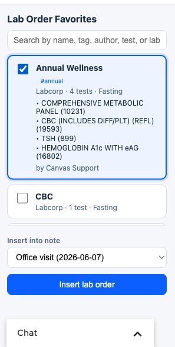
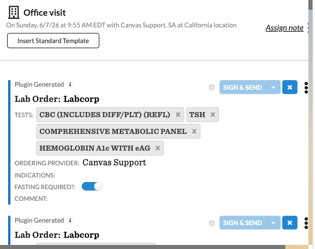
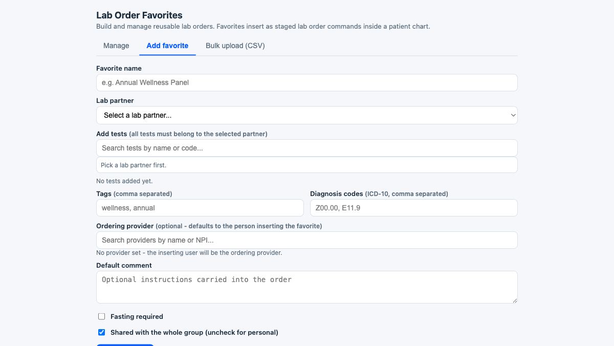
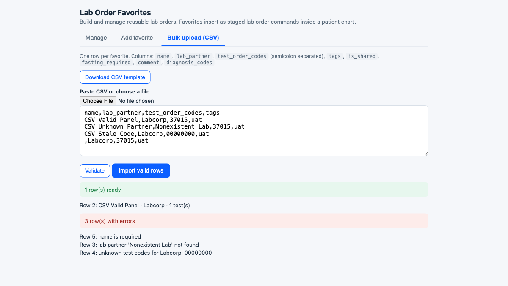
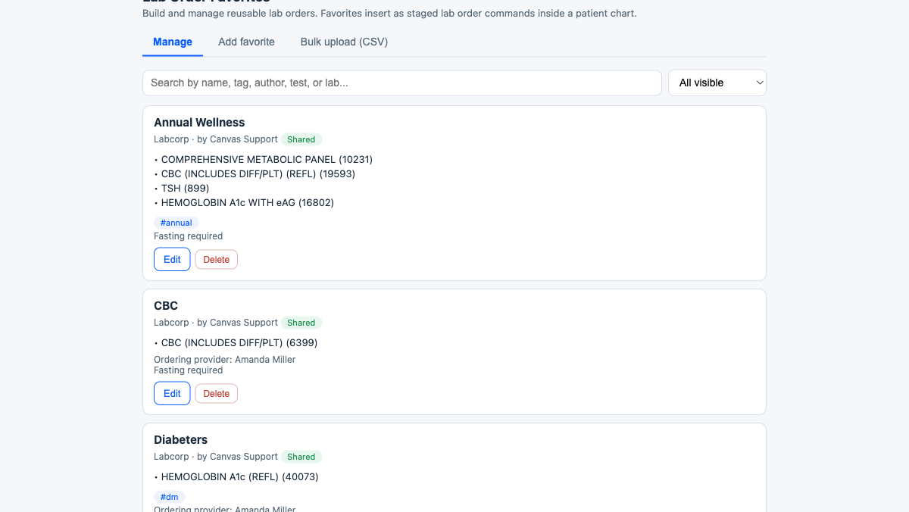

# Lab Order Favorites

## What it does

Lab Order Favorites lets staff save reusable lab orders - a single test or a multi-test panel from one lab partner - and drop them into a patient's note as **staged** lab order commands, one or more at a time.

- A global **configuration** app (in the provider menu) to create, edit, share, tag, and bulk-upload favorites, and optionally set a default ordering provider.
- An in-chart **patient app** to search favorites, multi-select, pick a target open note, and insert each as a staged `Lab order` command.
- Saved test codes are re-validated against the instance's live lab catalog at insert time. If the lab partner is inactive or a code is no longer offered, that favorite is skipped (never a partial order) and the owner/editor can fix it in place.
- Favorites can be personal or shared; shared ones are searchable by name, tag, author, test, or lab.





## Problem it solves

Providers reorder the same labs constantly - a single recurring test or a standard panel from one lab partner - and rebuild each `Lab order` command by hand every visit. That is slow and error-prone, and a stale or wrong test code can reach the chart. This plugin turns a recurring order into a one- or two-click insert, validates every code against the live catalog first, and lets a group standardize on shared panels.

## Who it's for

Ordering providers and clinical staff who place lab orders repeatedly, and practice/lab leads who want to seed and maintain a shared library of standard panels for the group.

## How to install

Install with the Canvas CLI, pointing at the plugin package directory:

```bash
canvas install lab_order_favorites --host <your-instance>
```

The plugin declares the custom-data namespace `canvas_medical__lab_order_favorites` (granted automatically on install) and respects the lab partners and tests already configured in the instance - there are no seeded/default favorites. Populate them in the config app or via CSV upload.

To manage or remove it:

```bash
canvas disable lab_order_favorites --host <your-instance>
canvas enable  lab_order_favorites --host <your-instance>
canvas uninstall lab_order_favorites --host <your-instance>
```



## Configuration options

| Variable | Sensitive | Purpose |
|---|---|---|
| `SHARED_FAVORITE_EDITORS` | no | Comma-separated staff keys allowed to edit/delete **shared** favorites, in addition to each favorite's author. Empty = shared favorites are author-only. (The `root` superuser may always edit.) |

Set it at install time if desired:

```bash
canvas install lab_order_favorites --host <your-instance> --variable SHARED_FAVORITE_EDITORS=<key1>,<key2>
```

**Per-favorite settings** (in the config app): lab partner, tests, tags, personal vs shared, an optional default ordering provider (active staff with a usable NPI), an optional default comment, default ICD-10 diagnosis codes, and a fasting flag.

**Bulk upload (CSV)** - one row per favorite; download the template from the config app:

| Column | Required | Example | Notes |
|---|---|---|---|
| `name` | yes | `Annual Wellness Panel` | Favorite name |
| `lab_partner` | yes | `LabCorp` | Matched by exact name against active partners, else by partner ID; ambiguous names are rejected |
| `test_order_codes` | yes | `001453;322000;001065` | `;`-separated order codes, all for that partner |
| `tags` | no | `wellness;annual` | `;`-separated |
| `is_shared` | no | `true` | `true`/`false` (default `true`) |
| `fasting_required` | no | `false` | `true`/`false` (default `false`) |
| `comment` | no | `Fasting 8h preferred` | Default command comment |
| `diagnosis_codes` | no | `Z00.00;E11.9` | `;`-separated ICD-10 |

Upload validates every row against the live catalog and shows a preview (ready vs error rows) before import.



## Screenshots

- **Manage favorites** (config app)

  

- **In-chart insert** and the resulting staged command - see *What it does* above.
