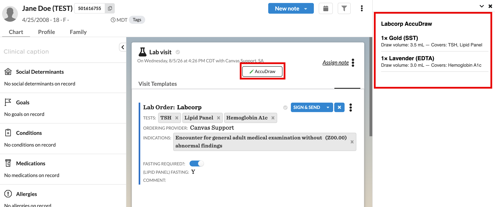

labcorp-draw-guidance
=====================

## Description

Surfaces Labcorp tube/specimen draw guidance (tube type, count, draw volume) for
in-progress Labcorp lab orders directly in the Canvas chart -- an AccuDraw-style
panel. Today, that detail only lives on Health Gorilla's own requisition/portal;
Canvas's `LabOrderCommand` has no tube/volume fields, and the Health Gorilla
compendium sync discards the specimen data HG returns. Phlebotomy/collection staff
otherwise have to leave Canvas to check HG before drawing blood.

**Who it's for:** ordering providers and phlebotomy/collection staff at
practices that use Labcorp for lab orders.

## Installation

```
canvas install labcorp_draw_guidance
```

No configuration is required -- the manifest declares no secrets or
variables.

## Screenshot



## How it works

1. `LabOrderDrawGuidanceButton` (`handlers/action_buttons.py`) is a
   `NOTE_HEADER` `ActionButton` labeled "AccuDraw", always visible (no
   conditional `visible()` -- clinicians can rely on it being in the same
   place on every note). `PRIORITY = 9999` sorts it after other plugins'
   note-header buttons.
2. Clicking the button (`handle()`) resolves guidance for every lab order
   command on the note, consolidates tests sharing a tube type into a single
   requirement sized to the largest count/volume needed
   (`domain/tube_guidance.consolidate` -- the core AccuDraw-equivalent logic),
   and opens the breakdown as a `LaunchModalEffect` in the `RIGHT_CHART_PANE`
   -- no separate page, no new browser tab. If the note has no lab order with
   known guidance yet, it opens a friendly "not available" message instead.
3. This plugin never touches the printed requisition or specimen label --
   Canvas has no hook for that. It's an adjacent advisory surface only.

### Tube-mapping table provenance

`domain/tube_guidance.py` matches on **test name keywords**
(`LabPartnerTest.order_name`, case-insensitive substring match) using
standard, widely-published phlebotomy tube-color conventions -- not a live
pull from Labcorp's official compendium. An `ORDER_CODE_OVERRIDES` dict
(empty by default) is available for pinning exact Labcorp order codes once a
practice confirms them, which take priority over the keyword match.
**This seed table should be reviewed/expanded by clinical ops before relying
on it for high-stakes draws.**

## Files

- `handlers/action_buttons.py` -- `LabOrderDrawGuidanceButton`, the
  always-visible `NOTE_HEADER` action button; opens the breakdown via
  `LaunchModalEffect(RIGHT_CHART_PANE)`.
- `domain/tube_guidance.py` -- the static tube-mapping table, resolution, and
  consolidation logic.
- `domain/command_parsing.py` -- defensive parsing of a staged `LabOrderCommand`'s
  `Command.data` JSON (lab partner name, test identifiers).
- `domain/order_resolution.py` -- ties the above together: resolves a `Command`
  instance to consolidated draw guidance, and `resolve_note_guidances` resolves
  every lab order command on a given note.

## Running Tests

```
uv run pytest tests/
```
