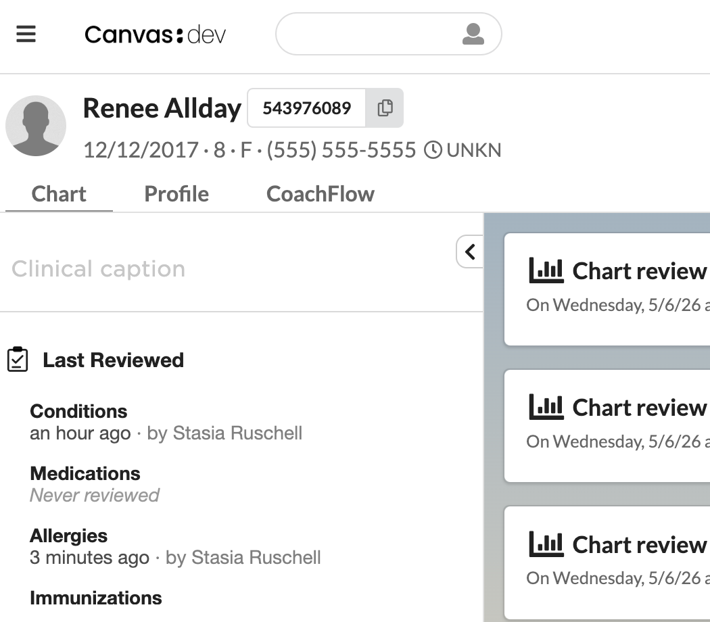

# Last Reviewed

A patient chart summary section that shows, at a glance, when each chart
section was last marked as reviewed and by whom.

## What it does

Adds a custom **Last Reviewed** section pinned to the top of the patient
chart summary. For each chart section that supports Canvas's "Mark as
Reviewed" button, it reports:

- when the section was last marked reviewed (relative time, with the
  absolute timestamp on hover)
- the reviewing staff member's name
- "Never reviewed" if no review has been recorded for this patient

The six covered sections — the ones Canvas's `ChartSectionReviewCommand`
exposes — are: Conditions, Medications, Allergies, Immunizations,
Surgical History, Family History.

If a clinician marks a section reviewed by accident and then deletes the
review, the section automatically rolls back to whatever the previous
valid review was (or "Never reviewed" if none) — see *Filtering deleted
reviews* below.

## How it works

Two handlers, both responding to chart-summary events:

- `handlers/section_config.py` registers a
  `CustomSection("last_reviewed_summary")` in
  `PatientChartSummaryConfiguration` so Canvas knows to ask for the
  section's content.
- `handlers/section_content.py` queries the `Command` model for the
  most recent valid `chartSectionReview` per section, joins to the
  committer for the reviewer name, and returns a
  `PatientChartSummaryCustomSection` effect with HTML rendered from
  `static/section.html` and styles loaded from `static/section.css`.

Markup and styling live as separate files under `static/`:

- `static/section.html` — Django template for the section body
- `static/section.css` — visual styles (font, weight, color hierarchy,
  icon size) tuned to match native chart sections

The custom section ships as a single inline content blob, so the CSS is
loaded via `render_to_string` and inlined into the HTML at render time
rather than referenced by URL.

## Filtering deleted reviews

Canvas's "Mark as reviewed" workflow commits the `chartSectionReview`
command into a small standalone note. When the clinician deletes the
review, **the `Command` row itself is not modified** — `state` stays
`'committed'`, `entered_in_error` stays null. The undo is realized by
transitioning the parent note to `NoteStates.DELETED`. So the right
invariant for "this review is in effect" is the parent note's current
state, not anything on the `Command` row. The handler's query
explicitly excludes `note__current_state__state=NoteStates.DELETED`
to honor rolled-back reviews.

## Caveat: section ordering

`PatientChartSummaryConfiguration` is all-or-nothing — emitting it
overrides the default chart summary section list. This plugin
therefore emits the full default order with the custom section pinned
to the top. If another plugin also emits a configuration for the same
patient (for example, `pediatric_patient_chart_customizations`), the
last-applied configuration wins. To combine plugins, edit the section
list in `section_config.py` to match your desired layout.
