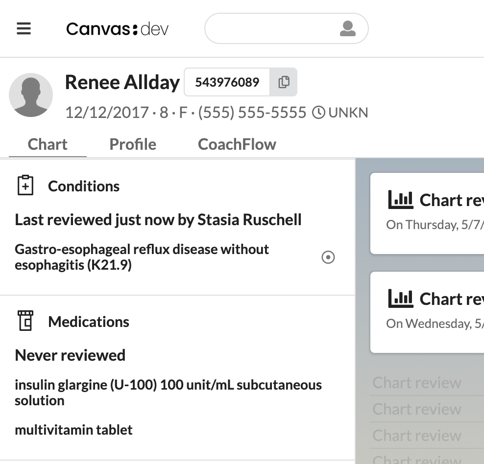

# Last Reviewed (Inline)

Adds an inline **Last reviewed …** banner to the top of the **Conditions**
and **Medications** sections of the patient chart, sourced from committed
`chartSectionReview` commands. A sibling plugin to `last_reviewed`, which
shows the same information for all six chart sections in a top-of-summary
custom section.



## What it does

For each of the two sections that have a per-section chart event in the
SDK (Conditions, Medications), emits a `PatientChartGroup` effect whose
single `Group` puts a banner above the section's existing items:

- `Last reviewed 2 hours ago by Jane Smith` — drops the `by …` part
  when the reviewer can't be resolved.
- `Never reviewed` — when no in-effect review exists.

The section's existing items are forwarded into the group's `items`
list so the renderer keeps them visible; an empty `items` list is
silently dropped by the renderer. The banner text lives in
`Group.name`.

## The problem this solves

Clinicians rely on the patient chart summary to make care decisions, but
the rows inside each section do not reflect whether the information is
considered current. Canvas exposes a *Mark as reviewed* button on each
section, but the history of those reviews is buried inside individual
notes — there's no single place to see when each section was last
reviewed and by whom. This plugin surfaces that history right inside
the Conditions and Medications sections themselves, so the review
status sits exactly where the clinician is already looking.

## Who it's for

- Clinicians who want the review status of Conditions and Medications
  visible inside those sections, rather than as a separate
  top-of-summary block.
- Practices that already use `last_reviewed` for a top-of-summary view
  and want a more compact in-section affordance for the two sections
  this plugin supports.

## How to install

Standard Canvas plugin install, run from the repository's `extensions/`
directory:

```bash
canvas install --host <your-instance> last_reviewed_inline
```

No secrets, environment variables, or external API keys are required —
the plugin only reads internal Canvas chart-section-review commands.
There are no configuration options.

## ⚠️ Known limitation: cross-plugin grouping exclusivity

**This plugin is not compatible with other plugins that emit
`PatientChartGroup` for the Conditions or Medications section** (for
example, `high-risk-medications`). Diagnostic testing on UAT showed
that when two plugins both emit a `PatientChartGroup` effect for the
same section, the renderer applies exactly one of them — regardless of
each group's `priority`. Whichever plugin "wins" suppresses the other
plugin's group **silently**.

For most charts this manifests as our banner appearing while the other
plugin's group (e.g. `⚠️ High Risk Medications`) is invisibly dropped,
which can hide clinically important information.

If you have other grouping-effect plugins active for these sections,
prefer the sibling `last_reviewed` plugin instead — it uses the
chart-summary custom section effect and does not collide with grouping
plugins.

## Why only two sections

`PatientChartGroup` is the SDK's only mechanism for injecting content
into an existing chart section, and the SDK only emits per-section
events for `PATIENT_CHART__CONDITIONS`, `PATIENT_CHART__MEDICATIONS`,
and `PATIENT_CHART__DETECTED_ISSUES`. The remaining "Mark as reviewed"
sections (Allergies, Immunizations, Surgical History, Family History)
have no per-section event and so cannot be reached this way. For full
coverage, install the sibling plugin `last_reviewed`.

## Filtering deleted reviews

Same invariant as the sibling plugin: Canvas's "delete review" workflow
does not mutate the `Command` row; it transitions the parent note to
`NoteStates.DELETED`. The query therefore excludes commands whose note
is currently deleted, so undoing an accidental review automatically
rolls the banner back to the prior valid review (or *Never reviewed*
if none).
