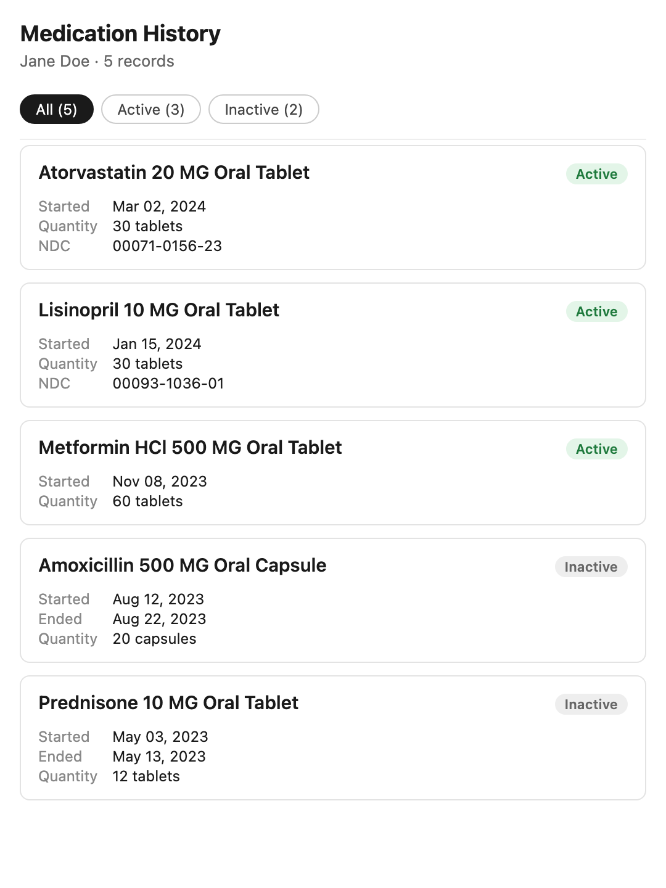

medication_history
==================

## What it does

Adds a **Med Hx** button to the Medications section of the patient chart.
When a provider clicks it, the patient's full medication history — every
active and historical medication on the chart — opens in a side panel,
showing the drug name, active/inactive status, start and end dates,
quantity, and NDC. A filter at the top lets the provider switch between
All, Active, and Inactive medications.

## Problem it solves

Reviewing a patient's complete medication history normally means scrolling
the chart's Medications section, which emphasizes current medications and
makes it hard to scan everything a patient has been on over time. This
plugin gives providers a single, filterable view of the patient's entire
medication record — active and discontinued — without leaving the chart.

## Who it's for

Any clinician who reviews medications during a visit — primary care,
behavioral health, and specialty providers — and the nurses or medical
assistants who do medication reconciliation. It is specialty-agnostic.

## How to install

```bash
canvas install medication_history
```

After installation the **Med Hx** button appears in the Medications section
of every patient chart.

## Configuration options

None. The plugin requires no secrets, environment variables, or settings,
and works against any Canvas instance out of the box.

## Screenshots



*The Med Hx modal: filter bar with counts, then one card per medication with
a status badge and details.*

## How it works

The plugin registers a single `ActionButton` handler
(`MedicationHistoryButton`) on the `CHART_SUMMARY_MEDICATIONS_SECTION`
location. On click it:

1. Resolves the patient for the current chart.
2. Reads the patient's `Medication` records (active and historical),
   excluding only retracted (entered-in-error) and deleted records, active
   medications first, then by start date.
3. Renders them with `templates/medication_history.html` and opens the
   result in a chart-pane modal.

Drug names are resolved from each medication's codings, preferring the FDB
or RxNorm description. If the patient has no medications, the modal shows a
clear empty state.

## Development

Run the tests from the plugin container directory:

```bash
uv run pytest --cov=medication_history --cov-report=term-missing --cov-branch
```

## License

Distributed under the MIT License. See `LICENSE` for details.
