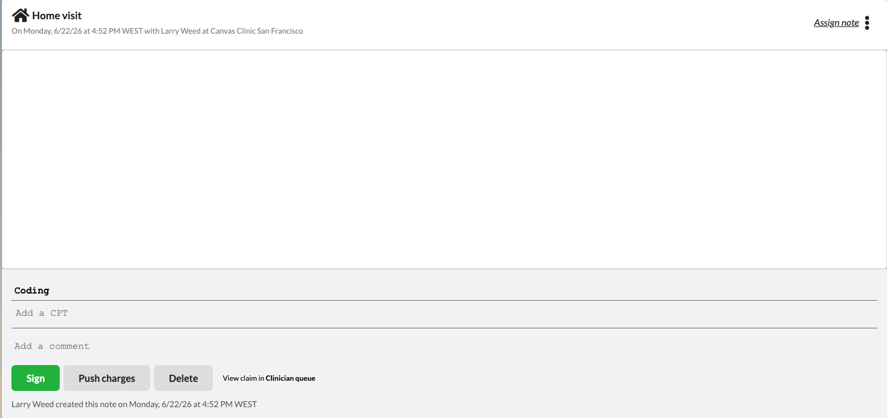

note-lifecycle-example
======================

Plugin-driven, state-responsive action buttons for the note footer.



## What it does

This plugin replaces the note footer's built-in state buttons (Sign, Lock, Unlock,
Push charges, Check in, No show, Cancel, Delete, Restore, Discharge) with buttons owned by
the plugin. Each button knows the single note state it moves the note into, and it only
appears when that move is actually allowed from the note's current state. As the note
changes state, the footer refreshes on its own, so a provider only ever sees the actions
that make sense right now — no page reload required.

## Problem it solves

The native note footer shows a fixed set of state buttons and there's no built-in way to
tailor them. If you want to relabel an action, restyle it, or gate it behind an extra
condition (for example, hide **Sign** until every staged command has been committed), your
only options today are to fork the EHR UI or train staff to ignore buttons that don't
apply. This plugin moves control of the note-lifecycle buttons into plugin code, where each
button's label, color, and visibility can be customized — while still mirroring the native
lifecycle by default.

## Who it's for

- **Canvas builders and developers** who want to customize the actions in the note footer,
  and who want a worked reference for the dynamic action-button SDK APIs.
- Works for **any provider role or specialty**, since out of the box it reproduces the
  native note lifecycle (with extra rules for signature-required and inpatient note types).

## How to install

```
canvas install note_lifecycle_example
```

No additional setup is required — the plugin starts hiding the native state buttons and
showing its own as soon as it's installed.

## Configuration options

None. The plugin has no secrets or settings. Customization is done in code: each button is
a small `NoteStateActionButton` subclass in `handlers/footer_buttons.py`, so you change a
label via `BUTTON_TITLE`, colors via `BUTTON_TEXT_COLOR` / `BUTTON_BACKGROUND_COLOR`, and
visibility by overriding `visible()`.

## How it works

- `handlers/footer_buttons.py` — one `NoteStateActionButton` subclass per supported
  transition. Each only declares the state it transitions into (`STATE_ACTION`); the SDK
  base class shows the button only when that transition is allowed from the note's current
  state (per the SDK's transition-state matrix), and on click applies the transition and
  returns a `ReloadNoteActionButtonsEffect` so the footer re-queries and re-evaluates
  against the new state. Sign and Discharge narrow visibility further to match the native
  footer (which keys those off the note type): Sign shows only for signature-required note
  types and hides while staged commands remain, and Discharge shows only for inpatient note
  types.
- `handlers/footer_configuration.py` — `HideDefaultStateButtons` answers the
  `NOTE_FOOTER__GET_CONFIGURATION` request with a `NoteFooterConfiguration`
  (`hide_default_state_buttons=True`). Suppression is configured at the note level here,
  not per button, so Canvas's native state buttons are hidden in favor of this plugin's.
- `handlers/event_handlers.py` — two reload handlers keep the footer in sync without a page
  refresh, each returning a `ReloadNoteActionButtonsEffect` for the affected note.
  `ReloadFooterOnNoteStateChange` listens for `NOTE_STATE_CHANGE_EVENT_CREATED`, and
  `ReloadFooterOnCommandChange` listens for a command being added to, removed from, or committed
  in the note (`*_COMMAND__POST_ORIGINATE`/`POST_DELETE`/`POST_COMMIT`) so the Sign button hides
  as soon as a command is added and reappears once the last staged command is committed or
  removed. Reloads are **pushed** to
  the open note via the `NoteActionButtonsSubscription` GraphQL subscription (driven by
  home-app's `ReloadActionButtonsInterpreter`), so the footer also refreshes for state
  changes that didn't come from a footer click (native flow, API, other tabs).

### CANVAS_MANIFEST

The CANVAS_MANIFEST.json registers the footer buttons, both reload handlers
(`ReloadFooterOnNoteStateChange` and `ReloadFooterOnCommandChange`), and the
footer-configuration handler. Update it if you add, remove, or rename handler classes.
