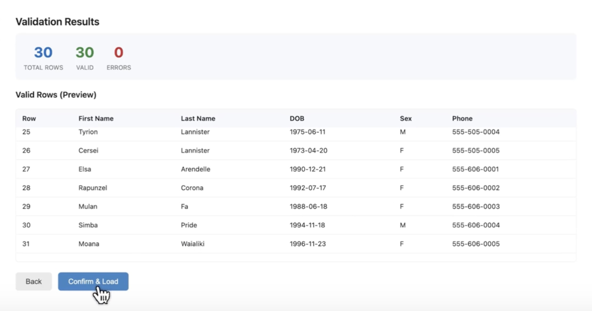

# Patient CSV Loader

Bulk-load patient demographic data into Canvas from a CSV file. The plugin provides a UI for uploading, validating, previewing, and confirming patient creation — with an optional S3 audit trail.

## Screenshot



## Installation

```bash
# Install with S3 audit trail
uv run canvas install patient_csv_loader --host <your-host> \
  --secret AWS_ACCESS_KEY_ID="<your-key>" \
  --secret AWS_SECRET_ACCESS_KEY="<your-secret>" \
  --secret S3_BUCKET_NAME="<your-bucket>"

# Install without S3 (audit trail disabled, all other features work)
uv run canvas install patient_csv_loader --host <your-host>
```

## How It Works

1. **Upload** — Staff opens the app from the Canvas app drawer and uploads a CSV file.
2. **Validate** — Every row is validated against FHIR Patient formatting rules. A summary shows valid rows and any errors.
3. **Preview** — Staff reviews the validated data before committing.
4. **Create** — On confirmation, a `Patient.create()` effect is submitted for each valid row.

## CSV Template

Download the template from within the app (click "Download CSV Template") or from the API at `GET /csv/template`.

---

## Field Reference

### Required Fields

| Field | Description | Accepted Format |
|---|---|---|
| `first_name` | Patient's first name | Free text |
| `last_name` | Patient's last name | Free text |
| `birthdate` | Date of birth | `YYYY-MM-DD` — must not be in the future |
| `sex_at_birth` | Biological sex | `F`, `M`, `O`, or `UNK` (case-insensitive) |
| `phone` | Primary mobile phone | Exactly 10 digits. Formatting is OK — e.g. `5551234567`, `(555) 123-4567`, `555-123-4567`. Non-digit characters are stripped automatically. |

### Optional Demographics

| Field | Description | Accepted Format |
|---|---|---|
| `middle_name` | Middle name | Free text |
| `prefix` | Name prefix | Free text — e.g. `Mr.`, `Ms.`, `Dr.` |
| `suffix` | Name suffix | Free text — e.g. `Jr.`, `III` |
| `nickname` | Preferred name | Free text |
| `social_security_number` | SSN | 9 digits. Dashes/spaces OK — e.g. `123-45-6789` or `123456789`. Non-digits are stripped automatically. |
| `administrative_note` | Admin-visible note | Free text |
| `clinical_note` | Clinician-visible note | Free text |

### Address Fields

If **any** address field is provided, then `address_line1`, `address_city`, `address_state_code`, `address_postal_code`, and `address_country` are all required.

| Field | Description | Accepted Format |
|---|---|---|
| `address_line1` | Street address line 1 | Free text |
| `address_line2` | Street address line 2 | Free text (optional) |
| `address_city` | City | Free text |
| `address_state_code` | State abbreviation | 2 letters — e.g. `CA`, `NY`. Auto-uppercased. |
| `address_postal_code` | ZIP / postal code | 5 digits — e.g. `90210`. Non-digits stripped automatically. |
| `address_country` | Country code | 2-letter ISO code — e.g. `US`. Auto-uppercased. |
| `address_use` | Address type | `home`, `work`, `temp`, or `old`. Defaults to `home`. |

### Contact Points (Slots 1–2)

Replace `N` with `1` or `2`. The `system` and `value` fields must be provided together.

| Field | Description | Accepted Format |
|---|---|---|
| `contact_N_system` | Contact type | `phone`, `fax`, `email`, `pager`, or `other` |
| `contact_N_value` | Contact value | Free text. If system is `phone`, must be exactly 10 digits (formatting stripped). |
| `contact_N_use` | Use type | `home`, `work`, `temp`, `old`, `other`, `mobile`, or `automation`. Defaults to `home`. |
| `contact_N_rank` | Priority rank | Positive integer. Defaults to slot number + 1. |
| `contact_N_has_consent` | Communication consent | `true` or `false` |

### External Identifiers (Slots 1–3)

Replace `N` with `1`, `2`, or `3`. The `system` and `value` fields must be provided together.

| Field | Description | Accepted Format |
|---|---|---|
| `external_id_N_system` | Identifier namespace / URI | Free text — e.g. `http://old-ehr.com` |
| `external_id_N_value` | Identifier value | Free text — e.g. `PAT-001` |

### Normalization Summary

The plugin automatically normalizes the following before creating the patient record:

- **Phone numbers** — non-digit characters removed (e.g. `(555) 123-4567` becomes `5551234567`)
- **SSN** — dashes and spaces removed (e.g. `123-45-6789` becomes `123456789`)
- **Postal code** — non-digit characters removed
- **State code** — uppercased (e.g. `ca` becomes `CA`)
- **Country code** — uppercased (e.g. `us` becomes `US`)
- **Sex at birth** — uppercased for matching (e.g. `f` matches `F`)

---

## Validation Rules

Each row is validated before being accepted. Rows with errors are flagged and shown in the preview — they will not be submitted for creation.

| Rule | Error Message |
|---|---|
| Missing any required field | `{field} is required` |
| Birthdate not `YYYY-MM-DD` | `birthdate must be in YYYY-MM-DD format` |
| Birthdate in the future | `birthdate cannot be in the future` |
| Sex not F/M/O/UNK | `sex_at_birth must be one of: F, M, O, UNK` |
| Phone not 10 digits | `phone must be 10 digits` |
| SSN not 9 digits | `social_security_number must be 9 digits` |
| Partial address (missing required) | `{field} is required when any address field is provided` |
| State code not 2 letters | `address_state_code must be a 2-letter state abbreviation` |
| Postal code not 5 digits | `address_postal_code must be 5 digits` |
| Country code not 2 letters | `address_country must be a 2-letter country code` |
| Invalid address use | `address_use must be one of: home, old, temp, work` |
| Contact system without value (or vice versa) | `contact_N_value is required when contact_N_system is provided` |
| Invalid contact system | `contact_N_system must be one of: email, fax, other, pager, phone` |
| Contact phone not 10 digits | `contact_N_value must be 10 digits when system is phone` |
| Invalid contact use | `contact_N_use must be one of: automation, home, mobile, old, other, temp, work` |
| Rank not a positive integer | `contact_N_rank must be a positive integer` |
| has_consent not true/false | `contact_N_has_consent must be true or false` |
| External ID system without value (or vice versa) | `external_id_N_value is required when external_id_N_system is provided` |

---

## Secrets

Configure these in the Canvas plugin secrets if you want an S3 audit trail of uploaded CSVs:

| Secret | Description |
|---|---|
| `AWS_ACCESS_KEY_ID` | AWS access key with S3 PutObject permission |
| `AWS_SECRET_ACCESS_KEY` | Corresponding secret key |
| `S3_BUCKET_NAME` | Target S3 bucket name |

If these are not configured, the plugin still works — it just skips the S3 upload and logs a warning. All core functionality (validation, preview, and patient creation) operates normally without S3.

---

## Future Improvements

- **Upload History View** — A historical view of previously uploaded CSV files, including upload date, row counts, and status. This would allow staff to review past imports and track what has been loaded over time.

---

## UAT (User Acceptance Testing)

### Prerequisites

- Plugin is deployed to a Canvas test instance
- You have staff-level access to log in
- A test CSV file ready (or use the built-in template)

### Test Plan

#### 1. App Drawer Launch

- [ ] Open the Canvas app drawer
- [ ] Confirm "Patient CSV Loader" appears with its icon
- [ ] Click to open — the upload UI should load

#### 2. Template Download

- [ ] Click "Download CSV Template" link
- [ ] Confirm a CSV file downloads with all expected column headers
- [ ] Open the template and verify the example row passes validation (re-upload it)

#### 3. Validation — Happy Path

- [ ] Fill in the template with 3–5 valid patient rows
- [ ] Upload the CSV
- [ ] Confirm the summary shows all rows as valid, zero errors
- [ ] Confirm the preview table shows correct first name, last name, DOB, sex, phone

#### 4. Validation — Error Handling

- [ ] Create a CSV with intentional errors:
  - Missing `first_name` on row 2
  - Invalid `birthdate` (`03/15/1985`) on row 3
  - Invalid `sex_at_birth` (`X`) on row 4
  - Phone with only 7 digits on row 5
- [ ] Upload and confirm error count matches expected
- [ ] Confirm each error row shows the correct error message
- [ ] Confirm valid rows still appear in the valid preview

#### 5. Validation — Normalization

- [ ] Upload a CSV with formatting that should be normalized:
  - Phone as `(555) 123-4567`
  - SSN as `123-45-6789`
  - State as `ca` (lowercase)
  - Country as `us` (lowercase)
- [ ] Confirm these rows pass validation (no errors)

#### 6. Patient Creation

- [ ] From the preview screen with valid rows, click "Confirm & Load"
- [ ] Confirm the success screen shows the correct submitted count
- [ ] Navigate to the Canvas patient list
- [ ] Search for the patients by name and confirm they were created
- [ ] Verify each patient's demographics match the CSV:
  - Name (first, last, middle, prefix, suffix)
  - Birthdate
  - Sex at birth
  - Phone number (digits only)
  - Address (if provided)
  - SSN (digits only, if provided)

#### 7. Edge Cases

- [ ] Upload an empty CSV (header only) — should show 0 total rows, no errors
- [ ] Upload a CSV with BOM characters — should parse correctly
- [ ] Upload a CSV with extra/unrecognized columns — should be ignored
- [ ] Upload a CSV with mixed valid and invalid rows — only valid rows should be submittable

#### 8. S3 Audit Trail (if secrets configured)

- [ ] Upload a CSV file
- [ ] Check the S3 bucket under `patient-csv-uploads/{date}/` for the uploaded file
- [ ] Confirm the file content matches what was uploaded

#### 9. Error Recovery

- [ ] After a validation with errors, click "Back" — confirm you can re-upload
- [ ] After patient creation, click "Upload Another File" — confirm the UI resets cleanly
