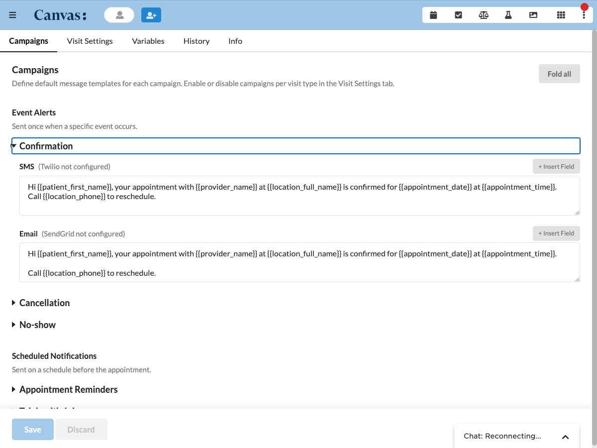

# Patient Notify

## What it does

Patient Notify sends patients appointment notifications over SMS and email directly, without a separate messaging platform. It covers five campaign types, confirmation when an appointment is created, reminders on a schedule before the visit, no-show and cancellation alerts, and telehealth join links. Delivery is direct through Twilio for SMS and SendGrid for email. A provider menu admin page configures global and per visit type campaigns, templates, and custom variables, and a patient chart panel shows the notifications sent to one patient and lets staff send manually.

Instant notifications fire from appointment created, canceled, and no-showed events. Scheduled reminders and telehealth join links fire from a cron task that runs every fifteen minutes and checks upcoming booked appointments. When a channel cannot deliver, no contact, no credentials, or an invalid phone number, the plugin records a descriptive skip reason instead of failing silently.

## Problem it solves

Appointment no-shows cost clinics time and revenue, and wiring up a full notification platform is heavy. Patient Notify gives a clinic configurable appointment messaging inside Canvas with only Twilio and SendGrid credentials to set. Staff define message templates once, enable the campaigns they want per visit type, and the plugin sends confirmations, reminders, and telehealth links automatically, so patients are reminded without any manual outreach.

## Who it's for

Front desk staff, schedulers, and practice administrators who want automated appointment reminders and confirmations, and care teams running telehealth who need join links delivered before the visit. The admin page suits whoever curates the clinic's message templates and campaign rules, and the patient chart panel suits staff checking or resending a notification for one patient.

## How to install

Install the plugin with the Canvas CLI, pointing it at the plugin package directory, the one that holds `CANVAS_MANIFEST.json`.

```
canvas install path/to/patient_notify --host <your-instance>
```

Set the Twilio and SendGrid secrets in the Configuration options below so the plugin can deliver, then open Notifications Admin from the provider menu to enable campaigns per visit type.

## Configuration options

Delivery credentials are set as plugin secrets. When a channel's secrets are not set, notifications for that channel are skipped with a descriptive reason, so the plugin is safe to install before the integrations are ready.

| Secret | Purpose |
|--------|---------|
| `twilio-account-sid` | Twilio account SID for direct SMS |
| `twilio-auth-token` | Twilio auth token |
| `twilio-phone-number` | Twilio sender phone number |
| `sendgrid-api-key` | SendGrid API key for direct email |
| `sendgrid-from-email` | SendGrid sender email address |

All campaign behavior is configured in the Notifications Admin page rather than in secrets. Global default templates, channels, and intervals are inherited by every activated visit type, each visit type can be toggled on or off and can override the global templates, channels, or intervals per campaign, and custom template variables are defined as key-value pairs available in every template.

## Screenshots

The Notifications Admin Campaigns tab, showing the Confirmation campaign expanded with its SMS and email templates, the integration status hints for Twilio and SendGrid, and the Insert Field control for template variables.



## Features

- Five campaign types, confirmation, reminder, no-show, cancellation, and telehealth join.
- Direct delivery via Twilio SMS and SendGrid email, with descriptive skip reasons when credentials are missing or contacts are unavailable.
- Per-visit-type activation, where visit types are explicitly enabled and inherit global campaign defaults with optional per-campaign overrides for templates, channels, and intervals.
- Telehealth join notifications that detect telehealth appointments and send join link reminders on a separate interval schedule.
- Customizable templates with dynamic variables for patient, appointment, provider, location, organization, and custom key-value pairs.
- An admin page for managing campaigns and viewing global notification history, and a patient chart panel for per-patient history and manual send.

## How it works

1. Instant notifications. When an appointment is created, canceled, or no-showed, the plugin resolves the campaign config for that visit type and sends the notification immediately.
2. Scheduled reminders. A cron task runs every fifteen minutes, finds upcoming booked appointments, and sends reminders at the configured intervals for each activated visit type.
3. Telehealth join notifications. The same cron task detects telehealth appointments and sends join link notifications on their own interval schedule, separate from regular reminders.
4. Direct delivery. The plugin sends SMS via Twilio and email via SendGrid to all consented active contacts. Phone numbers are normalized to E.164 format before calling Twilio.

## Admin UI

The Notifications Admin page has five tabs, Campaigns, Visit Settings, Variables, History, and Info.

- Campaigns configures global defaults inherited by all visit types, grouped into Event Alerts (Confirmation, Cancellation, No-show) and Scheduled Notifications (Appointment Reminders, Telehealth Join). Each campaign is a collapsible row with channel toggles, template editors, and interval inputs.
- Visit Settings lists every schedulable visit type as an accordion, each with a master on/off toggle and per-campaign toggles that auto-save. Campaign rows expand to show template and channel customization and show whether they inherit the global defaults or are customized.
- Variables manages custom template variables usable in any template with `{{variable_name}}` syntax. Deleting a variable referenced in a template is blocked until the references are removed.
- History shows a searchable table of all sent notifications with status filtering and retry support for failed entries.
- Info displays integration status for Twilio and SendGrid.

The patient chart Notification History panel lets staff pick an appointment, campaign type, and channel, preview the rendered message, and send manually, and shows all notifications sent to that patient with delivery status.

## Template variables

Templates support these variables, and custom variables defined in the admin UI use the same `{{variable_name}}` syntax.

| Variable | Example value |
|----------|---------------|
| `{{patient_first_name}}` | Jane |
| `{{patient_last_name}}` | Doe |
| `{{patient_preferred_name}}` | Janey |
| `{{patient_full_name}}` | Jane Doe |
| `{{provider_name}}` | Dr. Smith |
| `{{provider_credentials}}` | MD |
| `{{appointment_date}}` | March 15, 2026 |
| `{{appointment_time}}` | 2:30 PM |
| `{{appointment_type}}` | Office Visit |
| `{{location_name}}` | Main Street Clinic |
| `{{location_full_name}}` | Main Street Clinic |
| `{{location_short_name}}` | Main St |
| `{{location_address}}` | 123 Main St, Springfield, IL 62701 |
| `{{location_phone}}` | (555) 123-4567 |
| `{{organization_name}}` | Springfield Medical Group |
| `{{organization_full_name}}` | Springfield Medical Group |
| `{{organization_short_name}}` | SMG |
| `{{organization_address}}` | 100 Health Blvd, Springfield, IL 62701 |
| `{{organization_phone}}` | (555) 000-1234 |
| `{{telehealth_link}}` | https://visit.example.com/abc123 |
| `{{minutes_until}}` | 60 |

## Info

_This plugin was developed and contributed by [Vicert](https://vicert.com)._
