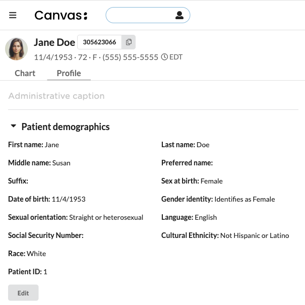
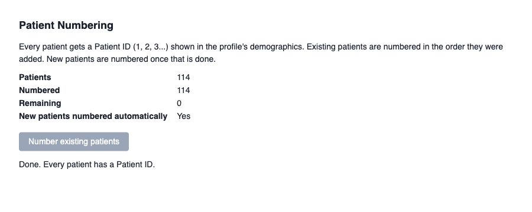
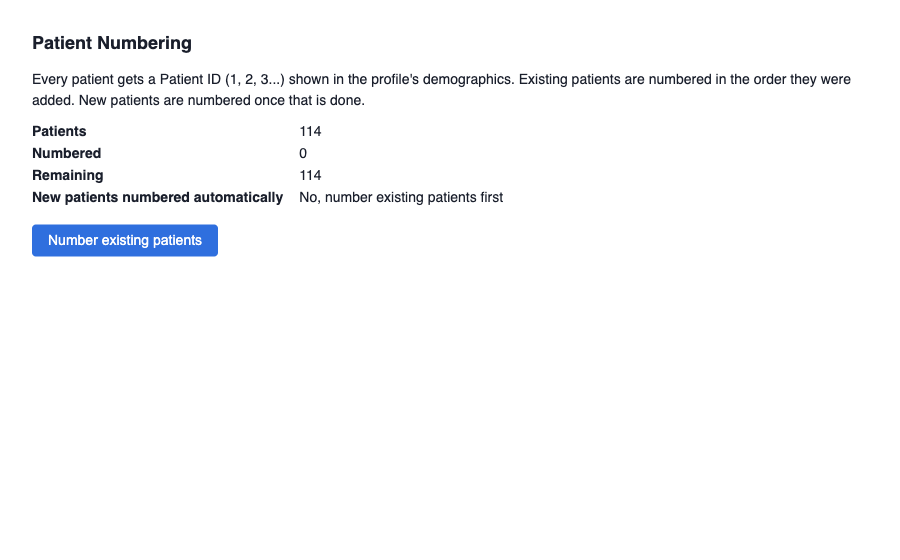

# Patient Numbering

## What it does

Gives every patient a simple Patient ID (1, 2, 3...) in addition to the Canvas MRN. The Patient ID appears in the Patient demographics section of the patient profile, and staff can find a patient by it from the patient search bar. Existing patients are numbered in the order they were added to Canvas, starting at 1, and every new patient gets the next number automatically.



## Problem it solves

Canvas assigns each patient a 9-digit random MRN. Some practices also need a short, sequential number: to label paper charts and forms, to say over the phone, or to match a numbering scheme the practice already uses. Without this plugin, staff keep that number in a separate spreadsheet or type it into a free-text field by hand, which leads to duplicates and skipped numbers. This plugin assigns the numbers itself and guarantees that no two patients share one.

## Who it's for

Front desk, intake, and practice administrators who register patients and look them up, and practice owners who want a simple running patient count. An administrator runs the one-time numbering of existing patients from the admin app.

## How it works

- **New patients:** when a patient is created, they get the next Patient ID.
- **Existing patients:** an administrator opens the **Patient Numbering** app and clicks **Number existing patients**. Patients are numbered in the order they were added to Canvas, in batches of 100, with progress shown on the page. New patients are not numbered until this finishes, so existing patients keep the lowest numbers.
- **Profile:** the number shows as a read-only **Patient ID** field in Patient demographics.
- **Search:** type `!` followed by the number in the patient search bar, for example `!42`. The `!` tells Canvas search to look up patient identifiers.
- **Numbers are never reused.** If a patient record is removed, its number is skipped.



### Where the number is stored

| Where | Purpose |
|---|---|
| Custom data table `patientnumber` in namespace `canvas__patient_numbering` | Source of truth. A unique constraint guarantees no two patients share a number. |
| Patient external identifier, system `https://schemas.canvasmedical.com/patient-number` | Makes `!<number>` search work and includes the number on the FHIR Patient resource. |
| Patient metadata, key `patient_number` | The value the profile field displays. |

## How to install

```bash
canvas install patient_numbering --variable "ADMIN_STAFF_IDS=<staff_id>,<staff_id>"
```

Then:

1. Copy the generated `namespace_read_write_access_key` and `namespace_read_access_key` from the plugin's secrets and store them somewhere safe. Canvas generates them only when the namespace is first created, and a reinstall after an uninstall needs them.
2. As one of the listed administrators, open the **Patient Numbering** app and click **Number existing patients**. When it reports "Done", new patients are numbered automatically.



## Configuration options

| Setting | Required | Description |
|---|---|---|
| `ADMIN_STAFF_IDS` | Yes | Comma-separated staff IDs allowed to use the admin app. If it is empty, nobody can open it. |
| `namespace_read_write_access_key` | Generated | Created on first install. Pass it back with `--secret` on any reinstall. |

The profile label (`Patient ID`) and the identifier system are set in code (`handlers/profile_field.py` and `numbering.py`).
