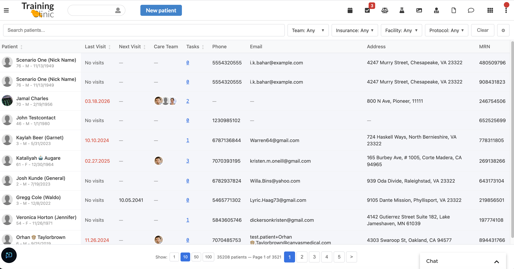
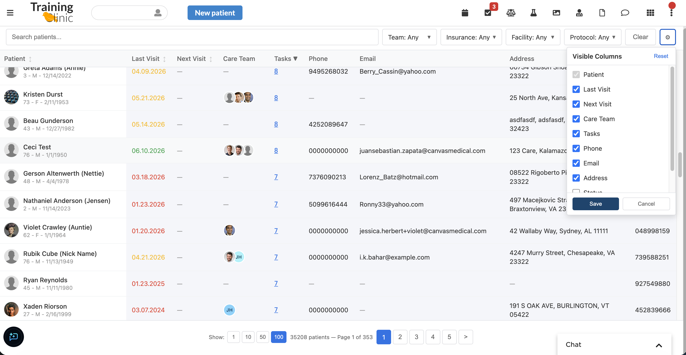
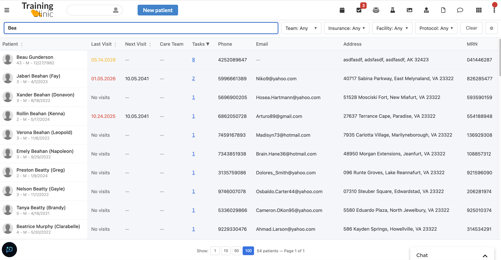
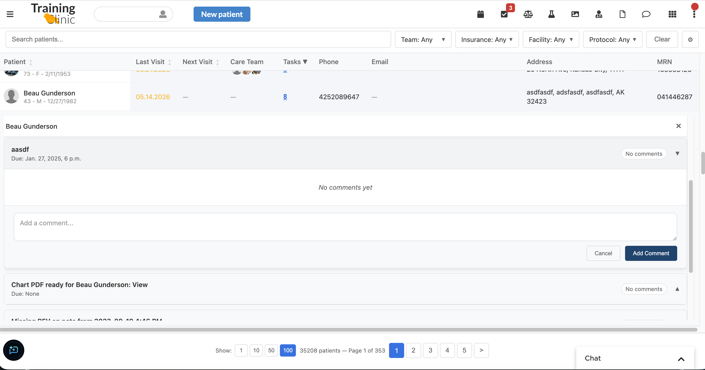

# Patient Panel

Configurable patient dashboard plugin for Canvas Medical.

## Info

*This plugin was developed and contributed by [Vicert](https://vicert.com).*

Contact: engineering@vicert.com

## What it does

Patient Panel adds a configurable, sortable, filterable view of a clinic's
patient population inside Canvas. It is surfaced as a provider-menu Application
(and a note-header button) that opens a full-page panel listing patients with
configurable columns — demographics, care team, last/next visit, facility, open
tasks, care gaps, insurance, observation values (e.g. A1C and BMI by LOINC), and
custom metadata fields. Each row supports color-coded flagging, an inline
clinical caption, and accordion detail views for tasks, gaps, conditions,
medications, allergies, and referrals. Sorting and pagination stay fast on large
panels via the denormalized `PatientPanelStats` table (see
[Sort acceleration](#sort-acceleration-patientpanelstats)).

## Problem it solves

Canvas has no built-in configurable population/panel view, and building one ad
hoc does not scale: ordering the full patient population by per-row correlated
note-state subqueries times out on large panels (~37 s at 8k patients). Care
teams are left without a single place to triage and sort their patients by visit
recency, open work, or risk. Patient Panel provides that view without leaving the
EMR and keeps it performant (~12 ms sorts) through an indexed stats table kept
fresh by event handlers and a reconciliation cron.

## Who it's for

Care teams, care coordinators, and panel managers who need to triage and act on a
patient population, and providers who want a fast roster from the provider menu
or a note. Administrators configure the visible columns, flag labels, highlight
thresholds, and custom metadata fields entirely through plugin secrets
(`PANEL_CONFIG`, `FLAG_COLOR_LABELS`, `HIGHLIGHT_THRESHOLD_DAYS_*`,
`METADATA_FIELDS`) — no code changes required.

## Screenshots or screen recordings

**Default panel view** — the patient roster with the filter bar (care team,
insurance, facility, protocol), search, and per-column sorting.



**Configurable columns** — show, hide, and reorder columns from the column
picker; the selection is driven by the `PANEL_CONFIG` secret.



**Search and sort** — filter the roster by patient name and sort by any
sortable column (here, open tasks).



**Detail accordions** — expand a patient row to see tasks, gaps, conditions,
medications, allergies, and referrals inline, including task comment threads.



## Features

- **Configurable columns** via `PANEL_CONFIG` JSON secret — show/hide/reorder built-in columns, add observation-based columns (by LOINC code), and custom metadata columns
- **Filter bar** with multi-select dropdowns for care team, insurance, facility, and protocol
- **Patient flagging** with color-coded flags (green/yellow/red)
- **Clinical caption** with inline editing
- **Tasks, gaps, conditions, medications, allergies, referrals** with accordion detail views
- **Pagination** and **sorting** on key columns
- **Indexed sort acceleration** via the `PatientPanelStats` table (see below) — keeps `/table` fast on large panels

## Entry Point

Launched as an **Application** (`PatientPanelApp`) accessible from the provider menu, opening the panel in a full-page modal.

## Configuration

Set the `PANEL_CONFIG` secret to a JSON object to customize columns:

```json
{
  "columns": [
    {"type": "built-in", "key": "patient", "visible": true},
    {"type": "built-in", "key": "care_team", "visible": true},
    {"type": "built-in", "key": "last_visit", "visible": true},
    {"type": "built-in", "key": "facility", "visible": true},
    {"type": "built-in", "key": "tasks", "visible": true},
    {"type": "built-in", "key": "gaps", "visible": true},
    {"type": "built-in", "key": "insurance", "visible": true},
    {"type": "built-in", "key": "caption", "visible": true},
    {"type": "built-in", "key": "next_visit", "visible": true},
    {"type": "observation", "key": "a1c", "label": "A1C", "loinc": "4548-4", "visible": true, "format": "value_units"},
    {"type": "observation", "key": "bmi", "label": "BMI", "loinc": "39156-5", "visible": true, "format": "value"},
    {"type": "metadata", "key": "preferred_language", "label": "Language", "visible": true}
  ]
}
```

Available built-in column keys: `patient`, `care_team`, `last_visit`, `next_visit`, `facility`, `room`, `tasks`, `gaps`, `insurance`, `caption`, `mrn`, `phone`, `email`, `address`, `default_provider`, `conditions`, `medications`, `allergies`, `referrals`, `active_status`. The `patient` column renders age, sex, and DOB as a sub-line under the patient name. If `PANEL_CONFIG` is not set, the default visible set is used.

## Secrets

| Secret | Required | Description |
|--------|----------|-------------|
| `PANEL_CONFIG` | No | JSON column configuration |
| `PAGE_SIZE` | No | Patients per page (default: 10) |
| `HIGHLIGHT_THRESHOLD_DAYS_GREEN` | No | Days threshold for green highlight |
| `HIGHLIGHT_THRESHOLD_DAYS_YELLOW` | No | Days threshold for yellow highlight |
| `HIGHLIGHT_THRESHOLD_DAYS_RED` | No | Days threshold for red highlight |
| `INSURANCES` | No | Insurance logo mappings |
| `FHIR_CLIENT_ID` | No | FHIR client ID for patient photos |
| `FHIR_CLIENT_SECRET` | No | FHIR client secret for patient photos |
| `CANVAS_INSTANCE_URL` | No | Canvas instance URL for FHIR API |
| `INSTANCE_TIMEZONE` | No | IANA TZ name (e.g. `America/New_York`) used when the logged-in staff has no `last_known_timezone`. Defaults to `UTC`. |
| `FLAG_COLOR_LABELS` | No | JSON dict overriding the dropdown labels for the three flag colors, e.g. `{"red": "Urgent", "yellow": "Follow-up", "green": "On track"}`. Missing keys fall back to capitalized color names. |
| `METADATA_FIELDS` | No | JSON list of extra patient-profile fields driven by the `PatientMetadataFields` handler. Each entry is `{"key", "label", "type": "TEXT" \| "SELECT" \| "DATE", "required", "editable", "options"?}`. Same `key` values are referenced by `type: "metadata"` columns in `PANEL_CONFIG` and gate the inline `POST /<patient_id>/metadata/<key>` edit endpoint (only `editable: true` keys can be written). |

## Sort acceleration (PatientPanelStats)

`PatientPanelStats` is a per-patient denormalized table (one indexed row per
patient) holding the stable, sortable derived values: `last_visit_dt`,
`next_visit_dt`, `room_number`, `tasks_open_count`, `gaps_due_count`. The
built-in sorts (`last_visit`, `next_visit`, `room`, `gaps`, `tasks`) **always**
order by this table (via a correlated lookup on the unique `patient_id` index)
instead of ordering the full patient population by per-row correlated note-state
subqueries (~12 ms vs ~37 s at 8k patients). This is not configurable — the live
correlated-subquery sort is an instance-killer (gateway timeout + Postgres JIT
storm) and must never be reachable from a sort click. The lookup is
LEFT-JOIN-equivalent, so a patient with no stats row still appears (sorts as
NULL), and an empty/cold table is safe (~13 ms), repopulating within ≤15 min via
the reconcile cron.

Only stable keys live here — config-driven values (metadata) are intentionally
excluded because CustomModel DDL is append-only (columns can't be altered or
dropped).

**Freshness model:**

- **Event handlers** (`panel_stats_sync.py`) recompute the affected patient's
  row on note/task/address/protocol-override/patient-created events — the
  freshness optimization.
- **Reconciliation cron** (`PanelStatsReconcile`, every 15 min) rebuilds every
  row set-based as the correctness backstop / drift repair / cold-start fill
  (idempotent upsert). Also the only refresh source for `gaps_due_count`.
- **Manual backfill**: `POST /stats/backfill` recomputes the whole table on
  demand (idempotent, set-based). Run it immediately after deploy to populate
  the table without waiting for the cron, and to repair drift. Inherits the
  plugin's org-wide `StaffSessionAuthMixin` auth; non-destructive.

## Metadata columns: filtering, sorting, and rendering

Metadata columns in `PANEL_CONFIG` accept these additional flags:

| Flag | Purpose |
|------|---------|
| `filterable: true` | Adds a multi-select filter chip in the toolbar. Options come from `filter_options` (preferred) or fall back to `sort_order`. The wire format is `metadata_<key>=v1,v2`. |
| `filter_options: ["..."]` | Explicit option list for the filter dropdown. |
| `sort_order: ["..."]` | Enables ordinal sorting (e.g. Low → Medium → High). Unknown / missing values sort last in either direction. Requires `sortable: true` + a matching `sort_key`. |
| `render: "tags"` | Splits the metadata value on `\|` and renders each piece as a chip. Whitespace is trimmed; empty values render as the em-dash placeholder. |

### Inline editing in the table

A metadata column renders an in-cell editable control (a `<select>` for `SELECT`
fields, a text/date input otherwise) when its `key` is declared `editable: true`
in `METADATA_FIELDS`. Changing the value POSTs a single upsert to
`POST /<patient_id>/metadata/<key>` — it does **not** reload the table, so the
sort/paginate query is never re-run (if the table is sorted by that column, the
edited row keeps its position until the next navigation). On failure the control
reverts and alerts.

Because the endpoint upserts the **whole** metadata value for the key, a column
is inline-editable only when its displayed value *is* that whole value. Columns
with a dotted `path` (nested JSON) or `render: "tags"` (pipe-joined list) stay
read-only in the table to avoid clobbering the stored value; edit those from the
patient-profile additional-fields form instead. `SELECT` options come from
`METADATA_FIELDS` (the set the endpoint validates against), not the column's
`sort_order`.

Example metadata column:

```json
{
  "type": "metadata",
  "key": "risk_score",
  "label": "Risk",
  "visible": true,
  "sortable": true,
  "sort_key": "risk_score",
  "sort_order": ["Low", "Medium", "High"],
  "filterable": true,
  "filter_options": ["Low", "Medium", "High"]
}
```

## Patient Flagging

Each patient avatar in the table doubles as a flag picker. Click the avatar
to open a small dropdown with **None / Green / Yellow / Red** options. The
selected color renders as a ring around the avatar and persists for the rest
of the day (cleared automatically every Monday morning by the
`WeeklyFlagCleanup` cron).

Flag semantics are intentionally open-ended — clinics typically map them to
triage urgency, follow-up status, or care-coordination state. To rename the
labels visible in the dropdown, set the `FLAG_COLOR_LABELS` secret to a JSON
dict, e.g.:

```json
{"red": "Urgent", "yellow": "Follow-up", "green": "On track"}
```

## Components

- `PatientPanelApp` — Application providing the provider-menu entry point that opens the panel modal
- `PanelButton` — ActionButton in the note header that opens the same panel modal
- `PatientPanelAPI` — SimpleAPI serving the dashboard UI and data endpoints
- `WeeklyFlagCleanup` — CronTask clearing stale flag metadata weekly
- `PatientMetadataFields` — Patient-profile additional-fields handler driven by the `METADATA_FIELDS` secret
- `PanelStatsOn*` — Event handlers (`panel_stats_sync.py`) that recompute a patient's `PatientPanelStats` row on note, task, address, protocol-override, and patient-created events
- `PanelStatsReconcile` — Nightly CronTask that rebuilds the full `PatientPanelStats` table (correctness backstop)

## Triggers

| Component | Trigger |
|---|---|
| `PatientPanelApp` | User clicks the "Patient Panel" entry in the provider menu |
| `PanelButton` | User clicks the "Patient Panel" button in the note header |
| `PatientPanelAPI` | Inbound HTTP requests under `/plugin-io/api/patient_panel/app/...` from the panel UI |
| `WeeklyFlagCleanup` | Cron — every Monday at 08:00 UTC (`0 8 * * 1`) |
| `PatientMetadataFields` | `PATIENT_METADATA__GET_ADDITIONAL_FIELDS` event when the patient-profile form is rendered |
| `PanelStatsOn*` | Note / task / patient-address / protocol-override / patient-created events |
| `PanelStatsReconcile` | Cron — nightly |

## Effects

| Component | Effect |
|---|---|
| `PatientPanelApp` / `PanelButton` | `LaunchModalEffect` targeting `PAGE` |
| `PatientPanelAPI` | `HTMLResponse` / `Response` (UI fragments, JSON), `PatientMetadata.upsert()` (flags + inline metadata edits), `AddTaskComment.apply()` (task comments) |
| `WeeklyFlagCleanup` | `PatientMetadata.upsert("")` per stale `daily_flag` record |
| `PatientMetadataFields` | `PatientMetadataCreateFormEffect` carrying the configured form fields |
| `PanelStatsOn*` / `PanelStatsReconcile` | None — direct ORM upsert into `PatientPanelStats` (no effects) |

## Installation

Installed with the Canvas CLI. From the plugin's container directory (`extensions/patient-panel/`):

```bash
uv run canvas install patient_panel --host <instance> --secret KEY=VALUE
```

**IMPORTANT — populate the stats table after install.** On a fresh install the
`PatientPanelStats` table is empty, so the `last_visit` / `next_visit` / `room`
columns show `—` and the stats-accelerated sorts have nothing to order by until
it is filled. (Patients are always listed regardless — the sort is
LEFT-JOIN-equivalent, so nobody is dropped; only the stats-derived values/sorts
are blank.) Do one of:

1. **Wait up to ~15 minutes** for the `PanelStatsReconcile` cron (`*/15 * * * *`)
   to fire and populate every row, **or**
2. **Populate it immediately** — open the Patient Panel in the UI, then in the
   browser dev console (the *same tab* the plugin is open in, so the staff
   session cookie is sent) run:

```js
fetch('/plugin-io/api/patient_panel/app/stats/backfill', {
  method: 'POST',
  credentials: 'include',
})
  .then(r => r.json().then(b => ({ status: r.status, body: b })))
  .then(console.log)
  .catch(console.error);
```

## Testing

From the container directory:

```bash
uv run pytest tests/                # full suite
uv run pytest tests/api/            # API tests only
uv run pytest --cov=patient_panel   # with coverage
```

Tests use `pytest-canvas` for ORM fixtures and `pytest-django` for DB setup. No live Canvas instance required.
