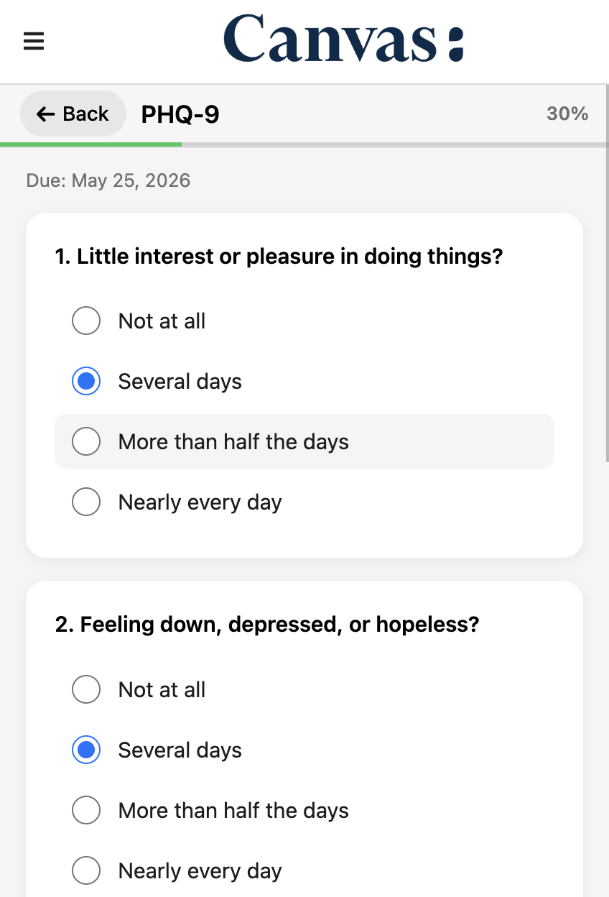
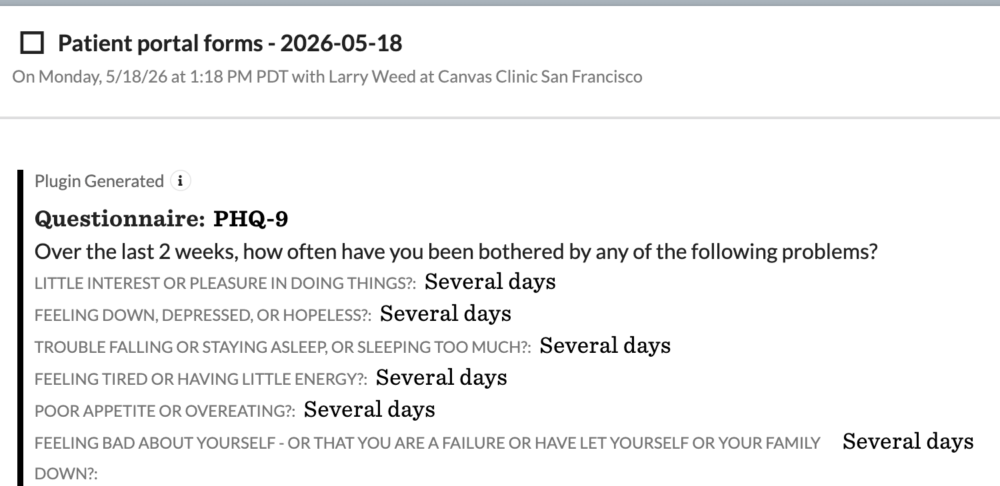
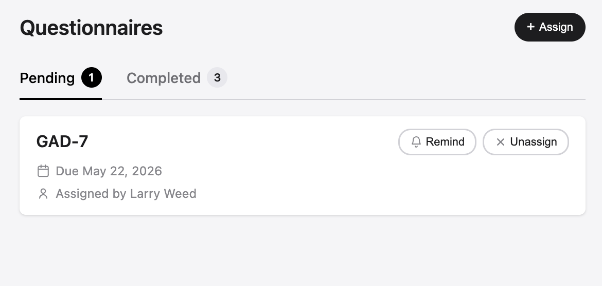
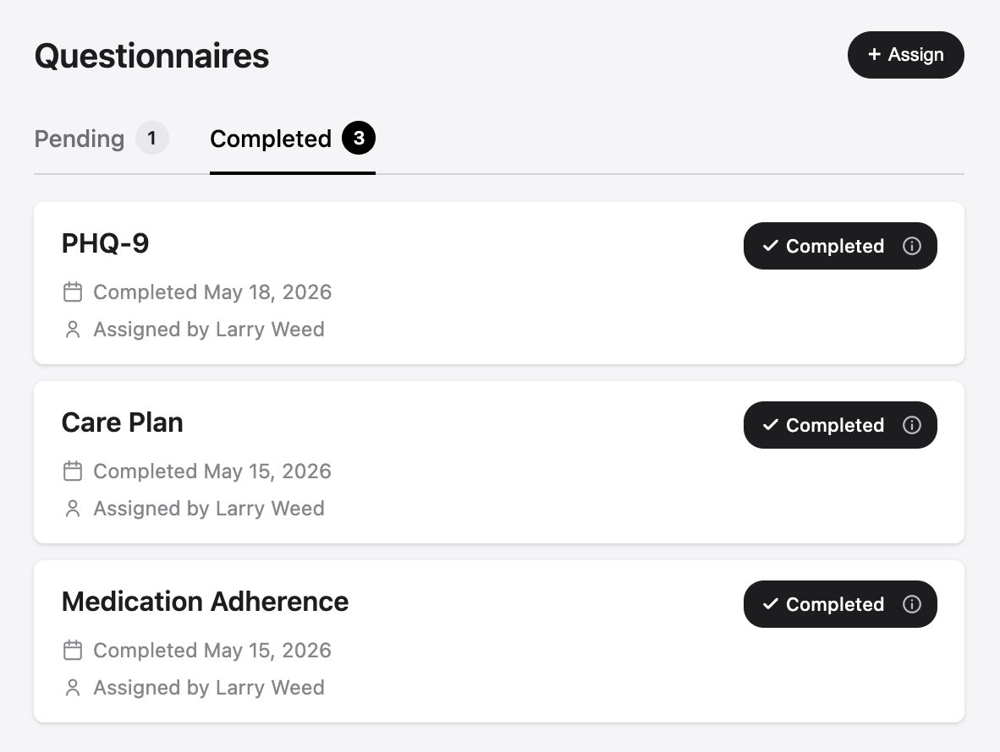
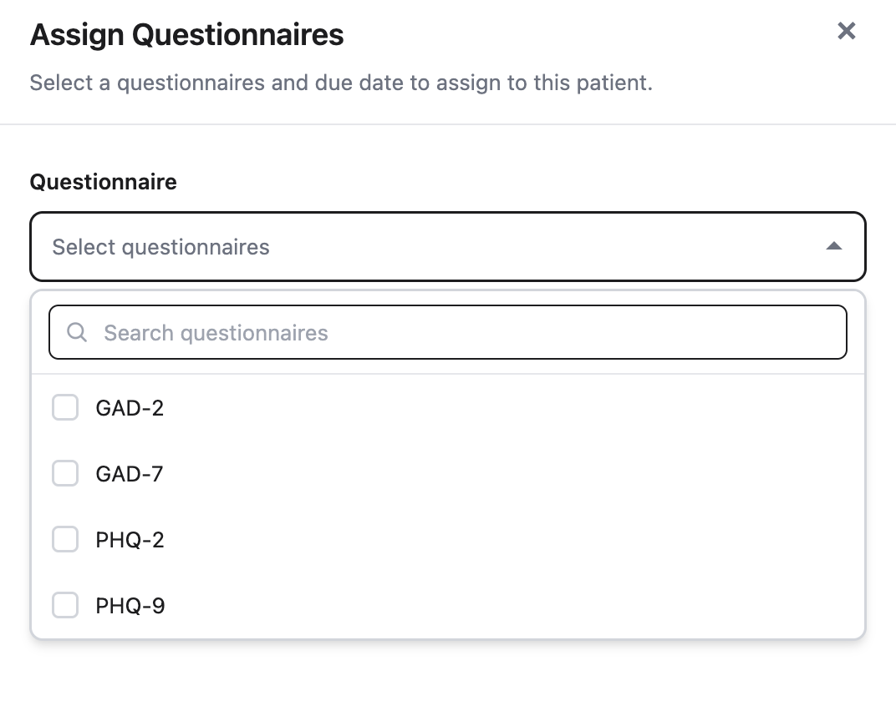
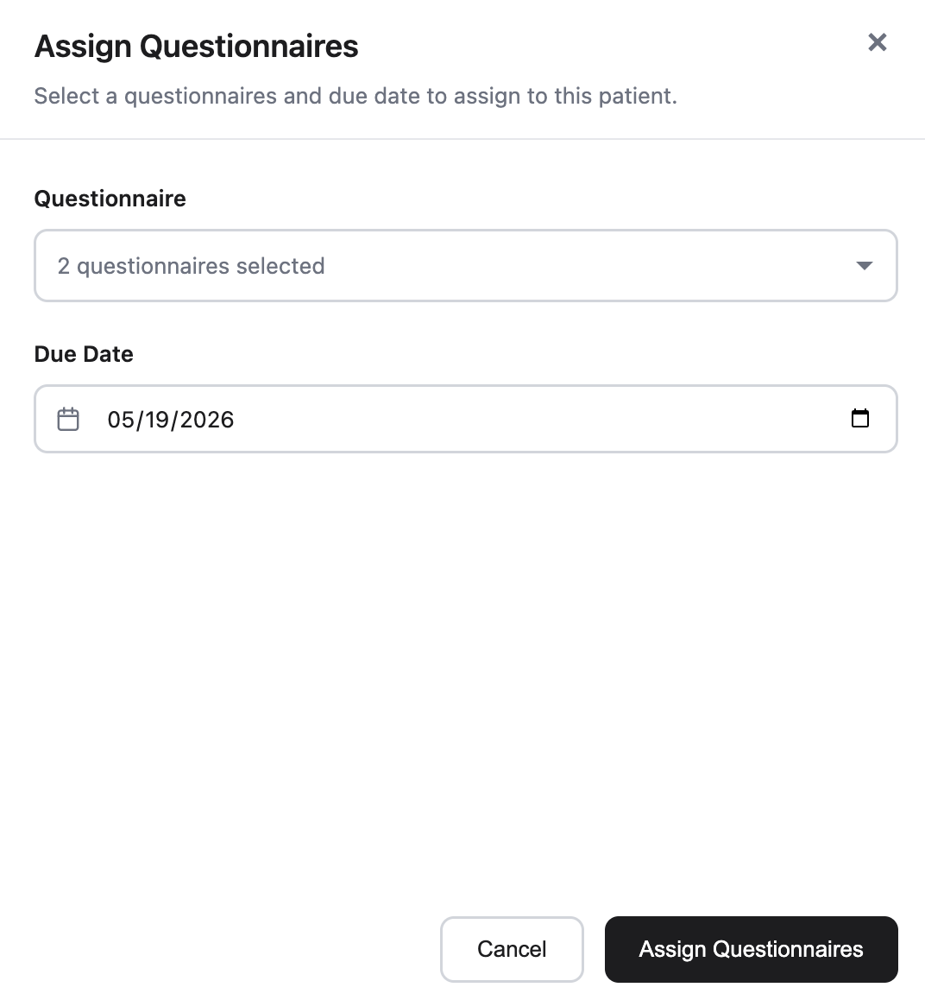
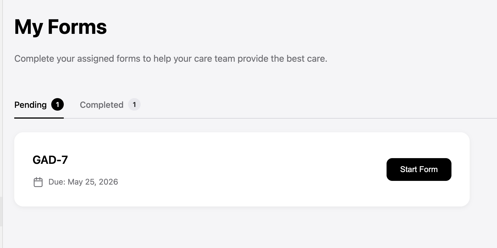
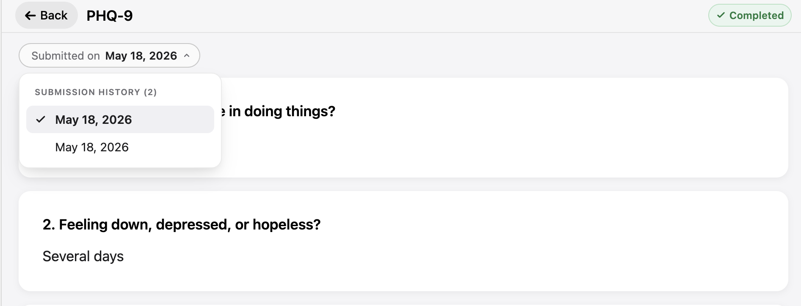

# Patient Portal Forms

## What it does

The Patient Portal Forms plugin enables healthcare providers to assign Canvas questionnaires to patients for completion through the patient portal. Patients fill out the forms at their convenience — before an appointment or asynchronously as part of ongoing care — and submissions land on the patient's chart automatically as a structured `QuestionnaireCommand` inside a daily "Patient Portal Form" note.

## Problem it solves

Saves clinicians time by shifting questionnaire completion out of the visit. Without the plugin, intake screens (PHQ-9, GAD-7, ROS, etc.) are either filled on paper in the waiting room and re-keyed into the chart, or collected through a separate e-form tool whose results have to be copied back into Canvas by hand. Either way, the structured-data value of the questionnaire is lost and the visit starts late. With the plugin, the patient does the entry through the portal, the responses flow into Canvas as a structured questionnaire response, and the provider walks into the visit with the screen already on the chart.

## Who it's for

Any practice that uses Canvas questionnaires as part of patient intake, periodic screening, or between-visit follow-up. The plugin is specialty-agnostic — primary care and behavioral health are the canonical use cases (PHQ-9 / GAD-7 style screens), but it works for any active questionnaire with `use_case_in_charting = "QUES"`. Both providers and support staff (MAs, care coordinators) can assign forms from the patient chart; patients with portal access can complete them.

## Screenshots

**Patient view — fill-out (mobile)**



A patient answers a PHQ-9 from the portal on their phone. Progress and due date are visible at the top; each question is a self-contained card with single-select responses.

**Resulting chart note**



When the patient submits, the responses land on the chart as a structured `QuestionnaireCommand` inside a daily-bundled "Patient portal forms" note, attributed to the provider who assigned the questionnaire. Same-day submissions of additional forms append to this note rather than creating new ones, so the clinician sees everything the patient filled out that day in one place.

**Provider view — Pending tab**



The "Patient Questionnaire" app on the patient chart. The Pending tab lists outstanding assignments with the due date and the assigning provider, plus inline **Remind** (sends a portal message) and **Unassign** actions. The tab badge counts make the current lifecycle state visible at a glance.

**Provider view — Completed tab**



The Completed tab shows submission history — newest first, with the completion date and the original assigning provider for each. Re-assigning a previously completed questionnaire creates a fresh outstanding row without rewriting history, so this list grows naturally over time and supports recurring screens (monthly PHQ-9, etc.).

**Assign dialog — questionnaire picker**



Clicking **+ Assign** opens a dialog that lists every active questionnaire on the instance whose `use_case_in_charting` is `QUES`. The picker is multi-select and searchable, so providers can stack several screens onto one assign action (e.g. PHQ-9 + GAD-7 in one go).

**Assign dialog — configured**



After selecting questionnaires and a due date, **Assign Questionnaires** persists the assignments and sends the patient a portal message listing exactly what was assigned with the due date.

**Patient view — Forms list**



The patient-side "My Forms" surface in the portal, reached from the portal menu. The tab strip shows the same Pending / Completed split as the provider view, and each pending row has a **Start Form** call-to-action that drops the patient straight into the fill-out template.

**Submission history**



When a questionnaire has been submitted more than once, the review template exposes a **Submission History** picker. Tapping a date swaps the rendered submission in place, so a patient (or a clinician walking back through the chart) can flip between every prior submission without leaving the screen. This is what makes recurring screens — monthly PHQ-9, periodic ROS — practical to track over time.

## Features

### Provider Features
- **Assign Questionnaires**: Providers can assign active Canvas questionnaires to patients with custom due dates
- **Track Progress**: View all assigned questionnaires for a patient, including completion status and due dates
- **Send Reminders**: Send reminder messages to patients for incomplete questionnaires
- **Unassign Forms**: Remove questionnaires that are no longer needed
- **Automated Notifications**: Patients automatically receive portal messages when forms are assigned

### Patient Features
- **Portal Access**: Dedicated "Forms" section in the patient portal menu
- **View Assignments**: See all assigned questionnaires with due dates and completion status
- **Fill Out Forms**: Complete questionnaires directly in the portal with a user-friendly interface
- **Automatic Submission**: Completed questionnaires are automatically saved to the patient's chart as notes

## Architecture

### Components

#### Applications
1. **PatientPortalFormsProviderApplication** (`patient_portal_forms_provider_application.py:10`)
   - Provider-facing application accessible from the patient chart
   - Opens in the right chart pane (large)
   - Allows providers to manage patient questionnaire assignments

2. **PatientPortalFormsPatientApplication** (`patient_portal_forms_patient_application.py:7`)
   - Patient-facing application accessible from the portal menu
   - Opens as a full-page modal
   - Allows patients to view and complete assigned questionnaires


#### API Protocols
1. **ProviderQuestionnaireAPI** (`patient_portal_forms_api.py:32`)
   - Endpoints for provider operations (view, assign, remind, unassign)
   - Authentication: Staff users only (`StaffSessionAuthMixin`)

2. **PatientQuestionnaireAPI** (`patient_portal_forms_api.py:137`)
   - Endpoints for patient operations (view forms, fill out questionnaires, submit)
   - Authentication: the logged-in patient, scoped to their own `patient_id`. Custom `authenticate()` enforces that the URL `patient_id` matches the session's user id and that the user type is `Patient`.

3. **PatientPortalFormsAdminAPI** (`patient_portal_forms_admin_api.py:31`)
   - One-shot admin endpoints for migrating legacy `portal_forms` `PatientMetadata` into the new CustomModel storage. Fails closed unless the `ENABLE_MIGRATION_ADMIN` secret is set.
   - Authentication: Staff users only (`StaffSessionAuthMixin`)

## How It Works

### Provider Workflow

1. **Open Application**: Provider opens "Patient Questionnaire" from the patient chart
2. **View Status**: See all currently assigned questionnaires for the patient
3. **Assign Form**:
   - Select from available active questionnaires
   - Set a due date
   - Optionally add notes
4. **Patient Notification**: Patient automatically receives a portal message with:
   - List of assigned questionnaires
   - Due dates
   - Link to the patient portal
5. **Send Reminders**: Provider can send reminder messages for incomplete forms
6. **Unassign**: Provider can remove questionnaires that are no longer needed

### Patient Workflow

1. **Receive Notification**: Patient receives a portal message about assigned questionnaires
2. **Access Portal**: Patient logs into the patient portal
3. **Navigate to Forms**: Click "Forms" in the portal menu
4. **View Assignments**: See list of assigned questionnaires with due dates and status indicators
5. **Complete Questionnaire**: Click on a questionnaire to fill it out
6. **Submit**: Submit completed questionnaire
7. **Automatic Charting**: Submission creates a "Patient Portal Form" note in the patient's chart with the questionnaire command

## Data Storage

### QuestionnaireAssignment (Custom Data)

Assigned questionnaires are persisted via the Canvas SDK Custom Data system
under the `canvas__patient_portal_forms` namespace. The plugin defines one
CustomModel:

| Field | Type | Notes |
|-------|------|-------|
| `patient` | ForeignKey(Patient) | the assigned patient |
| `questionnaire_name` | TextField | stored by name (not id) because publishing a new questionnaire version mints a new id |
| `assigning_provider` | ForeignKey(Staff) | the staff member who created the assignment |
| `due_date` | DateField | |
| `date_assigned` | DateTimeField | auto-populated on insert |
| `completed_at` | DateTimeField | `NULL` while outstanding; stamped on submission. Completed rows are retained as history. |

A partial `UniqueConstraint(patient, questionnaire_name)` — scoped to rows
where `completed_at IS NULL` — prevents a patient from having two outstanding
assignments for the same questionnaire at once. Re-assigning a questionnaire
that already has an outstanding row refreshes its due date in place;
re-assigning a questionnaire whose previous assignment was completed creates
a fresh outstanding row alongside the history. This makes recurring
questionnaires (e.g. monthly screens) natural to support.

If you are upgrading from a previous version that stored assignments in
`PatientMetadata`, see the [Migration from legacy metadata storage](#migration-from-legacy-metadata-storage)
section below.

### Note Creation
When a patient submits a questionnaire:
- A "Patient Portal Form" note is created on the patient's chart (one per calendar day per patient, bundling every questionnaire submitted that day).
- If the day's existing note is locked / relocked / deleted / cancelled, a fresh note is created and the per-day pointer is updated.
- If "Patient Portal Form" is not configured, the plugin falls back to a Data Import note. DATA notes are one-shot, so bundling is disabled — each submission gets its own note.
- The note is assigned to the provider who assigned the questionnaire.
- The responses are written via `QuestionnaireCommand`.
- The outstanding assignment row is stamped as completed once all effects are built (history is preserved across reassignments).

## How to install

From the plugin directory:

```bash
canvas install patient_portal_forms
```

Then complete the Canvas-instance setup:

1. **Provision a note type named "Patient Portal Form"** in your Canvas instance. This is what enables same-day bundling — every questionnaire a patient submits in one calendar day lands in the same note. Without it, the plugin falls back to a Data Import note type, which is a one-shot write: a second submission on the same day will create a new note (or worse, silently fail to land its responses) because DATA notes are finalized after the first write.
2. **Activate the questionnaires you want providers to be able to assign** by setting `use_case_in_charting = "QUES"` on each.
3. **Confirm the patient portal is enabled** for the patients you expect to use this — the plugin's patient-facing app is reached through the portal menu.

## Configuration options

The plugin has two operator-facing secrets, both declared in the manifest:

| Secret | Purpose | Default behavior when unset |
|---|---|---|
| `namespace_read_write_access_key` | Read/write access key for the plugin's custom-data namespace (`canvas__patient_portal_forms`). Auto-generated by `plugin-runner` on install. | Plugin can't read or write its CustomModels. |
| `ENABLE_MIGRATION_ADMIN` | Gates the one-shot `/admin` migration UI used when upgrading from `0.1.x` (legacy `PatientMetadata` storage). | Migration endpoints return `403 Forbidden`. **This is the safe default** — leave unset unless you are actively migrating. |

There are no other thresholds or runtime knobs — the plugin uses the Canvas questionnaires you activate and the note type you provision, and otherwise has no tuning surface.

## Migration from legacy metadata storage

Versions prior to `0.2.0` stored assigned questionnaires as JSON in
`PatientMetadata` under the key `portal_forms`. Starting in `0.2.0` they
live in `QuestionnaireAssignment` and `PatientDailyNote` CustomModels under
the `canvas__patient_portal_forms` namespace. A one-time migration tool is
included to move existing data into the new models.

The migration handles **both** legacy metadata shapes:

- **`main` / v0.0.x metadata** — entries are all pending. Each becomes an
  outstanding `QuestionnaireAssignment` row.
- **v2 (`0.1.x`) metadata** — entries can have `completed_date` and
  `submitted_answers`. Completed entries become history rows (`completed_at`
  set, `submitted_answers` snapshotted onto the row). The top-level
  `daily_notes` map (`{"YYYY-MM-DD": note_uuid}`) becomes `PatientDailyNote`
  rows so same-day bundling continues to find an existing note immediately
  after the migration. Idempotent — re-running is safe; duplicates are
  detected by (patient, questionnaire_name, completed_at) for history rows
  and (patient, date) for daily-note rows.

The migration UI is deliberately unlisted — there is no menu entry —
because it is expected to be run once per Canvas instance and then
forgotten. The operator running it should:

1. **Enable the admin** — set the `ENABLE_MIGRATION_ADMIN` secret on the
   plugin to any non-empty value. Until this is set, the admin endpoints
   return `403 Forbidden`, so the tool is inert.
2. **Navigate to the admin page** at
   `/plugin-io/api/patient_portal_forms/admin` — a staff session is
   required (the endpoints use `StaffSessionAuthMixin`).
3. **Run Step 1: Migrate now** — walks every legacy `portal_forms`
   metadata row and creates equivalent `QuestionnaireAssignment` rows.
   Idempotent and safe to re-run; rows whose `assigning_provider` no
   longer resolves to a Staff record are logged and skipped.
4. **Spot-check the new data** — open a few patient charts in the
   provider view and confirm the previously assigned questionnaires
   appear with the correct due dates and assigning providers.
5. **Run Step 2: Clear legacy metadata** — overwrites each `portal_forms`
   row's value with an empty string so nothing reads it again. The SDK
   only exposes `upsert` on `PatientMetadata` (there is no delete), so
   the row itself remains but is inert. The button is disabled until
   Step 1 has been run at least once during this page session, and a
   confirmation dialog guards the click. Already-empty rows are skipped,
   so re-running has no effect.
6. **Disable the admin** — unset `ENABLE_MIGRATION_ADMIN` so the
   endpoints return `403` again.

### Direct API access

The two-step UI is just a thin wrapper around two endpoints. Operators
who prefer scripting can call them directly with a staff session, after
setting `ENABLE_MIGRATION_ADMIN`:

```
POST /plugin-io/api/patient_portal_forms/admin/migrate-metadata
POST /plugin-io/api/patient_portal_forms/admin/clear-legacy-metadata
```

Both return JSON with counts of rows created / cleared and any per-row
warnings.

## API Endpoints

### Provider Endpoints
- `GET /plugin-io/api/patient_portal_forms/provider-view/patient/{patient_id}` - View patient's assigned questionnaires
- `POST /plugin-io/api/patient_portal_forms/provider-view/patient/{patient_id}/assign` - Assign questionnaires
- `POST /plugin-io/api/patient_portal_forms/provider-view/patient/{patient_id}/remind` - Send reminder message
- `POST /plugin-io/api/patient_portal_forms/provider-view/patient/{patient_id}/unassign` - Unassign a questionnaire

### Patient Endpoints
- `GET /plugin-io/api/patient_portal_forms/patient-view/patient/{patient_id}` - View assigned questionnaires
- `GET /plugin-io/api/patient_portal_forms/patient-view/patient/{patient_id}/questionnaire/{questionnaire_name}` - View questionnaire details
- `POST /plugin-io/api/patient_portal_forms/patient-view/patient/{patient_id}/questionnaire/submit` - Submit completed questionnaire

### Admin Endpoints
- `GET /plugin-io/api/patient_portal_forms/admin` - Admin landing page (migration UI)
- `POST /plugin-io/api/patient_portal_forms/admin/migrate-metadata` - Step 1: copy legacy `portal_forms` PatientMetadata into `QuestionnaireAssignment` rows. Idempotent.
- `POST /plugin-io/api/patient_portal_forms/admin/clear-legacy-metadata` - Step 2: overwrite each `portal_forms` PatientMetadata row's value with an empty string. The SDK does not expose a delete effect for PatientMetadata, so the rows remain but their data is neutralized. Run after Step 1 has been verified. Idempotent (already-empty rows are skipped).

## Technical Details

### Dependencies
- Canvas SDK with Custom Data support (`CustomModel`, `ModelExtension`)
- Uses Canvas data models: Patient, Staff, Questionnaire, NoteType
- Uses Canvas effects: LaunchModalEffect, Note, Message
- Uses Canvas commands: QuestionnaireCommand
- Declares a CustomModel `QuestionnaireAssignment` under the namespace `canvas__patient_portal_forms`

### Authentication
- Provider endpoints: Restricted to Staff users
- Patient endpoints: Restricted to the logged in patient's data

### Template Files
- `provider_view_questionnaires.html` - Provider interface for managing assignments
- `patient_view_questionnaires.html` - Patient list of assigned questionnaires
- `patient_fill_out_questionnaire.html` - Questionnaire fill-out form
- `patient_review_questionnaire.html` - Read-only view of a completed submission, with a submission-history picker
- `patient_message.html` - Message template sent to patients when forms are assigned
- `admin_migration.html` - Two-step migration UI (Step 1: migrate, Step 2: clear legacy metadata)
- `admin_disabled.html` - Landing page when `ENABLE_MIGRATION_ADMIN` is not set
- `404.html` - Error page
