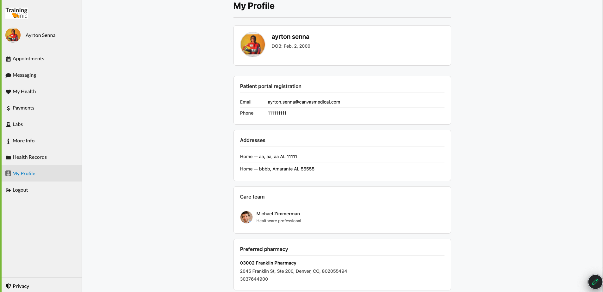

patient-portal-profile
======================

## What it does

Adds a **My Profile** menu item to the Canvas patient portal. When a logged-in
patient opens it, the plugin renders a read-only page showing the personal
information Canvas holds for them — photo, full name, birthdate, registration
email and phone, addresses on file, active care team members, and preferred
pharmacy.



## Problem it solves

Patients often want to confirm the contact info, addresses, care team, and
pharmacy the clinic has on file — but Canvas's patient portal doesn't include
a "my information" view out of the box. Today they have to call the front desk
or message their care team to ask, and staff have to look it up and reply
manually. This plugin gives patients self-serve visibility into their own
profile data, with no staff intervention.

v1 is read-only; updates still go through staff.

## Who it's for

- **Practices** that want to reduce inbound "what do you have on file for me?"
  questions from their patient population.
- **Patients** using the Canvas patient portal who want to verify their own
  contact info, addresses, care team, and preferred pharmacy.
- **All specialties** — the data shown is universal patient profile
  information, not specialty-specific.

## How to install

```
canvas install patient-portal-profile
```

No secrets, environment variables, or post-install configuration are required.
Once installed, every logged-in patient sees a **My Profile** entry in the
portal menu.

## How it works

- `ProfileApplication` (scope `portal_menu_item`) handles `Application.on_open`
  and returns a `LaunchModalEffect` targeting `PAGE`. The iframed URL points to
  this plugin's own SimpleAPI endpoint.
- `ProfileWebApp` is a `SimpleAPI` protected by `PatientSessionAuthMixin`, so
  only logged-in patients can reach it. It serves:
  - `GET /app/profile` — server-rendered HTML for the currently authenticated
    patient (resolved from `canvas-logged-in-user-id`).
  - `GET /app/main.js`, `GET /app/styles.css` — the static assets the page
    references.
- The care-team membership list is fetched with a single
  `CareTeamMembership.objects.values(...).filter(...)` call to avoid N+1.
- Patient data is loaded once via
  `Patient.objects.select_related("user").prefetch_related("addresses", "photos", "settings").get(...)`,
  so `patient.photo_url` and `patient.preferred_pharmacy` don't trigger
  extra queries.

## Layout

```
patient_portal_profile/
├── CANVAS_MANIFEST.json
├── applications/
│   └── profile_application.py    # ProfileApplication (portal_menu_item)
├── handlers/
│   └── profile_web_app.py        # ProfileWebApp (SimpleAPI)
├── assets/
│   ├── icon.png                  # 48x48 menu-item icon
│   └── screenshot-my-profile.png # README screenshot
└── static/
    ├── index.html                # Django template rendered server-side
    ├── styles.css
    └── main.js
```
