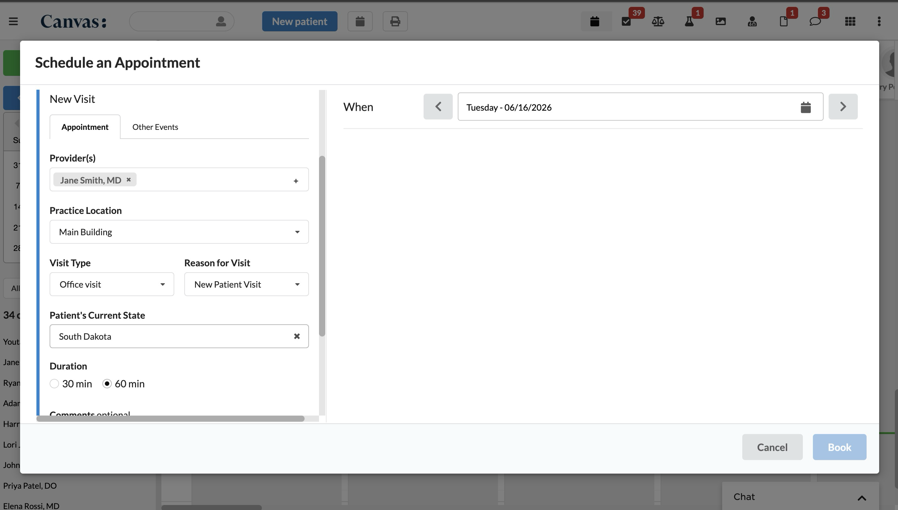

# Patient State Scheduling

Adds a "Patient's Current State" dropdown to the Canvas appointment scheduling
form and filters the practice-location options based on the selected state.

## What it does

Two event-driven protocol handlers work together on the appointment scheduling
form:

1. **AdditionalFieldsHandler** — adds a single **"Patient's Current State"**
   dropdown (all 50 states + DC). Staff choose the state the patient is
   currently located in; it is asked during scheduling, not read from the
   patient's address.
2. **LocationFilterHandler** — when the location dropdown is populated, it
   filters the options to the practice locations allowed for the selected state.

## Problem it solves

When scheduling, staff must pick a practice location that is valid for the
patient's current state — for example, for licensure or jurisdiction reasons.
By default every location appears regardless of context, which is slow and
error-prone. This plugin narrows the location list to the ones appropriate for
the selected state.

## Who it's for

Multi-state provider organizations whose schedulers need to route appointments
to the correct licensed practice location based on where the patient is located.

## How to install

```
canvas install patient_state_scheduling --host <your-instance>
```

## Configuration

The state → location mapping is read from the `LOCATION_MAPPING` plugin secret,
set per instance under the plugin's Settings (or via `canvas config set`). It is
a JSON object keyed by full state name, plus a `default` entry applied to any
state not listed explicitly. Each value is a list of practice-location names; a
location is kept when one of those names appears in its display text.

Example:

```json
{
  "default":     ["Main Street Clinic"],
  "California":  ["West Coast Medical Group"],
  "New York":    ["East Coast Medical Group"],
  "Kansas":      ["Central Plains Clinic"],
  "New Jersey":  ["Garden State Health"]
}
```

With this example, California shows only "West Coast Medical Group", and any
state without its own entry (e.g. Colorado) shows "Main Street Clinic". The
location names you configure must match — as a substring — the practice-location
display names on your instance.

Because the mapping lives in a secret, it can be changed without a code change or
redeploy.

### Behavior

Filtering **fails open**: if no state is selected, the secret is missing or
invalid, or no rule (and no `default`) matches the selected state, all locations
are shown so scheduling is never blocked by configuration.

## Screenshots

The "Patient's Current State" field on the Schedule an Appointment form. The
practice-location list is filtered to the locations allowed for the selected
state.



## Running tests

```
uv run pytest tests/
```
