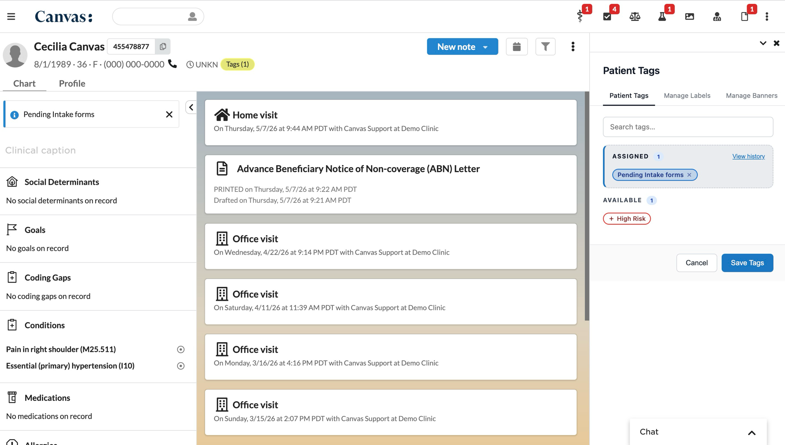

patient-tags
=======================

## What it does

Adds a "Tags" action button to the patient chart header that opens a right-pane modal for assigning user-defined labels (e.g. "Do not contact", "Treatment contract", "VIP", "Banned") to the patient. Labels can optionally be grouped into shared banner alerts that surface as colored banners on the chart, timeline, profile, scheduling card, or appointment card. Every assignment change is recorded in a per-patient audit history, and an external bearer-token API lets third-party systems (Zapier, custom integrations, automation rules) set patient tags programmatically.

## Problem it solves

Clinic operations teams need a lightweight way to flag patients with operational metadata that isn't captured by clinical structured data — things like "do not contact", "do not schedule until provider sign-off", "treatment contract on file", "high-no-show risk", "VIP", or per-clinic workflow stages. Without this plugin, that metadata typically lives in chart notes, sticky notes, ad-hoc lists in spreadsheets, or staff memory — none of which surface on the chart automatically, none of which audit who set what when, and none of which integrate with downstream automation. This plugin gives clinic-ops a first-class place to define and assign those tags, with banner alerts for the high-priority ones and a programmatic API for systems that need to react to them.

## Who it's for

Designed for clinic operations, intake, scheduling, billing, and care-management staff who need to triage patients on operational criteria. Useful across any specialty where staff handle non-clinical patient flags — including primary care, behavioral health, specialty practices, and DTC clinics. Administrators define the labels and banner groups; front-desk and ops staff assign them per patient.

## Screenshots

The "Tags" action button lives in the patient chart header. Clicking it opens a right-pane modal with three tabs: **Patient Tags** for assigning labels to the patient, **Manage Labels** for the label catalog, and **Manage Banners** for the banner-group configuration. Labels that belong to a banner group surface as a colored alert in the chart sidebar (here, the blue "Pending Intake forms" banner on the left).



## Installation

```
canvas install patient_tags
```

## Plugin secrets

Configure these in the Canvas instance plugin settings. All are optional; defaults are noted.

| Secret | Default | Effect |
|---|---|---|
| `MANAGE_TABS_ROLES` | unset (visible to everyone) | Comma-separated list of `StaffRole.internal_code` values (e.g. `MD,DO,AD`). When set, only users with one of those roles see the Manage Labels and Manage Banners tabs. |
| `API_TOKEN` | unset (API closed) | Bearer token for the external API. The API rejects all requests until this is set. |

## External API

When `API_TOKEN` is set, the plugin exposes a bearer-authenticated REST API for reading available labels and assigning tags to patients. Useful for third-party integrations (Zapier, custom apps, automation rules) that need to set patient tags programmatically.

### Base URL

```
https://<instance>.canvasmedical.com/plugin-io/api/patient_tags
```

Replace `<instance>` with the Canvas instance hostname.

### Authentication

Every request requires a bearer token in the `Authorization` header:

```
Authorization: Bearer <API_TOKEN>
```

Requests without the header, with a malformed header, or with a wrong token return `401 Unauthorized`. If `API_TOKEN` is unset on the instance, the API rejects everything.

### Endpoints

#### List available labels

```
GET /api/labels
```

Returns metadata for every label so external systems can map their domain concepts to label IDs.

```json
{
  "labels": [
    {
      "id": 1,
      "name": "Banned",
      "description": "Patient is no-contact",
      "color": "red",
      "assignable_in_chart": true,
      "assignable_in_profile": true,
      "banner_group_id": 3,
      "banner_group_name": "Clinic Ops Contact Label Alerts"
    }
  ]
}
```

#### Get a patient's current tags

```
GET /api/patients/<patient_uuid>/labels
```

```json
{ "label_ids": [1, 5, 12] }
```

#### Replace a patient's tags

```
POST /api/patients/<patient_uuid>/labels
Content-Type: application/json

{ "label_ids": [1, 5] }
```

The supplied list becomes the patient's complete tag set. **Anything not in the list is removed.** Triggers configured rule cascades (auto_assign / auto_remove) and reconciles patient banners.

Body alternative — by name (server resolves to IDs):

```json
{ "labels": ["Banned", "Do not contact"] }
```

To clear all tags:

```json
{ "label_ids": [] }
```

Response:

```json
{ "status": "ok", "label_ids": [1, 5] }
```

#### Add tags (idempotent)

```
POST /api/patients/<patient_uuid>/labels/add
Content-Type: application/json

{ "labels": ["VIP"] }
```

Adds the listed labels to whatever the patient already has. Already-assigned labels are skipped (no duplicate, no error, no rule re-trigger). Triggers rule cascades for newly-added labels.

Response:

```json
{
  "status": "ok",
  "added": [3],
  "already_present": [1],
  "label_ids": [1, 3, 5]
}
```

#### Remove tags (idempotent)

```
POST /api/patients/<patient_uuid>/labels/remove
Content-Type: application/json

{ "labels": ["Banned"] }
```

Removes only the listed labels. Other tags stay. Labels not currently assigned are silently skipped. Does not trigger rules (rules fire on assignment only).

Response:

```json
{
  "status": "ok",
  "removed": [1],
  "not_present": [99],
  "label_ids": [3, 5]
}
```

### Body shape — `label_ids` vs `labels`

All three POSTs accept the same body shape. Pick one:

- `{"label_ids": [1, 2]}` — preferred for stable integrations (IDs are stable; names can be edited)
- `{"labels": ["Banned", "VIP"]}` — friendlier for ad-hoc scripts; resolves names → IDs server-side. Returns `400 Unknown labels: [...]` if any name doesn't match.

If both keys are present, `label_ids` wins.

### Error responses

| Status | Body | Cause |
|---|---|---|
| `401` | (auth error) | Missing / malformed / wrong bearer token, or `API_TOKEN` secret unset |
| `400` | `{"error": "label_ids must be a list of integers."}` | `label_ids` not a list of ints |
| `400` | `{"error": "labels must be a list of label names."}` | `labels` not a list |
| `400` | `{"error": "Unknown labels: [\"Foo\"]"}` | Name in `labels` doesn't match any label |
| `400` | `{"error": "Body must include either 'label_ids' or 'labels'."}` | Neither field present |
| `400` | `{"error": "Unknown label IDs: [99]"}` | An ID in `label_ids` doesn't exist (add endpoint only) |

### Audit trail

Every change made through the API writes an audit row attributed to actor `"API"`, visible in the in-app **View History** modal alongside staff actions. This lets clinic staff distinguish programmatic changes from manual ones.

### Patient identifier

The endpoints take the Canvas patient UUID in the URL path. The plugin does not provide patient lookup — the third party must already have the UUID, typically via Canvas's FHIR Patient API or a webhook payload that includes it.

### Security considerations

#### Token scope and blast radius

`API_TOKEN` is a single shared secret. Any caller holding it can read and write tags for **every patient** in the instance (full plugin write access — replace, add, remove). The token is the only access barrier; there is no per-patient, per-tenant, or read-only/write-only scoping at the plugin layer.

In practice this means:

- Treat `API_TOKEN` as a high-trust credential. Compromise = full label-tampering capability across the entire patient population.
- Limit who can read it. Prefer storing in a managed secrets vault (1Password, AWS Secrets Manager, etc.) over plain env vars on shared boxes.
- Do not hand it to client-side code, browser extensions, or anything that runs in user space — server-to-server only.
- Pin which integrations use it. Audit access at the consumer side; the plugin cannot tell two callers apart.

#### Token generation

Use a strong random value — 32 URL-safe bytes is the minimum recommendation:

```bash
python -c "import secrets; print(secrets.token_urlsafe(32))"
```

Avoid human-chosen tokens, dictionary words, or values reused from other systems.

#### Token rotation

Rotate on any of these triggers: suspected leak, employee departure with secret access, end of integration project, scheduled key-rotation cadence (recommend every 90 days minimum), or before scaling access to additional consumers.

To rotate: generate a new strong random token, update the `API_TOKEN` secret in the Canvas plugin settings, and propagate the new value to all consumers. The change takes effect immediately. There is no way to support multiple tokens simultaneously — coordinate cutover.

To revoke entirely: clear the `API_TOKEN` secret. The API immediately rejects every request with `401 Unauthorized` until a new token is set.

#### Audit and detection

Every API mutation writes an audit row attributed to actor `"API"` (visible in the View History modal). If you suspect token misuse, review per-patient history for `actor: "API"` entries with unexpected timing or volume. The plugin does not currently emit per-request access logs — Canvas platform logs are the source of truth for inbound HTTP traffic.

#### Logging hygiene

The plugin itself does not log credentials. When integrating, ensure that consumer code, reverse proxies, or APM tools do not log the `Authorization` header or any URL containing the token.

### Examples (curl)

```bash
TOKEN="<your bearer token>"
PATIENT="<patient uuid>"
HOST="https://<instance>.canvasmedical.com/plugin-io/api/patient_tags"

# Discover labels
curl -H "Authorization: Bearer $TOKEN" "$HOST/api/labels"

# Get current
curl -H "Authorization: Bearer $TOKEN" "$HOST/api/patients/$PATIENT/labels"

# Add by name (idempotent)
curl -X POST -H "Authorization: Bearer $TOKEN" -H "Content-Type: application/json" \
  -d '{"labels": ["Banned"]}' \
  "$HOST/api/patients/$PATIENT/labels/add"

# Remove by name (idempotent)
curl -X POST -H "Authorization: Bearer $TOKEN" -H "Content-Type: application/json" \
  -d '{"labels": ["Banned"]}' \
  "$HOST/api/patients/$PATIENT/labels/remove"

# Replace whole set by ID
curl -X POST -H "Authorization: Bearer $TOKEN" -H "Content-Type: application/json" \
  -d '{"label_ids": [1, 5]}' \
  "$HOST/api/patients/$PATIENT/labels"
```

## CANVAS_MANIFEST

The CANVAS_MANIFEST.json is used when installing your plugin. Ensure it gets updated when you add, remove, or rename files or class names.

Required CANVAS_MANIFEST.json fields:
- `sdk_version` (string) — The version of the Canvas SDK
- `plugin_version` (string) — The version of your plugin
- `name` (string) — The name of your plugin
- `description` (string) — Description of your plugin
- `components` (object) — Must have at least 1 component property
- `tags` (object) — Tags for categorizing your plugin
- `license` (string) — License information
- `readme` (string or boolean) — Path to readme or false
