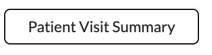
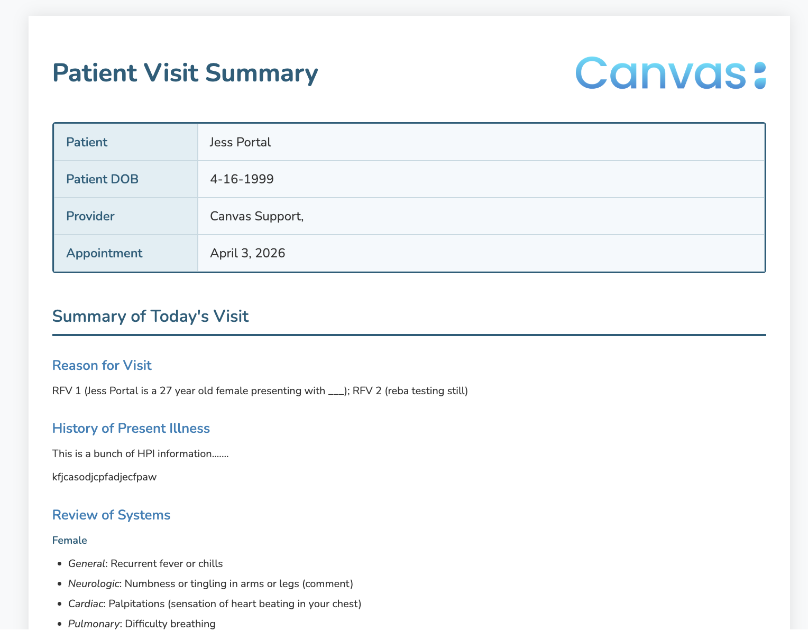
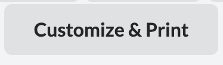
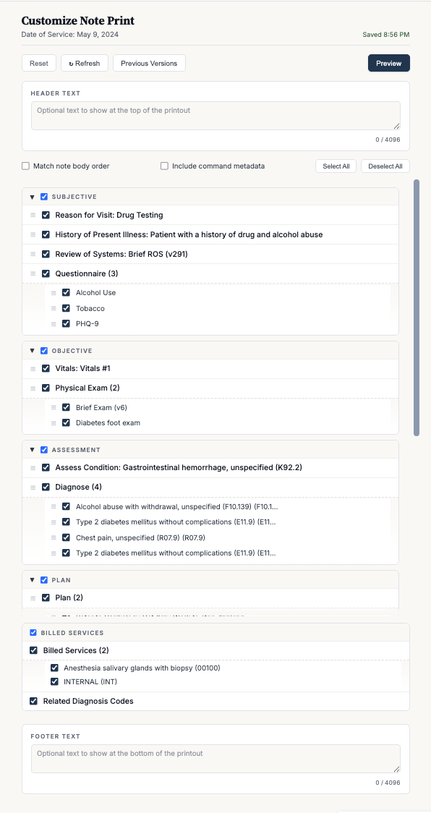

# Patient Visit Summary

## What it does

This plugin turns a clinical note into a clean, printable visit summary. It adds
buttons to the note that let you open a patient-friendly summary of the visit and
print it or save it as a PDF to hand to the patient, and open a "Customize &
Print" panel where staff pick exactly which parts of the note to include,
reorder them, add header and footer text, preview the result, and save a
finalized PDF back to the patient's chart so it can be found again later.

## Problem it solves

Canvas's out-of-the-box note print is clinician-oriented and inflexible —
it surfaces internal workflow fields, doesn't let staff control what gets
included, and the resulting print isn't durably attached back to the chart
for later retrieval. Practices end up with two competing pain points:

1. **Patients need a clean handout.** Today the common workaround is to
   copy the note's contents into Word or Google Docs, reformat by hand
   every visit, and print from there — slow, error-prone, and easy to
   omit relevant sections.
2. **Staff need a finalized, customizable clinical record.** The chart
   note is the source of truth, but the printable artifact (for legal,
   billing, audit, or patient-portal distribution) needs section-level
   control, optional header/footer text, custom comments, and a stable
   archive of every previously generated version.

This plugin solves both with two complementary surfaces:

- **Patient Visit Summary** builds a formatted, print-ready visit handout
  directly from the note's structured data in one click. Internal
  clinical-workflow fields are filtered out automatically so the patient
  sees only what's useful to them.
- **Customize & Print** lets staff toggle / reorder sections, match the
  note body order, include or exclude plugin-authored `CommandMetadata`,
  add header / footer / custom-comment text, preview live, and generate a
  finalized PDF that is attached back to the chart as an
  **Uncategorized Clinical Document** (retrievable via FHIR
  `DocumentReference`). Previously saved versions remain accessible from
  the same modal for re-print or delete.

Plugin authors extending the chart with custom commands get their content
surfaced automatically — auto-discovered schema keys render as Custom
Commands, `Command.custom_html` renders as a body block, and
`CommandMetadata` rows appear when the staff toggle is on.

## Who it's for

This plugin is **specialty-agnostic** — the section coverage mirrors
SOAP structure (vitals, conditions, medications, orders, immunizations,
procedures, history, goals, follow-up, billed services) and works
equally well for primary care, behavioral health, and most specialty
workflows.

Three audiences benefit:

- **Providers** finalizing a visit at the end of an encounter — generate a
  clean PDF for the chart, hand a patient-friendly summary to the patient
  at checkout.
- **Clinical and administrative staff** who curate visit documentation for
  legal, billing, audit, or patient-portal distribution — they get
  section-level toggles, custom header/footer/comment fields, and an
  archive of every previously saved version per note.
- **Plugin authors** building custom commands on top of the Canvas SDK —
  their commands render automatically (auto-discovered schema keys), and
  they can attach inline HTML (`Command.custom_html`) or key/value
  metadata (`CommandMetadata`) that the staff toggle surfaces in the
  print without any plugin coordination.

## Screenshots or screen recordings

> Screenshots use synthetic data on a development instance.

**Patient Visit Summary button (note header)**



**Rendered visit summary**



The print-ready summary modal, with a header logo/org block, a patient/visit
detail table, and the SOAP-organized content below. The **Print** button sends
it to the browser print / save-as-PDF dialog.

**Customize & Print button (note footer)**



**Customize & Print panel**



The customize panel: toggle and reorder sections, add optional header/footer
text, preview, and generate the finalized PDF that is attached to the chart.

## How It Works

The plugin declares five components in `CANVAS_MANIFEST.json`:

1. **`PatientVisitSummaryButton`** (`handlers/patient_visit_summary.py`) — note-header
   `ActionButton` that launches the summary modal.
2. **`PatientVisitSummaryAPI`** (`handlers/patient_visit_summary.py`) — SimpleAPI that
   fetches the note's clinical data (via `services/note_data_extractor.py`) and
   renders `templates/patient_visit_summary.html`.
3. **`CustomizePrintButton`** (`handlers/customize_print.py`) — note-footer
   `ActionButton` that launches the Customize & Print modal.
4. **`CustomizePrintHeaderButton`** (`handlers/customize_print.py`) — note-header
   `ActionButton` that launches the same Customize & Print modal from the note
   header (alternative entry point).
5. **`CustomizePrintAPI`** (`handlers/customize_print.py`) — SimpleAPI that renders
   the customize UI, persists the selection to the `CustomizedNotePrint` custom
   model, generates the PDF, and creates the FHIR `DocumentReference`.

Both SimpleAPIs authenticate via Canvas staff session credentials, with a shared
API key (`simple-api-key`) as a fallback (constant-time compared). Endpoints
address notes and finalized prints by their external **UUIDs**, never the
internal sequential `dbid`.

### Data extraction

`services/note_data_extractor.py` is the single source of truth for what each
review/print surfaces. It walks the note's committed commands, fetches the
necessary anchor models (Prescriptions, LabReports, ReferralReports, etc.), and
builds a fully-shaped template context. Key behaviors:

- **Schema-key driven** — every renderable command type is mapped in
  `_CONTEXT_KEY_SCHEMA_KEYS`; the extractor's individual fetch helpers iterate
  this map.
- **Plugin custom-command auto-discovery** — any committed `schema_key` on the
  note that isn't explicitly handled (e.g., `observationSummary`,
  `healthRiskAssessmentSummary`, anything registered by another plugin via
  home-app's `customize_custom_command`) is picked up by
  `_fetch_unknown_command_data` and rendered as a custom command. The heading
  prefers the plugin author's registered `PluginCommand.label` (stamped by
  `_attach_plugin_command_details`), falling back to a humanized schema key only
  when no registered row matches. Each command is also routed to its registered
  `PluginCommand.section` (`subjective` / `objective` / `assessment` / `plan` /
  `procedures` / `history`) so it prints under the right section heading;
  commands with no recognized section (or the provider-only `internal` section)
  fall back to a standalone "Custom Commands" section. See
  `_route_custom_commands_to_sections` and the `custom_commands_<section>`
  buckets in `DEFAULT_SECTIONS`.
- **UUID stamping** — every command entry returned by `_fetch_all_commands_data`
  (and the refill-decision / unknown-command variants) carries
  `_command_uuid` so the modal can order entries by `Note.body` position.
- **Anchor-model joins** — several command types are enriched from their
  anchor model (resolved via `command.anchor_object_dbid`):
  - Refill/change decision commands carry their Prescription's TOTAL QUANTITY
    / DIRECTIONS / PHARMACY rows.
  - Lab/Imaging/Referral/Uncategorized review commands carry their report
    content as a pre-rendered `Reference Data:` HTML block (via
    `_attach_*_review_reference_html` / `_attach_imaging_review_reference_html`).
    Lab reports also surface their report-level `Comment:` (`LabReportRemark`),
    and imaging reports surface their per-field codings (`ImagingReportCoding`).
  - `chartSectionReview` commands carry the reviewed-items list
    (`ChartSectionReview.content`) as `section_content`.
  - `visualExamFinding` commands carry a presigned image URL
    (`VisualExamFinding.image_url`) as `image_url`, rendered inline as an
    ``.
- **`Command.custom_html`** — the new top-level `custom_html` field (still
  being rolled out — see `https://docs.canvasmedical.com/sdk/data-command/#command`)
  is detected at import-time via `hasattr(Command, "custom_html")` and surfaced
  inline as a `body_html` block right after each command's heading. Rendering
  is silently skipped on instances that haven't been migrated yet.
- **`CommandMetadata`** — plugin-authored key/value rows are fetched via
  `_attach_command_metadata` and stamped on each entry as `_metadata`. The
  block renderer keeps these in a separate `metadata_blocks` array so the
  modal's "Include command metadata" checkbox can toggle them on/off
  without rebuilding the preview.

### Customize & Print modal features

- **Reorder + toggle** — drag commands to reorder, uncheck to exclude.
- **Match note body order** toggle — flattens the SOAP grouping into a single
  list ordered by `Note.body` position.
- **Include command metadata** toggle — off by default; when on, appends each
  command's `CommandMetadata` rows as fields beneath the main content. Most
  metadata is internal plugin state (workflow stage, external IDs), so it's
  opt-in to avoid noise.
- **Header text / footer text** — free-text fields above / below the rendered
  note in the PDF.
- **Custom comment** — captured at save time and stamped as a
  `document-reference-comment` FHIR extension on the resulting
  `DocumentReference`.
- **Reset** — clears all toggles, custom order, header/footer, and custom
  comment back to defaults.
- **Refresh** — re-fetches the note's commands without closing the modal.
- **Previous Versions** — lists previously saved PDFs from the
  `CustomizedNotePrint` model with view / delete actions.
- **Print/Save unified button** — saves the PDF then prints via a hidden
  same-origin iframe (avoids the Canvas chrome appearing in the print
  header).

## What's Included in the Summary

Two surfaces, two audiences:

- **Customize & Print** (provider/staff-finalized PDF) renders the **full**
  list of commands documented below. The provider can still toggle individual
  items off in the modal before printing.
- **Patient Visit Summary** (patient-facing HTML) renders a **curated subset**
  of the same data — internal clinical-workflow commands are skipped (see
  "Patient-facing curation" at the bottom of this section) so the output
  reads cleanly for a non-clinician.

The list below applies to the **Customize & Print** surface. Every
renderable command type uses Canvas's command verb as its label (singular,
matching the on-screen command UI — "Diagnose" not "Diagnoses", "Refer" not
"Referral", etc.) so the print reads identically to what the provider
entered.

**Subjective**
- Reason for Visit (with optional comment)
- History of Present Illness
- Review of Systems (with comments on individual answers when present)
- Questionnaires (with comments on individual answers when present)

**Objective**
- Vitals (height, weight with BMI, waist circumference, temperature with site, blood pressure with position/site, pulse rate with rhythm, respiration rate, oxygen saturation, notes)
- Physical Examination (with comments on individual answers when present)

**Assessment**
- Assess Condition (with background, status, and narrative)
- Diagnose (including diagnoses from structured assessments with ICD-10 codes)
- Structured Assessment (with comments on individual answers when present)
- Resolve Condition (with "Show on condition list: Yes/No")
- Change Diagnosis (showing both the original and new condition)
- Lab Review (with **Reference Data:** — full Name / Reference / Value / Units
  table per linked `LabReport`, including abnormal-flag suffixes)
- Imaging Review (with **Reference Data:** — the report's per-field codings,
  e.g. Comment / Interpretation, from `ImagingReport.codings`)
- Consult Review (with **Reference Data:** — report comment text)
- Uncategorized Document Review (with **Reference Data:** — document comment text)
- Reviewed (`chartSectionReview`) — heading ("Reviewed: Conditions",
  "Reviewed: Medications", etc.) plus the list of reviewed items beneath it
  (from `ChartSectionReview.content`)
- Reference (`reference`) — a saved diagnostic-view snapshot (e.g. a lab-trend
  table); renders `Reference: <name>` plus the stored values table, matching
  the note. Grouped under Reviews.
- Create Coding Gap / Assess Coding Gap / Validate Coding Gap / Defer Coding
  Gap (each with status formatted in sentence case, date, note, and the
  proposed/accepted diagnosis with ICD-10 in parens)

**Plan**
- Plan narrative
- Prescribe (with sig)
- Adjust Prescription (heading shows the OLD medication; "Change medication
  to: \<new\>" is the first row, matching Canvas)
- Change Medication, Stop Medication
- Approve Refill / Deny Refill (with TOTAL QUANTITY / DIRECTIONS / PHARMACY
  rows joined from the linked Prescription, RESPONSE: Denied on denies,
  REASON translated from code to the 14-entry display map, NOTE TO
  PHARMACIST)
- Approve Change / Deny Change (same shape as refill decisions)
- Cancel Prescription (ALSO STOP MEDICATION row before RATIONALE)
- Refer (with contact information)
- Lab Order (with COMMENT ordered before AOE rows, matching Canvas)
- Imaging Order (with INTERNAL COMMENT ordered before ORDERING PROVIDER)
- POC Lab Test (template name in heading, INDICATIONS with ICD-10,
  per-measurement rows rendered in template-defined order with units in the
  label like `GLUCOSE (MG/DL)`, blank measurements preserved, COMMENTS
  rendered from `remarks`)
- Instruct (`NARRATIVE` field labeled `COMMENT`, matching Canvas)
- Educational Material (with language)
- Goal, Update Goal, Close Goal (with status, progress, barriers)
- Visual Exam Finding (title + narrative + the attached image, rendered inline
  from `VisualExamFinding.image_url`)
- Snooze Protocol (SNOOZE UNTIL / REASON / COMMENT in that order)
- Clipboard (body text)
- Custom Commands (auto-discovered) — any plugin-customized command on the
  note that isn't explicitly handled. The HTML payload in `data.content` is
  base64-decoded and rendered as the body. The heading uses the registered
  `PluginCommand.label` (humanized schema key only when no row matches), and
  the command is routed to its registered `PluginCommand.section`.

**Procedures**
- Perform (immunizations administered, with CPT and CVX codes; procedures
  performed with CPT codes)
- Immunize (with CPT/CVX codes, lot number, expiration)

**History**
- Allergy / Remove Allergy (preserving the category qualifier in parentheses)
- Medication Statement
- Immunization Statement (with CPT and CVX codes)
- Family History
- Medical History
- Surgical History

**Next Steps**
- Follow-Up scheduling details (displayed as a separate top-level section)

**Billed Services**
- Active billing line items for the visit, shown patient-friendly: CPT code
  (with any modifiers, e.g. `90686-25`), description, and units — no charge
  amounts. Linked ICD-10 diagnoses (via `BillingLineItem.assessments`) render
  as a trailing "Related Diagnosis Codes" row.

**Inline content attached to any command**
- `Command.custom_html` — when a plugin (or the EHR) has stamped HTML
  content on a command's new `custom_html` field, it renders as a body
  block right under the command's heading (before main fields). Detected at
  import time so production instances that don't have the column yet
  silently skip it.
- `CommandMetadata` — plugin-authored key/value rows render as fields
  beneath each command, **only when the "Include command metadata" checkbox
  is on in the Customize & Print modal**. Off by default to keep internal
  plugin state out of customer-facing prints.

> CPT/CVX codes on immunizations and procedures are read from each command's
> structured `extra.coding` list; imaging orders display the CPT inline in the
> order title. The Billed Services section is sourced separately from the note's
> active `BillingLineItem` records.

The document closes with the provider's signature block (signature lines
from `Note.state_history` events — NEW / LOCKED / SIGNED / UNLOCKED /
RELOCKED) and practice-location info (clinic name, address, phone, fax)
sourced from the note's `PracticeLocation`.


### Patient-facing curation

The **Patient Visit Summary** surface renders a curated subset of the full
list above. The following commands are included for patients because they
have direct patient value:

| Surface          | Commands included |
|------------------|-------------------|
| Subjective       | Reason for Visit, History of Present Illness, Review of Systems, Questionnaires |
| Objective        | Vitals, Physical Examination, **Visual Exam Findings** |
| Assessment       | Conditions Assessed, New Diagnoses (incl. Assess Coding Gap diagnoses), Resolved Conditions, Changed Conditions, Lab/Imaging/Consult/Uncategorized Document Review, **Sections Reviewed (chartSectionReview — reviewed items per section)**, Structured Assessments, **In-Visit Test Results (POC Lab Test)** |
| Plan             | Plan narrative, Prescribe, Refill, **Refill Requests (Approve/Deny — directions + reason only)**, **Pharmacy Change Requests (Approve/Deny — directions + reason only)**, Stop Medication, **Cancel Prescription (medication + rationale, no internal flags)**, Adjust Prescription, Change Medication, Referrals, Lab Orders, Imaging & Diagnostic Orders, Instruct, Educational Materials, Goal/Update Goal/Close Goal |
| Procedures       | Immunize, Perform |
| History          | Allergy, Remove Allergy, Medication Statement, Immunization Statement, Family History, Past Medical History, Past Surgical History |
| Next Steps       | Follow-Up |
| Billed Services  | Active billing line items |

Commands omitted from the patient-facing summary (internal
clinical/billing workflow only — these still render in Customize & Print):

- **clipboard** — internal note-taking; staff-only
- **snoozeProtocol** — clinical workflow only
- **customCommand** (auto-discovered plugin commands) — output quality
  varies by plugin author; staff review the rendering in Customize & Print
- **Create Coding Gap / Validate Coding Gap / Defer Coding Gap** — billing
  / RAF coding workflow (Assess Coding Gap is folded into New Diagnoses
  since it actually adds a diagnosis to the chart)
- **Command.custom_html** and **CommandMetadata** inline content — these
  are Customize & Print-only since they're plugin-authored and may not be
  patient-friendly

The patient-facing surface also strips some fields that are useful to
staff but not patients:

- **Cancel Prescription** — the "Also stop medication" flag is hidden
  (internal pharmacy plumbing). Only the medication + rationale show.
- **Refill / Pharmacy Change Requests** — only the medication, the new
  directions, and (for denies) the translated reason appear. Total
  quantity, pharmacy, refill count, and the note-to-pharmacist field are
  Customize & Print-only.

The extractor pre-builds two patient-template-friendly helpers so the
Django template can render this content without computed-key lookups or
inline code-to-text translation:

- `_attach_poc_value_rows` — stamps a template-ordered
  `value_rows = [{label, units, value}, ...]` on each POC Lab Test entry,
  since Django can't look up `test_values|<lowercase label>` keys
  dynamically.
- `_attach_refill_reason_displays` — stamps `reason_display` (translated
  via the 14-entry `_REFILL_REASON_CODE_DISPLAYS` map mirrored on the
  extractor) on each deny refill / deny change entry, so the patient sees
  "Refill too soon" instead of "AD".

> **Naming convention for patient-template stamps:** Django blocks
> attribute access on names starting with `_`, so any extractor stamp the
> patient template needs to read (`total_quantity`, `directions`,
> `pharmacy_display`, `value_rows`, `reason_display`) is intentionally
> underscore-free. Each is added to the matching
> `_blocks_*`'s `shown_keys` set so it doesn't accidentally render as a
> stray field in Customize & Print. If you add another patient-template
> stamp, follow the same pattern: no leading `_`, and remember to add it
> to the shown_keys set in the corresponding block builder.

## How to install

From the plugin directory:

```bash
canvas install patient_visit_summary
```

Then set the plugin variables (see **Configuration (Variables)** below). Once
installed, three buttons appear on the note:

- **Patient Visit Summary** in the note header
- **Customize & Print** in the note footer
- **Customize & Print** in the note header (alternative entry point — same
  modal as the footer button)

> Note: the `CustomizedNotePrint` custom model includes two extra columns
> beyond the originals — a non-enumerable `uuid` and a free-text `comment`
> field used to stamp the saved PDF's `DocumentReference` extension. If you
> are upgrading from a build that predates either of them, reinstall the
> plugin so the new columns are provisioned. `list_finals` lazily backfills
> missing UUIDs on legacy rows, so old PDFs remain reachable.

## Configuration options

The plugin declares three sensitive variables in `CANVAS_MANIFEST.json` (modern
`variables` array). Set their values per-installation from the plugin's config
page or via the CLI:

| Variable | Purpose |
|----------|---------|
| `simple-api-key` | Fallback API-key auth for requests outside a staff session |
| `fhir-client-id` | OAuth client id used to create the FHIR `DocumentReference` (Customize & Print) |
| `fhir-client-secret` | OAuth client secret for the same |

If `fhir-client-id` / `fhir-client-secret` are not set, Customize & Print still
generates and stores the PDF locally — it just skips the FHIR
`DocumentReference` upload.

### Setting variables

1. Generate a secure random key for `simple-api-key`:

```bash
uv run python -c "import secrets; print(secrets.token_hex(16))"
```

2. Set values on your Canvas instance:

```bash
canvas config set PLUGIN_NAME simple-api-key=YOUR_GENERATED_KEY
canvas config set PLUGIN_NAME fhir-client-id=YOUR_FHIR_CLIENT_ID
canvas config set PLUGIN_NAME fhir-client-secret=YOUR_FHIR_CLIENT_SECRET
```

When calling the API outside a Canvas staff session, send the key in the
`Authorization` header:

```
Authorization: YOUR_GENERATED_KEY
```

## Customization

- **Logos**: Both surfaces (Patient Visit Summary and Customize & Print)
  pull the header logo dynamically from the note's `PracticeLocation`'s
  `organization.logo_url`. To change the logo, update the organization's
  logo URL in Canvas — no plugin code changes required. If no logo is
  set on the organization, the header renders without one. Logos are
  size-constrained (`max-height: 80px / max-width: 240px` on the Patient
  Visit Summary; smaller on the Customize & Print PDF header) so a wide
  logo doesn't blow out the layout. The Patient Visit Summary header is
  a flex row (title left, logo right) — change this in
  `templates/style.css#page-img-header` if you need a different layout.
- **Organization Info**: The provider signature block at the bottom of the
  Patient Visit Summary contains hard-coded organization contact information
  in the `index` method. Update this to match your organization. (The
  Customize & Print PDF sources its contact info from the note's
  `PracticeLocation` automatically.)
- **Styling**:
  - Patient Visit Summary modal: `templates/style.css`
  - Customize & Print modal + PDF: inline `<style>` block in
    `templates/customize_print.html` (look for `:root` CSS variables at the
    top to override colors / fonts globally)
- **Per-command rendering**: Each command's print layout is defined in
  `services/command_blocks.py`. To tweak field labels or ordering for a
  command type, edit the matching `_blocks_<command>` function. Sections and
  their command groupings live in `DEFAULT_SECTIONS` near the bottom of the
  same file.

