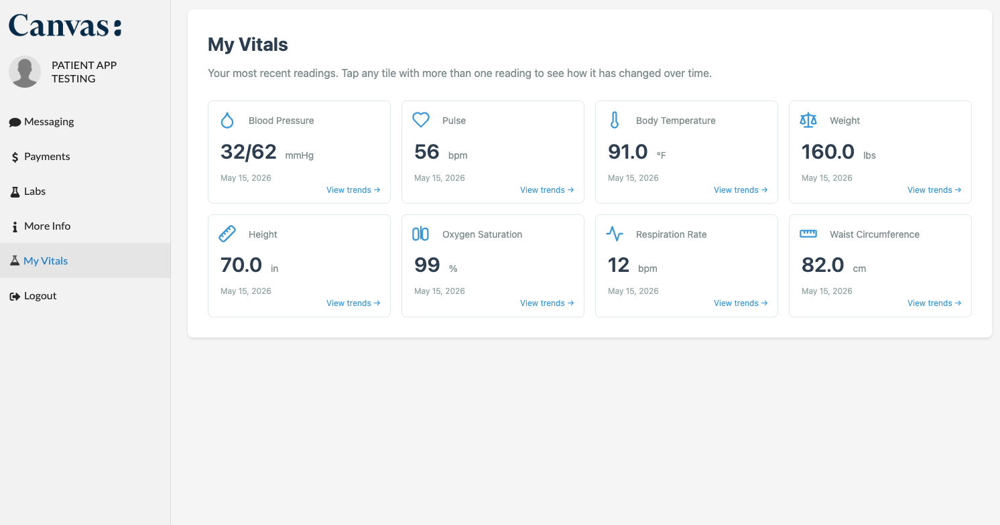
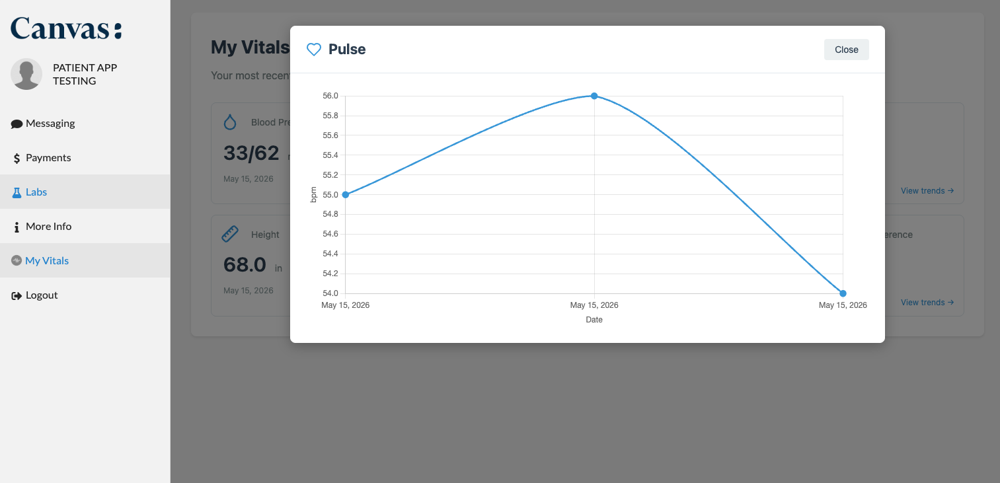
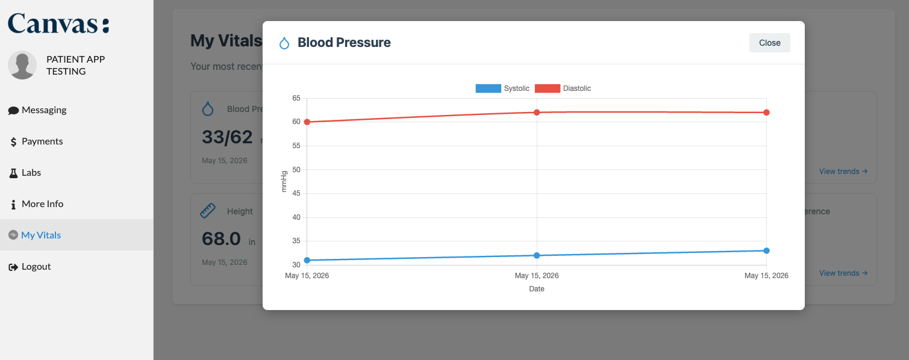

# patient_vitals

Adds a "My Vitals" page to the Canvas patient portal. Surfaces all vital signs
stored for the logged-in patient, with one tile per vital type and a trend chart
when more than one reading exists.







## What it does

Renders the logged-in patient's most recent vital signs as a tile grid on the
Canvas patient portal. Each tile shows the latest value, unit, and recorded
date. Tiles with more than one reading open a modal with a Chart.js line graph
of the full history (capped at the 100 most recent readings). Blood pressure
renders as two series (systolic / diastolic) sharing one X axis.

## Problem it solves

Patients have no portal-native way to look back at their own vitals between
visits. Today they either ask their care team for a printout, request records
through support, or piece values together from after-visit summaries. This
plugin gives patients self-service visibility into the same vital-sign data
that's already in their chart, with at-a-glance trends so they can spot
changes (e.g. blood pressure creeping up, weight loss/gain over months)
without contacting the practice.

## Who it's for

- **Patients** using the Canvas patient portal who want to see their own
  vitals and how they've changed over time.
- **Practices** on Canvas that want to surface this information in the portal
  without building it themselves. No specialty assumptions — applies anywhere
  vitals are recorded (primary care, cardiology, weight management, pediatrics,
  etc.).

## How to install

```bash
canvas install patient_vitals
```

No additional configuration steps are required. After install, "My Vitals"
appears in the patient portal menu for every logged-in patient.

## Configuration options

This plugin has **no secrets, settings, or thresholds** to configure. It is
stateless and reads vital-sign observations directly from the patient's chart
via the Canvas SDK ORM.

The set of supported vital types is fixed (see [Vital types supported](#vital-types-supported)
below). The server-side cap of 100 readings per vital is defined in
`vitals_data.py` as `PER_CODE_CAP` if you fork and want to change it.

## Architecture

Single `portal_menu_item` application + single `SimpleAPI` protocol.

- `patient_vitals.application:VitalsApp` — menu entry, opens the page modal.
- `patient_vitals.api:VitalsAPI` — two routes:
  - `GET /plugin-io/api/patient_vitals/page` — HTML page.
  - `POST /plugin-io/api/patient_vitals/observations` — JSON; actions `list_summary` and `history`.
- `patient_vitals.vitals_data` — pure functions: catalog, aggregation, BP split, unit conversion.

Data comes from the SDK ORM (`canvas_sdk.v1.data.Observation`). There is no
FHIR client and no `CLIENT_ID`/`CLIENT_SECRET` requirement; this plugin is
stateless and has no secrets.

Chart.js is loaded from `https://cdn.jsdelivr.net/npm/chart.js@4.4.0/dist/chart.umd.min.js`.

## Vital types supported

| Vital | LOINC | Unit |
|---|---|---|
| Blood Pressure | 85354-9 | mmHg |
| Pulse | 8867-4 | bpm |
| Body Temperature | 8310-5 | °F |
| Weight | 29463-7 | lbs (stored as oz, converted server-side) |
| Height | 8302-2 | in |
| BMI | 39156-5 | — |
| Oxygen Saturation | 59408-5 | % |
| Respiration Rate | 9279-1 | bpm |
| Waist Circumference | 56086-2 | cm |
| Head Circumference | 9843-4 | cm |
| Pain Severity | 72514-3 | — |

## Limits

- Server-side cap of 100 readings per vital code (chart shows the 100 most
  recent).
- v1 supports the **combined-string** form of blood pressure
  (`Observation.value == "120/80"`). Component-based BP (separate systolic /
  diastolic `ObservationComponent` rows) is not handled.

## Security

- Authentication: `PatientSessionAuthMixin`. Only logged-in patients can hit
  the endpoints; staff sessions are rejected.
- Patient identity is taken from the `canvas-logged-in-user-id` request header
  (populated by the auth mixin). The plugin never reads `patient_id` from a
  request body, so a patient cannot read another patient's vitals by spoofing
  the body.

## Local development

```bash
cd extensions/patient_vitals
uv run pytest tests/ -v
uv run ruff check patient_vitals tests
uv run mypy patient_vitals
```

Install against a local Canvas instance with `canvas install patient_vitals`,
then log in to the patient portal and open "My Vitals" from the menu.
